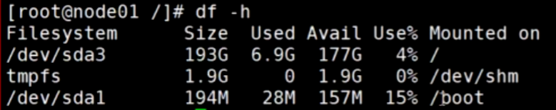
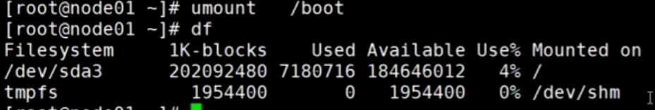
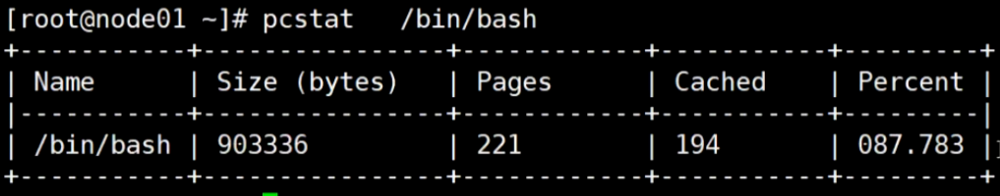
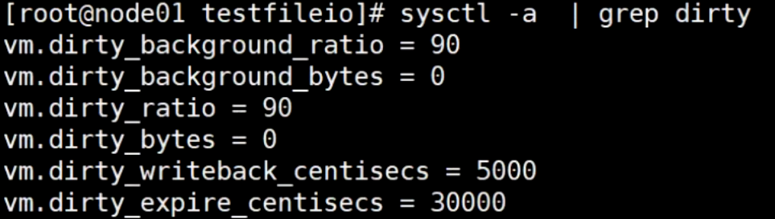

## 内存与IO

pagecache

优化I/O性能，可是会丢失数据，内存没将数据写到磁盘前，如果断电就会丢失这部分数据




追踪java程序的系统调用

```sh
# 脚本

!bin/bash

```


配置

```sh
vi /etc/sysctl.conf

# 底部添加脏页配置
```


查看内存赃页配置



- vm.dirty_background_ratio：后台开始将内存的数据刷到磁盘的比率


redis等一些第三方工具都可以配置什么时候将数据刷到磁盘，如果内核的参数设置的脏页设置的比较大，那么端点就会丢失非常多的数据


```java
//最基本的file写
public static  void testBasicFileIO() throws Exception {
    File file = new File(path);
    FileOutputStream out = new FileOutputStream(file);
    while(true){
        Thread.sleep(10);
        out.write(data);
    }
}

```


BufferIO 普通IO谁快？

普通的文件输出流套一层Buffered输出流为什么能快这么多？

jvm buffer数组 8kb，写满后才进行一次系统调用

```java
//测试buffer文件IO
//  jvm  8kB   syscall  write(8KBbyte[])
public static void testBufferedFileIO() throws Exception {
    File file = new File(path);
    BufferedOutputStream out = new BufferedOutputStream(new FileOutputStream(file));
    while(true){
        Thread.sleep(10);
        out.write(data);
    }
}
```


内存大小


查看strace追踪到的java程序进行的系统调用

```sh
strace -ff -o out cmd

vi out.1350
```

普通文件流


使用了buffered，明显减少了很多的系统调用


以上使用的是IO


## NIO


mmap 内存映射，就是直接将数据写到内核的pagecache ，不需要向io那样通过write系统调用，产生用户态到内核态的切换造成的性能损耗

**测试文件NIO**

```java
// 随机读写
public static void testRandomAccessFileWrite() throws  Exceptio
  RandomAccessFile raf = new RandomAccessFile(path, "rw");

  raf.write("hello mashibing\n".getBytes());
  raf.write("hello seanzhou\n".getBytes());
  System.out.println("write------------");
  System.in.read();

  raf.seek(4);
  raf.write("ooxx".getBytes());

  System.out.println("seek---------");
  System.in.read();

  FileChannel rafchannel = raf.getChannel();
  //mmap  堆外  和文件映射的   byte  not  objtect
  MappedByteBuffer map = rafchannel.map(FileChannel.MapMode.READ_WRITE, 0, 4096);


  map.put("@@@".getBytes());  //不是系统调用  但是数据会到达 内核的pagecache
      //曾经我们是需要out.write()  这样的系统调用，才能让程序的data 进入内核的pagecache
      //曾经必须有用户态内核态切换
      //mmap的内存映射，依然是内核的pagecache体系所约束的！！！
      //换言之，丢数据
      //你可以去github上找一些 其他C程序员写的jni扩展库，使用linux内核的Direct IO
      //直接IO是忽略linux的pagecache
      //是把pagecache  交给了程序自己开辟一个字节数组当作pagecache，动用代码逻辑来维护一致性/dirty。。。一系列复杂问题

   System.out.println("map--put--------");
   System.in.read();

//        map.force(); //  flush
        raf.seek(0);

        ByteBuffer buffer = ByteBuffer.allocate(8192);
//        ByteBuffer buffer = ByteBuffer.allocateDirect(1024);

        int read = rafchannel.read(buffer);   //buffer.put()
        System.out.println(buffer);
        buffer.flip();
        System.out.println(buffer);

        for (int i = 0; i < buffer.limit(); i++) {
            Thread.sleep(200);
            System.out.print(((char)buffer.get(i)));
     }

}

```

**演示：**

1. 第一个read阻塞

   

   虽然文件有内容，但是此时数据还是在内存中

2. 第二个read阻塞：演示随机读写能力

   

3. 第三个read阻塞：验证mmap映射

   lsof 查看进程的文件描述符，以及内存映射

   

   

   第一个红圈表示mmap映射，直接写数据不需要syscall

   第二个是随机写文件raf，需要syscall

   

**代码的模型**


- 堆内：jvm的堆里的字节数组
- 堆外：jvm的堆外，也就是java进程的堆里的字节数组
- mapped映射：是mmap调用的一个进程和内核共享的内存区域，且这个内存区域是pagecache到文件的映射

性能：堆内<堆外<mapped

## TCP参数

server

```java
import java.io.BufferedReader;
import java.io.IOException;
import java.io.InputStream;
import java.io.InputStreamReader;
import java.net.InetSocketAddress;
import java.net.ServerSocket;
import java.net.Socket;

/**
 * BIO  多线程的方式
 */
public class SocketIOPropertites {
    //server socket listen property:
    private static final int RECEIVE_BUFFER = 10;
    private static final int SO_TIMEOUT = 0;
    private static final boolean REUSE_ADDR = false;
    // 内核中同时等待被进程读取的socket数量，超过后内核不再和客户端建立三次握手
    private static final int BACK_LOG = 2;
    // client socket listen property on server endpoint
    // 如果双方建立了连接
    private static final boolean CLI_KEEPALIVE = false;
    // 发送首字节 探测
    private static final boolean CLI_OOB = false;
    private static final int CLI_REC_BUF = 20;
    private static final boolean CLI_REUSE_ADDR = false;
    private static final int CLI_SEND_BUF = 20;
    // 立刻关闭 释放端口资源
    private static final boolean CLI_LINGER = true;
    private static final int CLI_LINGER_N = 0;
    private static final int CLI_TIMEOUT = 0;
    // false 优化：有一个buffer，true 不优化：有多少发多少
    private static final boolean CLI_NO_DELAY = false;
/*
    StandardSocketOptions.TCP_NODELAY
    StandardSocketOptions.SO_KEEPALIVE
    StandardSocketOptions.SO_LINGER
    StandardSocketOptions.SO_RCVBUF
    StandardSocketOptions.SO_SNDBUF
    StandardSocketOptions.SO_REUSEADDR

 */
    public static void main(String[] args) {
        ServerSocket server = null;
        try {
            server = new ServerSocket();
            server.bind(new InetSocketAddress(9090), BACK_LOG);
            server.setReceiveBufferSize(RECEIVE_BUFFER);
            server.setReuseAddress(REUSE_ADDR);
            // accept阻塞等待时间，超时后会抛异常，捕获后继续循环
            server.setSoTimeout(SO_TIMEOUT);

        } catch (IOException e) {
            e.printStackTrace();
        }
        System.out.println("server up use 9090!");
        try {
            while (true) {
                // System.in.read();  //分水岭：
                Socket client = server.accept();  //阻塞的，没有 -1  一直卡着不动  accept(4,
                System.out.println("client port: " + client.getPort());

                client.setKeepAlive(CLI_KEEPALIVE);
                client.setOOBInline(CLI_OOB);
                client.setReceiveBufferSize(CLI_REC_BUF);
                client.setReuseAddress(CLI_REUSE_ADDR);
                client.setSendBufferSize(CLI_SEND_BUF);
                client.setSoLinger(CLI_LINGER, CLI_LINGER_N);
                client.setSoTimeout(CLI_TIMEOUT);
                client.setTcpNoDelay(CLI_NO_DELAY);

                //client.read   //阻塞   没有  -1 0
                new Thread(
                        () -> {
                            try {
                                InputStream in = client.getInputStream();
                                BufferedReader reader = new BufferedReader(new InputStreamReader(in));
                                char[] data = new char[1024];
                                while (true) {

                                    int num = reader.read(data);

                                    if (num > 0) {
                                        System.out.println("client read some data is :" + num + " val :" + new String(data, 0, num));
                                    } else if (num == 0) {
                                        System.out.println("client readed nothing!");
                                        continue;
                                    } else {
                                        System.out.println("client readed -1...");
                                        System.in.read();
                                        client.close();
                                        break;
                                    }
                                }
                            } catch (IOException e) {
                                e.printStackTrace();
                            }
                        }
                ).start();
            }
        } catch (IOException e) {
            e.printStackTrace();
        } finally {
            try {
                server.close();
            } catch (IOException e) {
                e.printStackTrace();
            }
        }
    }
}
```

client

```java
import java.io.*;
import java.net.Socket;

public class SocketClient {

    public static void main(String[] args) {
        try {
            Socket client = new Socket("192.168.150.11",9090);

            // 发送的缓冲区大小
            client.setSendBufferSize(20);
            // 不优化，无论多少字节直接发送
            // 优化，根据数据大小做优化，可能80个字节一次性再发送
            // 优化，不够缓冲区大小，等占满一个缓冲区大小再一次发送
            client.setTcpNoDelay(true);
            OutputStream out = client.getOutputStream();
		   // 命令行
            InputStream in = System.in;
            BufferedReader reader = new BufferedReader(new InputStreamReader(in));

            while(true){
                // 阻塞等待命令行回车
                String line = reader.readLine();
                if(line != null ){
                    byte[] bb = line.getBytes();
                    for (byte b : bb) {
                        out.write(b);
                    }
                }
            }
        } catch (IOException e) {
            e.printStackTrace();
        }
    }
}
```

流程：

1. 启动服务端：javac xx.java && java xx

2. 查看本地连接：nestat -natp

   

3. 抓包：tcpdump -nn -i eth0 port 9090

4. 查看进程号：jps

   

5. 查看进程文件描述符分配情况：lsof -p 7932

   

6. 启动客户端：javac SocketClient.java && java SocketClient

7. 查看抓包数据

   

   注意：此时服务端还未调用到accpet代码，还未开始接收客户端连接

   虽然这里客户端和服务端已经3次握手了，但是服务器端还未分配资源

   

   这里表示内核已经有连接了，但是还未到代码端

   如果此时客户端在命令行中给服务端发送数据，查看抓包信息，发现能正常通信

   

   此时再看网络连接，发现内核接收到了4个字节的数据（客户端发：1111），在内核的接收队列中

   

   **只要完成3次握手，内核就会开辟空间资源，TCP是面向连接的、可靠的传输协议**

   **[扩展：Recv-Q和Send-Q含义](https://blog.csdn.net/iceman1952/article/details/109014798)**

8. 服务端在命令行中回车

   代码中运行了server.accpet()

   

   看网络连接，内核连接数据接收队列被读取了，并且连接被分配给了7932进程

   

   看进程分配的文件描述符，多了一个6

   

   **进程想使用socket，且从中读取数据，要通过文件描述符，文件描述符是socket抽象的代表，换言之java中socket就是文件描述符的抽象**

   

9. 验证BACK_LOG，假设代码中配置了2

   同时运行多3个客户端，到第三个的时候会出现阻塞

   

   SYN_RECV表示三次握手时服务端没有给客户端ack

10. 验证客户端参数delay

    重新启动server、重新抓包、直接通过nc工具和server连接

    ```sh
    nc 192.168.150.11 9090
    ```

    客户端给server发送数据，客户端的代码是一个字节一个字节的发

    由于优化没打开，消息被分包发送了（能发送的尽量发送）根据内核调度

    

    

    如果delay优化打开，以上数据会以一个包一起发送（发送时会有延时）

11. 验证keepalive

    

**TCP连接模型**


## 网络IO演进

### BIO

多线程模式，1个主线程接收连接，每建立一个连接创建一个子线程处理

**弊端**

- 阻塞 Blocking：server.accpet
- 多线程: clone、线程切换

**示例代码**

```java
import java.io.BufferedReader;
import java.io.IOException;
import java.io.InputStream;
import java.io.InputStreamReader;
import java.net.ServerSocket;
import java.net.Socket;

public class SocketIO {

    public static void main(String[] args) throws Exception {
        ServerSocket server = new ServerSocket(9090,20);
        System.out.println("step1: new ServerSocket(9090) ");

        while (true) {
            Socket client = server.accept();  //阻塞1
            System.out.println("step2:client\t" + client.getPort());

            new Thread(() -> {
                InputStream in = null;
                try {
                    in = client.getInputStream();
                    BufferedReader reader = new BufferedReader(new InputStreamReader(in));
                    while(true){
                        String dataline = reader.readLine(); //阻塞2

                        if(null != dataline){
                        System.out.println(dataline);
                        }else{
                            client.close();
                            break;
                        }
                    }
                    System.out.println("客户端断开");
                } catch (IOException e) {
                    e.printStackTrace();
                }
            }).start();
        }
    }
}

```

启动并且追踪TestSocket程序

```sh
# 编译
/usr/java/j2sdk1.4.2_18/bin/javac TestSocket.java
# 运行并追踪
strace -ff -o out /usr/java/j2sdk1.4.2_18/bin/java TestSocket
# 查看四元组条目，处于监听状态，开始可以接收任何客户端连接
```


查看主线程中的系统调用


当有一个客户端连接进来：nc ip 8090


再跟踪进程文件描述符，看到了5号文件描述符 = socket(四元组)


再看主线程的系统调用信息，java代码中的new Thread() ，实际上是调用了内核的clone，得到一个8447的新线程号，根据flags的参数显示，8447是会共享主线程的数据的，比如fd5，fd3


此时strace也多创建了一个跟踪文件


查看out.8447内容，8447线程正在对fd5进行recv系统调用，内核就会阻塞等待数据


**扩展：系统调用文档**

```sh
# man 文档命令
yum install man man-pages
# 查看文档简介
man man 
# 查看man2类文档中的socket文档
man 2 socket
```

### BIO模型 

系统调用clone很消耗性能


### C10K

C10K表示服务器同时处理1万个连接/网络IO时的一系列问题，简单说就是高并发情况下的一些问题

**实例代码**

```java
import java.io.IOException;
import java.net.InetSocketAddress;
import java.nio.channels.SocketChannel;
import java.util.LinkedList;

public class C10Kclient {

    public static void main(String[] args) {
        LinkedList<SocketChannel> clients = new LinkedList<>();
        InetSocketAddress serverAddr = new InetSocketAddress("192.168.150.11", 9090);

        //端口号的问题：65535
        //  windows
        // 每次循环开启两个客户端去连接server，server每次循环会创建两个四元组
        // 如果能正常运行，表示一个客户端可以跟一台或者多台server建立无数的连接，只要硬件满足
        for (int i = 10000; i < 65000; i++) {
            try {
                SocketChannel client1 = SocketChannel.open();
                SocketChannel client2 = SocketChannel.open();

                /*
                linux中你看到的连接就是：
                client...port: 10508
                client...port: 10508
                 */

                client1.bind(new InetSocketAddress("192.168.150.1", i));
                //  192.168.150.1：10000   192.168.150.11：9090
                client1.connect(serverAddr);
                clients.add(client1);

                // 这个IP在客户端服务器上创建的一个虚拟网卡
                // linux 自己创建网卡
                // window 安装虚拟机后就会多一个虚拟网卡 
                client2.bind(new InetSocketAddress("192.168.110.100", i));
                //  192.168.110.100：10000  192.168.150.11：9090
                client2.connect(serverAddr);
                clients.add(client2);
            } catch (IOException e) {
                e.printStackTrace();
            }
        }
        System.out.println("clients "+ clients.size());

        try {
            System.in.read();
        } catch (IOException e) {
            e.printStackTrace();
        }
    }
}
```

抓包，四元组是成立的


此时查看server输出信息，发现每个端口没有出现两次，且客户端代码此时报超时异常


再次查看抓包信息


**为什么建立不了连接？排查**

server能ping通110.100


查看server路由表，发现server对110.100需要走默认网关 192.168.150.2


因为虚拟机走的是NAT模式，且是S-NAT，会把往外发的数据修改源IP地址，那么返回给client的源变成了 192.168.150.2:9090，client接收到server的ack后发现源变了，会被舍弃

**解决：server增加路由条目**

```sh
# 192.168.150.1 是client上面的真实网卡
route add -host 192.168.110.100 gw 192.168.150.1
```


### NIO

NIO的含义：

- JDK：new io 包
- 操作系统：nonblocking 非阻塞

**弊端**

- 基于C10K，当服务器连接很多的时候，主线程每一次循环都要有大量的系统调用

**示例代码**

```java
import java.net.InetSocketAddress;
import java.net.StandardSocketOptions;
import java.nio.ByteBuffer;
import java.nio.channels.ServerSocketChannel;
import java.nio.channels.SocketChannel;
import java.util.LinkedList;

public class SocketNIO {
    //  what   why  how
    public static void main(String[] args) throws Exception {
        LinkedList<SocketChannel> clients = new LinkedList<>();
        // 服务端开启监听：接受客户端
        // BIO是ServerSocket 
        // Channel有点像文件描述符，抽象层
        ServerSocketChannel ss = ServerSocketChannel.open();  
        ss.bind(new InetSocketAddress(9090));
        //重点  OS  NONBLOCKING!!!  //只让接受客户端  不阻塞
        ss.configureBlocking(false); 

//        ss.setOption(StandardSocketOptions.TCP_NODELAY, false);
//        StandardSocketOptions.TCP_NODELAY
//        StandardSocketOptions.SO_KEEPALIVE
//        StandardSocketOptions.SO_LINGER
//        StandardSocketOptions.SO_RCVBUF
//        StandardSocketOptions.SO_SNDBUF
//        StandardSocketOptions.SO_REUSEADDR

        while (true) {
            // 接受客户端的连接
            // Thread.sleep(1000);
            // 不会阻塞  
            // 没有得到客户端   操作系统：-1，java：NULL
            // 得到客户端     操作系统：
            SocketChannel client = ss.accept(); 
            //accept  调用内核了：
            // 1.如果没有客户端连接进来，返回值？在BIO 的时候一直卡着，但是在NIO 不卡着，返回-1，NULL
            // 2.如果来客户端的连接，accept 返回的是这个客户端的fd，java中就是SocketChannel
            // NONBLOCKING 就是代码能往下走了，只不过有不同的情况
            if (client == null) {
            	System.out.println("null.....");
            } else {
                // 重点  socket（服务端的listen socket<连接请求三次握手后，往我这里扔，我去通过accept 得到  连接的socket>，连接socket<连接后的数据读写使用的> ）
                client.configureBlocking(false); 
                int port = client.socket().getPort();
                System.out.println("client..port: " + port);
                clients.add(client);
            }

            // 堆外内存
            ByteBuffer buffer = ByteBuffer.allocateDirect(4096);  

            // 遍历已经链接进来的客户端能不能读写数据
            // 串行化！！！！  多线程！！
            for (SocketChannel c : clients) {  
                // >0  -1  0   //不会阻塞
                int num = c.read(buffer);  
                if (num > 0) {
                    buffer.flip();
                    byte[] aaa = new byte[buffer.limit()];
                    buffer.get(aaa);

                    String b = new String(aaa);
                    System.out.println(c.socket().getPort() + " : " + b);
                    buffer.clear();
                }
            }
        }
    }
}
```

查看系统调用跟踪，accept不阻塞，且返回-1，表示当前没有新客户端连接


此时新开一个客户端： nc ip 9090


NIO模式下，连接速度慢，客户端连接和遍历客户端数据在同一个线程，遍历客户端是否有数据需要系统调用，非常耗性能


**too many open files 的问题**，修改内核配置

```sh
ulimit -a

# 设置50万
ulimit -SHn 500000

# 看到 open files 配置为 1024，为什么配置的是1024，但是却能打开2044 x 2 = 4088个？
# 因为当前当户是root，root可以跳出一些限制
# 如果是普通用户，完全受限于配置

# 还可以配置系统总文件描述符的大小，一般系统会根据分配的内存自动设置，1G大概对应10万文件描述符
# 内核级别
cat /proc/sys/fs/file-max
```

### NIO模型


### 多路复用器

**分类：**

- SELECT POSIX 同步非阻塞
- POLL 同步非阻塞
- EPOLL(linux)  同步非阻塞
- KQueue(unix)


### Select 多路复用器

受FD_SETSIZE配置的影响，默认一次只能查询1024个IO连接的状态


**弊端**

- 一次系统调用只能查询1024个IO连接的状态
- 每次都要重新，重复传递fd，内核要对fd进行遍历


### 扩展：系统调用


1. CPU运行app程序的指令
2. 假如是int 80 指令
3. 进行系统调用
4. 最终回调 callback


### POLL 多路复用器

没有fd数量的限制

**实例代码：单线程版**

```java
import java.io.IOException;
import java.net.InetSocketAddress;
import java.nio.ByteBuffer;
import java.nio.channels.*;
import java.util.HashMap;
import java.util.Iterator;
import java.util.Set;

public class SocketMultiplexingSingleThreadv1 {

    private ServerSocketChannel server = null;
    // java selector = linux 多路复用器
    // 多路复用器（select poll epoll kqueue） nginx  event{}
    // 指定多路复用器
    // -Djava.nio.channels.spi.SelectorProvider=sun.nio.ch.EPollSelectorProvider
    // -Djava.nio.channels.spi.SelectorProvider=sun.nio.ch.PollSelectorProvider -cp /root/netty-all-
    // windows 没有 sun.nio.ch.EPollSelectorProvider
    private Selector selector = null;   
    int port = 9090;

    public void initServer() {
        try {
            // socket
            server = ServerSocketChannel.open();
            // fcntl      nonblocking
            server.configureBlocking(false);
            // bind
            server.bind(new InetSocketAddress(port));

            // select poll epoll，优先选择：epoll
            // select, poll：没有系统调用
            // epoll：open -> epoll_create -> fd3
            selector = Selector.open();  

            // listen
            // server是listen结果fd4的抽象
            /*
            register
                如果：
                select，poll：jvm里开辟一个数组 fd4 放进去，没有系统调用
                epoll：epoll_ctl(fd3,ADD,fd4,EPOLLIN
               		  懒加载：其实是触碰到selector.select()调用的时候才触发epoll_ctl的调用
             */
            server.register(selector, SelectionKey.OP_ACCEPT);
        } catch (IOException e) {
            e.printStackTrace();
        }
    }

    public void start() {
        initServer();
        System.out.println("服务器启动了。。。。。");
        try {
            //死循环
            while (true) {
                Set<SelectionKey> keys = selector.keys();
                System.out.println(keys.size()+" size");

                /*
                1，select，poll：调内核的select（fd4），poll(fd4)
                2，epoll：调内核的 epoll_wait()
                参数可以带时间：
                	没有时间 / 0：阻塞，直到有数据
                	有时间：设置一个超时
                主动唤醒：selector.wakeup()  结果返回0
                 */
                while (selector.select() > 0) {
                    //返回的有状态的fd集合
                    Set<SelectionKey> selectionKeys = selector.selectedKeys(); 
                    Iterator<SelectionKey> iter = selectionKeys.iterator();
                    // so，无论哪种多路复用器，都只能给我状态，还得一个一个的去处理他们的R/W。同步好辛苦！！！！！！！！
                    // 前边可以强调过，socket：listen 通信 R/W
                    while (iter.hasNext()) {
                        SelectionKey key = iter.next();
                        // set 不移除的话会重复循环处理
                        iter.remove(); 
                        // epoll：红黑树同时存放了server fd和client fd
                        if (key.isAcceptable()) {
                            // 看代码的时候，这里是重点，如果要去接受一个新的连接
                            // 语义上，accept接受连接且返回新连接的FD对吧？
                            // 那新的FD怎么办？
                            // select，poll：因为他们内核没有空间，那么在jvm中保存和前边的fd4那个listen的一起
                            // epoll：我们希望通过epoll_ctl把新的客户端fd注册到内核空间
                            // 查看accept上限：cat /proc/fs/epoll/max_user_watches
                            acceptHandler(key);
                        } else if (key.isReadable()) {
                            // read/write都处理了
                            readHandler(key);
                            // 在当前线程，这个方法可能会阻塞  ，如果阻塞了十年，其他的IO早就没电了。。。
                            // 所以，为什么提出了 IO THREADS，这个线程只负责读到数据，然后交给其他线程处理
                            // redis是不是用了epoll，redis是不是有个io threads的概念 ，redis是不是单线程的
                            // tomcat 8,9  异步的处理方式  IO和处理上  解耦
                        }
                    }
                }
            }
        } catch (IOException e) {
            e.printStackTrace();
        }
    }

    public void acceptHandler(SelectionKey key) {
        try {
            ServerSocketChannel ssc = (ServerSocketChannel) key.channel();
            // 接受客户端 -> new fd
            SocketChannel client = ssc.accept(); 
            client.configureBlocking(false);
            ByteBuffer buffer = ByteBuffer.allocate(8192);

            // select，poll：jvm里开辟一个数组 fd7 放进去
            // epoll：epoll_ctl(fd3,ADD,fd7,EPOLLIN
            client.register(selector, SelectionKey.OP_READ, buffer);
            
            System.out.println("-------------------------------------------");
            System.out.println("新客户端：" + client.getRemoteAddress());
            System.out.println("-------------------------------------------");
        } catch (IOException e) {
            e.printStackTrace();
        }
    }

    public void readHandler(SelectionKey key) {
        SocketChannel client = (SocketChannel) key.channel();
        ByteBuffer buffer = (ByteBuffer) key.attachment();
        buffer.clear();
        int read = 0;
        try {
            while (true) {
                read = client.read(buffer);
                if (read > 0) {
                    // 读到数据
                    buffer.flip();
                    while (buffer.hasRemaining()) {
                        client.write(buffer);
                    }
                    buffer.clear();
                } else if (read == 0) {
                    break;
                } else {
                    // -1：客户端断开
                    client.close();
                    break;
                }
            }
        } catch (IOException e) {
            e.printStackTrace();
        }
    }

    public static void main(String[] args) {
        SocketMultiplexingSingleThreadv1 service = new SocketMultiplexingSingleThreadv1();
        service.start();
    }
}
```


**验证POLL**

运行server，指定使用poll

```sh
javac SocketMultiplexingSingleThreadv1.java && strace -ff -o poll java -Djava.nio.channels.spi.SelectorProvider=sun.nio.ch.PollSelectorProvider SocketMultiplexingSingleThreadv1
```


在本机开启一个客户端连接

```sh
nc localhost 9090
```


client 此时 ctrl + c 断开，如果代码中把 client.close(); 注释掉了，那么会出现以下的情况，因为服务端没有给客户端发分手包，没有完成4次分手


**系统调用过程**


### EPOLL 多路复用器

eventpoll

epoll_create、epoll_ct、epoll_wait

**优点：**

- 规避fd的全量遍历


**验证EPOLL**

```sh
javac SocketMultiplexingSingleThreadv1.java && strace -ff -o poll java SocketMultiplexingSingleThreadv1
```


**示例代码：多线程、写**

```java
import java.io.IOException;
import java.net.InetSocketAddress;
import java.nio.ByteBuffer;
import java.nio.channels.*;
import java.util.Iterator;
import java.util.Set;

public class SocketMultiplexingSingleThreadv2 {
    private ServerSocketChannel server = null;
    private Selector selector = null;
    int port = 9090;
    public void initServer() {
        try {
            server = ServerSocketChannel.open();
            server.configureBlocking(false);
            server.bind(new InetSocketAddress(port));
            selector = Selector.open();
            server.register(selector, SelectionKey.OP_ACCEPT);
        } catch (IOException e) {
            e.printStackTrace();
        }
    }

    public void start() {
        initServer();
        System.out.println("服务器启动了。。。。。");
        try {
            while (true) {
                while (selector.select(50) > 0) {
                    Set<SelectionKey> selectionKeys = selector.selectedKeys();
                    Iterator<SelectionKey> iter = selectionKeys.iterator();
                    while (iter.hasNext()) {
                        SelectionKey key = iter.next();
                        iter.remove();
                        if (key.isAcceptable()) {
                            acceptHandler(key);
                        } else if (key.isReadable()) {
                            // select, poll: 现在在多路复用器里把key(fd)的状态改为cancel
                            // epoll: epoll_ctl(fd,del,fd    删除有状态fd链表里的数据
                            // 多线程必须（cancel是系统调用）
                            key.cancel();  
                            System.out.println("in.....");
                            key.interestOps(key.interestOps() | ~SelectionKey.OP_READ);
                            readHandler(key);
                            // 还是阻塞的嘛？ 即便以抛出了线程去读取，但是在时差里，这个key的read事件会被重复触发
                        } else if(key.isWritable()){
                            // 写事件<--  send-queue  只要不是空的，就一定会给你返回可以写的事件，就会回调我们的写方法
                            // 你真的要明白：什么时候写？不是依赖send-queue是不是有空间
                            // 1，你准备好要写什么了，这是第一步
                            // 2，第二步你才关心send-queue是否有空间
                            // 3，so，读 read 一开始就要注册，但是write依赖以上关系，什么时候用什么时候注册
                            // 4，如果一开始就注册了write的事件，进入死循环，一直调起！！！
                            // 多线程必须
                            key.cancel();
                            key.interestOps(key.interestOps() & ~SelectionKey.OP_WRITE);
                            writeHandler(key);
                        }
                    }
                }
            }
        } catch (IOException e) {
            e.printStackTrace();
        }
    }

    private void writeHandler(SelectionKey key) {
        new Thread(()->{
            System.out.println("write handler...");
            SocketChannel client = (SocketChannel) key.channel();
            ByteBuffer buffer = (ByteBuffer) key.attachment();
            buffer.flip();
            while (buffer.hasRemaining()) {
                try {

                    client.write(buffer);
                } catch (IOException e) {
                    e.printStackTrace();
                }
            }
            try {
                Thread.sleep(2000);
            } catch (InterruptedException e) {
                e.printStackTrace();
            }
            buffer.clear();
            
            // 断开连接
//            key.cancel();
//            try {
////                client.shutdownOutput();
////                client.close();
//            } catch (IOException e) {
//                e.printStackTrace();
//            }
        }).start();
    }

    public void acceptHandler(SelectionKey key) {
        try {
            ServerSocketChannel ssc = (ServerSocketChannel) key.channel();
            SocketChannel client = ssc.accept();
            client.configureBlocking(false);
            ByteBuffer buffer = ByteBuffer.allocate(8192);
            client.register(selector, SelectionKey.OP_READ, buffer);
            System.out.println("-------------------------------------------");
            System.out.println("新客户端：" + client.getRemoteAddress());
            System.out.println("-------------------------------------------");
        } catch (IOException e) {
            e.printStackTrace();
        }
    }

    public void readHandler(SelectionKey key) {
        new Thread(()->{
            System.out.println("read handler.....");
            SocketChannel client = (SocketChannel) key.channel();
            ByteBuffer buffer = (ByteBuffer) key.attachment();
            buffer.clear();
            int read = 0;
            try {
                while (true) {
                    read = client.read(buffer);
                    System.out.println(Thread.currentThread().getName()+ " " + read);
                    if (read > 0) {
                        key.interestOps(  SelectionKey.OP_READ);
					  // 读取到数据后，在这里交给写逻辑
                        // OP_WRITE 关心Send-Q是不是有空间
                        client.register(key.selector(),SelectionKey.OP_WRITE,buffer);
                    } else if (read == 0) {
                        break;
                    } else {
                        client.close();
                        break;
                    }
                }
            } catch (IOException e) {
                e.printStackTrace();
            }
        }).start();
    }

    public static void main(String[] args) {
        SocketMultiplexingSingleThreadv2 service = new SocketMultiplexingSingleThreadv2();
        service.start();
    }
}
```


## Netty

优化上面的代码，将selector分组，每个selector放在不同的线程，selector内处理的所有fd是线性的，不需要调用cancel进行系统调用

假如有100W个连接，专门开启一个线程处理accept，开启4个selector分组，那么每个线程负责25W个消息收发


## 磁盘IO

### 零拷贝

sendfile
