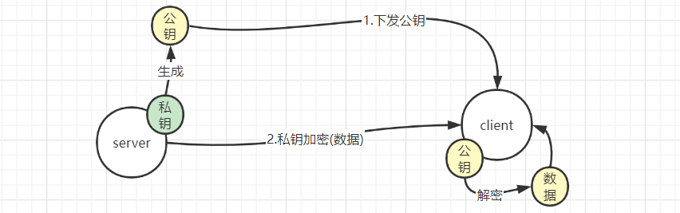
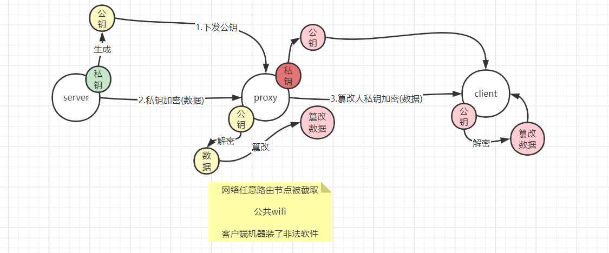
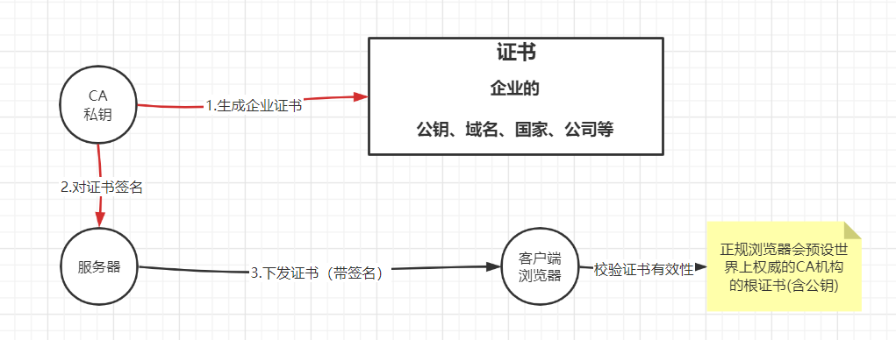
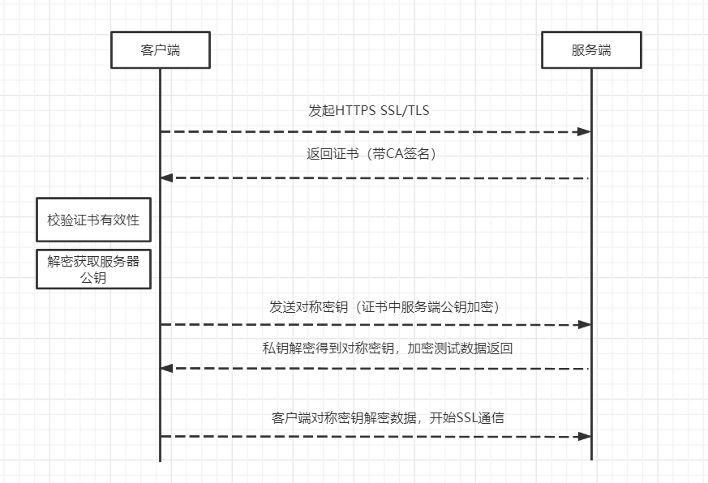

# Https

想要再HTTP交互中数据加密，就要使用对称加密算法，客户端在跟服务器开始正式请求前先生成一个对称密钥发给服务端，这个对称加密的密钥只有服务器知道、客户端知道，中途不能被拦截

**如何能保证客户端给服务端的对称加密的密钥**

通过非对称加密，服务端有私钥，公钥下发给客户端，客户端用公钥加密对称加密的密钥，只有服务端的私钥能解开

**如何能保证下发的公钥是服务器端正确的公钥？**

通过客户端预设权威CA机构的根证书

## 非对称加密

非对称加密有一对密钥，私钥和公钥，公钥是由私钥生成。

互联网通信中，都是把公钥下发给客户端。

私钥和公钥都能加密和解密

### 公钥加密、私钥解密

数据加密

客户端用公钥加密数据，然后发给服务端，保证数据在中途不会被窃取查看

### 私钥加密、公钥解密

数据放篡改

需要公钥才能解密，作用是防止数据被篡改

拥有公钥的人才能查看数据，如果保证客户端的公钥是正确的，那么就能保证数据是没有被篡改的，因为如果数据在中途被篡改，那么篡改人是没有私钥的，无法再加密，如果篡改人用自己的私钥乱加密再发给客户端，那么客户端用正确的公钥是无法解密的，保证了数据的有效性

### 中途篡改公钥

由于所有人都能拿到公钥，那么篡改人此时也有公钥

代理把自己的公钥下发给客户端，而客户端完全不知道这个公钥不是正确的公钥，导致所有和服务端的交互数据被一览无余

**如何能保证下发公钥没有被篡改？**

## CA

CA是证书的签发机构，是一个盈利组织，CA之所以能盈利是要保证自己的私钥非常安全，并且有私钥丢失，会给使用了此CA的企业做相应的赔偿

CA也是使用的非对称加密，自己有一对私钥和公钥

CA用私钥给企业生成证书

客户端的浏览器是安全的，正版的，非正版浏览器可能CA机构不合法

### CA工作流程

此时如果服务器和客户端之间存在代理，同时代理也有CA的根证书，那么代理是可以解开服务器的证书的

**此时代理再像之前一样解密证书，篡改公钥，再用自己的私钥生成证书并且签名返回给客户端，客户端知道吗？？客户端是如何校验证书是否被篡改的？？**

## Https SSL/TLS

客户端（浏览器）通过443端口发起HTTPS协议交互过程

### 证书有效性校验

1. 根据服务器的返回的证书(带签名)，获取到证书的CA签发机构
2. 通过浏览器预设的权威CA机构比对
   1. 如果证书中的CA机构在预设中找不到，那么就阻止请求，提示连接不安全
3. 找到CA机构，其实是摘到CA机构的根证书（含CA公钥）后
4. 用公钥解密证书中的签名
   1. 如果解密不成功，证明中途被篡改了
   2. 如果解密成功，证明证书有效，可以开始使用证书中的企业公钥了

### 客户端生成对称密钥

这一步是为了把密钥交给服务端，然后彼此从之后开始都用这个对称密钥来加密数据，防止数据中途被窃取

