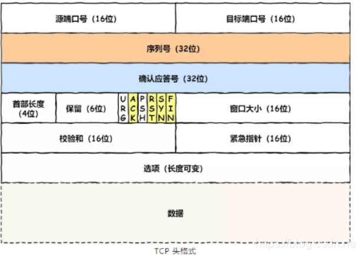
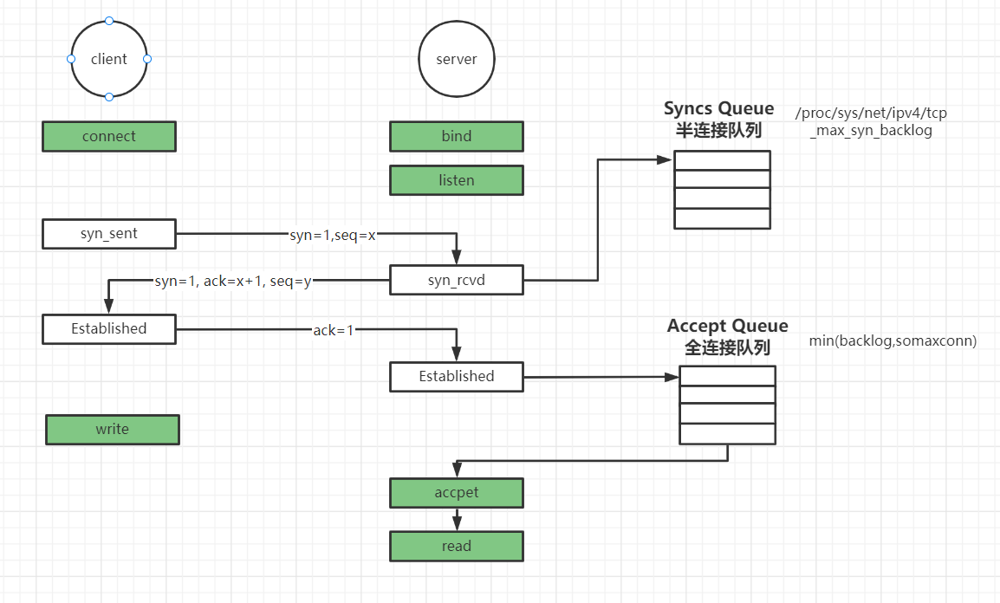

## 网络模型

### OSI 7层 参考模型 


### TCP/IP 4层


传输控制层以下的层都在内核


## 应用层

**常见协议**

HTTP协议 web

```sh
cd /proc/$$/fd

# 与www.baidu.com/80 建立连接tcp连接，得到一个文件描述符8，并且指向socket套接字
exec 8<> /dev/tcp/www.baidu.com/80

# 通过http协议与www.baidu.com/80通信
# 将这串http请求规范的最小请求字符串输入到文件描述符8
echo -e 'GET / HTTP/1.0\n' >&8

# 百度这时会收到请求
# “0”标准输出
# 将8的内容输入到cat的0文件描述符(标准输出)
cat 0<& 8
```


SSH协议 远程

SMTP协议  邮件


## 传输控制层协议

### TCP 协议

linux下建立tcp通信

确定端口

**TCP协议一句话总结：TCP是面向连接的，可靠的，基于字节流的传输层通信协议**

- 面向连接的：三次握手

  三次握手成功，在双方服务器开辟空间，消耗资源

- 可靠的：四次分手

  四次分手成功，双方服务器删除资源（端口号 总65535个、内存、线程）

  四次分手：两个服务器各给对方发送两次通知
  
- 基于字节流的：数据一般都是不可确认大小的，一般多大都可以有序传输


#### TCP结构图




#### 三次握手

**请求流程**

**报文**


圈起来的是3次握手

字段：

- seq：序列号
- win：数据包窗口大小，用于在服务器端和客户端交流下次发送数据包的大小
- ack：发送包里的 seq+1
- options：可选项
  - mss：报文中除去ip port后的真实数据


查看网卡向外发送数据报文时的大小：ifconfig       MTU          1500字节


#### 四次分手

**流程图**


##### TIME_WAIT

**注意，主动断开方的TCP如果在TIME_WAIT状态，会占用资源（端口、内存）**

内核配置对其配置

```sh
sysctl -a | grep reuse
net.ipv4.tcp_tw_reuse = 0

# net.ipv4.tcp_tw_reuse = 1 可以快速停止TIME_WAIT资源
```

**为什么TIME_WAIT=2MSL?**

1. 保证最后一次分手报文能到达接收方
2. 当接收方没有收到第四次分手报文，发起方需要确认等待到接收方发起第三次分手重试报文


#### 窗口控制 win

TCP每发送一个段都需要一次确认应答的处理，这种处理是有一个缺点的：包往返的时间（RTT）越长通行能力越差。解决这个问题TCP采用了窗口，每次发送不再是以每个分段了，而是以更大的单位（假设每次4个段，可以了解为批量操作）

##### 流量控制

- 可能出现的问题

  服务端接收到客户端发来一个数据包，这个数据包可能在处理其他的问题上需要花费一定的时间，甚至在高负荷的情况下无法接受其他的数据包。如果将数据包丢失那就会促发重发机制，导致网络流量的浪费

- 解决这个问题

  在TCP头部中，有一个字段用来通知窗口大小(字段越大说明网络的吞吐量越大)。服务端将自己可以接收的缓冲区大小放入这个字段通知客户端

  另外注意的是客户端也会时不时发送一个窗口探测的数据段，这个数据段就只有一个字节，用来获取最新的窗口大小信息。当服务端的缓冲区一旦面临数据溢出的时候，窗口大小的值也会随之被设置一个更小的值通知客户端，从而控制数量发送的量。客户端根据服务端的指示来进行对发送数据的量进行控制，这个就是流量控制


##### 拥塞控制

[推荐文章](https://zhuanlan.zhihu.com/p/76023663)

> TCP 拥塞控制的目标是最大化利用网络上瓶颈链路的带宽

MTU 数据包大小、MSS 数据内容大小（除去IP、端口号），如果数据量很大，超过MTU很多，会对数据切割成若干个数据包，这时要靠协商的窗口大小来提高性能，两边的win大小可能不一样，有了协商好的win，既可以提高性能，还能防止发爆了，造成后面的数据丢失，消息接收方会给发送放返回的消息中包含win的信息，能让发送方下次控制发送报文的大小


**验证拥塞**

客户端和服务端建立3次握手后，服务端不要accept，此时数据都会发送到服务端socket所匹配的接收队列，此时客户端不停的给服务端发送数据


直到接收队列满了


此时客户端再给服务端发一条能记得住的消息


此时服务端开始accept，发现后面的消息都被丢弃了，没有1111的数据


#### 序列号 seq

序列号**ISN**(**Initial** **Sequence** **Number**)是随机产生的


#### 连接队列

- **半连接队列**：服务器第一次收到客户端的 SYN 之后，就会处于 SYN_RCVD 状态，此时双方还没有完全建立其连接，服务器会把此种状态下请求连接放在一个队列里
- **全连接队列**：已经完成三次握手，建立起连接的就会放在全连接队列中



##### SYN攻击

- 服务器接收到连接请求，将此信息加入未连接队列，并发送请求包给客户，此时进入SYN_RECV状态 
- 当服务器未收到客户端的确认包时，重发请求包，一直到超时，才将此条目从未连接队列删除
- 配合IP欺骗，SYN攻击能达到很好的效果，通常，客户端在短时间内伪造大量不存在的IP地址，向服务器不断地发送syn包，服务器回复确认包，并等待客户的确认，由于源地址是不存在的，服务器需要不断的重发直至超时，这些伪造的SYN包将长时间占用未连接队列，正常的SYN请求被丢弃，目标系统运行缓慢，严重者引起网络堵塞甚至系统瘫痪


### UDP协议 

非面向连接、不可靠

连接可以1对1、1对多、多对多

## 网络层

确定端点

```sh
# n 地址 a 所有 t tcp p pid
netstat -natp
```


IP地址：点分字节

掩码作用：和IP地址做二进制位与运算得出网络号是几个字节，剩下的就是主机位，掩码中255的二进制是8个1

与运算：同为1则为1


路由表

```sh
route -n

# Destination 表示这台主机可以访问的网段的主机，0.0.0.0 网关不为空 就是为了下一跳
# 
# 如果这台主机需要访问公网上任意一台主机IP，就拿这个想访问的IP和路由表的掩码做与运算，得知192.168.150和169.254网段都不匹配
# 当目标地址和掩码0.0.0.0做与运算的时候，结果正好是Destination的0.0.0.0，这时根据下一跳机制直接走网关
# Gateway 0.0.0.0 表示，网段是同一局域网内，不需要下一跳
```


下一跳机制

IP是端点间的

mac地址是节点设备间的


## 链路层

确定设备

假设应用层中需要和百度通信，那么网络层中的路由表没有能和百度地址匹配的路由，最后交由给网关，这时，网关是如何知道百度（61.135.169.121）该发给谁？

此时网络层外面再包一层，mac地址


### arp协议


流程：

1. 计算机开机，只要网卡接了网线，就会向网关发送arp数据包
2. 交换机会广播这个arp数据包
3. 每个节点接收到arp数据包后判断其中的目标ip是不是自己的ip，如果是就响应
4. 路由器的网关接收到arp数据包，新建一个数据包（包含了路由器本身的mac地址）返回给计算机1
5. 交换机会记录每个接口对应的mac地址数据包
6. 计算机1存储响应回来的arp数据包

```sh
# arp 解析 网卡和ip地址的映射
arp -a

# 根据结果得知192.168.150.2网关对应的mac地址
```


最终的数据包：

源端口号->目标端口号

源IP->目标IP

源MAC->目标MAC


## 物理层

网卡


## Socket 

四元组：客户端IP:PORT + 服务端IP:PORT

​	只要四元组其中之一不同，就能正常通信

问题：客户端跟服务器A已经使用了65535个端口进行通信，那么此时客户端还能跟服务器A的另外一个程序进行通信吗？

答案：是可以的，因为四元组不同了

内核级的，只要建立了3次握手就可以开始发送数据

内核实现了TCP/IP协议，提供给应用层方便通信，只需要提供IP:端口

每个socket有自己的接收队列和发送队列 （缓冲区）

只要内存够，单纯建立socket连接，百万并连都可以


一个高性能负载均衡模型 


NAT


上图所示的改变源IP的方式 也可以叫 S-NAT 模式


## LVS 

网络四层（到了第四层只是看一眼，没有拆包）

数据包转发级别

不会和client握手

LVS只是单纯数据包转发，如果网络特别快，带宽特别大，可以负载非常多的连接


### D-NAT模式

类似NAT，但是，改变的是目标IP


### DR模式（高性能）


### TUN模式


实战


 **演示1 手动搭建lvs负载均衡**

```sh
# 安装ipvs客户端 -node1
yum install -y ipvsadm
# 添加对外的统一虚拟网络接口，后期多台的时候通用该网络接口的IP -n1
ifconfig ens33:8 192.168.177.100/24
# 安装web服务器 -n3 -n4
yum install -y httpd
systemctl start httpd
# 添加首页 -n3 
vi /var/www/html/index.html<h1>192.168.177.13</h1>
# 远程拷贝文件到node4的相同目录位置
scp /var/www/html/index.html root@192.168.177.14:`pwd`
# 修改内核网卡变量 -n3 -n4
# 一切皆文件，以下文件是内核运行时的动态变量
echo 1 > /proc/sys/net/ipv4/conf/ens33/arp_ignore
echo 1 > /proc/sys/net/ipv4/conf/all/arp_ignore
echo 2 > /proc/sys/net/ipv4/conf/ens33/arp_announce
echo 2 > /proc/sys/net/ipv4/conf/all/arp_announce
# 添加隐藏VIP -n3 -n4
# 必须设置掩码为4个255，否则
ifconfig lo:8 192.168.177.100 netmask 255.255.255.255
# 配置转发网卡  -r 转发模式：rr 轮询 -n1
ipvsadm -A -t 192.168.177.100:80 -s rr
# 配置转发的服务 -r 真实服务器 -g dr模式 -w 权重 -n1
ipvsadm -a -t 192.168.177.100:80 -r 192.168.177.13 -g -w 1
ipvsadm -a -t 192.168.177.100:80 -r 192.168.177.14 -g -w 1
# 查看 
ipvsadm -ln              
ipvsamd -lnc
```

**演示2 高可用lvs**

```sh
# 是用 keepalived 搭建 lvs 负载均衡
# 安装keepalived客户端 -n1 n2
yum install -y keepalived 
# 修改配置文件，修改前先备份 -master -n1
vi /etc/keepalived/keepalived.conf
#如果不会配置，可以安装帮助文档，并且通过帮助文档查询
yum install -y manman 5 keepalived.conf
# 例如输入: /virtual_ipaddress
vrrp_instance VI_1 {    
	state MASTER    
	interface ens33    
	virtual_router_id 51    
	priority 100    
	advert_int 1    
	authentication {        
		auth_type PASS        
		auth_pass 1111    
	}    
	virtual_ipaddress {        
		192.168.177.100 dev ens33 label ens33:8    
	}
}

virtual_server 192.168.200.100 443 {    
	delay_loop 6    
	lb_algo rr    
	lb_kind DR    
	persistence_timeout 50    
	protocol TCP    
	real_server 192.168.201.13 80{        
		weight 1        
		SSL_GET {            
            url {              
                path /              
                status_code 200            
            }            
            connect_timeout 3            
            retry 3            
            delay_before_retry 3        
		}    
	}
}
# 删除 ipvs 配置 -n1
ipvsadm -C
# 删除 vip 网卡 -n1
ifconfig ens33:8 down

<h1>192.168.177.13</h1>
# 远程拷贝文件到node4的相同目录位置
scp /var/www/html/index.html root@192.168.177.14:`pwd`
# 修改内核网卡变量 -n3 -n4
# 一切皆文件，以下文件是内核运行时的动态变量
echo 1 > /proc/sys/net/ipv4/conf/ens33/arp_ignore
echo 1 > /proc/sys/net/ipv4/conf/all/arp_ignore
echo 2 > /proc/sys/net/ipv4/conf/ens33/arp_announce
echo 2 > /proc/sys/net/ipv4/conf/all/arp_announce
# 添加隐藏VIP -n3 -n4
# 必须设置掩码为4个255，否则
ifconfig lo:8 192.168.177.100 netmask 255.255.255.255
# 配置转发网卡  -r 转发模式：rr 轮询 -n1
ipvsadm -A -t 192.168.177.100:80 -s rr
# 配置转发的服务 -r 真实服务器 -g dr模式 -w 权重 -n1
ipvsadm -a -t 192.168.177.100:80 -r 192.168.177.13 -g -w 1
ipvsadm -a -t 192.168.177.100:80 -r 192.168.177.14 -g -w 1
# 查看 
ipvsadm -ln              
ipvsamd -lnc
```


nginx

7层

需要握手

功能多

官方称可以保持5万个连接

