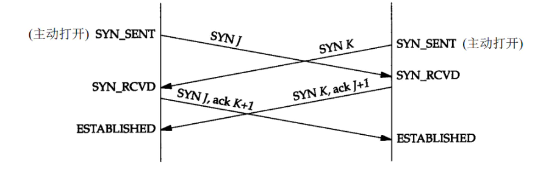

### TIME_WAIT为什么在客户端而不在服务端？为什么这么设计？

客户端需要向服务端发起第四次的分手请求，此时客户端需要先TIME_WAIT一段时间，防止服务端由于网络抖动没有收到第四次请求，从而重新给客户端发送第三次的分手请求，此时客户端由于资源还在，所以可以处理


### 加入888端口的连接处于TIME_WAIT状态，该端口还能建立别的连接吗？

1. 如果是同一个四元组，那么不能建立新连接，资源仍然被占用，包括端口和内存
2. 如果不是同一个四元组，可以建立


### 一个端口能建立多少TCP连接？

1. 客户端

   同一个四元组，可以建立65535个与服务器的连接

2. 服务端

   一个四元组建议一个连接，不同四元组可以建立无数的连接


### 一个TCP能建立多少HTTP连接？

如果使用HTTP/1.1默认的Connection:keep-alive，那么一个TCP连接会持久存在，那么多个HTTP使用是同一个TCP


### 三次握手初始序列号是随机的，linux里是怎么具体得到这个随机数的？

```sh
# -s 指定分隔符 默认是回车
seq -s " " ...
```


### TCP连接双方可不可以同时打开？同时打开需要几次握手？

可以同时打开，仅建立一条连接而不是两条，同时打开需要4次握手




### 现代浏览器在与服务器建立了一个 TCP 连接后是否会在一个 HTTP 请求完成后断开？什么情况下会断开？

1. HTTP/1.0（过时）

   1. 默认就是服务器在返回响应后会立马断开TCP连接

   2. 显然下次请求需要重新进行TCP三次握手，并且SSL也需要重新进行

      

2. HTTP/1.1（现在的服务器和客户端一般都使用1.1版本）

   1. 将Connection头写进了标准，并且默认是keep-alive
   2. 将Connection设置为close，那么服务器会把响应返回后直接断开


### 一个 TCP 连接可以对应几个 HTTP 请求？

如果使用HTTP/1.1默认的Connection:keep-alive，那么一个TCP连接会持久存在，那么多个HTTP


### 一个TCP连接中HTTP请求发送可以同时进行吗（比如同时一起发送三个请求，再三个响应一起接收）？

1. HTTP/1.1
   1. 单个TCP连接同一时间只能处理一个请求，意思是说，两个请求的生命周期不能重叠，任意两个HTTP请求从开始到结束的时间在同一TCP连接里不能重叠
   2. 通过Pipelining可以试图解决，但是浏览器默认是关闭这个功能的
2. HTTP/2.0
   1. 提供了 Multiplexing 多路传输特性，可以在一个TCP连接中同时完成多个HTTP请求。


### 为什么有的时候刷新页面不需要重新建立 SSL 连接？

如果请求头Connection:keep-alive，那么TCP连接会被保留一段时间


### 浏览器对同一 Host 建立 TCP 连接到数量有没有限制？

有。Chrome浏览器最多对同一个Host建立6个TCP连接。不通浏览器会有所区别

试想一下：如果一个网页有1000张图片，如果每张图片都建立一个TCP连接来发送HTTP请求，那么会极大消耗电脑性能，服务器端也会被消耗


###  HTML 如果包含几十个图片标签，这些图片是以什么方式、什么顺序、建立了多少连接、使用什么协议被下载下来的呢？

1. 如果请求的地址是HTTPS，那么客户端和服务端会协商看能不能升级为HTTP/2.0版本，然后使用Multiplexing特性来同时发起更多的HTTP请求来快速加载图片，可能是在1个TCP连接中完成，也可能是多个
2. 如果不能使用HTTP/2.0，或者请求的是HTTP地址，那么根据HTTP/1.1版本，按浏览器的对Host的同时请求限制来HTML页面的图片加载顺序来加载，还未加载到的需要等待


### 为什么需要三次握手？

1. 避免历史连接

   当客户端发送多个SYN报文的时候，不一定是按前后顺序的，有时候网络阻塞导致旧的报文比新的报文早到服务端，客户端可以根据服务端返回的SYN+ACK报文，基于自身的上下文来判断是否是一个历史连接，由此来中断连接

2. 同步客户端和服务端双方的序列号

   TCP是通过序列号和确认应答来提高可靠性的，他的作用：接收双方可以取出重复数据，也可以确认发出的数据包中那些对方收到


### 未收到确认应答数据一定丢失吗？

1. 客户端发送了第一次握手数据包，但是服务端没有收到，这种情况客户端在特定的时间间隔内没有收到服务端的确认应答，则会对数据进行重发
2. 服务端返回了第二次握手数据包，但是客户端没有收到，客户端也会再次重试，但是服务端发现数据(seq)已经存在了，服务端丢弃


