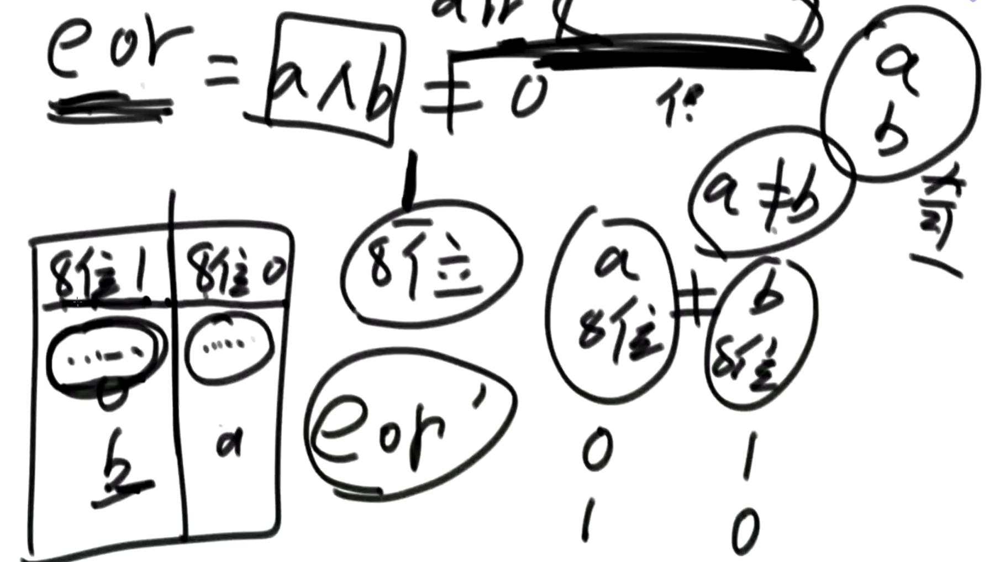

打印一个int类型的32位二进制

取反


负数

为什么负数这么别扭？

为了提高运算时候的性能，正数负数的运算走一套逻辑

相反数

最小数取相反数？

0相反数？

## 或

## 与

## **异或 EOR**

相同为0，不同为1

**太难记了，用这个方法记忆：无进位相加**

```java
0 1 1 0
1 0 1 0
// 1+1进位了，所以为0
// 0 和 其他数向比，直接取其他数
1 1 0 0 
```

**一批数做异或运算，任何顺序执行结果都一样**

由以上可以看出 0^N=N  N^N=0   (N=0/1)

由于是无进位相加、所以一批数做异或运算，只跟这批数的奇偶个相关，与顺序无关


**一个数组中由一种数出现了奇数次，其他数都出现了偶数次，怎么找到并打印这种数**

```java
int eor = 0;
for(int i=0;i<arr.length,i++){
    eor=eor^arr[i];
}

// 由于异或运算和顺序无关，数组中任意的偶数放一起异或=0
// 最终剩下的一个与0异或，就是出现了奇数次的数
System.out.print()
```


**怎么把一个整形数，提取出最右侧的1来**

```java

```

1. N取反相当于，把开头的一堆0都变成1
2. 然后+1，相当于把开头的1全部变成0，然后后一位进位变成了1
3. 和原来的数相比，会发现，除了进位1之前的相同，其他都是反的
4. 与运算后，就是1之前的都不变，后边的都是0


**一个数组中有两种数出现了奇数次，其他数都出现了偶数次，怎么找到并打印这两种数**

```java
//int eor=0;
// 循环和arr与运算
// 由于只有两种数出现了奇数次，假设是a, b
// 那么最终
//eor = a^b;

// 如何知道a, b分别是什么？
// 首先确定a, b不相等
// 那么知道a^b != 0
// 说明eor二进制位不全是0
// 假设eor第8位是1，那么a, b 在第8位就不相等
// 此时，如果将arr分为两大类，一类是第8位为0，另一类第八位为1，反正a, b肯定被分开到不同类
// 由于其他的都是偶数，那么任意的偶数都会在放同一类，那么做完异或运算，就直接能得出一类中的a或者b

// 那么如何知道哪一位不相等？

public static void printOddTimesNum2(int[] arr){
    int eor = 0;
	for(int i =0;i<arr.length;i++){
        eor ^= arr[i];
    }
    // 最终结果是 eor = a^b
    
    // 找出“第八位”
    int rightOne = eor & ((~eor)+1);
    
    // 找出a或者b
    int onlyOne = 0;
    for(int i=0;i<arr.length;i++){
        // 将onlyOne与“1”类做异或运算
        if((arr[i] & rightOne) != 0){
            onlyOne ^= arr[i];
        }
    }
    
    System.out.print(onlyOne+" "+(eor^onlyOne);
}
```



**二进制中1的数字**

```java
public static int bit1Counts(int num){
    int count = 0;
    while(num!=0){
        // 去num最右边的1
        int rightOne = num & ((~num)+1);
        count++;
        // 异或，无进制相加
        num ^= rightOne;
        // 如果是负数，直接减会有问题
        // num -= rightOne;
    }
    return count;
}
```


## 同或运算（很少运用）

相同为1，不同为0


移位

左移

```JAVA
N << 1 = N*2
```


右移

```java
N >> 1 = N / 2
```


带符号位的右移

**扩展**

```java
N*2+1
=
(N<<1 | 1)   
// 因为向左移1位，第0位肯定是0，和1做与预算，那么第0位变成1，等于加了1
```

