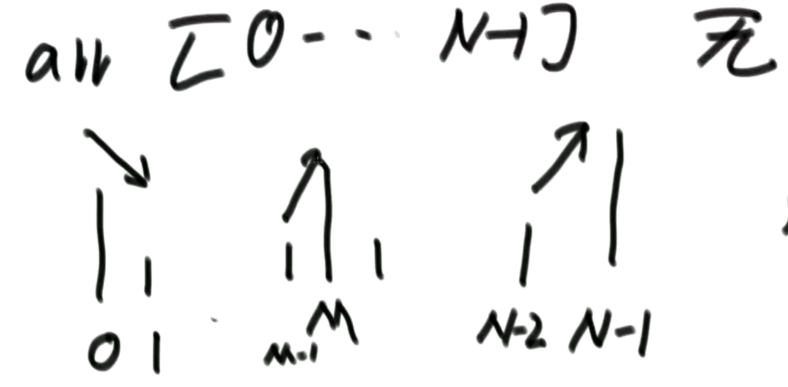

### 阶层

一个正整数的阶乘（factorial）是所有小于及等于该数的正整数的积，并且0的阶乘为1

**给定一个参数N，返回：1!+2!+3!+...+N! 的结果**

```java
// 流程一：

    
    
// 流程二： 
private int factorial(int N){
    int a = 0;
    int b = 1;
    for(i=1;i<N;i++){
        b *= i;
        a += b;
    }
    
    return a;
}
```


## 等差数列

2，5，8，11，14。。。

从 2 开始的 3 为公差的等差数列

输出求等差数列前n项和

```java
// n 0 2
// n 1 5
// n 2 8
// n 3 11
// n+2 n+4 n+6 n+8
int sum = 0;    
for(int i = 0;i<n-1;i++){
    sum+=i+2(i+1)
}    
 
```


## 二分算法

适用于有序数组，O(logN)

**判断值是否存在**

```java
public static boolean exist(int[] arr,int num){
    int L = 0;
    int R = arr.length-1;
    while(R>L){
        // 这条公式不安全，可能会溢出，当L和R极大的时候
        // mid = (L+R)/2
        // 这条公式安全，不会溢出
        // mid = L + (R-L)/2
        int mid = L+((R-L)>>1);
        if(num==arr[mid]){
            return true;
        }else if(mid>num){
            R = mid - 1;
        }else{
            L = mid + 1;
        }
    }
    return false;
}
```

**找满足>=value的最左位置**

```java
public static int nearesIndex(int[] arr,int value){
    int L = 0;
    int R = arr.length-1;
    int index = -1; // 记录最左对号
    while(L<=R){
        int mid = L + ((R-L)>>1);
        if(arr[mid]>=value){
            index = mid;
            R = mid - 1;
        }else{
            L = mid + 1;
        }
    }
    
    return index;
}
```

**局部最小**



1. 0位置比1位置小，那么0所在位置局部最小，因为左边已经没有数了
2. N位置比N-1位置小，那么N所在位置局部最小，因为右边已经没有数了
3. I位置比I+1和I-1都小，那么I所在位置局部最小

无序数组，相邻不等，返回一个局部最小 

```java
public static int getLessIndex(int[] arr,int value){
    if(arr==null || arr.length==0){
        return -1;
    }
    
    if(arr[0]<arr[1]){
        return 0;
    }
    
    if(arr[length-1]<arr[length-2]){
        return arr.length-1;
    }
    
    int L = 1;
    int R = arr.length-2;
    int mid;
    while(L<R){
        mid = L + ((R-L)>>1);
        // 第一第二种情况，mid(I)都是比左右两侧大，证明不是局部变量
        // mid位置比mid+1和mid-1都小，那么mid所在位置局部最小
        if(arr[mid]>arr[mid-1]){
            R = mid - 1;
        }else if(arr[mid]>arr[mid+1]){
            L = mid + 1;
        }else{
            return mid;
        }
    }
    
    // 如果找不到那么，L、R都是局部最小
    return L;
}
```


## 百钱买百鸡

公元五世纪，我国古代数学家张丘建在《算经》一书中提出了“百鸡问题”：鸡翁一值钱五，鸡母一值钱三，鸡雏三值钱一。百钱买百鸡，问鸡翁、鸡母、鸡雏各几何？

现要求你打印出所有花一百元买一百只鸡的方式。

```java
// 鸡翁=5
// 鸡母=3
// 3*鸡雏=1
// count=0 m=100 aC=0
// count=0 m=100 aC=0 bC=0
// count=0 m=100 aC=0 bC=0 cC=1
// count=3 m=99 aC=0 bC=0 cC=2
// count=6 m=98 aC=0 bC=0 cC=3
// ....
// count=102 m=66 aC=0 bC=0 cC=35

// count=1 m=97 aC=0 bC=1
// count=1 m=97 aC=0 bC=1 cC=1
// count=4 m=96 aC=0 bC=0 cC=2
// ....
// count=100 m=64 aC=0 bC=1 cC=34

//

Scanner in = new Scanner(System.in);
while (in.hasNextInt()) {
    in.nextInt();
    
    int aC = 0;
    int bC = 0;
    int cC = 0;
    int m = 100;
    int count = 0;
    while(aC<=20){
        count+=aC;
        m -= 5aC;
        if(m<=0 && count=100){
            if(count==100){
                System.out.println(aC+" "+bC+" "+cC);
            }else{
                m = 100;
                count=0;
                continue;
            }
        }
        while(bC<=33){
            count+=bC;
            m -= 3bC;
            if(m<=0 && count=100){
            	if(count==100){
                    System.out.println(aC+" "+bC+" "+cC);
                }else{
                    m = 100;
                    count=0;
                    continue;
                }
            }
            while(cC<=50){
                count+= 3cC;
                m -= cC
                if(m<=0 && count>=100){
                    if(m==0 || count==100){
                        System.out.println(aC+" "+bC+" "+cC);
                    }else{
                        m = 100;
                        count=0;
                        continue;
                    }
                }
            }
        }
        
        if(count==100)
            System.out.println(aC+" "+bC+" "+cC);
    }
}
```


## 最长回文

- 基数回文
- 偶数回文

```java
// 0123456789 10 11 12 13
// ddddddasdasz
// abcbaaa
// (越界)
char[] a = in.nextLine().toCharArray();
int l = 0;
int sameCount = 1;
for(int i=1;i<a.length;i++){
    char ch = a[i];
        int s = i-sameCount*2+1;
        if(s<0)
            continue;
        if(a[s]!=ch){
            if(a[i]!=a[i-1])
            	sameCount=1;
        }else{
            if(sameCount*2>l)
                l = sameCount*2;
            sameCount++;
        }
}


```


## 密码强度    

**描述**

密码按如下规则进行计分，并根据不同的得分为密码进行安全等级划分。

一、密码长度:
5 分: 小于等于4 个字符
10 分: 5 到7 字符
25 分: 大于等于8 个字符

二、字母:

0 分: 没有字母
10 分: 密码里的字母全都是小（大）写字母
20 分: 密码里的字母符合”大小写混合“

三、数字:
0 分: 没有数字
10 分: 1 个数字
20 分: 大于1 个数字

四、符号:
0 分: 没有符号
10 分: 1 个符号
25 分: 大于1 个符号

五、奖励（只能选符合最多的那一种奖励）:
2 分: 字母和数字

3 分: 字母、数字和符号

5 分: 大小写字母、数字和符号

最后的评分标准:
\>= 90: 非常安全
\>= 80: 安全（Secure）
\>= 70: 非常强
\>= 60: 强（Strong）
\>= 50: 一般（Average）
\>= 25: 弱（Weak）
\>= 0: 非常弱（Very_Weak）

对应输出为：

VERY_SECURE
SECURE
VERY_STRONG
STRONG
AVERAGE
WEAK
VERY_WEAK

请根据输入的密码字符串，进行安全评定。

注：
字母：a-z, A-Z
数字：0-9
符号包含如下： (ASCII码表可以在UltraEdit的菜单view->ASCII Table查看)
!"#$%&'()*+,-./   (ASCII码：0x21~0x2F)
:;<=>?@       (ASCII码：0x3A~0x40)
[\]^_`       (ASCII码：0x5B~0x60)
{|}~        (ASCII码：0x7B~0x7E)

提示:
1 <= 字符串的长度<= 300

### 输入描述：

输入一个string的密码

### 输出描述：

输出密码等级

```java
import java.util.Scanner;

// 注意类名必须为 Main, 不要有任何 package xxx 信息
public class Main {
    public static void main(String[] args) {
        Scanner in = new Scanner(System.in);
        while (in.hasNextInt()) {
            char[] arr = in.nextLine().toCharArray();
            int score = 0;
            // 密码长度
            if(arr.length>=8){
                score+=25;
            }else if(arr.length>=5){
                score+=10;
            }else{
                score+=5;
            }
            // 字母
            int letterC = 0;
            // 数字
            int numC = 0;
            // 符号
            int symbolC = 0;
            for(int i =0;i<arr.length;i++){
                char ch = arr[i];
                // 数字
                if(Character.isDigit(ch)){
                    numC++;
                }
                // 字母
                else if(Character.isLetter(ch)){
                    if(letterC<3){
                        boolean isLowLetter = ch>='a' && ch<='z';
                        if(letterC==0){
                            letterC = isLowLetter?1:2;
                        }else{
                            if(letterC==1 && !isLowLetter)
                                letterC=3;
                            else if(letterC==2 && isLowLetter)
                                letterC=3;
                        }
                    }
                }
                // 符号
                else{
                    symbolC++;
                }
            }
            // 字母
            if(letterC>=3)
                score+=20;
            else if(letterC>0)
                score+=10;
            
            // 数字
            if(numC>1)
                score+=25;
            else if(numC==1)
                score+=10;
            
            // 符号
            if(symbolC>1)
                score+=20;
            else if(symbolC==1)
                score+=10;
            
            // 奖励       
            if(letterC==3 && numC>0 && symbolC>0)
                score+=5;
            else if(letterC>0 && letterC<3 && numC>0 && symbolC>0)
                score+=3;
            else if(letterC>0 && letterC<3 && numC>0)
                score+=2;
            
            if(score>=90){
                System.out.println("VERY_SECURE");
            }else if(score>=80){
                System.out.println("SECURE");
            }else if(score>=70){
                System.out.println("VERY_STRONG");
            }else if(score>=60){
                System.out.println("STRONG");
            }else if(score>=50){
                System.out.println("AVERAGE");
            }else if(score>=25){
                System.out.println("WEAK");
            }else{
                System.out.println("VERY_WEAK");
            }
        }
    }
}
```


