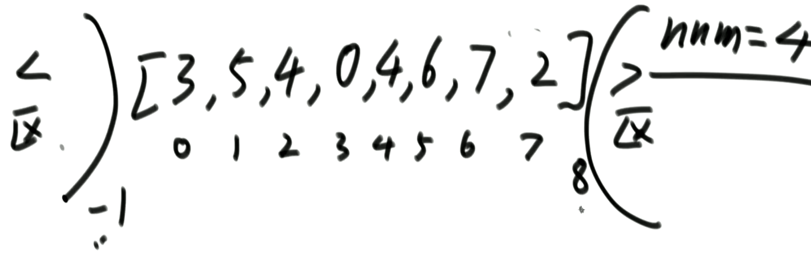

## 数组元素交换

```java
public static void swap(int[] arr,int i,int j){
    // 普通方式
    // int temp = arr[i];
    // arr[i] = arr[j];
    // arr[j] = temp;
    
    // 不使用临时变量方式
    arr[i] = arr[i] + arr[j];
    arr[j] = arr[i] - arr[j];
    arr[i] = arr[i] - arr[j];
    
    // 位运算方式 （前提，a,b分别指向不同的内存，否则就是0）
    //a = a^b;
    //b = a^b;
    //a = a^b;
}
```


## 比较器

规定样本如何比较大小

Compare(T1,T2)，返回值

- 负数：T1放前面
- 0：T1=T2
- 整数：T2放前面

实例代码：

```java
 private static class Sutdent{
     int id;
     int age;
     String name;
     public Student(int id, int age, String name) {
        this.id = id;
        this.age = age;
        this.name = name;
    }
 }
 private static class IdComparator implements Comparator<Sutdent>{
     @Override
     public int compare(Sutdent o1, Sutdent o2) {
         // sheng'xu
         return o1.id-o2.id;
     }
 }
 private static class AgeDescComparator implements Comparator<Sutdent>{
     @Override
     public int compare(Sutdent o1, Sutdent o2) {
         // 降序
         return o2.age-o1.age;
     }
 }
```

测试：

```java
Student[] arr =  { new Student(1,10,"a"),new Student(2,20,"b"),new Student(3,30,"c")};
Arrays.sort(arr,new AgeDescComparator());
Arrays.sort(arr,new IdComparator());
```


## 选择排序

- 在给定边界内，每次选择一个最小的值放入排序队列

1. 从0到N-1中选择最小值放在0位置
2. 从1到N-1中选择最小值放在1位置
3. 从2到N-1中选择最小值放在2位置
4. ...

```java
static void selectionSort(int[] arr) {
    // 首先确定边界条件
    if (arr == null || arr.length < 2)
        return;
    
    int N = arr.length;
    // 0 ~ n-1
    // 1 ~ n-1
    // 2 ~ n-1
    // 3 ~ n-1
    for (int i = 0; i < N; i++) {
        // i ~ n-1
        int minValueIndex = i;
        for (int j = i + 1; j < N; j++) {
            minValueIndex = arr[j] < arr[minValueIndex] ? j : minValueIndex;
      
        swap(arr, i, minValueIndex);
    }
}
```

### 时间复杂度

O(N^2)

浪费比较行为，每次都要做重复的比较行为来确定一个数

## 冒泡排序

- 左右比较，如果左边大则交换位置
- 每一轮循环后可以确认一个最大值

```java
static void bubbleSort(int[] arr) {
        if (arr == null || arr.length < 2)
            return;
        // 0 ~ n-1
        // 0 ~ n-2
        // 0 ~ n-3
        // 0 ~ end
        int N = arr.length;
//        for (int i = 0; i < N; i++) {
//            // 01 12 23 34 45 (end-1 end) 比较交换
//            for (int second = 1; second < N - i; second++) {
//                if (arr[second - 1] > arr[second])
//                    swap(arr, second - 1, second);
//            }
//        }
        for (int end = N - 1; end >= 0; end--) {
            for (int second = 1; second <= end; second++) {
                if (arr[second - 1] > arr[second])
                    swap(arr, second - 1, second);
            }
        }
    }
```

### 时间复杂度

O(N^2)

## 插入排序

```java
static void insertSort1(int[] arr) {
    if (arr == null || arr.length < 2)
        return;
    //0 ~ 0
    //0 ~ 1
    //0 ~ 2
    //0 ~ 3
    //0 ~ n-1 范围内有序
    int N = arr.length;
    for (int end = 0; end < N; end++) {
        int newNumIndex = end;
        while (newNumIndex - 1 >= 0 && arr[newNumIndex] < arr[newNumIndex - 1]) {
            swap(arr, newNumIndex, newNumIndex - 1);
            // 往前移动
            newNumIndex--;
        }
    }
}

static void insertSort2(int[] arr) {
    if (arr == null || arr.length < 2)
        return;
    int N = arr.length;
    for (int end = 0; end < N; end++) {
        for (int pre = end - 1; pre >= 0 && arr[pre] > arr[pre + 1]; pre--) {
            swap(arr, pre, pre + 1);
        }
    }
}
```

### 时间复杂度

O(N^2)


## 并归排序

统计数组的个数

### 递归实现方法

```java
public static void mergeSort(int[] arr){
    if(arr==null || arr.length<2){
        return;
    }
    
    process(arr,0,arr.length-1);
}

public static void process(int[] arr,int L,int R){
    if(L==R){
        return;
    }
    
    int M = L + ((R-L)>>1);
    // 确保左边有序
    process(arr,L,M);
    // 确保右边有序
    process(arr,M+1,R);
    // 合并为整体有序
    merge(arr,L,M,R);
}

public static void merge(int[] arr,int L,int M,int R){
    // 准备一个数组，用来装排序后的数据
    int[] help = new int[R-L+1];
    int curIndex = 0;
    int lI =L;
    int rI = M+1;
    while(lI<=M && rI<=R){
        help[curIndex++] = arr[lI]<arr[rI]?arr[lI++]:arr[rI++];
    }
    while(lI<=M){
        help[curIndex++] = arr[lI++];
    }
    while(rI<=R){
        help[curIndex++] = arr[rI++];
    }
    // 刷到主数组
    for(int i=0;i<help.length;i++){
        arr[L+i] = help[i];
    }
}
```

画出脑图有利于理解递归


### 递归时间复杂度

方法体的时间复杂度主要看merge，因为忽略常数项，merge是O(N)

递归是2T(N/2)


log(b,a)==d   =>  O(N*logN)


### 非递归实现方式

```java
public static void mergeSort(int[] arr){
    if(arr==null || arr.length<2){
        return;
    }
    
    int N = arr.length;
    // 合并组一边的规模（k/2）
    int mergeSize = 1;
    while(mergeSize<N){
        int L = 0;
        while(L<N){
            int M = L+mergeSize-1;
            // 剩余的一半如果大于数组剩余的元素，那么在上一轮已经有序，因为已经凑不齐一对有序数组进行合并
            if(M>=N){
                break;
            }
            // 防止右边越界
            int R = Math.min(M+mergeSize,N-1);
            merge(arr,L,M,R);
            L=R+1;
        }

        // 主要是防止int类型的mergeSize溢出
        if(mergeSize>N/2){
            break;
        }
        
        mergeSize<<=1;
    }
}
```

- 先设定k=2，对数组进行2个为一组merge排序
- 再设定k=4，对数组进行4个为一组merge排序


### 非递归时间复杂度

- 每轮排序是O(N)
- 需要O(logN)次
- 最终还是O(N*logN)


## 随机快排

### 快排1.0

**当数组本身就是顺序数组，那么时间复杂度是O(N^2)**

```java
public static void process1(int[] arr,int L,int R){
    if(L==R)
        return;
    
    int M = partition(arr,L,R);
    process1(arr,L,M-1);
    process1(arr,M+1,R);
}
```

通过以数组最右元素作为分区元素，将数据分区后，可以得到**一个X**的排好序的位置，然后递归其他分区


### 快排2.0

**当数组本身就是顺序数组，那么时间复杂度是O(N^2)**

```java
public static void process2(int[] arr,int L,int R){
    if(L==R)
        return;
    
    int[] area = netherlandsFlag(arr,L,R);
    process2(arr,L,area[0]-1);
    process2(arr,area[1]+1,R);
}
```

通过以数组最右元素作为分区元素，将数据分区后，可以得到**一批等于X**的排好序的位置，然后递归其他分区


### 快排3.0

**时间复杂度O(N*logN)**

在快排2.0的基础上，改为随机选取元素和最后元素替换

```java
public static void process2(int[] arr,int L,int R){
    if(L==R)
        return;
    
    swap(arr,L+(int)(Math.random()*(R-L+1)),R);
    int[] area = netherlandsFlag(arr,L,R);
    process2(arr,L,area[0]-1);
    process2(arr,area[1]+1,R);
}
```

随机打到任意位置，有最差，有最好，最终根据数学家的推断，最终是O(N*logN)


## 桶排序

### 计数排序

- 一个200位员工的年龄，要求对其排序

- 首先准备一个150长度的数组，循环员工的年龄，几岁就在数组下标位置+1

  

- 再准备一个200长度的数组，循环150长度数组，下表的值是多少，就在200长度的数组中插入几条数据

  

如果上面的数量为10亿呢？创建一个10亿长度的数组吗？显然不行

**所有桶排序思想下的排序，都要对数据状况本身有要求**


### 基数排序

基数：不包括小数

适合正整数、数据量不大的情况。有小数也可以调整代码适配，但是代价很大，不如直接使用比较类的排序

- [100,17,29,13,5,27]
- 不满3位的(参考最大值100)，补0
- 准备10个桶，每个桶对应一个队列
- 先按个位进桶
- 再按0-9的队列出桶回到数组
- 再按十位进桶
- 。。。
- 最后一次出桶就排好序了


```java
```

**时间复杂度：O(N*log(10,max))**

最大值求有多少位，就是用最大值除于K次10，所以就是log(10,max)


## 排序的稳定性

什么是稳定性？

- [1,2,3,4,1,2,4,1,1]
- [1,1,1,1,2,2,3,4,4]
- 以上的数组在每一次的排序后第一个位置的1和未排序的1是同一个，其他同理

这个稳定性有什么用？对于上面的基础类型的稳定性，一点毛用都没有

**但对于引用类型很有用**

### 稳定性的作用

一个学生对象有年龄和班级属性，先按年龄排序，再按班级排序，如果有稳定性，那么按每个班级的学生是按年龄有序的


### 哪些排序算法有稳定性

- 选择排序：不稳定
- 冒泡排序：相等的时候不交换，稳定性不会被破坏
- 插入排序：相等不往前，稳定性不会被破坏
- 归并排序：如果每次都保持两边相等时，先拷贝左边的，稳定性不会被破坏
- 随机快排：不稳定，因为涉及到边界数交换
- 堆排序：不稳定，堆排序不管稳不稳定，首要目的是调整成堆结构，调结构的时候会交换父子节点位置


## 总结


### 排序算法总结


### 常见的坑


- 第一点：直接使用堆排序替代
- 第二点：直接使用插排替代
- 第三点：直接使用桶排序


## 常见面试题

### 在一个数组中，一个数左边比它小的数的总和，叫数的小和，所有数的小和累加起来，叫数组小和。求数组小和

例子：[1,3,4,2,5]

- 1左边比1小：没有
- 3左边比3小：1
- 4左边比4小：1，3
- ...
- 所有数组的小和是：1+1+3+。。。=16

**使用归并排序实现**

```java
public static int process(int[] arr,int L,int R){
    if(L==R){
        return 0;
    }
    
    int M = L + ((R-L)>>1);
    return process(arr,L,M) + process(arr,M+1,R) + merge(arr,L,M,R);
}

public static int merge(int[] arr,int L,int M,int R){
    int[] help = new int[R-L+1];
    int curIndex = 0;
    int lI =L;
    int rI = M+1;
    int res = 0;
    while(lI<=M && rI<=R){
        // 判读左边的哪个数比右边的小的数
        res += arr[lI]<arr[rI]? (R-rI+1)*arr[lI]:0;
        // 如果相当需要先拷贝右边
        help[curIndex++] = arr[lI]<arr[rI]?arr[lI++]:arr[rI++];
    }
    while(lI<=M){
        help[curIndex++] = arr[lI++];
    }
    while(rI<=R){
        help[curIndex++] = arr[rI++];
    }
    for(int i=0;i<help.length;i++){
        arr[L+i] = help[i];
    }
    return res;
}
```

### 在一个数组中，求所有的降序对

例子：[3,1,7,0,2]

- 3,1
- 3,0
- 3,2
- 1,0
- 7,0
- 7,2

**使用归并排序实现**

```java
public static int process(int[] arr,int L,int R){
    if(L==R){
        return 0;
    }
    
    int M = L + ((R-L)>>1);
    return process(arr,L,M) + process(arr,M+1,R) + merge(arr,L,M,R);
}

public static int merge(int[] arr,int L,int M,int R){
    int[] help = new int[R-L+1];
    int curIndex = 0;
    int lI =L;
    int rI = M+1;
    int res = 0;
    while(lI<=M && rI<=R){
        // 判断右边哪个数比左边的小的个数
        res += arr[lI]>arr[rI]? (M-lI+1):0;
        // 相等的时候需要拷贝左边的
        help[curIndex++] = arr[lI]<=arr[rI]?arr[lI++]:arr[rI++];
    }
    while(lI<=M){
        help[curIndex++] = arr[lI++];
    }
    while(rI<=R){
        help[curIndex++] = arr[rI++];
    }
    for(int i=0;i<help.length;i++){
        arr[L+i] = help[i];
    }
    return res;
}
```


### 给定一个数组，指定一个数，将小于等于指定数放左边，大于指定数放右边

一个数组就能实现

```java
public static int partition(){
    // <=区域右边界
	int start = -1;
    
}
```

- [i]<=num：将<=区域右边界的下一个和当前数交换，右边界+1
- [i]>num：什么也不做


### 给定一个数组，指定一个数，将小于指定数放左边，大于指定数放右边，中间放等于

- [i]==num：i++
- [i]<num：[i]与 <区 右一个交换，<区 右阔，i++
- [i]>num：[i]与 >区 左一个交换， >区 左阔，i不变（因为交换过来的数还未处理）
- i==右边界相等时结束




### 荷兰国旗问题

- 给定一个数组，指定数组的边界，将内部的元素区分为3部分，用数组的最右元素作为区分区分，最终返回中间区域的边界
- [7,3,2,1,4,0,2]
- (1,0)22(7,3,4) 
- 最终返回[2,3]

```java
public static int[] netherlandsFlag(int[] arr,int L,int R){
    if(L>R){
        return new int[] [-1,-1];
    }
    
    if(L==R){
        return new int[] [L,R];
    }
    
    // <区 右边界
    int less = L-1;
    // >区 左边界，包含了R，由于最右为中间区域的值，所以可以最后再进行单独处理
    int more = R;
    int i = L;
    int midV = arr[R];
    while(i<more){
        if(arr[i]==midV){
            i++;
        }else if(arr[i]<midV){
            // ++less，将当前值和<区的下一个交换，i++
            swap(arr,i++,++less);
        }else{
            // --more，将当前值和>区前一个交换
            swap(arr,i,--more);
        }
    }
    swap(arr,more,R);
    return new int[]{less+1,more};
}
```
