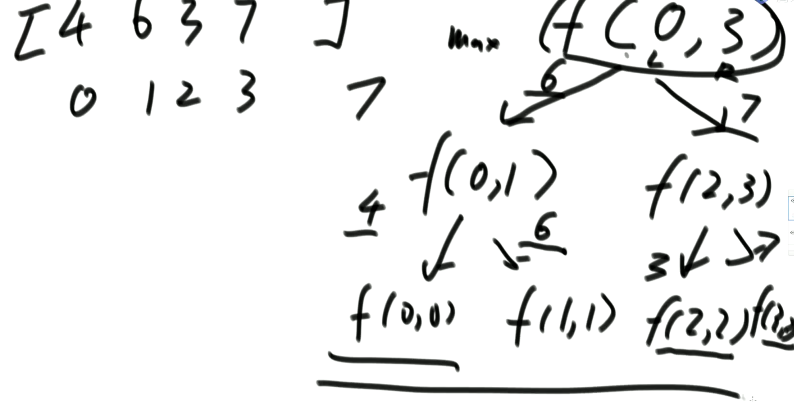
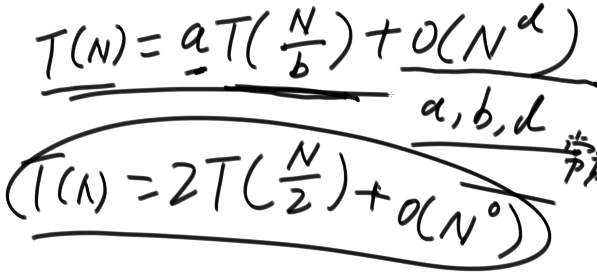
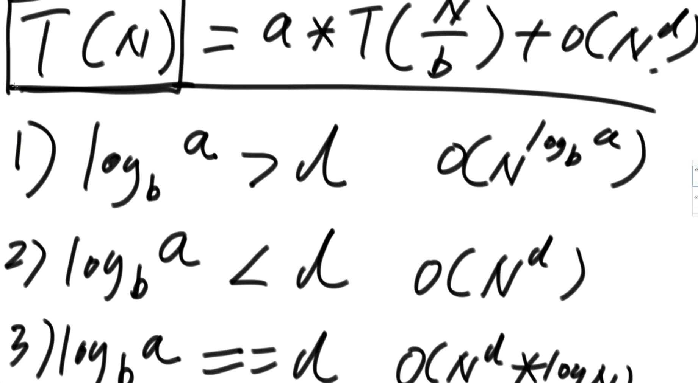

将递归分解成脑图，一直分解到低

在底部会根据一种决策往上返回数据

### 用递归数组求最大值



```java
public static int process(int[] arr,int L,int R){
    if(L==R){
        return arr[L];
    }
    
    int mid = L + ((R-L)>>1);
    int min = process(arr,L,mid-1);
    int max = process(arr,mid+1,R);
    return Math.max(min,max);
}
```


递归利用的是系统栈

任何的递归行为都可以改为非递归

#### 递归时间复杂度

aT(N/b) 是递归次数的时间复杂度

O(N^d) 是递归次数之外的，递归方法内的执行时间





- 以上面的递归方法为例
- 每次递归都是一半的数组，每次递归内部有两次递归，递归内部方法执行时O(1)
- 得出 T(N)=2T(N/2) + O(N^0)
- 那么 a=2, b=2, d=0，中了第一条 log(2,2)，因为log(2,2)=1 > 0(d)
- 所以最终时间复杂度是O(N^log(2,2))
- 得出：O(N^log(2,2))