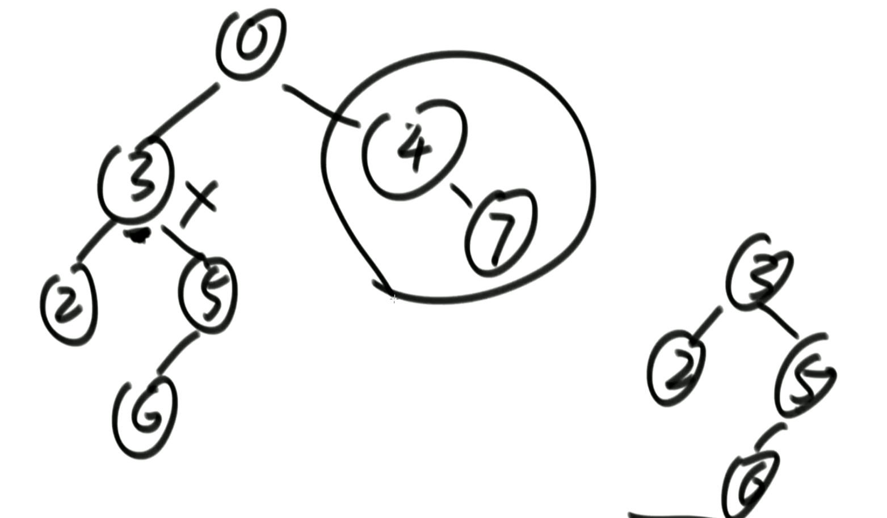

## 递归实现

```java
public class RecursiveTraversal{
    private static class Node{
        int v;
        Node left;
        Node right;
        public Node(){}
        public Node(int v){
            this.v = v;
        }
    }
    
    public static void f(Node head){
        if(head==null)
            return;
        
        // 1
        f(head.left);
        // 2
        f(head.right);
        // 3
    }
    
    // 先序遍历
    public static void pre(Node head){
        if(head==null)
            return;
        
        System.out.println(head.v);
        pre(head.left);
        pre(head.right);
    }
    
    // 中序遍历
    public static void in(Node head){
        if(head==null)
            return;
        
        in(head.left);
        System.out.println(head.v);
        in(head.right);
    }
    
    // 后续遍历
    public static void pos(Node head){
        if(head==null)
            return;
        
        pos(head.left);
        pos(head.right);
        System.out.println(head.v);
    }
}
```


## 递归序

先序、中序、后序，本质都是递归序：每个节点都会经过三次

- 先序：第一次到达时
- 中序：第二次到达时
- 后续：第三次到达时


## 非递归实现

```java
public class Traversal{
    private static class Node{
        int v;
        Node left;
        Node right;
    }
    
    // 先序遍历打印
    public static void pre(Node head){
        if(head==null)
            return;
        
        Stack<Node> stack = new Stack<>();
        stack.push(head);
        while(!stack.isEmpty()){
            Node cur = stack.pop();
            // 弹出立即打印
            System.out.println(cur.v);
            
            if(cur.right!=null)
                stack.push(head.right);
            
            if(cur.left!=null)
                stack.push(head.left);
        }
    }
    
    // 中序遍历（左头右） [难理解]
    public static void in(Node head){
        if(head==null)
            return;
        
        Stack<Node> stack = new Stack<>();
        while(!stack.isEmpty() || head!=null){
            // 1.头->左->（每次都先把头和左压入栈，直到left为null，就是左的最底部）
            if(head!=null){
                stack.push(head);
                head = head.left;
            }else{
                head = stack.pop();
                System.out.print(head.v+" ");
                // 2.弹出左节点后，接着处理右节点
                head = head.rigth;
                // 3.接着又会对右节点的所有左节点压入栈
            }
        }
    }
    
    // 后续遍历（左右头）
    public static void pos(Node head){
        if(head==null)
            return;
        
        Stack<Node> stack = new Stack<>();
        Stack<Node> resStack = new Stack<>();
        stack.push(head);
        // 先头右左
        while(!stack.isEmpty()){
            Node cur = stack.pop();
            // 弹出立即打印
            resStack.push(cur);
            
            if(cur.left!=null)
                stack.push(head.left);
            
            if(cur.right!=null)
                stack.push(head.right);
        }
        
        // 逆序输出
        while(!stack.isEmpty()){
            System.out.print(stack.pop().v+" ")
        }
    }
}
```

后续遍历解析：


## 按层遍历

1. 其实就是宽度优先遍历：**队列**
2. 可以通过设置flag变量的方式来发现某一层的结束


```java
public static void level(Node head){
    if(head==null)
        return;
    
    Queue<Node> queue = new LinkedList<>();
    queue.add(head);
    while(!queue.isEmpty()){
        head = queue.poll();
        System.out.print(head.v+" ");
        
        if(head.left)
            queue.add(head.left);
        
        if(head.right)
            queue.add(head.right);
    }
}
```


## 最大宽度

需要知道每一层的开始或者结束

```java
public static int maxLevel(Node head){
    if(head==null)
        return 0;
    
    Queue<Node> queue = new LinkedList<>();
    queue.add(head);
    Map<Node,Integer> nodeLevelMap = new HashMap<>();
    nodeLevelMap.put(head,1);
    int max = 0;
    // 当前层级
    int curLevel = 1;
    // 当前层级节点数
    int curLevelNodeCount = 0;
    while(!queue.isEmpty()){
        // 当前节点
        Node cur = queue.poll();
        // 获取当前节点的所在层级
        int curNodeLevel = nodeLevelMap.get(cur);
        
        if(cur.left!=null){
            // 每次添加子节点，都能知道子节点的所在层数
            nodeLevelMap.put(cur.left,curNodeLevel+1);
            queue.add(cur.left);
        }
        
        if(cur.right!=null){
            nodeLevelMap.put(cur.right,curNodeLevel+1);
            queue.add(cur.right);
        }
        
        // 如果是当前层级，让当前层级节点总数++
        if(curNodeLevel==curLevel){
            curLevelNodeCount++;
        }else{
            // 层级不同了，先更新上一层的最大值
            max = Math.max(max,curLevelNodeCount);
            curLevelNodeCount = 1;
            // 切换层级
            curLevel++;
        }
    }
    
    return Math.max(max,curLevelNodeCount);
}
```


## 序列化和反序列化

例如内存的此时状态被序列化后保存，下次可以反序列化来恢复当时的状态

1. 序列化的时候需要保留空节点，否则无法还原树结构
2. 用什么方式（先序、中序、后序、按层）序列化，就要用什么方式反序列化


**先序方式：**

```java
// 序列化
public static Queue<String> preSerialize(Node head){
    Queue<String> queue = new LinkedList<>();
    if(head==null){
        queue.add(head);
        return queue;
    }
        
    recursivePreSerialize(head,queue);
    return queue;
}

private static void recursivePreSerialize(Node head,Queue<String> queue){
    if(head==null)
        queue.add(null);
    else{
        // 1 先序
        queue.add(String.valueOf(head.v));
        // 2 中序
        recursivePreSerialize(head.left);
        // 3 后续
    	recursivePreSerialize(head.right);
    }
}

// 反序列化
public static Node preDeSerialize(Queue<String> queue){
    if(queue==null || queue.size()==0)
        return;
    
    return recursivePreDeserialize(queue);
}

private static Node recursivePreDeserialize(Queue<String> queue){
    String v = queue.poll();
    if(v==null)
        return null;
    
    // 1
    head = new Node(Integer.parse(v));
    // 2
    head.left = recursivePreDeserialize(queue);
    // 3
    head.right = recursivePreDeserialize(queue);
    
    return head;
}
```


## 递归套路

1. 假设以X节点为头，假设可以向X左树和X右树要任何信息
2. 在上一步的假设下，讨论以X为头节点的树，得到答案的可能性（最重要）
3. 列出所有可能性后，确定到底需要向左树和右树要什么样的信息
4. 把左树信息和右树信息求全集，就是任何一颗子树都需要返回的信息S
5. 递归函数都返回S，每一棵树都这么要求
6. 写代码，在代码中考虑如何把左树的信息和右树的信息整合出整颗树的信息

通过例子了解递归套路

### 求平衡树

平衡树：

- 子树高度差不超过1
- 左子树和右子树都是平衡树

```java
 public static boolean isBalanceTree(Node head){
    return process(head).isBalance;
}

private static Info process(Node head){
    if(head==null){
        // 最底层的距离是0
        return new Info(true,0);
    }
    
    // 需要向子树得知子树的高度和是否平衡
    Info leftInfo = process(head.left);
    Info rightInfo = process(head.right);
    
    boolean isBalance = true;
    // 分别判断左、右子树本身是否是平衡树
    // 判断左右两数高度差
    if(!leftInfo.isBalance || !rightInfo.isBalance || Math.abs(leftInfo.height-rightInfo.height)>1)
        isBalance = false;
    
    int height = Math.max(leftInfo.height, rightInfo.height) + 1;
    return new Info(isBalance,height);
}

private static class Info{
    boolean isBalance;
    int height;
    public Info(boolean isBalance,int height){
        this.isBalance = isBalance;
        this.height = height;
    }
}
```

### 求最大距离

```java
public static boolean maxDistance(Node head){
    return process(head).isBalance;
}

private static Info process(Node head){
    if(head==null){
        // 最底层的高度是0
        return new Info(0,0);
    }
    
    // 需要向子树得知子树的高度和最大距离
    Info leftInfo = process(head.left);
    Info rightInfo = process(head.right);
    
    // 当前节点的高度
    int height = Math.max(leftInfo.height, rightInfo.height) + 1;
    // 当前节点的最大距离
    // 一种是经过head的最大距离 (左右子树到本节点的最远距离)，另一种是不经过head的最大距离 (子树的maxDistance)
    int maxDistance = Math.max(
        Math.max(leftInfo.maxDistance,rightInfo.maxDistance),leftInfo.height+rightInfo.height+1);
    
    return new Info(maxDistance,height);
}

private static class Info{
    boolean maxDistance;
    int height;
    public Info(boolean maxDistance,int height){
        this.maxDistance = maxDistance;
        this.height = height;
    }
}
```

### 查找最大二叉搜索子树的头节点

二叉搜索子树（BST）：

- 整颗树上没有重复值

- 左树的值都比当前节点小、右树的最小值都比dang'qian大

- 子树包括所有子节点

  

```java
```


## 面试题

### 打印树

如何设计一个打印整棵树的函数

```java

```


### 后继节点

二叉树结构如下定义：

```java
class Node {
    V value;
    Node left;
    Node right;
    // 经典红黑树也是多一个向上指向的指针
    Node parent;
}
```

给你二叉树的某个节点，返回该节点的**后继节点**（中序遍历中，一个节点的下一个节点）

**暴力解：通过parent指针找到头节点，来一遍中序遍历，找到X节点，返回X节点的下一个节点**

```java
public static Node getNextNode(Node node){
    Queue<Node> queue = new LinkedList<>();
    // 先找到head
    Node head = getHead(node);
    inTraverse(head,queue);
    while(!queue.isEmpty()){
        if(queue.pop()==node)
            return queue.pop();
    }
    
    return null;
}

private static Node getHead(Node node){
    while(true){
        if(node.parent==null)
            return node;
        
        node = node.parent;
    }
}

// 中序遍历
public static void inTraverse(Node head,queue){
    if(head==null)
        return;
    
    in(head.left);
    queue.add(head);
    in(head.right);
}
```

**优化解：O(k)**

- 一个节点，如果有右子树，那么后继节点就是右子树的最左节点
- 一个节点，如果没有右子树
  - 如果当前节点是父节点的左孩子，那么父节点就是后继节点
  - 如果当前节点是父节点的右孩子，那么就继续往上找

```java
public static Node getNextNode(Node node){
    if(node==null)
        return node;
    
    if(node.right!=null){
        return getLastLeftNode(node.right);
    }else{
        Node parent = node.parent;
        while(parent!=null && parent.right==node){
            node = parent;
            parent = parent.parent;
        }
        return parent;
    }
}

private static Node getLastLeftNode(Node node){
    if(node==null)
        return node;
    
    while(node.left!=null){
        node = node.left;
    }
    
    return node;
}
```


### 纸条折痕

微软、谷歌、脸书面试题


```java
// N 2N-1
public static void printAllFlods(int N){
    recursivePrint(N,true);
}

// 中序遍历
public static void recursivePrint(int N,boolean down){
    if(N==0)
        return;
    
    recursivePrint(--N,true);
    System.out.print(down?"凹":"凸");
    recursivePrint(N,false);
}
```

