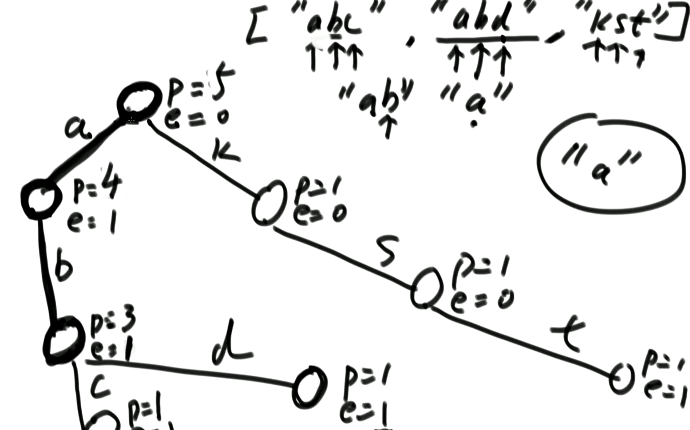

## 介绍

原理

- 每个节点都有两个属性
  - P：被通过的次数
  - E：以当前节点为结束点的次数
- 每个字符串的每个字符都会都会单独创建一个节点
- 如何知道有几个以a开头的字符串？
  - a节点的P为4，所以有4个以a开头的字符串
- 如何知道有几个ab字符串？
  - a->b节点的E为1，所以只有一个ab字符串



## 实现

### 支持26个小写字母

```java
public class TrieTree{
    Node root;
    public TrieTree(){
        root = new Node();
    }
    
    public void insert(String str){
        if(str==null || str.length()==0)
            return;
        char[] chs = str.toCharArray();
        Node cur = root;
        cur.pass++;
        for (int i = 0; i < chs.length; i++) {
            // 'a'~'z' - 'a' = 0 ~ 26
            int index = chs[i]-'a';
            if(cur.nexts[index]==null){
                cur.nexts[index] = new Node();
            }
            cur = cur.nexts[index];
            cur.pass++;
        }
        cur.end++;
    }
    
    // 找到等于word的字符串有几个
    public int findWordCount(String word){
        if(word==null || word.length()==0)
            return 0;
        char[] chs = word.toCharArray();
        Node cur = root;
        for (int i = 0; i < chs.length; i++) {
            int index = chs[i]-'a';
            if(cur.nexts[index]==null){
                return 0;
            }
            cur = cur.nexts[index];
        }
        return cur.end;
    }
    
    // 找到以word为前缀的字符串有几个
    public int prefixCount(String word){
        if(word==null || word.length()==0)
            return 0;
        char[] chs = word.toCharArray();
        Node cur = root;
        for (int i = 0; i < chs.length; i++) {
            int index = chs[i]-'a';
            if(cur.nexts[index]==null){
                return 0;
            }
            cur = cur.nexts[index];
        }
        return cur.pass;
    }
    
    public void delete(String word){
        if(word==null || word.length()==0)
            return;
        // 必须存在才能沿途删除
        if(findWordCount(word)==0)
            return;
        char[] chs = word.toCharArray();
        Node cur = root;
        cur.pass--;
        for (int i = 0; i < chs.length; i++) {
            int index = chs[i]-'a';
            // 最后一个，直接删除节点
            // 兼容最后多个节点属于唯一当前字符串，删除当前节点后，后续节点因为没有被引用会被JVM回收
            if(--cur.nexts[index].pass==0){
                cur.nexts[index] = null;
                return;
            }
            cur = cur.nexts[index];
        }
        // 此条节点路径存在其他字符串
        cur.end--;
    }
    
    private static class Node{
        int pass;
        int end;
        Node[] nexts;
        public Node(){
            // 这里假设只有从a到z的字符
            nexts = new Node[26];
            pass = 0;
            end = 0;
        }
    }
}
```

### 支持所有字符

```java
public class TrieTree{
    Node root;
    public TrieTree(){
        root = new Node();
    }
    
    public void insert(String str){
        if(str==null || str.length()==0)
            return;
        char[] chs = str.toCharArray();
        Node cur = root;
        cur.pass++;
        for (int i = 0; i < chs.length; i++) {
            int index = (int)chs[i];
            if(!cur.nexts.containsKey(index)){
                cur.nexts.put(index,new Node());
            }
            cur = cur.nexts.get(index);
            cur.pass++;
        }
        cur.end++;
    }
    
    // 找到等于word的字符串有几个
    public int findWordCount(String word){
        if(word==null || word.length()==0)
            return 0;
        char[] chs = word.toCharArray();
        Node cur = root;
        for (int i = 0; i < chs.length; i++) {
            int index = (int)chs[i];
            if(!cur.nexts.containsKey(index)){
                return 0;
            }
            cur = cur.nexts.get(index);
        }
        return cur.end;
    }
    
    // 找到以word为前缀的字符串有几个
    public int prefixCount(String word){
        if(word==null || word.length()==0)
            return 0;
        char[] chs = word.toCharArray();
        Node cur = root;
        for (int i = 0; i < chs.length; i++) {
            int index = (int)chs[i];
            if(!cur.nexts.containsKey(index)){
                return 0;
            }
            cur = cur.nexts.get(index);
        }
        return cur.pass;
    }
    
    public void delete(String word){
        if(word==null || word.length()==0)
            return;

        if(findWordCount(word)==0)
            return;
        char[] chs = word.toCharArray();
        Node cur = root;
        cur.pass--;
        for (int i = 0; i < chs.length; i++) {
            int index = (int)chs[i];
            if(--cur.nexts.get(index).pass==0){
                cur.nexts.get(index) = null;
                return;
            }
            cur = cur.nexts.get(index);
        }

        cur.end--;
    }
    
    private static class Node{
        int pass;
        int end;
        HashMap<Integer,Node> nexts;
        public Node(){
            // 这里假设只有从a到z的字符
            nexts = new HashMap<Integer,Node>();
            pass = 0;
            end = 0;
        }
    }
}
```

### 时间复杂度

**O(N)**

字符有多少个就操作多少次


## 扩展

可以在节点上增加自定义属性，按需求
