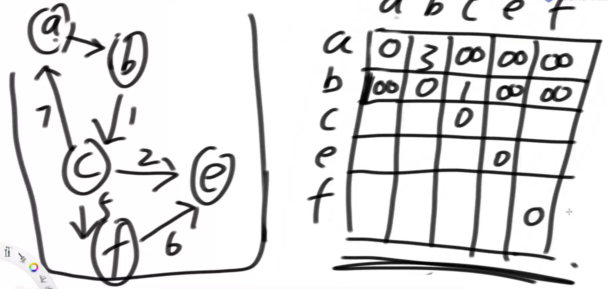
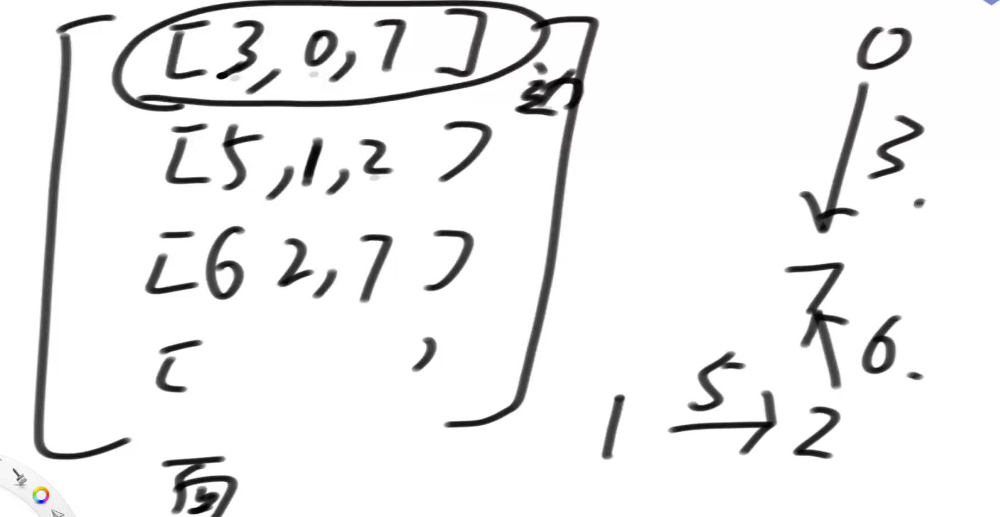
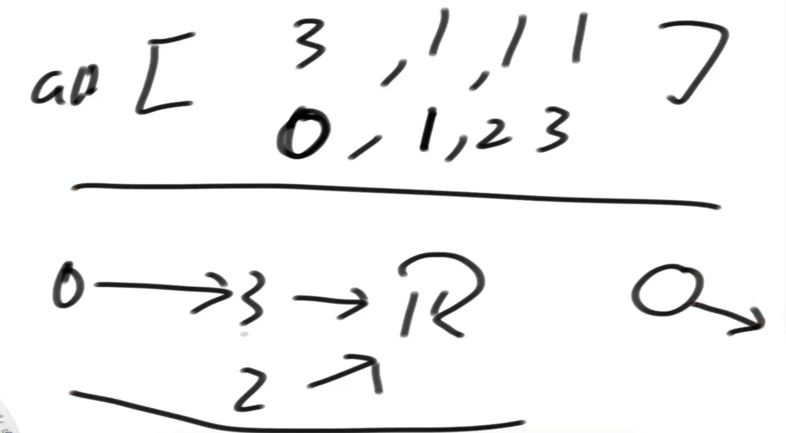
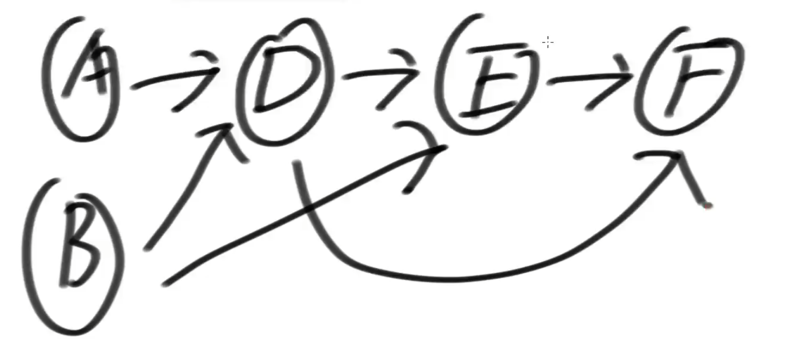
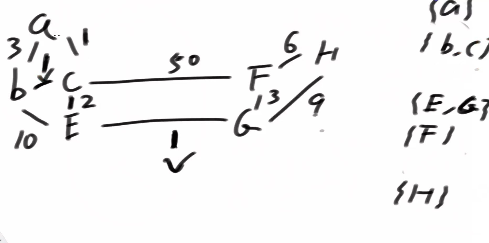
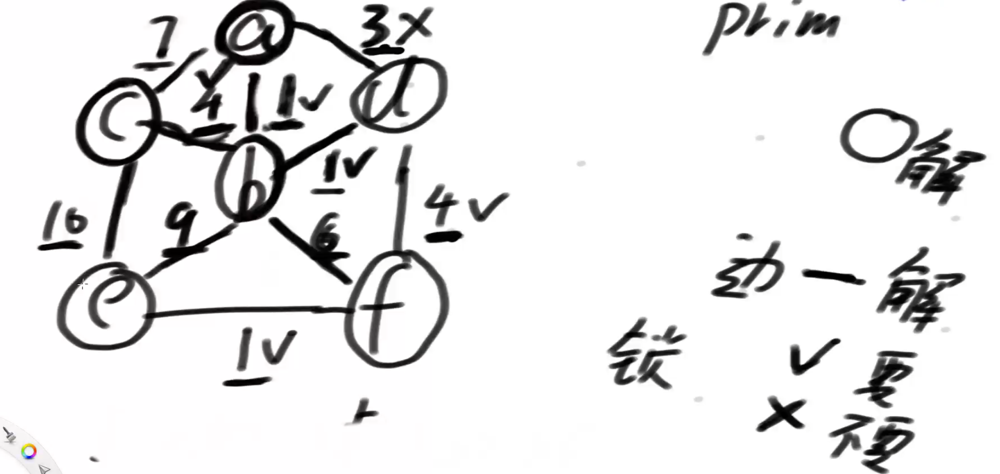

# 图

## 介绍

- 有向图
  - 单向图
  - 双向图
- 无向图

## 单向图示例

用二位数组表示有向图

面试中的图结构
二维数组表示

用下标表示开始，元素表示结束

## 应用

## 拓扑排序

通过每个点的入度属性(in)==0来判断先后顺序，如：

1. A、B的in是0，所以先放入一个队列
2. 然后弹出A放入结果集，遍历A的邻居点，让邻居点的in--（另外用一个map来记录就不用修改图的原本数据了）
3. 判断当前邻居节点in--后是否==0，是就入队列
4. 重复以上2,3
5. 最终结果：A, B, D, E, F   或者   B, A, D, E, F

### Kruskal算法（贪心）

贪心：用日常智慧想出来的

### Prim算法（贪心）

