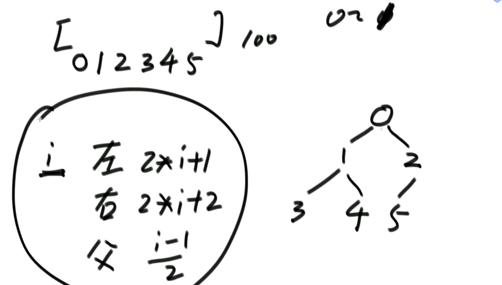
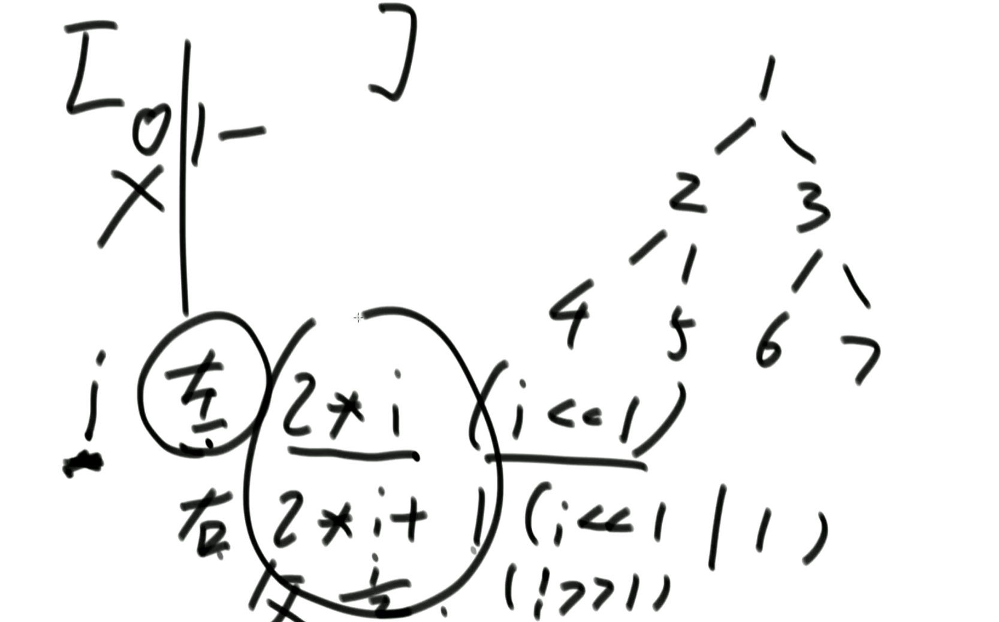
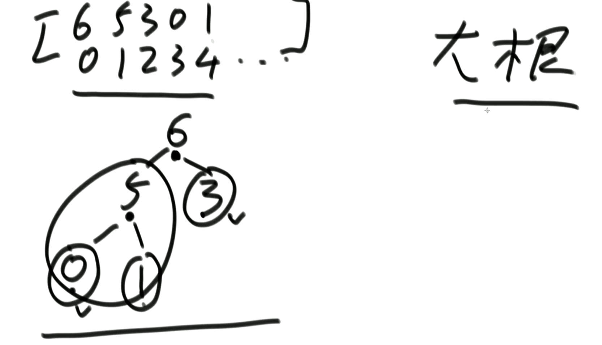
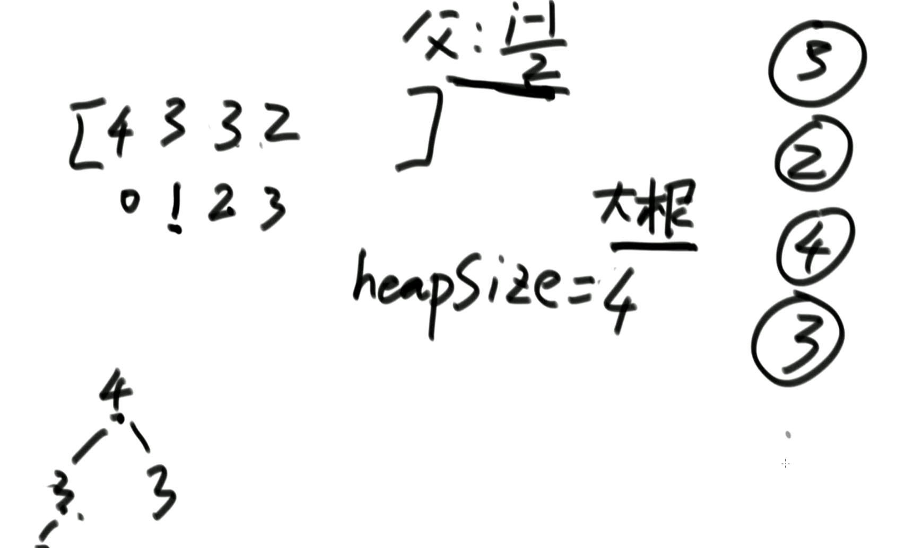
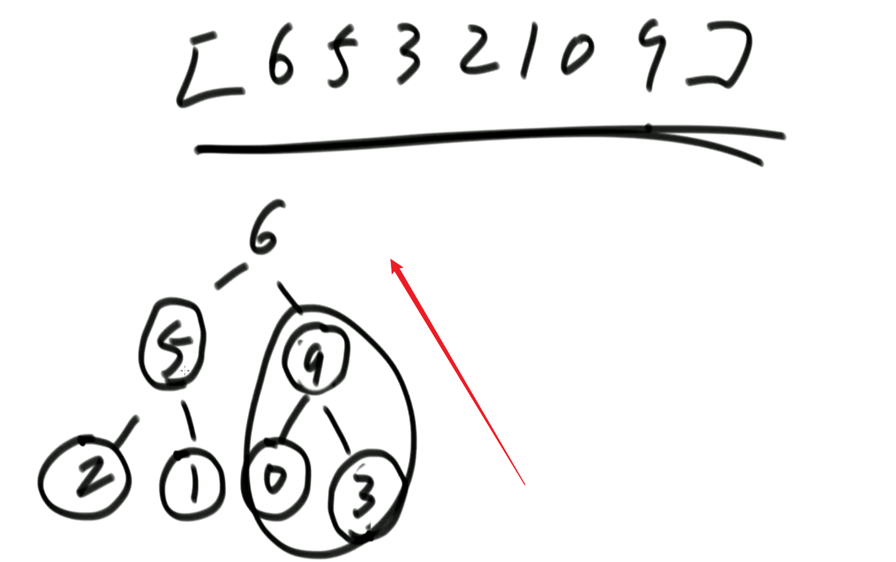
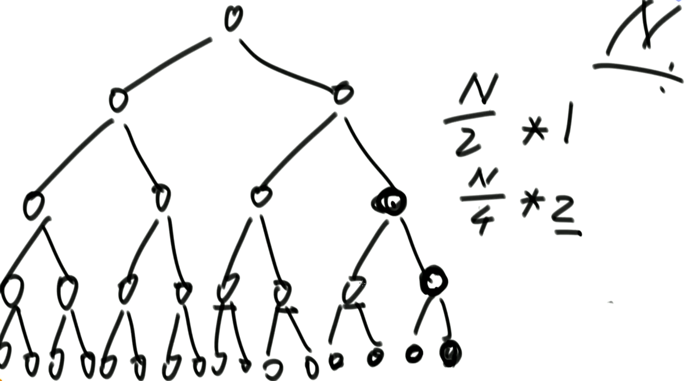
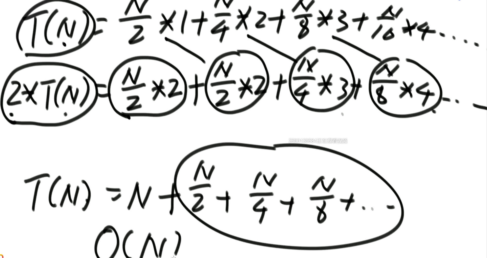
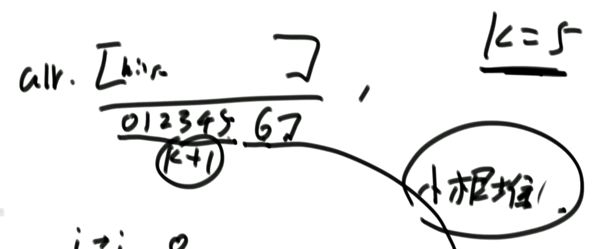

## 介绍

堆是逻辑结构

完全二叉树结构

数组来表示完全二叉数

通过以下公式来支撑数组表示二叉树



**很多实现是不使用第0位，从第1位开始**

计算就可以通过全位运算来实现




## 堆实现

### 普通实现

```java
public class MyMaxHeap{
    private int[] heap;
    private final int limit;
    private int heapSize;
    
    public MyMaxHeap(int limit){
        heap = new int[limit];
        this.limit = limit;
        heapSize = 0;
    }
    
    public boolean isEmpty(){
        return heapSize==0;
    }
    
    public boolean isFull(){
        return heapSize==limit;
    }
    
    public void push(int v){
        if(heapSize==limit){
            throw new RuntimeException("heap is full");
        }
        
        heap[heapSize] = v;
        heapInsert(heap,heapSize++);
    }
    
    public void pop(){
        if(heapSize==0){
            throw new RuntimeException("heap is empty");
        }
        
        // 返回最大值
        int t = arr[0];
        // 将最后一个末尾节点（最小值）替换到头节点，且缩小堆大小
        swap(arr,0,--heapSize)
	    // 重新调整堆化
        heapify(arr,0,heapSize);
        return t;
    }
    
    private void heapInsert(int[] heap,int i){
        // 根父节点比较大小,i==0时退出
        while(heap[i]>heap[(i-1)/2]){
            swap(heap,i,(i-1)/2);
            i = (i-1)/2;
        }
    }
    
    private void swap(int[] arr,int i,int j){
        int temp = arr[i];
        arr[i] =arr[j];
        arr[j] =arr[i];
    }
    
    // 重新调整结构为堆
    private void heapify(int[] arr,int index，int heapSize){
        // 左孩子的下标
        //int left = 2*index+1;
		int left = (index<<1) | 1;
        while(left<heapSize){  // 如果下标不越界，代表有孩子
            // 判断是否有右孩子，判断左孩子大还是右孩子大，大的跟父节点交换
            int largest = left+1<heapSize && arr[left+1]>arr[left]? left+1:left;
            //largest = arr[largest]>arr[index]?largest:index;
            if(arr[largest]<arr[index])
                break;
            
            swap(arr,largest,index);
            index = largest;
            left = 2*index+1;
        }
    }
}
```

### 泛型实现

支持元素修改后，重新排序

```java
public class MyMaxHeap<T>{
    private List<T> heap;
    private Map<T,Integer> indexMap;
    private int heapSize;
    private Comparator<? super T> comparator;
    
    public MyMaxHeap(Comparator<? super T> comparator){
        heapSize = 0;
        heap = new ArrayList<>();
        this.comparator = comparator;
        indexMap = new HashMap<>();
    }
    
    public boolean isEmpty(){
        return heapSize==0;
    }

    public int size(){
        return heapSize;
    }

    public boolean contains(T key){
        return indexMap.containsKey(key);
    }
    
    public void push(T t){
        heap.add(t);
        // 记录节点的位置，后续根据节点找到所在位置
        indexMap.put(t,heapSize);
        heapInsert(heapSize++);
    }
    
    public T pop(){
        if(heapSize==0){
            throw new RuntimeException("heap is empty");
        }
        
        // 弹出堆顶
        T t = heap.get(0);
        // 将最后一个替换到头节点
        swap(0,--heapSize);
	    // 重新调整堆化
        heapify(0);
        return t;
    }
    
    private void heapInsert(int i){
        // 根父节点比较大小
//        while(heap[i]>heap[(i-1)/2]){
        while(comparator.compare(heap.get(i),heap.get((i-1)/2)) < 0){
            swap(i,(i-1)/2);
            i = (i-1)/2;
        }
    }

    private void reSign(T t){
        Integer tIndex = indexMap.get(t);
        // 以下只有一个方法内部会处理逻辑
        heapInsert(tIndex);
        heapify(tIndex);
    }
    
    private void swap(int i,int j){
        T t = heap.get(i);
        T t1 = heap.get(j);
        heap.set(i,t1);
        heap.set(j,t);
        indexMap.put(t,j);
        indexMap.put(t1,i);
    }
    
    // 重新调整结构为堆
    private void heapify(int index){
        int left = 2*index+1;
        while(left<heapSize){
//            int largest = left+1<heapSize && arr[left+1]>arr[left]? left+1:left;
            int largest = left+1<heapSize && comparator.compare(heap.get(left+1),heap.get(left)) < 0? left+1:left;
            //largest = arr[largest]>arr[index]?largest:index;
//            if(arr[largest]<arr[index])
            if(comparator.compare(heap.get(index),heap.get(largest)) < 0)
                break;
            
            swap(largest,index);
            index = largest;
            left = 2*index+1;
        }
    }

    private static class Student {
        int id;
        int age;
        String name;

        public Student(int id, int age, String name) {
            this.id = id;
            this.age = age;
            this.name = name;
        }
    }

    private static class IdComparator implements Comparator<Student>{
        @Override
        public int compare(Student o1, Student o2) {
            if(o1.id<o2.id)
                return -1;
            else if(o1.id==o2.id)
                return 0;
            else
                return 1;
//            return o1.id-o2.id;
        }
    }
}
```


## 堆的类型

- 大根堆：任何子树中都是父节点的数最大

  

- 小根堆：任何一个子树的父节点都是最小的


## 堆结构

### 大根堆插入流程

每次插入都通过找父节点公式，判断自己是否比父节点大，如果大就要交换，一直向上比较父节点的大小，直到小于父节点后停下




## 堆排序

**使用大根堆的结构来对数组进行排序**

1. 先让整个数组都变成大根堆结构，建立堆的过程：
   1. 从上到下的方法，时间复杂度为O(N*logN)
   2. 从下到上的方法，时间复杂度为O(N)
2. 把堆的最大值和堆末尾的值交换，然后减少堆的大小之后，再去调整堆，一直周而复始，时间复杂度为O(N*logN)
3. 堆的大小减小成0之后，排序完成

```java
public static void heapSort(int[] arr){
    if(arr==null || arr.length<2)
        return;
    
    // 从头遍历，相当于有一棵树在不断的生长，然后孩子节点在不停的和父节点做比较，保证最后生成大根堆
    //for(int i=0;i<arr.length;i++){ // O(N)
    //    heapInsert(arr,0);  // O(logN)
    //}
    // 优化点
    for(int i=arr.length-1;i>=0;i--){ // O(N)
        heapify(arr,i,arr.length);  // N+O(N)
    }
    
    // 开始排序
    int heapSize = arr.length;
    // 头节点直接放到最后，最后的孩子放到头节点，因为根据大根堆的结构，头节点是最大的，然后缩小堆大小
    // 循环结束就能得到按从小到达排序的数组
    swap(arr,0,--heapSize);
    while(heapSize>0){ // O(N)
        // 重新堆化来选出最大值（下沉最初交换上来的末尾j）
	    heapify(arr,0,heapSize); // O(logN)
        swap(arr,0,--heapSize); // O(1)
    }
}
```

优化点原理图





**最终N后面那串被收敛为O(N)**




## Java中堆的应用

### PriorityQueue

```java
public void test(){
    // 默认是小根堆
    PriorityQueue<Integer> heap = new PriorityQueue<>();
    heap.add(5);
    heap.add(0);
    heap.add(2);
    heap.add(5);
    while(!heap.isEmpty()){
        System.out.println(heap.poll());
    }
    
    // 结果是排好序的
    //0 2 5 5
}
```

**使用大根堆**

```java
private static class MyComparator implements Comparator<Integer>{
    @Override
    public int compare(Integer o1, Integer o2) {
        return o2-o1;
    }
}

public void test(){
    // 默认是小根堆
    PriorityQueue<Integer> heap = new PriorityQueue<>(new MyComparator());
    heap.add(5);
    heap.add(0);
    heap.add(2);
    heap.add(5);
    while(!heap.isEmpty()){
        System.out.println(heap.poll());
    }
    
    // 结果是排好序的
    // 5 5 2 0
}
```


## 面试题

### 排序

**已知一个几乎有序的数组。几乎有序是指，如果把数组排好顺序的话，每个元素移动的距离一定不超过K，并且K相对于数组长度来说是比较小的。**

```java
public void sortedArrDistanceLessK(int[] arr,int k){
    PriorityQueue<Integer> heap = new PriorityQueue<>();
    int index=0;
    // 先加入k个数到堆
    for(;index<Math.min(arr.length-1,k);index++){
        heap.add(arr[index]);
    }
    int i=0;
    for(;i<arr.length;i++,index++){
        // 根据小根堆，先弹出最小的
        arr[i] = heap.poll();
        heap.add(arr[index]);
    }
    // 最后剩余的k个只需要依次弹出
    while(!heap.isEmpty()){
        arr[i++] = heap.poll();
    }
}
```



**时间复杂度：O(N*logk)**

