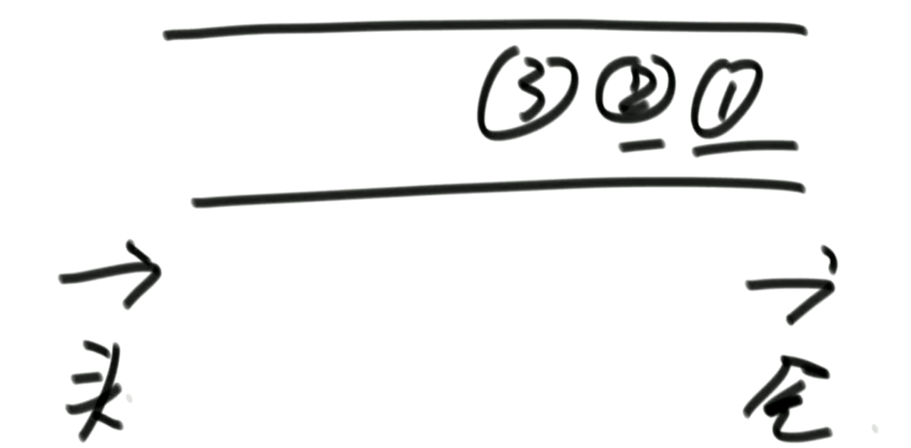

## 介绍

栈和队列都是逻辑结构

**底层是用双向链表或者数组来实现的**

### 双向链表

取数和压数都是O(1)

```java
public class DoubleEndsQueue<T>{
    DoubleNode<T> head;
    DoubleNode<T> tail;
    
    public void addFromHead(T value){
        DoubleNode<T> cur = new DoubleNode<>(value);
        if(head==null){
            head = cur;
            tail = cur;
        }else{
            cur.next = head;
            head.last = cur;
            head = cur;
        }
    }
    
    public void addFormBottom(T value){
        DoubleNode<T> cur = new DoubleNode<>(value);
        if(head==null){
            head = cur;
            tail = cur;
        }else{
            cur.last = tail;
            tail.next = cur;
            tail = cur;
        }
    }
    
    public T popFromHead(){
        if(head==null){
            return null;
        }

        DoubleNode<T> cur = head;
        if(head == tail){
            head = null;
            tail = null;
        }else{
            head = head.next;
            cur.next = null;
        	head.last = null;
        }
        
        return cur.v;
    }
    
    public T popFromBottom(){
        if(head==null){
            return null;
        }

        DoubleNode<T> cur = head;
        if(head == tail){
            head = null;
            tail = null;
        }else{
            head = head.next;
            cur.next = null;
        	head.last = null;
        }
        
        return cur.v;
    }
}
```

add 过程


### 数组

简单的情况，固定的数组长度


## 栈

先进先出

### 基于双向链表实现

```java
public class MyStack<T> {
    private final DoubleEndsQueue<T> queue;

    public MyStack() {
        queue = new DoubleEndsQueue<T>();
    }

    public void push(T v) {
        queue.addFromHead(v);
    }

    public T pop() {
        return queue.popFromHead();
    }
}
```

pop 过程

### 基于数组


## 队列



### 基于双向链表

```java
public class MyQueue<T>{
    private DoubleEndsQueue<T> queue;
    
    public MyStack(){
        queue = new DoubleEndsQueue<T>();
    }
    
    public void push (T v){
        queue.addFromHead(v);
    }
    
    public T pop(){
        queue.popFromBottom();
    }
}
```

### 基于数组

环状使用内存的结构


**如何实现？**

单纯的用两个变量：pollIndex和putindex，然后putindex去追赶pollindex，coding太难了，起始位置的设定和是否追赶上很难判断


增加size字段，解耦pollindex和putindex

```java
publiu class MyQueue<T>{
    private T[] arr;
    private int polli;
    private int pushi;
    private int size;
    private int limit;
    
    public MyQueue(int l){
        polli = 0;
        pushi = 0;
        size = 0;
        queue = new T(l);
        limit = l;
    }
    
    public void push(T v){
        if(size==limit){
            throw new RuntimeException("队列满了，不能再加了");
        }
        
        size++;
        arr[pushi] = v;
        pushi = nextIndex(pushi);
    }
    
    public T pop(){
        if(size==0){
            throw new RuntimeException("队列空了，不能再取了");
        }
        
        size--;
        T t = arr[polli];
        polli = nextIndex(polli);
        return t;
    }
    
    // ring
    private int nextIndex(int i){
        return i<limit-1?i++:0;
    }
}
```


## 常见面试题

### 实现一个特殊的栈，在基本功能的基础上，再实现返回栈中最小元素的功能

1. pop、push、getMin操作的时间复杂度都是O(1)
2. 设计的栈类型可以使用现成的栈结构


```java
public class IntegerStack<T> {
    private final Stack<Integer> stackMin;
    private final Stack<Integer> stackData;

    public IntegerStack() {
        stackMin = new Stack<>();
        stackData = new Stack<>();
    }

    public void push(int v) {
        if(stackData.isEmpty() || v < getMin()){
            stackMin.push(v);
        }else{
            stackMin.push(getMin());
        }

        stackData.push(v);
    }

    public int pop() {
        if(stackMin.isEmpty()){
            throw new RuntimeException("Your Stack Is Empty");
        }

        stackMin.pop();
        return stackData.pop();
    }

    public int getMin(){
        if(stackMin.isEmpty()){
            throw new RuntimeException("Your Stack Is Empty");
        }

        return stackMin.peek();
    }
}
```

### 使用队列实现栈

- 两个队列：data、help
- push时：往data队列
- pop时：将data队列的数据压入help队列，剩余最后一个直接返回
- 切换data、help


### 使用栈来实现队列

- 两个栈：push、pop
- push：往push栈
- pop：将push栈导到pop栈，但是有个前提条件，pop栈必须为空，如果不为空直接从pop栈出


```java
public class TwoStackImplQueue<T> {
    private Stack<T> stackPush;
    private Stack<T> stackPop;

    public TwoStackImplQueue() {
        stackPush = new Stack<>();
        stackPop = new Stack<>();
    }

    public void add(T t){
        stackPush.push(t);
        pushToPop();
    }

    public T poll(){
        if(stackPush.isEmpty() && stackPop.isEmpty()){
            throw new RuntimeException("Queue Is Empty!");
        }

        pushToPop();
        return stackPop.pop();
    }

    public T peek(){
        if(stackPush.isEmpty() && stackPop.isEmpty()){
            throw new RuntimeException("Queue Is Empty!");
        }

        pushToPop();
        return stackPop.peek();
    }

    public void pushToPop(){
        if(!stackPop.isEmpty())
            return;

        while(!stackPush.isEmpty()){
            stackPop.push(stackPush.pop());
        }
    }
}
```

