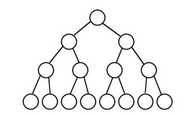
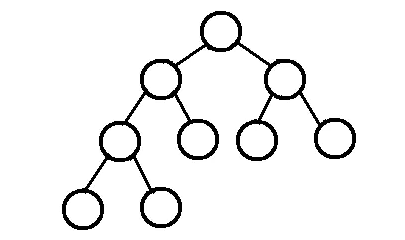
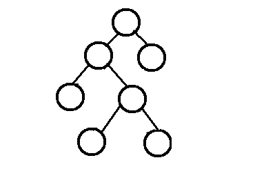
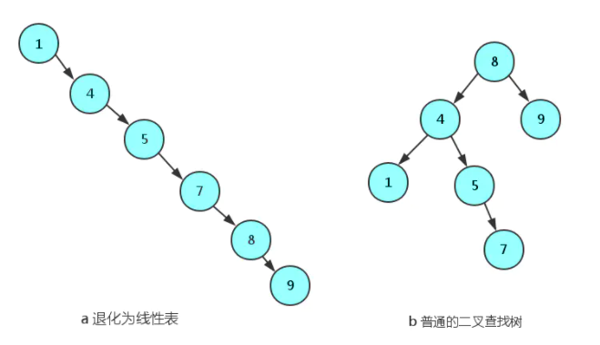
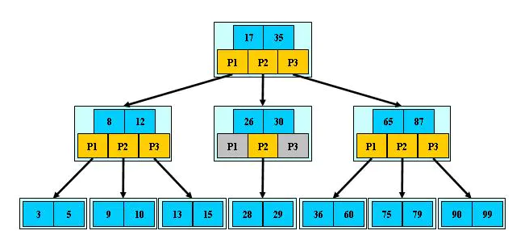
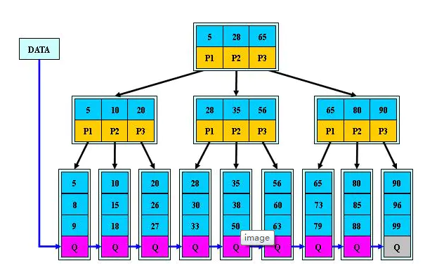

## 概念

树是由结点或顶点和边组成的(可能是非线性的)且不存在着任何环的一种数据结构。没有结点的树称为空(null或empty)树。一棵非空的树包括一个根结点，还(很可能)有多个附加结点，所有结点构成一个多级分层结构

## 二叉树

每个结点至多拥有两棵子树(即二叉树中不存在度大于2的结点)，并且，二叉树的子树有左右之分，其次序不能任意颠倒。
 二叉树的性质

1. 若二叉树的层次从0开始，则在二叉树的第i层至多有`2^i`个结点(i>=0)
2. 高度为`k`的二叉树最多有`2^(k+1) - 1`个结点`(k>=-1)`(空树的高度为-1)
3. 对任何一棵二叉树，如果其叶子结点(度为0)数为`m`, 度为2的结点数为`n`, 则`m = n + 1`

**完美二叉树(满二叉树)**

除了叶子节点之外的每个节点都有两个孩子，每一层都被完全填充

**完全二叉树**

除了最后一层之外的其他每一层都被完全填满，最后一层不能出现间隙

**完满二叉树**

除了叶子节点之外其余节点都有两个孩子节点

### 二叉树的遍历方法

- 中序遍历：即左-根-右遍历，对于给定的二叉树根，寻找其左子树；对于其左子树的根，再去寻找其左子树；递归遍历，直到寻找最左边的节点i，其必然为叶子，然后遍历i的父节点，再遍历i的兄弟节点。随着递归的逐渐出栈，最终完成遍历
-  先序遍历：即根-左-右遍历
-  后序遍历：即左-右-根遍历

## 二叉查找树

二叉查找树也称为有序二叉查找树,满足二叉查找树的一般性质,是指一棵空树具有如下性质：

- 任意节点左子树不为空,则左子树的值均小于根节点的值
-  任意节点右子树不为空,则右子树的值均大于于根节点的值
-  任意节点的左右子树也分别是二叉查找树
-  没有键值相等的节点 

**局限性及应用**

一个二叉查找树是由n个节点随机构成,所以，对于某些情况，叉查找树会退化成一个有n个节点的线性链.如下图:

## AVL树

AVL树是带有**平衡条件的二叉查找树**，和红黑树相比，它是严格的平衡二叉树，平衡条件必须满足(所有节点的左右子树高度差不超过1)。不管我们是执行插入还是删除操作，只要不满足上面的条件，就要通过旋转来保持平衡，而旋转是非常耗时的， 旋转的目的是为了降低树的高度，使其平衡

**使用场景：**

AVL树适合用于插入删除次数比较少，但查找多的情况。
在`Windows`进程地址空间管理中得到了使用

 **AVL树特点：**

- AVL树是一棵二叉搜索树
- AVL树的左右子节点也 是AVL树
- AVL树拥有二叉搜索树的所有基本特点
- 每个节点的左右子节点的高度之差的绝对值最多为1，即平衡因子为范围为`[-1,1]`

## 红黑树

红黑树多用于搜索,插入,删除操作多的情况下

**红黑树应用比较广泛：**

1. 广泛用在`C++`的`STL`中。`map`和`set`都是用红黑树实现的。
2. 著名的`linux`进程调度`Completely Fair Scheduler`，用红黑树管理进程控制块。
3. epoll`在内核中的实现，用红黑树管理事件块
4. `nginx`中，用红黑树管理`timer`等

**与AVL数的区别：**

红黑树的查询性能略微逊色于`AVL`树，因为比`AVL`树会稍微不平衡最多一层，也就是说红黑树的查询性能只比相同内容的`AVL`树最多多一次比较，但是，红黑树在插入和删除上完爆`AVL`树，`AVL`树每次插入删除会进行大量的平衡度计算，而红黑树为了维持红黑性质所做的红黑变换和旋转的开销，相较于`AVL`树为了维持平衡的开销要小得多

**性质：**

1. 节点是红色或黑色。
2. 根节点是黑色。
3. 每个叶子节点都是黑色的空节点（NIL节点）。
4. 每个红色节点的两个子节点都是黑色。(从每个叶子到根的所有路径上不能有两个连续的红色节点)
5. 从任一节点到其每个叶子的所有路径都包含相同数目的黑色节点。

## B树

B-树就是B树，-只是一个符号

B树(B-Tree)是一种自平衡的树,它是一种多路搜索树（并不是二叉的），能够保证数据有序。同时它还保证了在查找、插入、删除等操作时性能都能保持在`O(logn)`，为大块数据的读写操作做了优化,同时它也可以用来描述外部存储(支持对保存在磁盘或者网络上的符号表进行外部查找)

**特点：**

1. 定义任意非叶子结点最多只有`M`个儿子；且`M>2`
2. 根结点的儿子数为`[2, M]`
3. 除根结点以外的非叶子结点的儿子数为`[M/2, M]`
4. 每个结点存放至少`M/2-1`（取上整）和至多`M-1`个关键字；（至少2个关键字）
5. 非叶子结点的关键字个数=指向儿子的指针个数-1
6. 非叶子结点的关键字：`K[1], K[2], …, K[M-1]；且K[i] < K[i+1]`
7. 非叶子结点的指针：`P[1], P[2], …, P[M]`，其中`P[1]`指向关键字小于`K[1]`的子树，`P[M]`指向关键字大于`K[M-1]`的子树，其它`P[i]`指向关键字属于`(K[i-1], K[i])`的子树
8. 所有叶子结点位于同一层

4 阶 B 树表示每个节点最多有 4 个子树、3 个关键字，最少有 2 个子树、一个关键字

添加/删除也是一样的，要考虑添加/删除孩子后，父节点是否还满足子树 `k` 介于 `M/2` 和 `M` 的条件，不满足就得从别的节点拆子树甚至修改相关子树结构来保持平衡。

## B+树

**B+树是B-树的变体，也是一种多路搜索树**

 B+的搜索与B-树也基本相同，区别是B+树只有达到叶子结点才命中（B-树可以在非叶子结点命中），其性能也等价于在关键字全集做一次二分查找；

**B+的特性：**

1. 所有关键字都出现在叶子结点的链表中（稠密索引），且链表中的关键字恰好是有序的

2. 不可能在非叶子结点命中

3. 非叶子结点相当于是叶子结点的索引（稀疏索引），叶子结点相当于是存储（关键字）数据的数据层

4. 更适合文件索引系统

   原因： 增删文件（节点）时，效率更高，因为B+树的叶子节点包含所有关键字，并以有序的链表结构存储，这样可很好提高增删效率

**使用场景：**

文件系统和数据库系统中常用的B/B+ 树，他通过对每个节点存储个数的扩展，使得对连续的数据能够进行较快的定位和访问，能够有效减少查找时间，提高存储的空间局部性从而减少IO操作。他广泛用于文件系统及数据库中，如：

- Windows：HPFS 文件系统
- Mac：HFS，HFS+ 文件系统
- Linux：ResiserFS，XFS，Ext3FS，JFS 文件系统
- 数据库：ORACLE，MYSQL，SQLSERVER 等中

**B树：有序数组+平衡多叉树
B+树：有序数组链表+平衡多叉树**

**B+ 树的优点：**

1. 层级更低，IO 次数更少
2. 每次都需要查询到叶子节点，查询性能稳定
3. 叶子节点形成有序链表，范围查询方便