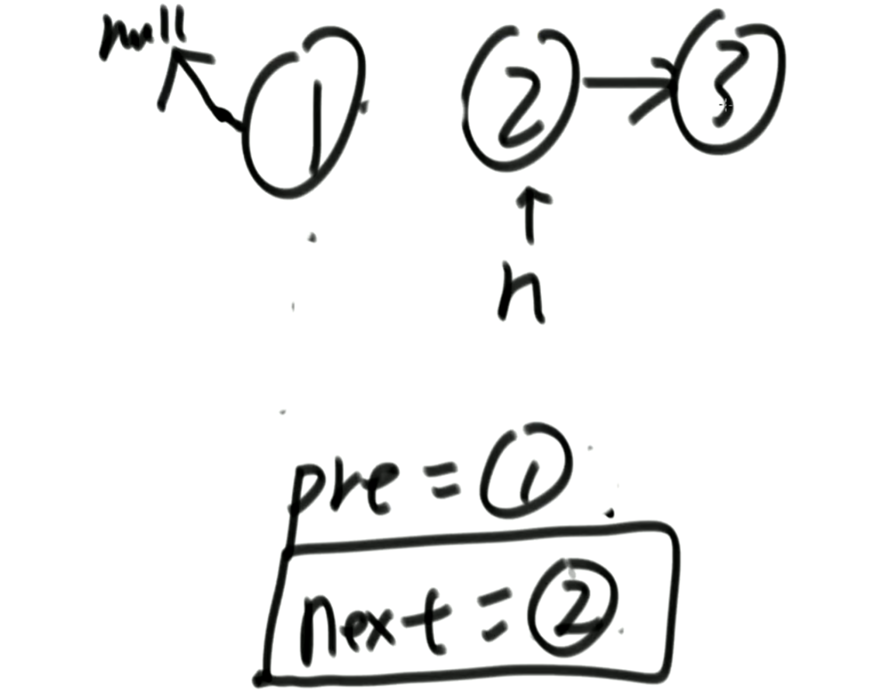
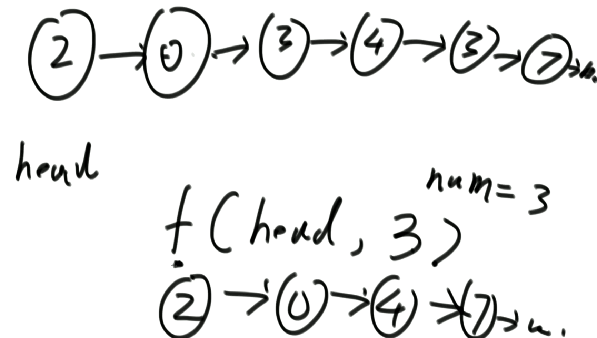
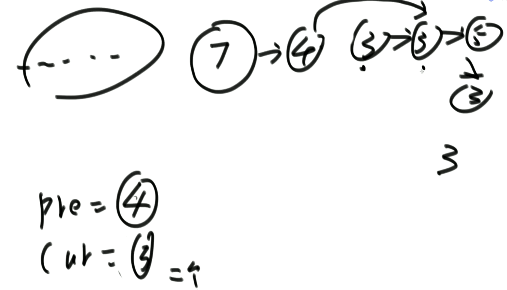
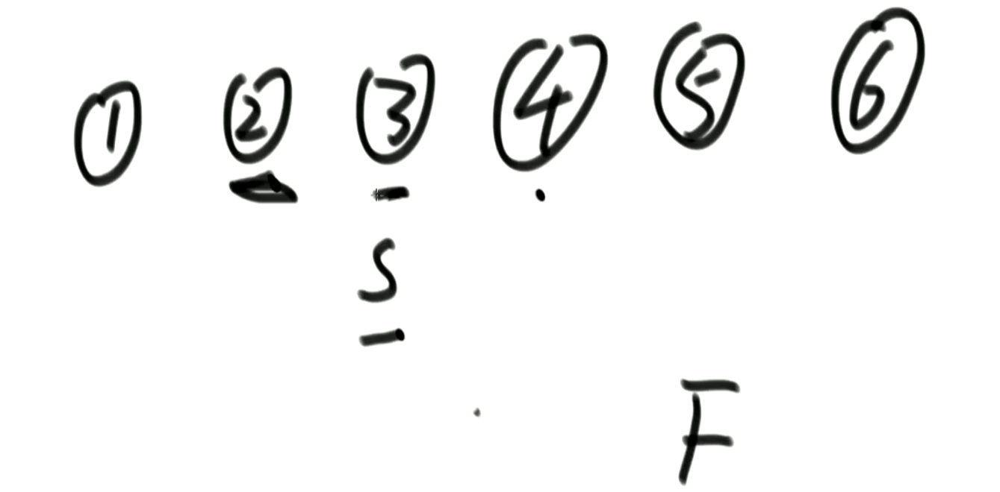
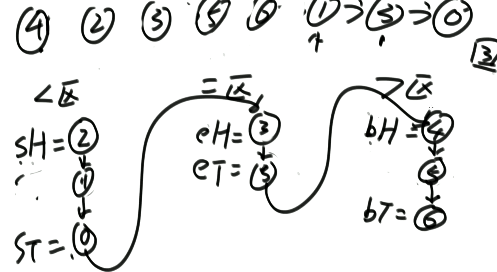
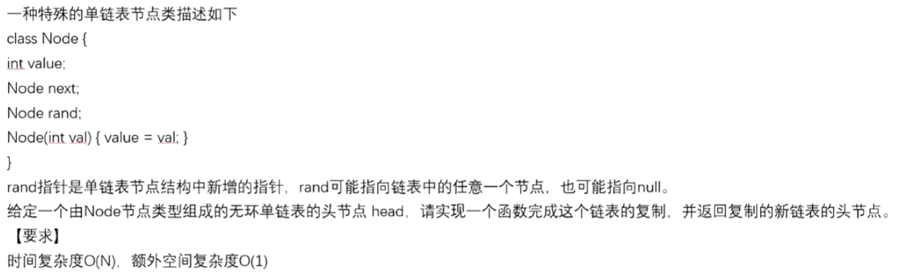
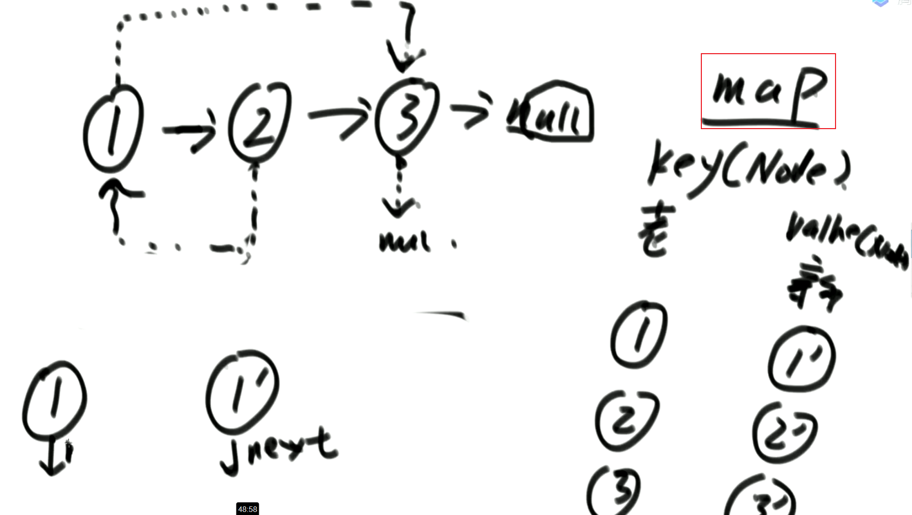
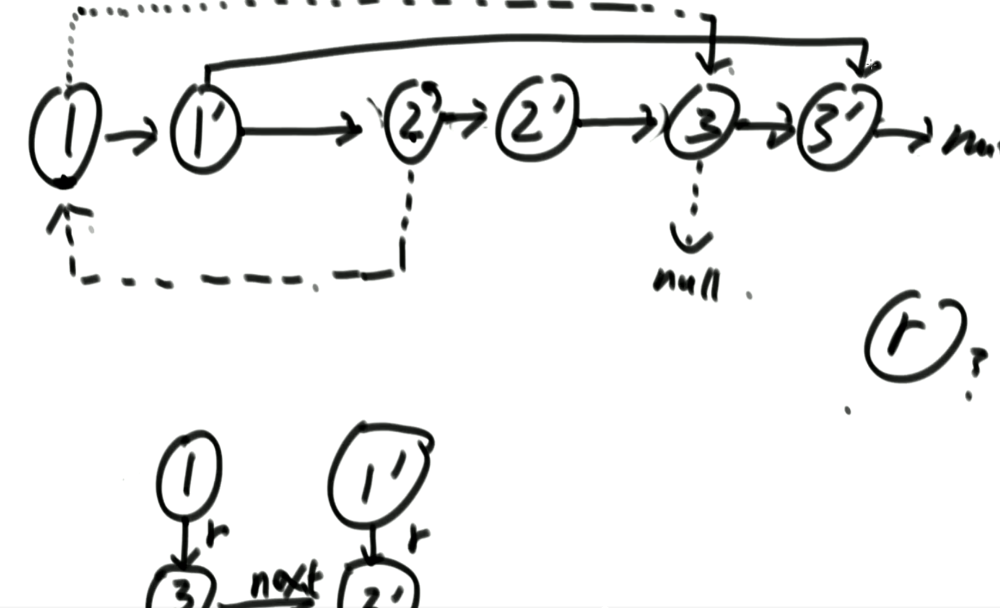
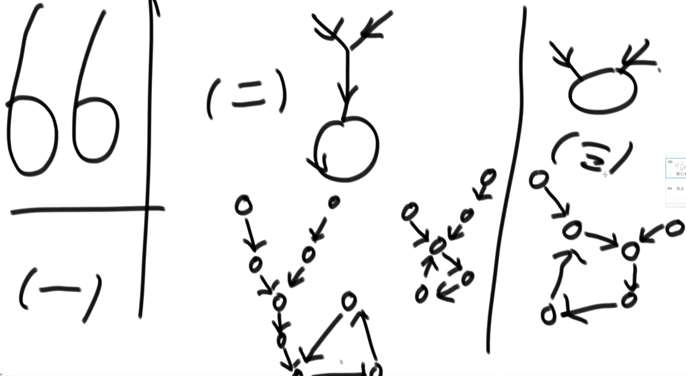
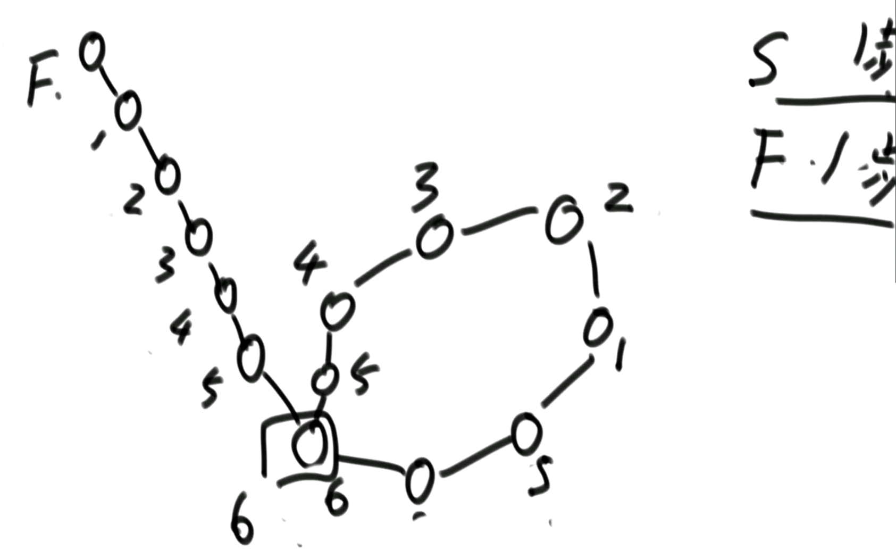

## 单向链表

```java
public static class Node{
    int v;
    Node next;
    public Node(int data){
        v = data;
    }
}
```

### 反转单向链表

```java
public static Node reverse(Node head){
    Node pre = null;
    Node next = null;
    while(head != null){
        next = head.next;
        // 指向前一个节点
        head.next = pre;
        // 向后移动
        pre = head;
        head = next;
    }
    // 新头部节点
    return pre;
}
```



### 删除链表中指定值的节点



因为有可能删除头部，所以方法要返回头节点

```java
public static Node removeValue(Node head,int v){
    // 确定头节点
    while(head!=nul){
        if(head.v == v){
            break;
        }
        head = head.next;
    }
    
    Node pre = head;
    Node cur = head;
    while(next!=null){
        if(cur.v == v){
            pre.next = cur.next;
        }else{
            pre = cur;
        }
        cur = cur.next;
    }
    
    return head;
}
```




## 双向链表

```java
public static class DoubleNode{
    int v;
    // 前一个节点
    DoubleNode last;
    // 下一个
    DoubleNode next;
    public Node(int data){
        v = data;
    }
}
```

### 反转单向链表

```java
public static Node reverse(DoubleNode head){
    DoubleNode pre;
    DoubleNode next;
    while(DoubleNode!=null){
        next = head.next;
        head.next = pre;
        head.last = next;
        
        pre = head;
        head = next;
        
    }
    return pre;
}
```


## 面试题

### 获取链表中点

输入链表头节点，奇数长度返回中点，偶数长度返回上中点

```java
public staic Node midOrUpMidNode(Node head){
    if(head==null || head.next==null || head.next.next==null)
        return head;
    
    // 每次跳一步
    Node slow = head.next;
    // 每次跳两步
    Node fast = head.next.next;
    while(fast.next!=null && fast.next.next!=null){
        slow = slow.next;
        fast = fast.next.next;
    }
    return slow;
}
```

**快慢指针**



扩展：输入链表头节点，奇数长度返回中点的前一个点，偶数长度返回上中点的**前一个点**

```java
public static Node midOrUpMidPreNode(Node head){
    if(head==null || head.next==null || head.next.next==null)
        return head;
    
    List arr = new ArrayList();
    Node cur = head;
    while(cur!=null){
        arr.add(cur);
        cur = cur.next;
    }
    
    int midIndex = arr.size()%2==0?arr.size()/2-1:arr.size()/2;
    return arr.get(midIndex);
}
```


### 判断链表是否是回文结构

给定一个单链表的头节点head，请判断该链表是否为回文结构

提示：

1. 哈希表方法特别简单（笔试用）
2. 改原链表的方法就需要注意边界了（面试用）

```java
// 通过栈实现
public static boolean isManacher(Node head){
    Stack<Node> stack = new Stack<>();
    
    Node cur = head;
    while(cur!=null){
        // 先进
        stack.push(cur);
        cur = cur.next;
    }
    
    while(head!=null){
        // 后出
        if(head.v!=stack.pop().v)
            return false;
        
        head = head.next;
    }
    
    return true;
}
```


### 将链表按荷兰国旗分区

将单向链表按某值划分成左边小、中间相等、右边大的形式

提示：

1. 把链表放入数组里，再数组上做partition（笔试）
2. 分成小、中、大三部分，再把各个部分之间串起来（面试）

```java
public static Node partition(Node head,int mid){
    Node cur = head;
    List<Node> arr = new ArrayList<>();
    while(cur!=null){
        arr.add(cur);
        cur = cur.next;
    }
    
    // 分区
    int l = -1;
    int r = arr.size();
	for(int i = 0;i<arr.size();i++){
        if(arr.get(i).v<mid){
            swap(arr,++l,i);
        }else if(arr.get(i).v==mid){
            continue;
        }else{
            swap(arr,--r,i);
        }
    }
    
    // 重新连起来
    // 从第二个开始
	for(int i = 1;i<arr.size();i++){
        arr[i-1].next = arr[i];
    }
    arr[arr.length-1].next = null;
    
    return arr.get(0);
}

private void swap(ArrayList<Integer> arr,int i,int j){
    int v1 = arr.get(i);
    int v2 = arr.get(j);
    arr.set(j,v1);
    arr.set(i,v2);
}
```

通过6个变量来做到稳定，且额外空间复杂度O(1)



```java
```


### 复制链表



提示：

1. 哈希（笔试）
2. 不需要哈希（面试）

```java
public static Node copyListWithRand(Node head){
    Map<Node,Node> map = new HashMap<>();
    Node cur = head;
    whlie(cur!=null){
        // 克隆
        map.add(cur,new Node(cur.v));
        cur = cur.next;
    }
    
    cur = head;
    while(cur!=null){
        Node cloneCur = map.get(cur);
        cloneCur.next = map.get(cur.next);
        cloneCur.rand = map.get(cur.next);
        cur = cur.next;
    }
    
    return map.get(head);
}
```



面试的逻辑：不需要哈希，最后需要分离旧节点




### 求两个链表相交节点（较难）

给定两个可能有环也可能无环的单链表，头节点head1和head2。

请实现一个函数，如果两个链表相交，请返回相交的第一个节点。如果不相交，返回null。

【要求】如果两个链表长度之和为N，时间复杂度请达到O(N)，额外空间复杂度请达到O(1)。

提示：

- 由于是单向链表，如果两条链表出现过相交，那么后续部分的节点都一样，不会再分叉
- 可以通过最末尾节点是否相等来判断是否出现了相交

```java
public static Node getIntersectNode(Node head1,Node head2){
    if(head1==null || head2==null)
        return null;
    
    Node loop1 = getLoopNode(head1);
    Node loop2 = getLoopNode(head2);
    
    if(loop1==null && loop2==null)
        return getNoLoopIntersect(head1,head2);
    
    if(loop1!=null && loop2!=null)
    	return getBothLoopIntersect(loop1,loop2);
    
    return null;
}

public static Node getNoLoopIntersect(Node head1,Node head2){
    Set<Node> set = new HashSet<>();
    
    Node cur1 = head1;
    while(cur1!=null){
        set.put(cur1);
        cur1 = cur1.next;
    }
    
    Node cur2 = head2;
    while(cur2!=null){
        if(set.get(cur2)!=null)
            return set.get(cur2);
        
        cur2 = cur2.next;
    }
}

public static Node getBothLoopIntersect(Node head1,Node loop1,Node head2,Node loop2){
    if(loop1==loop2){
        // 第二种情况
        // 可以用HashSet实现
        // 也可以用无HashSet实现
        
    }else{
        // 第一/三种情况
        Node cur1 = loop1.next;
        while(cur1!=loop1){
            // 第三种情况
            if(cur1==loop2)
                return loop2;
            
            cur1 = cur1.next;
        }
        // 第一种情况
        return null;
    }
}

// 扩展：找到单链表第一个入环节点，如果无环返回null
public static Node getLoopNode(Node head){
    if(head==null || head.next==null || head.next.next==null)
        return head;
    
    // 一步
    Node slow = head.next;
    // 两步
    Node fast = head.next.next;
    while(slow!=fast){
        if(fast.next==null || fast.next.next==null)
            break;
        
        slow = slow.next;
        fast = fast.next.next;
    }
    
    // 小学奥数问题：当fast第一次和slow在环内相交时，fast再重头一步一步和slow一起向后移动
    // fast和slow第一次相遇必定是在环的相交点遇到 
    fast = head;
    while(slow!=fast){
        slow = head.next;
        fast = fast.next;
    }
    
    return fast;
}
```

当两边链表都是环状结构，有如下三种相交情况

- 通过loop1==loop2可以判断得出是第二种情况
- 任意使用loop1或者loop2走一圈环，再回到自己，如果都没有匹配到另外一个入环节点，那么就是第一种情况，不相交



小学奥数流程图:




### 不给头节点删除任意节点

