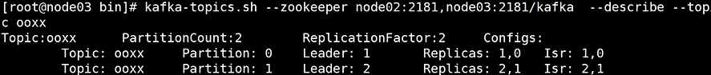
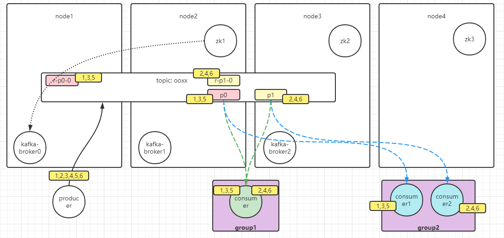

Kafka
====

消息中间件

## 概念

- broker:  kafka服务
- controller:  kafka集群的主入口
  - topic的创建
- topic: 主题
- partition: 分区
  - 每个分区的数据会存在不同的节点，每个节点的数据不同，默认是轮训分配
  - 同一个组，一个分区只能被一个消费者消费，如：一个主题有2个分区，在同一个组下，只有2个消费者有作用，当然一个消费者可以消费多个分区
- group: 组
  - 同一个组同一条消息只能消费一次，无论有多少个消费者，默认是轮训
  - 
- consumer: 消费者
  - 


kafka是顺序写，客户端拿数据的时候，会提供offset，kafka通过内核级别的sendfile(in,offset,out)系统调用直接实现零拷贝给客户端返回数据


## 安装

​	准备4个节点：1-3节点安装kafka、2-4节点安装zk

- kafka version: 2.6.0
- zk version:

```sh
# 下载 kafka -> https://kafka.apache.org/downloads 选版本下载
wget https://archive.apache.org/dist/kafka/2.6.0/kafka_2.12-2.6.0.tgz
# 下载 zookeeper
wget 

# 配置KAFKA_HOME
vi /etc/profile

export KAFKA_HOME=/opt/kafka
export PATH=$PATH:$KAFKA_HOME/bin

# 配置zk


# 配置kafka
# 要想客户端调通，3个kafka容器要使用不同的端口：9092、9093、9094


# 启动zk
zookeeper-server-start.sh config/zoo.cfg

# 启动kafka
kafka-server-start.sh config/server.properties

```


docker搭建

​	6个容器：3个kafka、3个zk

- kafka version: 3.0.0
- zk version: 3.7.0

```sh
# 创建网络
docker network create --subnet 172.39.0.0/16 kafka

# 创建zk
# 创建 /root/conf-zk/zk{}/data/myid
docker run --name zk1 --restart always -d -v /root/conf-zk/zk1/zoo.cfg:/conf/zoo.cfg -v /root/conf-zk/zk1/data/:/data -p 2181:2181 --net kafka zookeeper
docker run --name zk2 --restart always -d -v /root/conf-zk/zk2/zoo.cfg:/conf/zoo.cfg -v /root/conf-zk/zk2/data/:/data --net kafka zookeeper
docker run --name zk3 --restart always -d -v /root/conf-zk/zk3/zoo.cfg:/conf/zoo.cfg -v /root/conf-zk/zk3/data/:/data --net kafka zookeeper

# 验证
docker exec zk1 zkServer.sh status
ZooKeeper JMX enabled by default
Using config: /conf/zoo.cfg
Client port found: 2181. Client address: localhost. Client SSL: false.
Mode: follower

docker exec zk3 zkServer.sh status
ZooKeeper JMX enabled by default
Using config: /conf/zoo.cfg
Client port found: 2181. Client address: localhost. Client SSL: false.
Mode: leader


# 创建kafka卷目录
mkdir -p /root/conf-kafka/kafka{}/kafka-logs
# 拷贝配置文件到 /root/conf-kafka/kafka{}
# 设置 kafka-logs 的权限，因为kafka需要锁住这个文件夹
chmod -R 777 /root/conf-kafka/kafka{}/kafka-logs

# 创建kafka
docker run -d --name kafka1 -p 9092:9092 --network kafka -v /root/conf-kafka/kafka1/:/data bitnami/kafka:latest kafka-server-start.sh /data/server.properties

docker run -d --name kafka2 -p 9093:9093 --network kafka -v /root/conf-kafka/kafka2/:/data bitnami/kafka:latest kafka-server-start.sh /data/server.properties

docker run -d --name kafka3 -p 9094:9094 --network kafka -v /root/conf-kafka/kafka3/:/data bitnami/kafka:latest kafka-server-start.sh /data/server.properties
```


## 运行

```sh
# 创建topic，topic是发布订阅的基础
# partitions: 分区，2表示将会在两个物理节创建topic的分区，数据会分散存储到2个节点
# replication-factor: 副本因子，2表示每个分区一共会有2份，存在两个不同的节点，并且其中有一个被标识为leader
#	副本的只能为分区增加可靠性，不会提高分区读写性能，副本不能提供读写
kafka-topics.sh --bootstrap-server kafka1:9092,kafka2:9092,kafka3:9092 --create --topic ooxx --partitions 2 --replication-factor 2

# 查看有哪些topic
# 不用给出zk所有节点的IP地址
kafka-topics.sh --bootstrap-server kafka1:9092,kafka2:9092,kafka3:9092 --list

# 查看topic信息
kafka-topics.sh --bootstrap-server kafka1:9092,kafka2:9092,kafka3:9092 --describe --topic ooxx

# 测试
#
# 消费者工具，bootstrap-server 随意给出任一kafka集群节点即可
# gourp: 分组，隔离数据，不同的组会对同一个topic全量读写
# 开启两个消费者，对应topic的两个分区
kafka-console-consumer --bootstrap-server node1:9092,node2:9092,node3:9093 --topic ooxx --group test
kafka-console-consumer --bootstrap-server node1:9092,node2:9092,node3:9093 --topic ooxx --group test

# 生产者工具
kafka-console-producer --broker-server node1:9092,node2:9092,node3:9093 --topic ooxx --group test
# 输入发布1，2，3，4，5，6消息
```



模型：



```sh
# 查看组列表
kafka-consumer-groups.sh --bootstrap-server kafka1:9092 --list 
```


## 查看Kafka集群信息

zkCli.sh 连上zookeeper集群

```sh
# 查看controller
get /kafka/controller
{"version":1,"brokerid":0,"timestamp":"1640216576545"}

# 查看集群id
ls /kafka/brokers/ids
[0, 1, 2]

```


## java中使用


## Offset

偏移量


