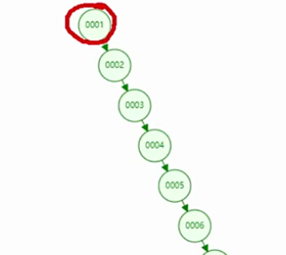
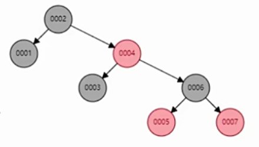
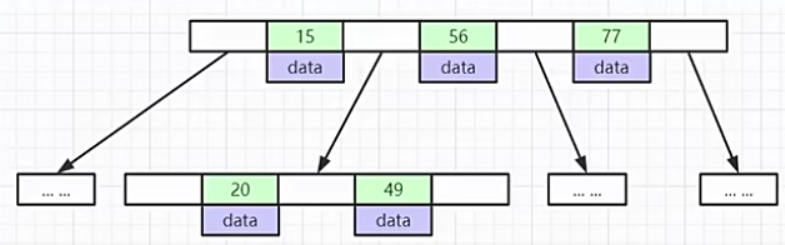
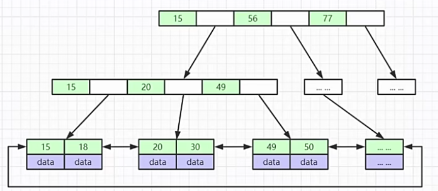
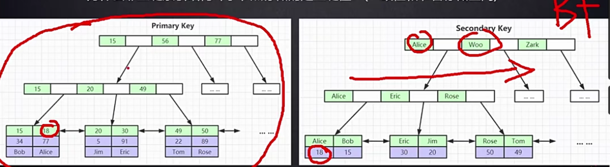
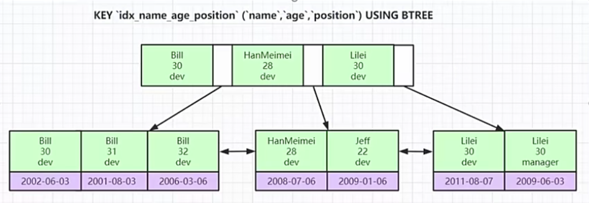

# MySQL


## 引擎

- InnoDB
  - 数据文件：frm、ibd
- MyISAM
  - 数据文件：frm、MYD、MYI


## 索引

**索引是排好序的数据结构，帮助MySQL搞笑查询数据**

- 数据结构

  - 二叉树

    - 

  - 红黑树

    - 

  - Hash（数组+链表）

  - B-Tree

    - 

  - B+Tree

    - 一个节点是一个数据页，默认大小是16KB

      ```sh
      假设整个数据页都用BigInter类型64位(8字节)的数据，那么根节点一个数据页能存放1170个数据，二级节点就是1170个数据页，假设第三级叶子节点的数据是1KB，那么一个数据页存16个数据，最后能得出一个3层深度的B+Tree能存的数据
      117*1170*16 =21,902,400 条
      ```

    - 

- 聚集索引

  - 叶子节点包含完整的行数据，InnoDB表只会有一份聚集索引，默认使用主键索引来组织，其他的非主键索引组织的叶子节点中不包含所有数据，只指向主键索引的数据（也可以称为非聚集索引），然后通过**回表**最后得到数据
  - 

- 非聚集索引

  - MyISAM引擎的表示非聚集索引，索引的叶子节点存放的数据是行数据所在磁盘的地址空间

- 联合索引

  - 最左列原理，按制定列的先后顺序建立

  - 一般单个表不建议建立太多的单字段的索引，比如有5个字段，都要作为查询条件，那么要为这5个字段分别建立索引吗？此时可以使用联合索引来优化

  - 

  - 索引查询的时候，先按 name 列查询，如果 name 相等，开始对 age 列查询

  - **以下SQL哪条会走索引？**

    - ```mysql
      key `idx_name_age_position` (`name`,`age`,`position`) USING BTREE
      
      select * from emp where name = 'bill' and age = 31;
      select * from emp where age = 31 and position = 'dev';
      select * from emp where position = 'dev';
      ```

    - 只有第一条SQL会走索引，由上图可以看出，age = 30 会在多个数据页中，完全不能用来索引

    

  

  


## 面试题

- **为什么建议InnoDB表必须建主键，并且推荐使用整形的自增主键？**
  - 因为InnoDB引擎的索引存储数据结构是B+Tree，如果表没有建立主键，那么MySQL会选出表的某一列（没有重复数据）来作为B+Tree的索引来组织数据文件，如果选不出来，就会创建一个隐藏的列来组织数据
  - B+Tree是有序的数据结构，如果插入的数据不是按顺序（UUID），B+Tree会经常分裂子节点，还有重新平衡父节点
- **B-Tree 和 B+Tree 有什么区别？**
  - B+Tree的叶子节点有头尾指针
  - B+Tree的全部数据存放在叶子节点，最大利用数据页的容量来存放导航索引，并且减少了树的深度
- **为什么非主键索引结构叶子节点存储的是主键值？**
  - 数据一致性、节省空间

