# 索引调优

示例表：

```sql
CREATE TABLE `employees` (
     `id` int(11) NOT NULL AUTO_INCREMENT,
     `name` varchar(24) NOT NULL DEFAULT '' COMMENT '姓名',
     `age` int(11) NOT NULL DEFAULT '0' COMMENT '年龄',
     `position` varchar(20) NOT NULL DEFAULT '' COMMENT '职位',
     `hire_time` timestamp NOT NULL DEFAULT CURRENT_TIMESTAMP COMMENT '入职时间',
     PRIMARY KEY (`id`),
     KEY `idx_name_age_position` (`name`,`age`,`position`) USING BTREE
) ENGINE=InnoDB AUTO_INCREMENT=1 DEFAULT CHARSET=utf8 COMMENT='员工记录表';
                         
‐‐ 插入一些示例数据
INSERT INTO employees(name,age,position,hire_time) VALUES('LiLei',22,'manager',NOW());
INSERT INTO employees(name,age,position,hire_time) VALUES('HanMeimei', 23,'dev',NOW());
INSERT INTO employees(name,age,position,hire_time) VALUES('Lucy',23,'dev',NOW());

drop procedure if exists insert_emp;
delimiter ;;
create procedure insert_emp()
begin
    declare i int;
    set i=1;
    while(i<=100000)do
        insert into employees(name,age,position) values(CONCAT('zhuge',i),i,'dev');
        set i=i+1;
    end while;
    end;;
delimiter;
call insert_emp();
```

## 综合例子

1. **联合索引第一个字段用范围不会走索引** 

   ```sql
   EXPLAIN SELECT * FROM employees WHERE name > 'LiLei' AND age = 22 AND position ='manager';
   ```

   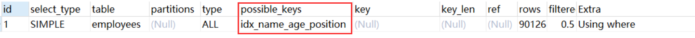

   结论：联合索引第一个字段就用范围查找不会走索引，mysql内部可能觉得第一个字段就用范围，结果集应该很大，回表效率不高，还不如就全表扫描

2. **强制走索引** 

   ```sql
   EXPLAIN SELECT * FROM employees force index(idx_name_age_position) WHERE name > 'LiLei' AND age = 22 A ND position ='manager';
   ```

   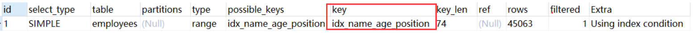

   结论：虽然使用了强制走索引让联合索引第一个字段范围查找也走索引，扫描的行rows看上去也少了点，但是最终查找效率不一定比全表扫描高，因为回表效率不高 

   实验： 

   ```sql
   ‐‐ 关闭查询缓存
   set global query_cache_size=0;
   set global query_cache_type=0;
   ‐‐ 执行时间0.333s
   SELECT * FROM employees WHERE name > 'LiLei';
   ‐‐ 执行时间0.444s
   SELECT * FROM employees force index(idx_name_age_position) WHERE name > 'LiLei';
   ```

3. **覆盖索引优化**

   ```sql
   EXPLAIN SELECT name,age,position FROM employees WHERE name > 'LiLei' AND age = 22 AND position ='manag er';
   ```

   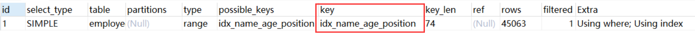

4. **in和or在表数据量比较大的情况会走索引，在表记录不多的情况下会选择全表扫描**

   ```sql
   EXPLAIN SELECT * FROM employees WHERE name in ('LiLei','HanMeimei','Lucy') AND age = 22 AND position ='manager';
   ```

   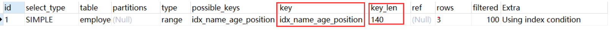

   ```sql
   EXPLAIN SELECT * FROM employees WHERE (name = 'LiLei' or name = 'HanMeimei') AND age = 22 AND position ='manager';
   ```

   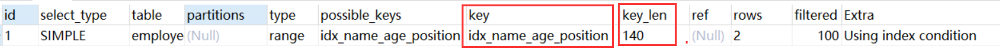

   实验： 将employees 表复制一张employees_copy的表，里面保留两三条记录

   ```sql
   EXPLAIN SELECT * FROM employees_copy WHERE name in ('LiLei','HanMeimei','Lucy') AND age = 22 AND posit ion ='manager';
   ```

   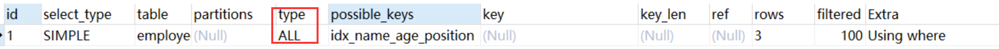

   ```sql
   EXPLAIN SELECT * FROM employees_copy WHERE (name = 'LiLei' or name = 'HanMeimei') AND age = 22 AND pos ition ='manager';
   ```

   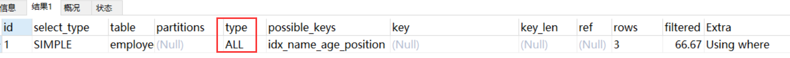

5. **like KK% 一般情况都会走索引**

   ```sql
   EXPLAIN SELECT * FROM employees WHERE name like 'LiLei%' AND age = 22 AND position ='manager';
   ```

   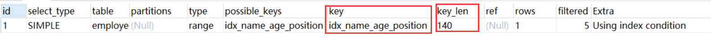

   ```sql
   EXPLAIN SELECT * FROM employees_copy WHERE name like 'LiLei%' AND age = 22 AND position ='manager';
   ```

   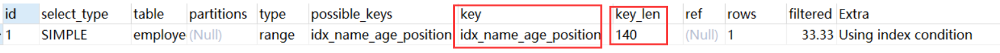


## Mysql如何选择合适的索引

```sql
EXPLAIN select * from employees where name > 'a';
```

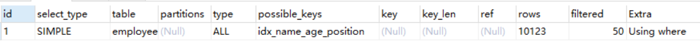

如果用name索引需要遍历name字段联合索引树，然后还需要根据遍历出来的主键值去主键索引树里再去查出最终数据，成本比全表扫描 还高，可以用覆盖索引优化，这样只需要遍历name字段的联合索引树就能拿到所有结果，如下：

```sql
 EXPLAIN select name,age,position from employees where name > 'a' ;
```

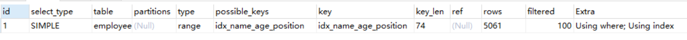

```sql
EXPLAIN select * from employees where name > 'zzz' ;
```

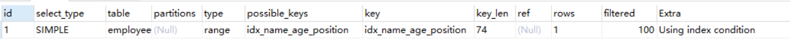

对于上面这两种 name>'a' 和 name>'zzz' 的执行结果，mysql最终是否选择走索引或者一张表涉及多个索引，mysql最终如何选择索引，我们可以用**trace工具**来一查究竟，开启trace工具会影响mysql性能，所以只能临时分析sql使用，用完之后立即关闭

**trace工具用法：**

```sql
set session optimizer_trace="enabled=on",end_markers_in_json=on; ‐‐开启trace
select * from employees where name > 'a' order by position;
SELECT * FROM information_schema.OPTIMIZER_TRACE;

-- 查看trace字段：


```

**结论：全表扫描的成本低于索引扫描，所以mysql最终选择全表扫描**

```sql
select * from employees where name > 'zzz' order by position;
SELECT * FROM information_schema.OPTIMIZER_TRACE;

-- 查看trace字段可知索引扫描的成本低于全表扫描，所以mysql最终选择索引扫描
set session optimizer_trace="enabled=off"; ‐‐关闭trace
```

## 常见SQL深入优化

**Order by与Group by优化** 

1. 利用最左前缀法则：中间字段不能断，因此查询用到了name索引，从key_len=74也能看出，age索引列用在排序过程中，因为Extra字段里没有using filesort

   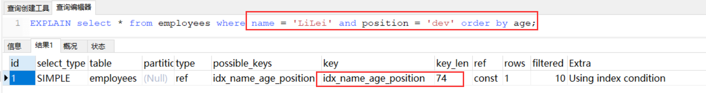

2. 从explain的执行结果来看：key_len=74，查询使用了name索引，由于用了position进行排序，跳过了age，出现了Using filesort

   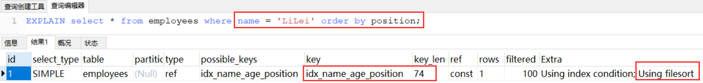

3. 查找只用到索引name，age和position用于排序，无Using filesort

   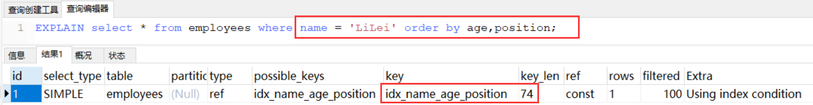

4. 和Case 3中explain的执行结果一样，但是出现了Using filesort，因为索引的创建顺序为name,age,position，但是排序的时候age和position颠倒位置了

   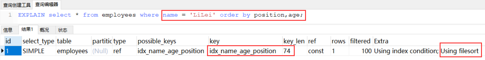

5. 与Case 4对比，在Extra中并未出现Using filesort，因为age为常量，在排序中被优化，所以索引未颠倒，不会出现Using filesort

   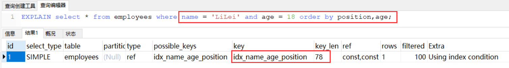

6. 虽然排序的字段列与索引顺序一样，且order by默认升序，这里position desc变成了降序，导致与索引的排序方式不同，从而产生Using filesort。Mysql8以上版本有降序索引可以支持该种查询方式

   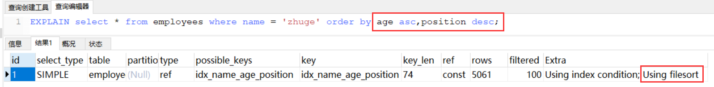

7. 对于排序来说，多个相等条件也是范围查询

   

8. 可以用覆盖索引优化

   

   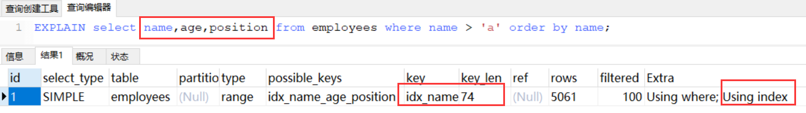

## 优化总结

1. MySQL支持两种方式的排序filesort和index，Using index是指MySQL扫描索引本身完成排序。index效率高，filesort效率低
2. order by满足两种情况会使用Using index
   1. order by语句使用索引最左前列
   2. 使用where子句与order by子句条件列组合满足索引最左前列
3. 尽量在索引列上完成排序，遵循索引建立（索引创建的顺序）时的最左前缀法则
4. 如果order by的条件不在索引列上，就会产生Using filesort
5. 能用覆盖索引尽量用覆盖索引 
6. group by与order by很类似，其实质是先排序后分组，遵照索引创建顺序的最左前缀法则。对于group by的优化如果不需要排序的可以加上**order by null禁止排序**。注意，where高于having，能写在where中的限定条件就不要去having限定了


## Using filesort文件排序原理详解 

**filesort文件排序方式**

- 单路排序：是一次性取出满足条件行的所有字段，然后在sort buffer中进行排序；用trace工具可以看到sort_mode信息里显示< sort_key, additional_fields >或者< sort_key, packed_additional_fields >
- 双路排序（又叫**回表**排序模式）：是首先根据相应的条件取出相应的排序字段和可以直接定位行数据的行 ID，然后在 sort buffer 中进行排序，排序完后需要再次取回其它需要的字段；用trace工具可以看到sort_mode信息里显示< sort_key, rowid > 

MySQL 通过比较系统变量 max_length_for_sort_data(**默认1024字节**) 的大小和需要查询的字段总大小来判断使用哪种排序模式。 

- 如果 字段的总长度小于max_length_for_sort_data ，那么使用 单路排序模式
- 如果 字段的总长度大于max_length_for_sort_data ，那么使用 双路排序模∙式

**示例验证下各种排序方式：**

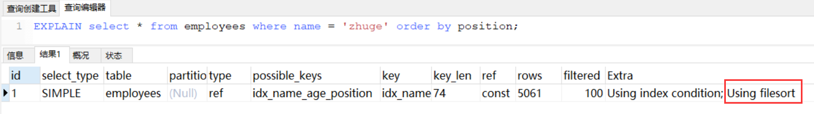

查看下这条sql对应trace结果如下(只展示排序部分)：

```json
set session optimizer_trace="enabled=on",end_markers_in_json=on; ‐‐开启trace
select * from employees where name = 'zhuge' order by position;
select * from information_schema.OPTIMIZER_TRACE;
```

- **单路排序**的详细过程
  1. 从索引name找到第一个满足 name = ‘zhuge’ 条件的主键 id 
  2. 根据主键 id 取出整行，**取出所有字段的值，存入 sort_buffer 中**
  3. 从索引name找到下一个满足 name = ‘zhuge’ 条件的主键 id
  4. 重复步骤 2、3 直到不满足 name = ‘zhuge’
  5. 对 sort_buffer 中的数据按照字段 position 进行排序
  6. 返回结果给客户端
- **双路排序**的详细过程
  1. 从索引 name 找到第一个满足 name = ‘zhuge’ 的主键id
  2. 根据主键 id 取出整行，**把排序字段 position 和主键 id 这两个字段放到 sort buffer 中**
  3. 从索引 name 取下一个满足 name = ‘zhuge’ 记录的主键 id
  4. 重复 3、4 直到不满足 name = ‘zhuge’
  5. 对 sort_buffer 中的字段 position 和主键 id 按照字段 position 进行排序
  6. 遍历排序好的 id 和字段 position，按照 id 的值**回到原表**中取出 所有字段的值返回给客户端

其实对比两个排序模式，单路排序会把所有需要查询的字段都放到 sort buffer 中，而双路排序只会把主键和需要排序的字段放到 sort buffer 中进行排序，然后再通过主键回到原表查询需要的字段。如果 MySQL **排序内存** **sort_buffer** 配置的比较小并且没有条件继续增加了，可以适当把 max_length_for_sort_data 配置小点，让优化器选择使用**双路排序**算法，可以在sort_buffer 中一次排序更多的行，只是需要再根据主键回到原表取数据

如果 MySQL 排序内存有条件可以配置比较大，可以适当增大 max_length_for_sort_data 的值，让优化器优先选择全字段排序(**单路排序**)，把需要的字段放到 sort_buffer 中，这样排序后就会直接从内存里返回查询结果了。所以，MySQL通过 **max_length_for_sort_data** 这个参数来控制排序，在不同场景使用不同的排序模式，从而提升排序效率。

**注意**，如果全部使用sort_buffer内存排序一般情况下效率会高于磁盘文件排序，但不能因为这个就随便增大sort_buffer(默认1M)，mysql很多参数设置都是做过优化的，不要轻易调整。

## 索引设计原则

1. **代码先行，索引后上**

   不知大家一般是怎么给数据表建立索引的，是建完表马上就建立索引吗？这其实是不对的，一般应该等到主体业务功能开发完毕，把涉及到该表相关sql都要拿出来分析之后再建立索引

2. **联合索引尽量覆盖条件**

   比如可以设计一个或者两三个联合索引(尽量少建单值索引)，让每一个联合索引都尽量去包含sql语句里的where、order by、group by的字段，还要确保这些联合索引的字段顺序尽量满足sql查询的最左前缀原则

3. **不要在小基数字段上建立索引**

   索引基数是指这个字段在表里总共有多少个不同的值，比如一张表总共100万行记录，其中有个性别字段， 其值不是男就是女，那么该字段的基数就是2。如果对这种小基数字段建立索引的话，还不如全表扫描了，因为你的索引树里就包含男和女两种值，根本没 法进行快速的二分查找，那用索引就没有太大的意义了。一般建立索引，尽量使用那些基数比较大的字段，就是值比较多的字段，那么才能发挥出B+树快速二分查找的优势来

4. **长字符串我们可以采用前缀索引**

   尽量对字段类型较小的列设计索引，比如说什么tinyint之类的，因为字段类型较小的话，占用磁盘空间也会比较小，此时你在搜索的时候性能也会比较好一点

   当然，这个所谓的字段类型小一点的列，也不是绝对的，很多时候你就是要针对varchar(255)这种字段建立索引，哪怕多占用一些磁盘空间也是有必要的

   对于这种varchar(255)的大字段可能会比较占用磁盘空间，可以稍微优化下，比如针对这个字段的前20个 字符建立索引，就是说，对这个字段里的每个值的前20个字符放在索引树里，类似于 KEY index(name(20),age,position)

   此时你在where条件里搜索的时候，如果是根据name字段来搜索，那么此时就会先到索引树里根据name字段的前20个字符去搜索，定位到之后前20个字符的前缀匹配的部分数据之后，再回到聚簇索引提取出来完整的name字段值进行比对

   但是假如你要是order by name，那么此时你的name因为在索引树里仅仅包含了前20个字符，所以这个排序是没法用上索引的（相当于范围查询：前20个字符有序，右面的无序）， group by也是同理。所以这里大家要对前缀索引有一个了解

5. **where与order by冲突时优先where**

   在where和order by出现索引设计冲突时，到底是针对where去设计索引，还是针对order by设计索引？到底是让where去用上索引，还是让order by用上索引?

   一般这种时候往往都是让where条件去使用索引来快速筛选出来一部分指定的数据，接着再进行排序。 因为大多数情况基于索引进行where筛选往往可以最快速度筛选出你要的少部分数据，然后做排序的成本可 能会小很多

6. **基于慢sql查询做优化**

   可以根据监控后台的一些慢sql，针对这些慢sql查询做特定的索引优化

   关于慢sql查询不清楚的可以参考这篇文章：https://blog.csdn.net/qq_40884473/article/details/89455740

## **索引设计案例**

以社交场景APP来举例，我们一般会去搜索一些好友，这里面就涉及到对用户信息的筛选，这里肯定就是对用户user表搜索了，这个表一般来说数据量会比较大，我们先不考虑分库分表的情况，比如，我们一般会筛选地区(省市)，性别，年龄，身高，爱好之类的，有的APP可能用户还有评分，比如用户的受欢迎程度评分，我们可能还会根据评分来排序等等。 

对于后台程序来说除了过滤用户的各种条件，还需要分页之类的处理，可能会生成类似sql语句执行：select xx from user where xx=xx and xx=xx order by xx limit xx,xx对于这种情况如何合理设计索引了，比如用户可能经常会根据省市优先筛选同城的用户，还有根据性别去筛选，那我们是否应该设计一个联合索引 (province,city,sex) 了？这些字段好像基数都不大，其实是应该的，因为这些字段查询太频繁了。 

假设又有用户根据年龄范围去筛选了，比如 where province=xx and city=xx and age>=xx and age<=xx，我们尝试着把age字段加入联合索引 (province,city,sex,age)，注意，一般这种范围查找的条件都要放在最后，之前讲过联合索引范围之后条件的是不能用索引的，但是对于当前这种情况依然用不到age 

这个索引字段，因为用户没有筛选sex字段，那怎么优化了？其实我们可以这么来优化下sql的写法：where province=xx and city=xx and sex in ('female','male') and age>=xx and age<=xx 对于爱好之类的字段也可以类似sex字段处理，所以可以把爱好字段也加入索引 (province,city,sex,hobby,age) 

假设可能还有一个筛选条件，比如要筛选最近一周登录过的用户，一般大家肯定希望跟活跃用户交友了，这样能尽快收到反馈，对应后台sql可能是这样： where province=xx and city=xx and sex in ('female','male') and age>=xx and age<=xx and latest_login_time>= xx 那我们是否能把 latest_login_time 字段也加入索引了？比如 (province,city,sex,hobby,age,latest_login_time) ，显然是不行的，那怎么来优化这种情况了？其实我们 可以试着再设计一个字段is_login_in_latest_7_days，用户如果一周内有登录值就为1，否则为0，那么我们就可以把索引设计成 (province,city,sex,hobby,is_login_in_latest_7_days,age) 来满足上面那种场景了！一般来说，通过这么一个多字段的索引是能够过滤掉绝大部分数据的，就保留小部分数据下来基于磁盘文件进行order by语句的排序，最后基于limit进行分页，那么一般性能还是比较高的。 

不过有时可能用户会这么来查询，就查下受欢迎度较高的女性，比如sql：where sex = 'female' order by score limit xx,xx，那么上面那个索引是很难用上的，不能把太多的字段以及太多的值都用 in 语句拼接到sql里的，那怎么办了？其实我们可以再设计一个辅助的联合索引，比如 (sex,score)，这样就能满足查询要求了。 

以上就是给大家讲的一些索引设计的思路了，核心思想就是，尽量利用一两个复杂的多字段联合索引，抗下你80%以上的查询，然后用一两个辅助索引尽量抗下剩余的一些非典型查询，保证这种大数据量表的查询尽可能多的都能充分利用索引，这样就能保证你的查询速度和性能了！


## 分页优化

很多时候我们业务系统实现分页功能可能会用如下sql实现

```sql
select * from employees limit 10000,10;
```

表示从表 employees 中取出从 10001 行开始的 10 行记录。看似只查询了 10 条记录，实际这条 SQL 是先**读取 10010 条记录**，然后抛弃前 10000 条记录，然后读到后面 10 条想要的数据。因此要查询一张大表比较靠后的数据，执行效率是非常低的

**>>常见的分页场景优化技巧：**

```sql
select * from employees ORDER BY name limit 90000,5;
EXPLAIN select * from employees ORDER BY name limit 90000,5;
```

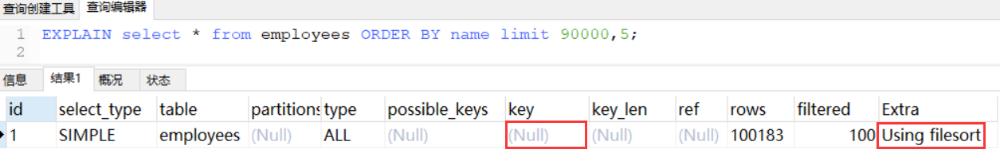

发现并没有使用 name 字段的索引key 字段对应的值为 null），具体原因：扫描整个索引并查找到没索引的行(可能要遍历多个索引树)的成本比扫描全表的成本更高，所以优化器放弃使用索引

**知道不走索引的原因，那么怎么优化呢？覆盖索引**

其实关键是**让排序时返回的字段尽可能少**，所以可以让排序和分页操作先查出主键，然后根据主键查到对应的记录，SQL改写如下

```sql
select * from employees t1 join (select id from employees order by name limit 90000,5) t2 on t1.id=t2.id 
```

我们再对比优化前后sql的执行计划：

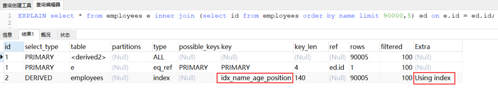

原 SQL 使用的是 filesort 排序，而优化后的 SQL 使用的是索引排序

## **Join优化**

```sql
CREATE TABLE `t1` (
    `id` int(11) NOT NULL AUTO_INCREMENT,
    `a` int(11) DEFAULT NULL,
    `b` int(11) DEFAULT NULL,
    PRIMARY KEY (`id`),
    KEY `idx_a` (`a`)
) ENGINE=InnoDB DEFAULT CHARSET=utf8;

create table t2 like t1; 
‐‐ 插入一些示例数据
‐‐ 往t1表插入1万行记录
drop procedure if exists insert_t1;
delimiter ;;
create procedure insert_t1()
    begin
        declare i int;
        set i=1;
        while(i<=10000)do
            insert into t1(a,b) values(i,i);
            set i=i+1;
        end while;
    end;;
delimiter ;

call insert_t1();
‐‐ 往t2表插入100行记录
drop procedure if exists insert_t2;
delimiter ;;
create procedure insert_t2()
begin
    declare i int;
    set i=1;
    while(i<=100)do
        insert into t2(a,b) values(i,i);
        set i=i+1;
    end while;
end;;
delimiter ;
call insert_t2();
```

**mysql的表关联常见有两种算法**

1. Nested-Loop Join 算法
2. Block Nested-Loop Join 算法

**嵌套循环连接** **Nested-Loop Join(NLJ) 算法**

一次一行循环地从第一张表（称为**驱动表**）中读取行，在这行数据中取到关联字段，根据关联字段在另一张表（**被驱动表**）里取出满足条件的行，然后取出两张表的结果合集

```sql
 EXPLAIN select * from t1 inner join t2 on t1.a= t2.a;
```

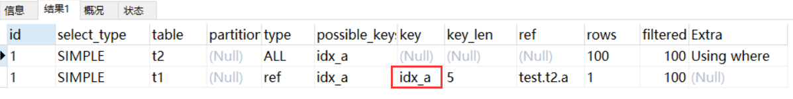

从执行计划中可以看到这些信息：

- 驱动表是 t2，被驱动表是 t1。先执行的就是驱动表(执行计划结果的id如果一样则按从上到下顺序执行sql)；优化器一般会优先选择**小表做驱动表**。**所以使用 inner join 时，排在前面的表并不一定就是驱动表**
- 当使用left join时，左表是驱动表，右表是被驱动表，当使用right join时，右表时驱动表，左表是被驱动表，当使用join时，mysql会选择数据量比较小的表作为驱动表，大表作为被驱动表
- 使用了 NLJ算法。一般 join 语句中，如果执行计划 Extra 中未出现 **Using join buffer** 则表示使用的 join 算法是 NLJ

**上面sql的大致流程如下：**

1. 从表 t2 中读取一行数据（如果t2表有查询过滤条件的，会从过滤结果里取出一行数据）
2. 从第 1 步的数据中，取出关联字段 a，到表 t1 中查找
3. 取出表 t1 中满足条件的行，跟 t2 中获取到的结果合并，作为结果返回给客户端
4. 重复上面 3 步

整个过程会读取 t2 表的所有数据(**扫描100行**)，然后遍历这每行数据中字段 a 的值，根据 t2 表中 a 的值索引扫描 t1 表 中的对应行(**扫描100次 t1 表的索引，1次扫描可以认为最终只扫描 t1 表一行完整数据，也就是总共 t1 表也扫描了100行**)。因此整个过程扫描了 **200 行**。 

如果被驱动表的关联字段没索引，**使用NLJ算法性能会比较低(下面有详细解释)**，mysql会选择Block Nested-Loop Join 算法

**基于块的嵌套循环连接** **Block Nested-Loop Join(BNL)算法**

把**驱动表**的数据读入到 join_buffer 中，然后扫描**被驱动表**，把**被驱动表**每一行取出来跟 join_buffer 中的数据做对比

```sql
EXPLAIN select * from t1 inner join t2 on t1.b= t2.b;
```

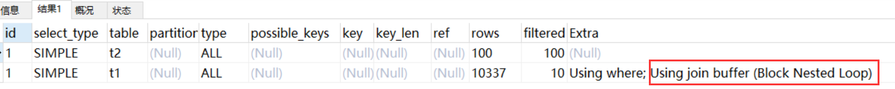

**上面sql的大致流程如下：**

1. 把 t2 的所有数据放入到 **join_buffer** 中
2. 把表 t1 中每一行取出来，跟 join_buffer 中的数据做对比
3. 返回满足 join 条件的数据 

整个过程对表 t1 和 t2 都做了一次全表扫描，因此扫描的总行数为10000(表 t1 的数据总量) + 100(表 t2 的数据总量) =**10100**。并且 join_buffer 里的数据是无序的，因此对表 t1 中的每一行，都要做 100 次判断，所以内存中的判断次数是 100 * 10000= **100 万次**

这个例子里表 t2 才 100 行，要是表 t2 是一个大表，join_buffer 放不下怎么办呢？

join_buffer 的大小是由参数 join_buffer_size 设定的，默认值是 256k。如果放不下表 t2 的所有数据话，策略很简单，就是**分段放**

比如 t2 表有1000行记录， join_buffer 一次只能放800行数据，那么执行过程就是先往 join_buffer 里放800行记录，然后从 t1 表里取数据跟 join_buffer 中数据对比得到部分结果，然后清空 join_buffer ，再放入 t2 表剩余200行记录，再次从 t1 表里取数据跟 join_buffer 中数据对比。所以就多扫了一次 t1 表

**被驱动表的关联字段没索引为什么要选择使用 BNL 算法而不使用 Nested-Loop Join 呢？**

如果上面第二条sql使用 Nested-Loop Join，那么扫描行数为 100 * 10000 = 100万次，这个是**磁盘扫描**。很显然，用BNL磁盘扫描次数少很多，相比于磁盘扫描，BNL的内存计算会快得多。

因此MySQL对于被驱动表的关联字段没索引的关联查询，一般都会使用 BNL 算法。如果有索引一般选择 NLJ 算法，有 索引的情况下 NLJ 算法比 BNL算法性能更高 

**对于关联sql的优化** 

- **关联字段加索引**，让mysql做join操作时尽量选择NLJ算法 
- **小表驱动大表**，写多表连接sql时如果**明确知道**哪张表是小表可以用straight_join写法固定连接驱动方式，省去mysql优化器自己判断的时间 

**straight_join解释：straight_join**功能同join类似，但能让左边的表来驱动右边的表，能改表优化器对于联表查询的执行顺序

```sql
-- 指定mysql选着 t2 表作为驱动表
select * from t2 straight_join t1 on t2.a = t1.a; 
```

- **straight_join**只适用于inner join，并不适用于left join，right join。（因为left join，right join已经代表指定了表的执行顺序）
- 尽可能让优化器去判断，因为大部分情况下mysql优化器是比人要聪明的。使用**straight_join**一定要慎重，因为部分情况下人为指定的执行顺序并不一定会比优化引擎要靠谱


## in和exsits优化

原则：**小表驱动大表**，即小的数据集驱动大的数据集

**in：**当B表的数据集小于A表的数据集时，in优于exists

```sql
select * from A where id in (select id from B)
```

**exists：**当A表的数据集小于B表的数据集时，exists优于in 

```sql
-- 将主查询A的数据，放到子查询B中做条件验证，根据验证结果（true或false）来决定主查询的数据是否保留
select * from A where exists (select 1 from B where B.id = A.id)
```

1. EXISTS (subquery)只返回TRUE或FALSE,因此子查询中的SELECT * 也可以用SELECT 1替换,官方说法是实际执行时会忽略SELECT清单,因此没有区别
2. EXISTS子查询的实际执行过程可能经过了优化而不是我们理解上的逐条对比
3. EXISTS子查询往往也可以用JOIN来代替，何种最优需要具体问题具体分析

## count(*)优化

```sql
‐‐ 临时关闭mysql查询缓存，为了查看sql多次执行的真实时间\
set global query_cache_size=0;
set global query_cache_type=0;

EXPLAIN select count(1) from employees;
EXPLAIN select count(id) from employees;
EXPLAIN select count(name) from employees;
EXPLAIN select count(*) from employees;
```

**注意：以上4条sql只有根据某个字段count不会统计字段为null值的数据行**

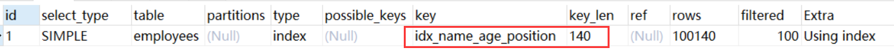

**四个sql的执行计划一样，说明这四个sql执行效率应该差不多** 

**字段有索引：count(\*)≈count(1)>count(字段)>count(主键 id) **

