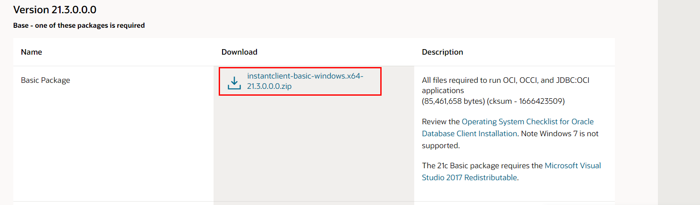
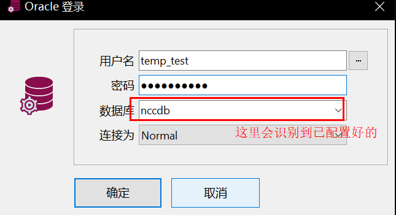

# Oracle

## 简介


### 表空间

```sql
-- 查看表空间
SELECT * FROM v$tablespace;
-- 查看当前表空间
SELECT PROPERTY_VALUE FROM database_properties WHERE PROPERTY_NAME ='DEFAULT_PERMANENT_TABLESPACE';
-- 查看某个用户的所属默认表空间
SELECT default_tablespace FROM dba_users WHERE username ='TEMP_TEST';
-- 修改用户默认表空间
alter user dbcenter default tablespace DBCENTER_DATA;
```

1. **System表空间**

   SYSTEM表空间主要存放SYS用户的各个对象和其他用户的少量对象

2. **SYSAUX表空间**

   SYSTEM表空间主要用于存放Oracle系统内部的数据字典，而SYSAUX表空间则充当SYSTEM表空间的辅助表空间，主要用于存储数据字典以外的其他数据对象，它在一定程度上降低了SYSTEM表空间的负荷

3. **USERS表空间**

   创建一个用户时，没有给这个用户指定默认表空间，这个用户就会采用默认的表空间——users表空间（sys和system等系统用户采用的默认表空间是system表空间）

## 表

```sql

```


## 安装


## 权限

oracle提供三种标准角色（role）:connect/resource和dba.

1. connect role(连接角色)
   临时用户，特指不需要建表的用户，通常只赋予他们connect role.

   connect是使用oracle简单权限，这种权限只对其他用户的表有访问权限，包括select/insert/update和delete等。
   拥有connect role 的用户还能够创建表、视图、序列（sequence）、簇（cluster）、同义词(synonym)、回话（session）和其他 数据的链（link)。

2. resource role(资源角色)

   更可靠和正式的数据库用户可以授予resource role。

   resource提供给用户另外的权限以创建他们自己的表、序列、过程(procedure)、触发器(trigger)、索引(index)和簇(cluster)。

3. dba role(数据库管理员角色)

   dba role拥有所有的系统权限

   包括无限制的空间限额和给其他用户授予各种权限的能力。

### 用户

创建用户

```sql
-- 创建用户 temp_test 密码 Hkancu1904
create user temp_test identified by Hkancu1904;
-- 指定默认表空间
create user dave2 identified by dave2 default tablespace users;
```

查看用户

```sql
select * from dba_users; 
select * from all_users; 
select * from user_users;
```

### 权限

查看权限

```sql
-- 查看CONNECT,RESOURCE角色拥有哪些权限
SELECT * FROM dba_sys_privs WHERE grantee IN ('RESOURCE角色有哪些权限', 'CONNECT,') ORDER BY 1;
-- 查询对象（用户、角色）拥有的权限
select * from dba_sys_privs WHERE grantee = 'CONNECT';
```

授权

```sql
-- 连接数据库权限
grant connect to TEMP_TEST;
-- 查询视图权限
grant select on view_car_runtime_b to user01;
-- 授予查询任何表
grant select any table to TEMP_TEST;
-- 授予用户使用表空间的权限
alter user 用户名 quota 0 on 表空间;
-- 给某个用户分配指定用户的所有表的某个权限（select,delete等）
BEGIN
   FOR R IN (SELECT owner, table_name FROM all_tables WHERE owner='TheOwner') LOOP
      EXECUTE IMMEDIATE 'grant select on '||R.owner||'.'||R.table_name||' to TheUser';
   END LOOP;
END; 
```

撤销权限

```sql
revoke connect from ext_test_query;
```

### 角色

查看角色

```sql
-- 查询用户拥有的角色
select * from dba_role_privs WHERE grantee = 'TEMP_TEST';
```


## 运维

查询ORACLE_SID

```sh
ps -ef | grep pmon

ora1024   262314        1   0   Mar 23      -  0:12 ora_pmon_mysid

ORACLE_SID is mysid
```

## SQLPLUS

```sh
# 当在数据库安装服务器上执行：以管理员身份免密登录数据库c'c
./sqlplus / as sysdba
```

设置sqlplus 

```sql
set linesize 300;
set pagesize 20;
```

测试

```sql
create user sct_dba identified by Sct2022NccDBA;
create user temp_test identified by Hkancu1904;


SELECT owner,table_name,TABLESPACE_NAME FROM dba_tables where owner = 'NCC1903';
SELECT owner,table_name,TABLESPACE_NAME FROM dba_tables where owner = 'SYSTEM';


-- 查看表空间
select * from v$tablespace;
-- 查看表空间下的表
select OWNER,TABLE_NAME,TABLESPACE_NAME from dba_tables where TABLESPACE_NAME='NCC_DATA01';
select OWNER,TABLE_NAME,TABLESPACE_NAME from dba_tables where TABLESPACE_NAME='UNDOTBS1';

order by ts desc
```

## PL/SQL

**安装**

官网下载客户端(几十兆)

**Oracle客户端配置**

[Oracle客户端官方下载地址](https://www.oracle.com/database/technologies/instant-client/winx64-64-downloads.html)



1. 将软件包解压缩到单个目录中，例如`C:\oracle\instantclient_19_3`
2. 将此目录添加到`PATH`环境变量中，环境变量名：ORACLE_HOME
3. 在`C:\oracle\instantclient_19_3\network\admin`下创建tnsnames.ora

#### 创建tnsnames.ora

使用sid或service_name都可以连接数据库

```markdown
# 1、service_name
## TEST 连接名
## HOST oracle服务器地址
## PORT oracle服务端口
## service_name oracle服务名
nccdb =
 (DESCRIPTION =
  (ADDRESS_LIST =
   (ADDRESS = (PROTOCOL = TCP)(HOST = 168.168.10.10)(PORT = 1521))
  )
  (CONNECT_DATA =
   (service_name = orastat)
  )
 )

# 2、sid

nccdb =
 (DESCRIPTION =
  (ADDRESS_LIST =
   (ADDRESS = (PROTOCOL = TCP)(HOST = 168.168.10.10)(PORT = 1521))
  )
  (CONNECT_DATA =
   (sid = orastat)
  )
 )
```

**登录数据库**

