Redis
====

[中文文档](http://redis.cn/)

redis与内核之间使用的是epoll(多路复用)技术

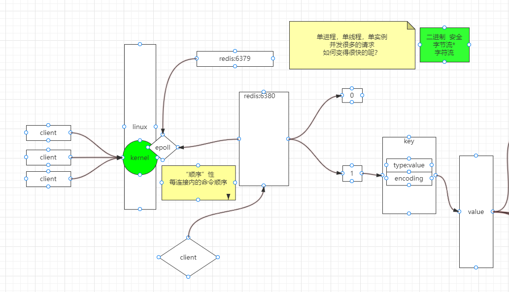

## 简介

**常识一：数据访问的两个角度**

- 磁盘
  - 寻址（速度）：ms  
  - 带宽（单位时间可以传输多少数据）：G/M
- 内存
  - 寻址：ns
  - 带宽：

​	秒>毫秒>微妙>纳秒：可以看出内存比磁盘快了10万倍

**常识二：I/O buffer：成本问题**

​	磁盘与磁道，扇区，一扇区 512Byte带来一个成本变大：索引 ，这样索引就不能像现在这样用4位来表示了，所以一次读取的是4K ，操作系统无论你读多少，都是最少4k从磁盘拿

​	从以上常识可以得知：随着文件变大，读取速度变慢，这时就产生了数据库，用于提高读取速度。关系型数据库建表的时候必须给出schema类型，有了类型就定死了字节宽度，存的时候倾向于行级存储，假如插入一行，其中某个字段为空，内存空间还是会开辟占位，未来修改的时候内存就不用移动位置

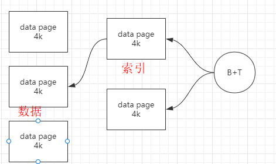

​	4K不是一定的，取决于上层应用的需求，一般家用会把磁盘格式化成4k的，而倾向于存储视频那种大数据，可以格式化成更大的数据页

​	关系型数据库，表很大，性能下降？：

- 如果表有索引，增删改变慢
- 查询速度
  - 1个或少量查询依然很快
  - 并发大的时候会受硬盘带宽影响速度

**常识三：数据在磁盘和内存体积不一样**

​	SAP HANA内存级别的关系型数据库2T，价格在2亿，太贵，只有500强在用，那么就出现了折中方案，redis，memcached 

当然出现这么多的问题，主要是受制于当前的两个基础设施

- 冯诺依曼体系的硬件
- 以太网，tcp/ip的网络


## 技术选型

[技术选型网站](https://db-engines.com/en/)

**这个世界有3种数据表示方式：**

- k=a k=1
- k=[1,2,3]  k=[a,x,f]
- k={x=y} k=[{},{}]


## Redis 和 Memcached 的区别

​	memcached 没有类型，会导致一些网络IO的问题

- 因为没有类型，memcached 要返回value所有的数据到client，假如这个value是一个数组，或者对象，那么就要在client自己实现代码去解码
- redis的server中对每种类型都有自己的方法，如：index()、lpop()，服务端会直接把一个很小的结果返回client

​	redis的优势：计算向数据移动


## Redis 和数据库的区别

1、redis key 可以有有效期

**面试题：如果一个设置了有过期时间的Key，用 set 修改key的值后，会剔除过期时间**

2、内存有限，随着访问变化，应该淘汰掉冷数据

**面试题：redis提供了什么淘汰算法？参考《回收策略》**


## 安装

[官网](https://redis.io/)

### 一：源码安装

​	centos 7.x，redis 官网6.x

```sh
# 全程按照redis源码包内的readme.md来安装
yum install wget
cd ~
mkdir soft
cd soft
wget http://download.redis.io/releases/redis-6.0.6.tar.gz
tar xf    redis...tar.gz
cd redis-src

#（看README.md）

# make  linux 编译工具，需要 makefile 才知道如何编译
yum install gcc systemd-devel -y
make USE_SYSTEMD=yes
# 编译成功后，在src目录生成了可执行程序 redis-server redis-cli

# 将redis程序迁出到指定目录
# PREFIX 指定安装目录，默认：/usr/local/bin （看Makefile可知）
make install PREFIX=/usr/local/redis/bin

# 添加环境变量，后续的脚本文件需要知道redis程序的位置
vi /etc/profile
export REDIS_HOME=/opt/redis
export PATH=$PATH:$REDIS_HOME/bin

source /etc/profile

# 安装服务
cd utils
./install_server.sh  （可以执行一次或多次）    
	a)  一个物理机中可以有多个redis实例（进程），通过port区分
	b)  可执行程序就一份在目录，但是内存中未来的多个实例需要各自的配置文件，持久化目录等资源
	c)  service   redis_6379  start/stop/stauts     >   linux   /etc/init.d/****
	d)脚本还会帮你启动！17,ps -fe |  grep redis  
	
# 安装可能出现以下问题
# Welcome to the redis service installer
# This script will help you easily set up a running redis server
# This systems seems to use systemd.
# Please take a look at the provided example service unit files in this directory, and adapt and install them. Sorry!

# 修改install_server.sh 

#bail if this system is managed by systemd
#_pid_1_exe="$(readlink -f /proc/1/exe)"
#if [ "${_pid_1_exe##*/}" = systemd ]
#then
#       echo "This systems seems to use systemd."
#       echo "Please take a look at the provided example service unit files in this directory, and adapt and install them. Sorry!"
#       exit 1
#fi
```

### 二：docker安装

```sh
docker run -d -p 6379:6379 --name redis1 redis

# 自定义配置文件，要将daemonize 设置为 no
docker run -d -p 63791:6379 -v /root/redisConf:/usr/local/etc/redis --name redis11 redis redis-server /usr/local/etc/redis/redis.conf
```


### 三：k8s安装


## redis-cli

[命令大全](http://doc.redisfans.com/)

**关闭服务**

```sh
redis-cli -p 6379 shutdown
```

### FLUSHDB

​	清空当前数据库中的所有 key。生产环境要禁用（改名）

#### Object

```sh
# 查看key的真实类型
object encoding key

# embstr: 字符串
# raw:
# int: 数值
```

#### STRLEN

```sh
set k1 hello
STRLEN k1
# 结果是5
set k2 9
STRLEN k2
# 1
# 常识：1字节=8位 可以表示 -128~127
set k3 中
STRLEN k3
# 3
get k3
# "\xe4\xb8\xad"
# 因为是3个字节所以显示的是3

# 二进制安全：字节流，字符流
# redis 拿的是字节流
# 因为redis 面向的是任何客户端，很多客户端对字节的宽度理解不一，只要是同一种客户端存或者取那么就没有问题
# 比如我有一个java程序用的是UTF-8编码，那么汉字长度就是3个字节，如果有另外一个程序用的GBK编码，那么汉字长度是2个字节

# 如果用 redis-cli --raw 来连接redis，那么get key 的时候，如果value符合当前客户端编码规则，那么会转码，比如对于上面的 get k3 会得到 中
# 如果我这时的客户端用了gbk编码格式来连接redis，那么get k3 会乱码
```

​	常识：字符集：ascii ，其他一般叫扩展字符集？？ todo 补充 ascii知识

**结论：客户端需要沟通好使用相同的编码，否则有可能出现乱码**


## 类型

```json
// key
{
    type:"string",  // redis的类型
    encoding:"int"  // 这个类型提升计算（incr...）
}
```


### 一：String

​	value的类型：

- 字符串
- 数值
- 位图


#### - 字符串

**NX**

```sh
set k v nx
```

​	key不存在的时候设置值

**应用的场景：分布式锁**

**XX**

```sh
set kv xx
```

​	key存在的时候设置值


1. **实战一：图形验证码的文本**


2. **实战二：分布式锁**

命令 `SET resource-name anystring NX EX max-lock-time` 是一种在 Redis 中实现锁的简单方法。

客户端执行以上的命令：

- 如果服务器返回 `OK` ，那么这个客户端获得锁。
- 如果服务器返回 `NIL` ，那么客户端获取锁失败，可以在稍后再重试。

设置的过期时间到达之后，锁将自动释放。

可以通过以下修改，让这个锁实现更健壮：

- 不使用固定的字符串作为键的值，而是设置一个不可猜测（non-guessable）的长随机字符串，作为口令串（token）。
- 不使用 [*DEL*](http://doc.redisfans.com/key/del.html#del) 命令来释放锁，而是发送一个 Lua 脚本，这个脚本只在客户端传入的值和键的口令串相匹配时，才对键进行删除。

这两个改动可以防止持有过期锁的客户端误删现有锁的情况出现。

以下是一个简单的解锁脚本示例：

```lua
if redis.call("get",KEYS[1]) == ARGV[1]
then
    return redis.call("del",KEYS[1])
else
    return 0
end
```

3. **实战三：用户登录状态**

todo  完善

#### - 数值 int

1. **实战一：秒杀**


2. **实战二：详情页**

​	incr 库存


#### - 位图 bitmap

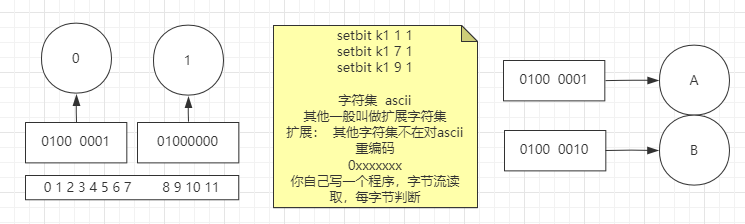

```sh
# setbit b1 偏移量 value
# 变异量表示的是位的偏移量

setbit b1 7 1
strlen b1 
# 1
setbit b2 8 1
strlen b2 
# 2   因为有9位，一个字节8位，redis看的是字节流，所以这里是2
```


1. **实战一：有用户系统，统计用户登录天数，且窗口随机**

   1. 做法一：在数据库创建一张表，每一个用户登录就记录一条

      这个表的设计，用户id列需要几个字节（假设4个），如果是uuid那就更多了，日期列也需要4个字节，那么一次登录就要消耗8个字节，有200天登录了就是1600个字节

      如果一个系统特别大，用户特别多，登录特别频繁，加入是京东，这个怎么优化？

   2. 做法二：使用redis

      用一个bit的每一位代表一个用户一年的某一天是否登录，登录了那这个位就是1

      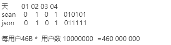

      ```sh
      # sean在第2天登录了
      setbit userlogin:sean 1 1
      # sean在第8天登录了
      setbit userlogin:sean 7 1
      # sean 在第365天登录了
      setbit userlogin:sean 364 1
      # 记录一年一个用户的登录次数只需要 365/8 个字节 40几个字节
      STRLEN userlogin:sean
      # 查询倒数16天sean的登录次数
      BITCOUNT userlogin:sean -2 -1
      ```

      

2. **实战二：京东就是你们的，618做活动：送礼物，大库备货多少礼物假设京东有2E用户**

   僵尸用户，冷热用户/忠诚用户

   需求：活跃用户统计！随即窗口，比如说 1号~3号 连续登录要   去重

   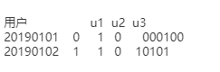

   ```sh
   # key表示日期，位表示用户（这里要给用户和位做好一个映射关系）
   # 1号用户在20190101登录了
   setbit 20190101   1  1
   setbit 20190102   1  1
   # 7号用户在20190102登录了
   setbit 20190102   7  1
   # bitop位运算，计算的结果放入destkey
   # 统计 20190101 20190102 这两天有哪些人登录了
   bitop  or  destkey 20190101  20190102
   # 查看一共有多少人登录了
   BITCOUNT  destkey  0 -1 
   ```


### 二：List 

链表，key中包含头尾指针，并且维护了正反向索引

List 有顺序，可重复

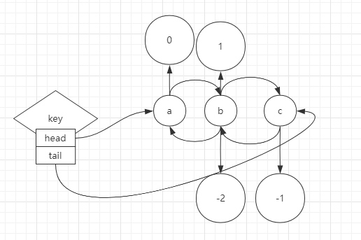

​	redis对 list 类型提供的一些方法让 list 能轻松的扩展类型

- 栈 （先进后出）：lpush lpop / rpush rpop 同向命令 

  - ```sh
    # 插入后的顺序是 d c b a
    lpush a b c d
    ```

- 队列（先进先出）：lpush rpop / rpush lpop 反向命令

- 数组：lindex lset linsert lrem llen

- 单播订阅：

  - ```sh
    # 订阅key，直到有消息才弹出。0表示一直等待
    blpop key 0 
    ```


### 三：hash 

一般存放一个简单的只有一级深度的键值对 ，因为他不支持json那种无限层级的属性键值对


### 四：Set

不可重复，无序

- 交集 SINTER SINTERSTORE
- 差集 SDIFF 通过key的顺序控制差集
- 并集 SUNION SUNIONSTORE


常用于对象间的关联关系：1对1、1对多


**SRANDMEMBER** 

如果命令执行时，只提供了 `key` 参数，那么返回集合中的一个随机元素。

- 如果 `count` 为正数，且小于集合基数，那么命令返回一个包含 `count` 个元素的数组，数组中的元素**各不相同**。如果 `count` 大于等于集合基数，那么返回整个集合。
- 如果 `count` 为负数，那么命令返回一个数组，数组中的元素**可能会重复出现多次**，而数组的长度为 `count` 的绝对值。

**SPOP**

​	将随机元素从集合中移除并返回

1. **实战一：抽奖**


2. **实战二：家庭争斗**


### 五：Sorted Set

为什么它的命令是Z开头？因为S被占用了，直接取的26个字母的最后一个

支持对元素排序，没有分值默认按值的字符串排，物理存储方式是按数值左小右大

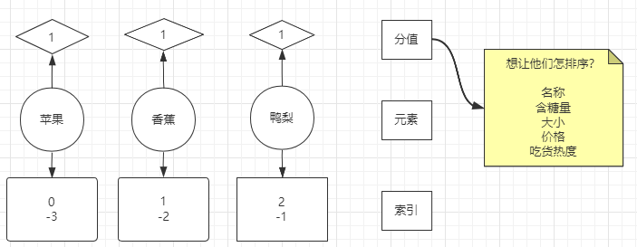


**面试题：排序是如何实现的？速度？**

skip list 跳表  todo 深入学习

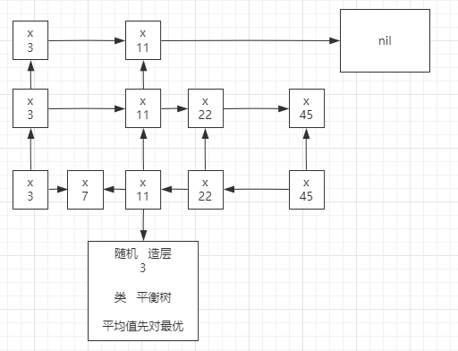

1. **实战一：排行榜**


## 回收策略

配置文件中的配置项

 - `maxmemory <bytes>`: 最大可用内存，建议1G~10G

 - `maxmemory-policy noeviction`  :

   	-	*volatile-lru*：使用近似的LRU驱逐，只使用有过期设置的键，常用
       -	*allkeys-lru*：使用近似LRU驱逐任意键
       -	*volatile-random*：移除一个有过期设置的随机键
       -	*allkeys-random*：移除一个随机的键，任何键
       -	*volatile-ttl*：删除与过期时间最近的密钥(次要TTL)
       -	*noeviction*：不要驱逐任何东西，只是在写操作时返回一个错误，只适合拿redis做为数据库时

   

**Redis如何淘汰过期的keys**

Redis keys过期有两种方式：被动和主动方式。

当一些客户端尝试访问它时，key会被发现并主动的过期。

当然，这样是不够的，因为有些过期的keys，永远不会访问他们。 无论如何，这些keys应该过期，所以定时随机测试设置keys的过期时间。所有这些过期的keys将会从密钥空间删除。

具体就是Redis每秒10次做的事情：

1. 测试随机的20个keys进行相关过期检测。
2. 删除所有已经过期的keys。
3. 如果有多于25%的keys过期，重复步奏1.

这是一个平凡的概率算法，基本上的假设是，我们的样本是这个密钥控件，并且我们不断重复过期检测，直到过期的keys的百分百低于25%,这意味着，在任何给定的时刻，最多会清除1/4的过期keys。


可以看出Redis是以性能为大前提，通过平衡算法，牺牲一些内存，保住性能


## 高级扩展


### 模块

[模块列表](https://redis.io/modules)

#### 布隆过滤器 

[官方文档](https://github.com/RedisBloom/RedisBloom)

​	解决缓存穿透问题，布隆过滤器首先知道你有啥，没有的也不去查询数据库。那么如果数据库的数据特别多，布隆过滤器要加载的数据就会很多，它是如何用小空间存大数据的？

​	布隆过滤器不是百分百阻挡，有概率解决问题，失败的概率<1%

​	对于穿透了redis，然后数据库中也没查询到，这时可以往redis中加一条该数据，value 是空

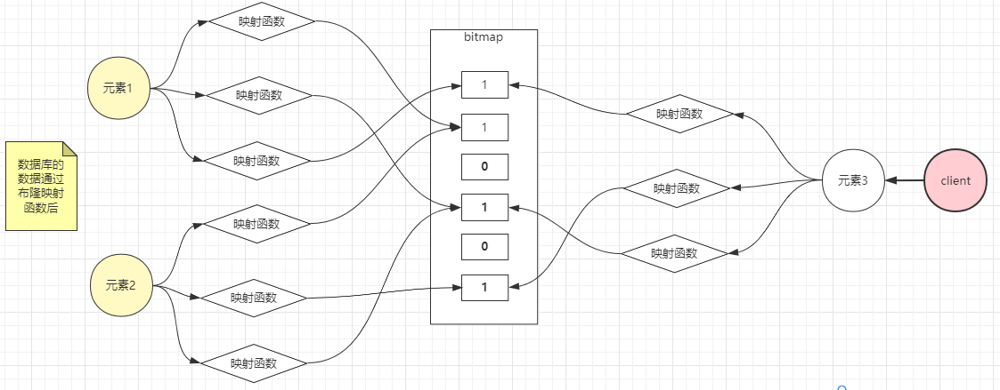

​	除了布隆过滤器，还有 `counting bloom` `cukcoo`(布谷鸟)

**双写**

​	当数据库新增了元素，此时还要将元素添加到布隆


​	通过源码安装

```sh
wget https://github.com/RedisBloom/RedisBloom/archive/refs/heads/master.zip

# 解压需要安装unzip
unzip 文件名

# 进入文件夹，有makefile的目录 
# 编译需要安装gcc

make

# 拷贝编译好的.so后缀的程序到/opt/redis/modules 

# 启动   module的加载要写全路径
redis-server --loadmodule /opt/redis/modules/redisbloom.so redis.conf

# 测试
redis-cli

# 真实场景是，写程序通过调用以下命令来添加数据标识
bf.add ooxx abc

# 通过这个命令可以判是否存在，以此来确定数据库中是否有该数据标识
bf.exists abc
# 结果是1 表示数据库有
```


## 高可用

### 数据持久化

​	redis中 rdb和aof可以同时开，不过恢复的时候只会用aof恢复，因为aof数据相对完整

#### **一：快照/副本（RDB）**

​		假如有个需求要对当前时间之前（如8:00）的数据做快照，有一个Key，8点前值是 a，在快照的过程中被修改成了 z，那么这个快照该保存哪个数据？如何能保存？

**插入一个常识：linux的父子进程**

- 父进程的数据默认子进程看不到

- 父进程可以让子进程看到数据，通过export

- 子进程中修改父进程的数据，不会破坏父进程原始数据

- 父进程export的数据修改也不会破坏子进程

- 验证以上观点：

  ```sh
  # 管道
  num = 0;
  ((num++))
  echo $num
  
  ((num++)) | more
  echo $num
  
  echo $$ | more
  echo $...PID | more
  
  # test.sh 一个脚本，在一个进程中测试num的改变
  #!/bin/bash
  
  echo $num
  num = 999
  
  sleep 20
  echo $num
  
  # 设置脚本
  chmod +x ./test.sh
  
  # 父进程调用脚本
  ```

根据以上的常识，是不是redis在需要快照的时候，创建一个子进程（内核函数fork()），那么是不是就自动的有了那个时刻的快照？假如redis此时内存为10G，内存空间够不够，创建子进程的速度是什么程度？

如图8:00时刻开始做快照，8:10修改了值

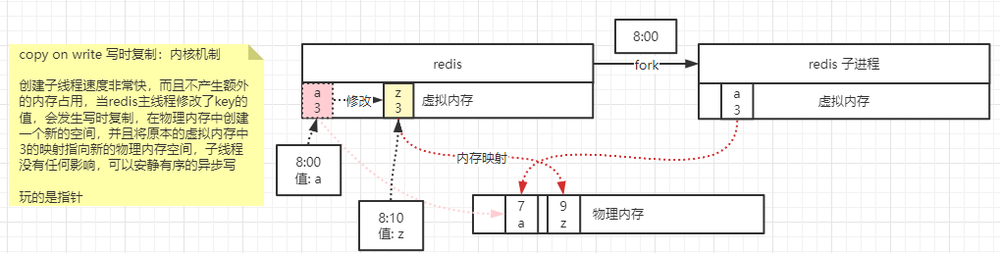


**使用**

​		配置文件中的*SNAPSHOTTING*

**save指令**：

​		将当前的所有内存中的数据写到rdb文件，阻塞，使用场景少，适合停服维护

**bqsave指令**

​		常用，非阻塞，通过fork()，通过配置文件可以指定规则

```sh
# 查看rdb文件
redis-check-rdb *.rdb
```


**弊端**

​		1、不支持拉链，只有一个dump.rdb，需要人为手动移动备份

​		2、修饰数据，窗口数据容易丢失

**优点**

​		类似于java序列化、恢复速度相对快


#### **二：日志（AOF）**

​		AOF（RDB全量+AOF增量），redis所有写操作记录到文件中

​		如果有一个redis运行了10年，然后挂了，AOF多大？恢复要多久？如果这10年就运行两个命令 一个设置key，一个删除key，那么AOF文件多大？有什么方案可以让AOF日志文件足够小？

​		凡是日志系统都有这个问题HDFS、FSIMAGE+EDITS.log：让日志只记录增量，合并的过程

​		**redis 4.0版本后，重写（BGREWRITEAOF）将内存中的老数据RDB到aof文件的开头，将新的增量的以指令的方式Append到aof文件**

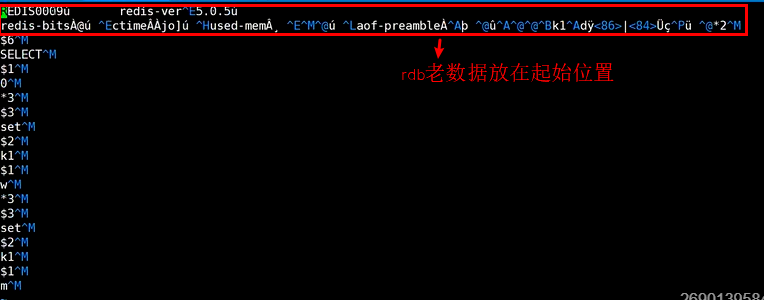

**使用**

​		配置文件中的*APPEND ONLY MODE* 

- appendonly：是否开启AOP：yes
- appendfilename：aof文件名：appendonly.aof 
- appendfsyn：3个写级别
  - *no* ：速度最快，不调用IO流的flush，这个flush会让内核将缓冲区的剩余数据立即写到磁盘上，这里表示不会flush缓冲区，内核的该IO流的缓冲区什么时候满了才刷到磁盘上，有可能会丢失一个缓冲区的数据
  - *always*：速度最慢，每一条增量数据都立即flush到磁盘上，最多丢失一条的数据
  - everysec ：每秒，最多丢失差不多一个buffer缓冲区的大小
- aof-use-rdb-preamble：是否结合rdb
- auto-aof-rewrite-percentage：自动重写配置：100
- auto-aof-rewrite-min-size：自动重写配置：64mb

​		redis 启动的时候就会创建空的aof文件，没有rdb文件，rdb需要满足条件才会创建

​		aof文件内容：

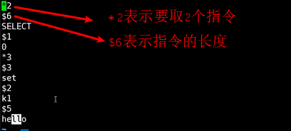

**弊端**

体量无限变大

恢复慢（重放）

**优点**

丢失数据少

### 集群

单机、单节点、单实例的问题：

- 1、单点故障
- 2、容量有限
- 3、访问计算压力

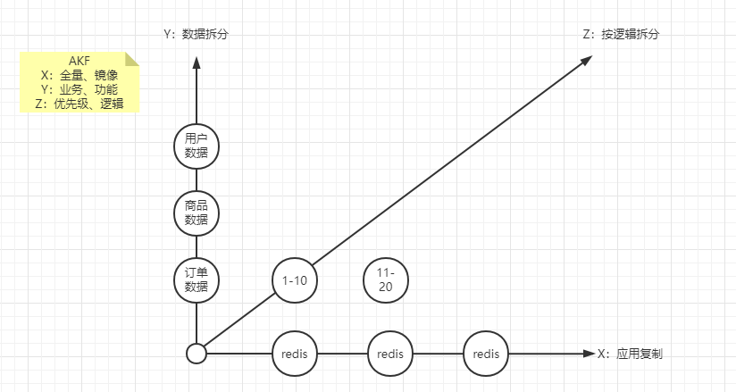

X轴可以解决单点故障，但带来了新的问题：如何保证数据一致性？

1. 方案一：当写操作到达，所有节点阻塞写入，直到数据全部一致，**强一致性**。

   **反问自己：为什么要一变多？为了可用性，而强一致性破坏了可用性，所以不可取**

2. 方案二：当写操作到达，通过异步让其他节点写入，容忍数据丢失一部分，**最终一致性**

   **Redis使用默认的异步复制，其特点是低延迟和高性能，是绝大多数 Redis 用例的自然复制模式**


1. **主从复制**

   - 从节点不能写，只能读 **（可以配置为支持读写）**
   - 从节点跟随主节点前，会把自己的数据先清除
   - 主节点知道自己的从节点有哪些
   - **主节点挂了，从节点不会自动切换为主节点，需要人工介入**

   Docker搭建

   ```sh
   # 配置文件
   bind 0.0.0.0
   port 6379
   daemonize yes
   dir /data
   logfile "/data"
   
   
   # 创建网络，让这几个容器能互相访问
   docker network create --subnet 172.38.0.0/16 redisnet
   
   # 运行3个redis容器
   # 第一台主
   docker run -d -v /root/conf-redis/replicate:/usr/local/etc/redis --net redisnet --name redis-m1 redis redis-server /usr/local/etc/redis/redis.conf
   
   # 第二台从，直接运行的时候就追随主
   docker run -d -v /root/conf-redis/replicate:/usr/local/etc/redis --net redisnet --name redis-s1 redis redis-server /usr/local/etc/redis/redis.conf --replicaof redis-m1 6379
   
   # 第三台从，进入容器追随主
   docker run -d -v /root/conf-redis/replicate:/usr/local/etc/redis --net redisnet --name redis-s2 redis redis-server /usr/local/etc/redis/redis.conf
   
   docker exec -it redis-s2 /bin/bash
   redis-cli
   set k1 1
   # 通过命令追随
   REPLICAOF redis-m1 6379
   
   # 追随完成后发现k1没了
   # 查看从2的日志
   Before turning into a replica, using my own master parameters to synthesize a cached master: I may be able to synchronize with the new master with just a partial transfer.
   Connecting to MASTER redis-m1:6379
   MASTER <-> REPLICA sync started
   ...
   receiving 189 bytes from master to disk
   Flushing old data
   Loading DB in memory
   ...
   # 从以上日志得知，追随主节点，会把自己节点内原有的数据清掉
   
   
   # 查看主的日志
   Replica 172.38.0.3:6379 asks for synchronization
   Full resync requested by replica 172.38.0.3:6379
   Replication backlog created, my new replication IDs are '9def6cd5f7f3825efb71028a135ef549a85229da' and '0000000000000000000000000000000000000000'
   Starting BGSAVE for SYNC with target: disk
   Background saving started by pid 18
   DB saved on disk
   RDB: 2 MB of memory used by copy-on-write
   Background saving terminated with success
   Synchronization with replica 172.38.0.3:6379 succeeded
   
   # 从以上得知，主节点是知道自己的从节点有哪些
   
   # 此时如果主节点挂了
   docker stop redis-m1
   
   # 查看日志发现两个从节点并不会自主选举，而是在等主节点恢复
   # 在从1上手动切换为主节点
   REPLICAOF NO ONE
   
   # 在从2上手动重新跟随
   REPLICAOF redis-s2 6379
   ```

   

2. **哨兵**

   哨兵就是用来解决，主从复制中需要人工介入的问题，一套哨兵可以监控多套主从复制集群（有点像keepalive）

   - **监控（Monitoring）**：会不断地检查你的主服务器和从服务器是否运作正常
   - **提醒（Notification）**：当被监控的某个 Redis 服务器出现问题时， Sentinel 可以通过 API 向管理员或者其他应用程序发送通知
   - **自动故障迁移（Automatic failover）**：当一个主服务器不能正常工作时， Sentinel 会开始一次自动故障迁移操作， 它会将失效主服务器的其中一个从服务器升级为新的主服务器， 并让失效主服务器的其他从服务器改为复制新的主服务器； 当客户端试图连接失效的主服务器时， 集群也会向客户端返回新主服务器的地址， 使得集群可以使用新主服务器代替失效服务器

   

   启动服务：

   ```sh
   # 最后的2表示判断失效2个sentinel同意（只要同意 Sentinel 的数量不达标，自动故障迁移就不会执行）
   # mymaster 用来区分不同的redis监控集群
   # 之所以哨兵的配置只需要一个redis主节点的地址端口就可以，是因为主节点记录了所有其他从节点的信息
   
   # 创建最简单的配置文件 sentinel.conf（源码中有默认配置文件）
   port 16379
   sentinel monitor mymaster 127.0.0.1 6379 2
   
   # 以下是扩展配置（可选）
   # Sentinel 认为服务器已经断线所需的毫秒数
   sentinel down-after-milliseconds mymaster 60000
   sentinel failover-timeout mymaster 180000
   # 指定了在执行故障转移时， 最多可以有多少个从服务器同时对新的主服务器进行同步， 这个数字越小， 完成故障转移所需的时间就越长
   sentinel parallel-syncs mymaster 1
   
   sentinel monitor resque 192.168.1.3 6380 4
   sentinel down-after-milliseconds resque 10000
   sentinel failover-timeout resque 180000
   sentinel parallel-syncs resque 5
   
   # 启动哨兵
   redis-server /path/to/sentinel.conf --sentinel
   
   # 哨兵启动以后会重写配置文件，补全集群的节点信息
   ```

   

   **哨兵之间是如何通信的？**

   是通过在主节点开启了发布订阅

   ```sh
   在主节点用命令可以看通信内容
   PSUBSCRIBE *
   ```

   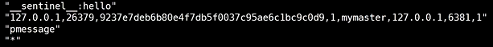

   

3. **数据拆分**

   模型

   - **1、modula** 

     

     - 优点：客户端容易实现，适合中小应用
     - 弊端：当增加节点的时候，需要全局洗牌，把数据全部取出来重新取模分配

   - **2、随机**

     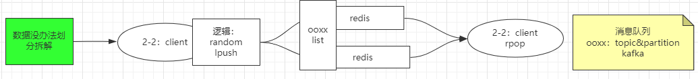

     - 优点：当redis有多个节点，并且key是list类型，那么就像kafka

   - **3、ketama 一致性哈希算法**（一个无论多长的字符串，经过算法得出的结果长度等宽）

     **只用在缓存**

     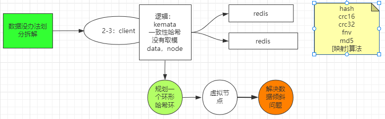

     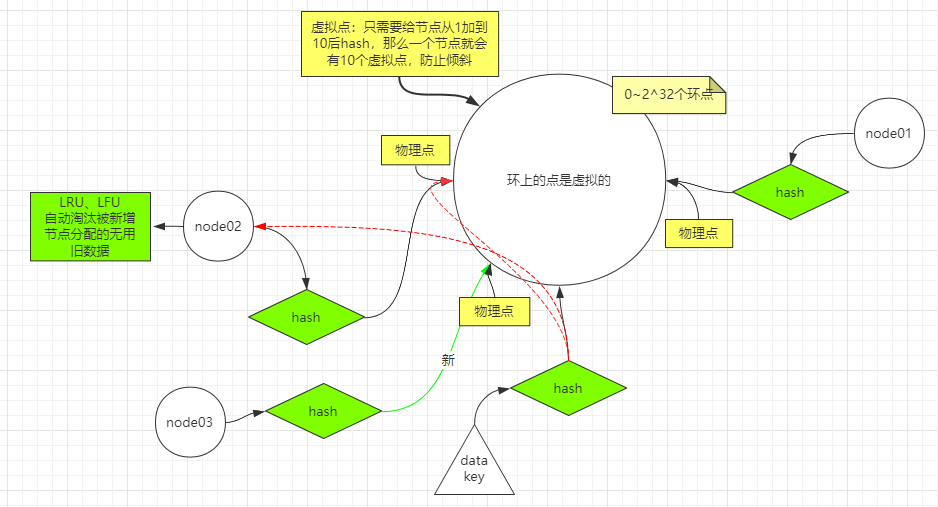

     - 优点：不需要全局洗牌

     - 缺点：当刚开始增加节点的时候会造成小部分数据不能命中，因为环形 被分割了，会阻挡后面切环点的数据查询被阻挡，此时会击穿缓存，把压力给到后端数据库，等重新查询完后再放入新节点重新缓存

       缺点的解决方案：

       - 连续查询从两个redis节点的查询，第一个节点查询不到就到第二个节点查询，然后再缓存第一个节点

   - **4、代理 twemproxy、predixy**

     以上都是基于客户端的实现，twemproxy 是基于服务器的实现

     使用了服务器redis代理，客户端就可以屏蔽redis集群的复杂性，只需要知道一个代理服务器的IP地址，由于代理面向的是redis集群，某些redis 命令不支持：keys * 、事务

     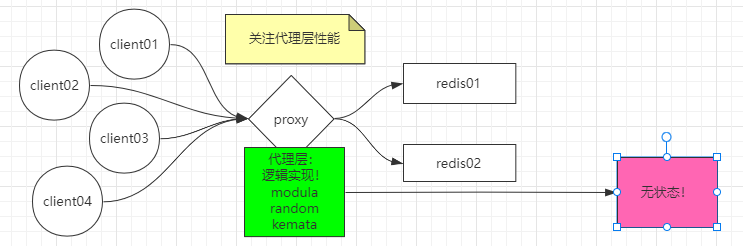

     - **twemproxy**

       - 安装 [官方](https://github.com/twitter/twemproxy)
       -  

     - **predixy**

       解决存在哨兵集群时的redis集群对外只暴露一个端口

       - 安装 [官方](https://github.com/joyieldInc/predixy)

       - **HashTag**

         指定k1到一个固定的节点

         ```sh
         set {oo}k1 sda
         set {oo}k2 addasd
         ```

         

   - **5、redis 分片 (集群 无主模型)**

     module模型的问题就是取模的问题，那么如果我们一开始就把模数设的特别大，是不是就不会出现全局洗牌了

     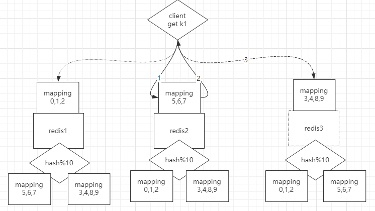

     

     **实操**

     [文档](http://redis.cn/topics/cluster-tutorial.html)

     ```sh
     
     
     # 这里可以随意连接到集群的任意一个节点，-c表示获取会自动跳转到存放这个key的节点
     redis-cli -c -p 30001
     ```

     

4. 


## 缓存的几大问题

以下问题的前提是在高并发下

### 击穿

请求的key不存在时，没有预缓存或过期了，大量的请求会直接查询数据库，如何阻塞这些请求，让每一个key同时只有一个请求给到数据库？

**锁 setnx**

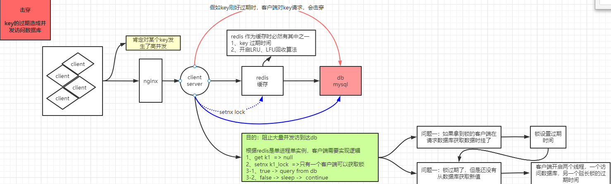


### 穿透

一般情况，先查询redis，redis没有就查数据库。但是会存在一个问题，就是查询的这条数据数据库也没有，客户端如果一直查询redis没有的数据，那么就会一直访问数据库，让数据库造成无用的性能损耗

**布隆过滤器**

布隆过滤器不支持删除（布谷鸟过滤器支持），但是可以设置这个key的值为空来在客户端判断

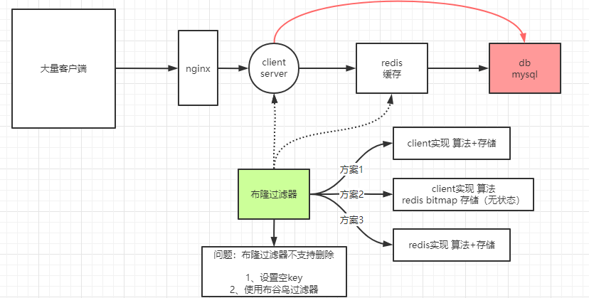


### 雪崩

大量的key同时批量失效

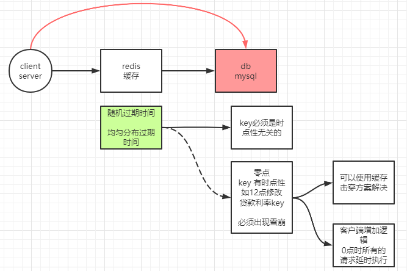


## 使用场景汇总

### 缓存

String类型

例如：热点数据缓存（例如报表、明星出轨），对象缓存、全页缓存、可以提升热点数据的访问数据。


### 数据共享分布式

String 类型，因为 Redis 是分布式的独立服务，可以在多个应用之间共享

例如：分布式Session

```xml
<dependency> 
 <groupId>org.springframework.session</groupId> 
 <artifactId>spring-session-data-redis</artifactId> 
</dependency>
```


### 分布式锁

String 类型setnx方法，只有不存在时才能添加成功，返回true


### 全局ID

int类型，incrby，利用原子性

incrby userid 1000

分库分表的场景，一次性拿一段


### 计数器

[int类型，incr方法](https://mp.weixin.qq.com/s?__biz=MzI4NTM1NDgwNw==&mid=2247500365&idx=1&sn=7abfd8b30427d4ac15bb351c3dbb640c&scene=21#wechat_redirect)

[例如：文章的阅读量、微博点赞数、允许一定的延迟，先写入Redis再定时同步到数据库]()


### 限流

[int类型，incr方法]()

[以访问者的ip和其他信息作为key，访问一次增加一次计数，超过次数则返回false]()


### 位统计

String类型的bitcount（1.6.6的bitmap数据结构介绍）

字符是以8位二进制存储的

```sh
set k1 a
setbit k1 6 1
setbit k1 7 0
get k1 
# 6 7 代表的a的二进制位的修改
# a 对应的ASCII码是97，转换为二进制数据是01100001
# b 对应的ASCII码是98，转换为二进制数据是01100010
# 因为bit非常节省空间（1 MB=8388608 bit），可以用来做大数据量的统计。

# 例如：在线用户统计，留存用户统计
setbit onlineusers 01 
setbit onlineusers 11 
setbit onlineusers 20

# 支持按位与、按位或等等操作
BITOPANDdestkeykey[key...] ，对一个或多个 key 求逻辑并，并将结果保存到 destkey 。       
BITOPORdestkeykey[key...] ，对一个或多个 key 求逻辑或，并将结果保存到 destkey 。 
BITOPXORdestkeykey[key...] ，对一个或多个 key 求逻辑异或，并将结果保存到 destkey 。 
BITOPNOTdestkeykey ，对给定 key 求逻辑非，并将结果保存到 destkey 。

# 计算出7天都在线的用户
BITOP "AND" "7_days_both_online_users" "day_1_online_users" "day_2_online_users" ...  "day_7_online_users"
```


### 购物车

String 或hash。所有String可以做的hash都可以做

- key：用户id；field：商品id；value：商品数量
- +1：hincr。-1：hdecr。删除：hdel。全选：hgetall。商品数：hlen


### 用户消息时间线timeline

list，双向链表，直接作为timeline就好了。插入有序

### 消息队列

List提供了两个阻塞的弹出操作：blpop/brpop，可以设置超时时间

- blpop：blpop key1 timeout 移除并获取列表的第一个元素，如果列表没有元素会阻塞列表直到等待超时或发现可弹出元素为止
- brpop：brpop key1 timeout 移除并获取列表的最后一个元素，如果列表没有元素会阻塞列表直到等待超时或发现可弹出元素为止

上面的操作。其实就是java的阻塞队列。学习的东西越多。学习成本越低

- 队列：先进先除：rpush blpop，左头右尾，右边进入队列，左边出队列
- 栈：先进后出：rpush brpop


### 抽奖

自带一个随机获得值

```sh
spop myset
```


### 点赞、签到、打卡

用 like:t1001 来维护 t1001 这条微博的所有点赞用户

- 点赞了这条微博：sadd like:t1001 u3001
- 取消点赞：srem like:t1001 u3001
- 是否点赞：sismember like:t1001 u3001
- 点赞的所有用户：smembers like:t1001
- 点赞数：scard like:t1001

是不是比数据库简单多了


### 商品标签

老规矩，用 tags:i5001 来维护商品所有的标签。

- sadd tags:i5001 画面清晰细腻
- sadd tags:i5001 真彩清晰显示屏
- sadd tags:i5001 流程至极


### 商品筛选

```sh
# 获取差集
sdiff set1 set2
# 获取交集（intersection ）
sinter set1 set2
# 获取并集
sunion set1 set2

# 假如：iPhone11 上市了
sadd brand:apple iPhone11

sadd brand:ios iPhone11

sad screensize:6.0-6.24 iPhone11

sad screentype:lcd iPhone11

# 筛选商品，苹果的、ios的、屏幕在6.0-6.24之间的，屏幕材质是LCD屏幕
sinter brand:apple brand:ios screensize:6.0-6.24 screentype:lcd
```


### 用户关注、推荐模型

follow 关注 fans 粉丝

相互关注：

- sadd 1:follow 2
- sadd 2:fans 1
- sadd 1:fans 2
- sadd 2:follow 1

我关注的人也关注了他(取交集)：

- sinter 1:follow 2:fans

可能认识的人：

- 用户1可能认识的人(差集)：sdiff 2:follow 1:follow
- 用户2可能认识的人：sdiff 1:follow 2:follow


### 排行榜

```sh
# id 为6001 的新闻点击数加1：
zincrby hotNews:20190926 1 n6001

# 获取今天点击最多的15条：

zrevrange hotNews:20190926 0 15 withscores
```


## 面试题

### 如何防止数据存储倾斜？

