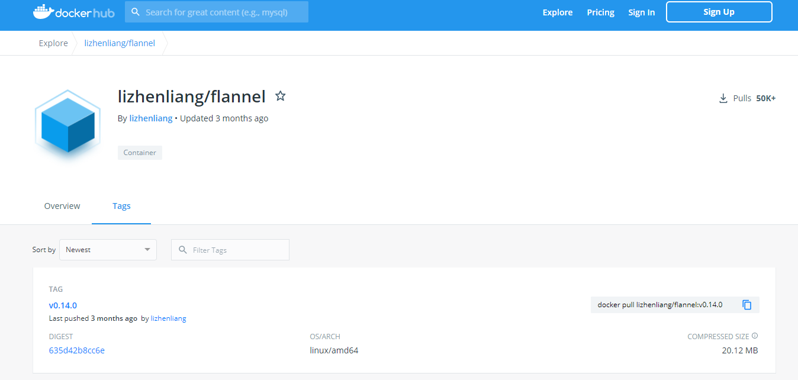
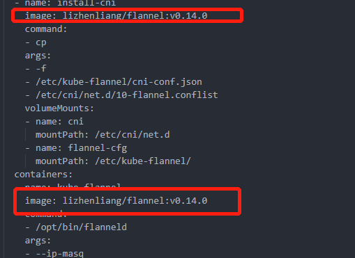
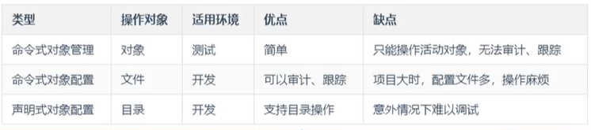
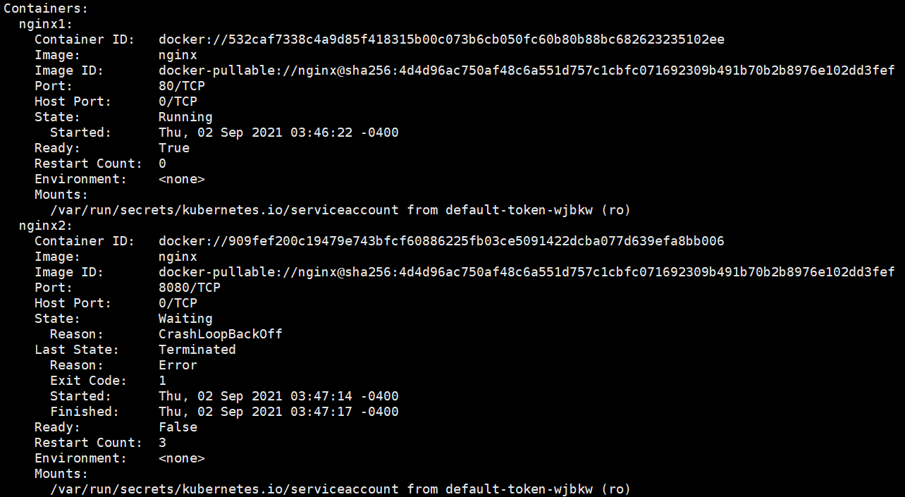
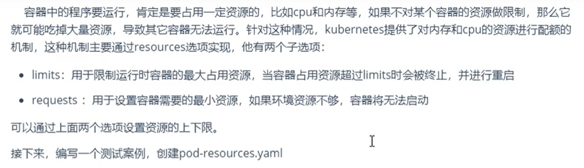
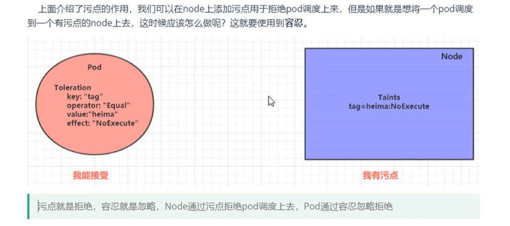
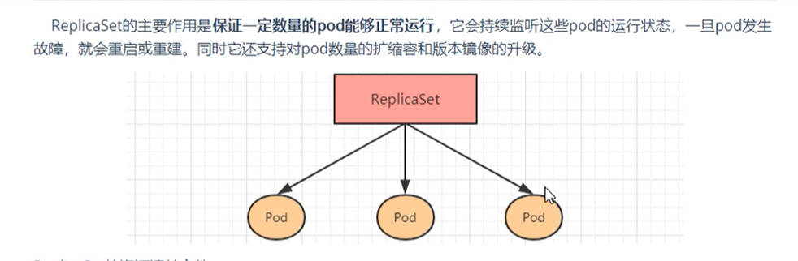
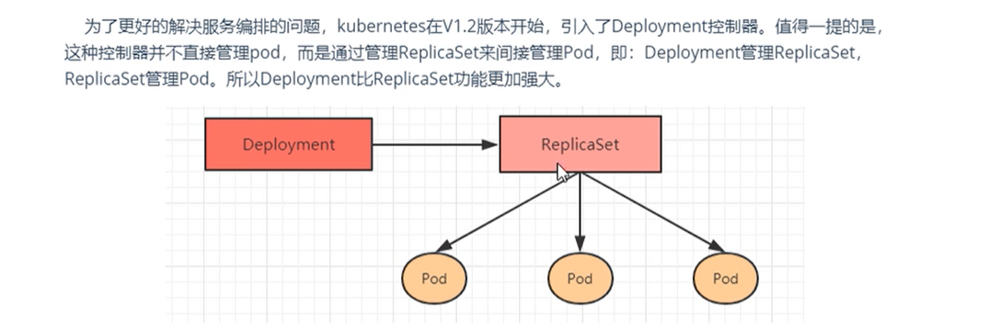
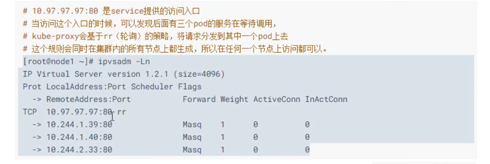
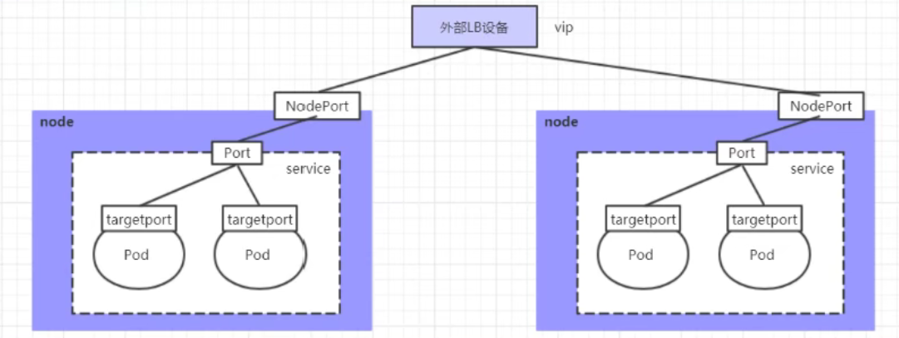

# Kubernetes

## Kubernetes介绍

#### 应用部署方式演变


**传统部署时代：**

- 优点：部署简单，无其他技术要求
-  缺点：资源不可隔离，如果一台机器部署了多个应用，某个应用故障导致资源占用大，会殃及其他应用

**虚拟化部署时代：**

- 优点：资源隔离，提供了一定程度的安全性
- 缺点：增加了操作系统，浪费了部分资源，虚拟机管理不够简单

**容器部署时代：**

- 优点：
  - 每个容器的资源隔离，又共享了宿主机的底层基础架构
  - 敏捷应用程序的创建和部署：与使用 VM 镜像相比，提高了容器镜像创建的简便性和效率
  -  持续开发、集成和部署：通过快速简单的回滚（由于镜像不可变性），支持可靠且频繁的 容器镜像构建和部署
  - 关注开发与运维的分离：在构建/发布时而不是在部署时创建应用程序容器镜像， 从而将应用程序与基础架构分离
  - 可观察性：不仅可以显示操作系统级别的信息和指标，还可以显示应用程序的运行状况和其他指标信号
  - 跨开发、测试和生产的环境一致性：在便携式计算机上与在云中相同地运行
  - 跨云和操作系统发行版本的可移植性：可在 Ubuntu、RHEL、CoreOS、本地、 Google Kubernetes Engine 和其他任何地方运行
  - 以应用程序为中心的管理：提高抽象级别，从在虚拟硬件上运行 OS 到使用逻辑资源在 OS 上运行应用程序
  - 松散耦合、分布式、弹性、解放的微服务：应用程序被分解成较小的独立部分， 并且可以动态部署和管理 - 而不是在一台大型单机上整体运行
  - 资源隔离：可预测的应用程序性能
  - 资源利用：高效率和高密度

- 缺点：
  - 学习成本高

#### 容器化部署带来了新问题

- 如果一个容器挂了，怎么样另外一个容器立刻启动替补停机的容器？
- 当并发访问变大的时候，怎样做到横向扩展容器的数量？

#### Kubernetes简介


[官方简介](https://kubernetes.io/zh/docs/concepts/overview/what-is-kubernetes/)

#### Kubernetes组件

[官方文档](https://kubernetes.io/zh/docs/concepts/overview/components/)


##  集群环境搭建

- 搭建测试环境集群：1主2从
- 3台2核2G内存服务器
- 系统版本：centos 8
- Docker版本：20.10.8
- K8s版本：v1.20.10

#### 环境初始化

```sh
# 设置主机名后重启，主机名在创建k8s集群时会使用
$ hostnamectl set-hostname [主机名]

# 以下命令再所有机器上执行
# 主机域名配置
# 企业中推荐使用内部的DNS服务器
$ vi /etc/hosts
192.168.177.100 master1
192.168.177.101 node1
192.168.177.102 node2

# 测试是否有效
$ ping node1
PING node1 (192.168.177.101) 56(84) bytes of data.

# 时间同步
# Kubernetes集群需要服务器时间精准一至，企业中建议配置内部的时间同步服务器
# 启动chronyd服务
$ systemctl start chronyd && systemctl enable chronyd

# 测试
$ date
2021年 08月 26日 星期四 21:49:54 EDT

# 禁用iptables和firewalld服务(可选：测试环境)
# Kubernetes和Docker在运行中会产生大量的iptables规则，为了不让系统规则和它们混淆，关闭系统规则
$ systemctl stop firewalld && systemctl disable firewalld
$ systemctl stop iptables && systemctl disable iptables

# 禁用selinux  (待查证)
# selinux是linux系统下的一个安全服务，如果不关闭它，在安装集群时会产生各种各样的问题
$ vi /etc/selinux/config
SELINUX=disabled

# 重启后生效

# 禁用swap分区（虚拟内存分区）
# 它的作用是在物理内存使用完之后，将磁盘空间虚拟成内存来使用，启动swap设备会对系统的性能产生非常负面的影响，因此Kubernetes要求每个节点都要禁用swap设备，但是也可以在安装的过程中进行参数配置来允许swap分区被启用
$ vi /etc/fstab
#/dev/mapper/cl-swap     swap                    swap    defaults        0 0

# 重启后生效

# 允许 iptables 检查桥接流量，修改linux内核参数（Kubernetes要求）
# Kubernetes支持几种不同的网络附加解决方案。接下来安装flannel网络插件，我们需要做的第一件事是我们需要在所有服务器上设置一个sysctl值，包括主节点
$ cat <<EOF | sudo tee /etc/modules-load.d/k8s.conf
br_netfilter
EOF

$ cat <<EOF | sudo tee /etc/sysctl.d/k8s.conf
net.bridge.bridge-nf-call-ip6tables = 1
net.bridge.bridge-nf-call-iptables = 1
EOF

$ sysctl --system

# 加载模块
$ modprobe br_netfilter
# 查看模块是否加载
$ lsmod | grep br_netfilter

# 配置ipvs
# Kubernetes中service有两种代理模型，iptables，ipvs，后者性能更高，需要手动载入ipvs模块
# 安装ipset,ipvsadm
$ yum install ipset ipvsadm -y
# 添加需要加载的模块写入脚本文件
$ cat << EOF >/etc/sysconfig/modules/ipvs.modules
#!/bin/bash
modprobe -- ip_vs
modprobe -- ip_vs_rr
modprobe -- ip_vs_wrr
modprobe -- ip_vs_sh
modprobe -- nf_conntrack
EOF
# centos8.3 找不到nf_conntrack_ipv4模块 ,更换为nf_conntrack试试
# modprobe -- nf_conntrack_ipv4

$ chmod +x /etc/sysconfig/modules/ipvs.modules
# $ modprobe nf_conntrack_ipv4
$ modprobe nf_conntrack
$ /bin/bash /etc/sysconfig/modules/ipvs.modules

# 重启服务器
$ reboot

# 查看配置是否生效
$ getenforce
Disabled
$ free -m
              total        used        free      shared  buff/cache   available
Mem:           1790         190        1371           8         228        1436
Swap:             0           0           0

```

#### 安装Docker

```sh
yum install -y yum-utils
# 国内仓库
yum-config-manager --add-repo http://mirrors.aliyun.com/docker-ce/linux/centos/docker-ce.repo

yum install docker-ce docker-ce-cli containerd.io

# 查看当前镜像源中支持的docker版本
yum list docker-ce --showduplicates
Docker CE Stable - x86_64     48 kB/s |  15 kB     00:00    
可安装的软件包
docker-ce.x86_64      3:19.03.13-3.el8         docker-ce-stabl
# 安装指定版本
yum install --setopt=obsoletes=0 docker-ce-19.03.15 docker-ce-cli-19.03.15 containerd.io -y
# --setopt=obsoletes=0 此参数为取消安装包取代关系，有时候有些旧的安装包被新的安装包取代了，安装的时候就会自动安装新的。

# 添加配置文件
# Docker默认情况下使用Cgroup Driver为cgroupfs，而K8s推荐使用systemd替代cgroupfs
mkdir /etc/docker
cat << EOF >/etc/docker/daemon.json
{
    "exec-opts": ["native.cgroupdriver=systemd"],
    "registry-mirrors": [
            "https://registry.aliyuncs.com"
          ]
}
EOF

# 启动Docker
systemctl start docker && systemctl enable docker
# 查看Docker信息
$ docker info 
 ...
 Cgroup Driver: systemd

```

#### 安装K8S组件

你需要在每台机器上安装以下的软件包：

- `kubeadm`：用来初始化集群的指令。
- `kubelet`：在集群中的每个节点上用来启动 Pod 和容器等。
- `kubectl`：用来与集群通信的命令行工具。

```sh
# 由于K8s的镜像源在国外，速度比较慢，更换为国内镜像源
cat << EOF > /etc/yum.repos.d/kubernetes.repo
[kubernetes]
name=Kubernetes
baseurl=https://mirrors.aliyun.com/kubernetes/yum/repos/kubernetes-el7-x86_64/
enabled=1
gpgcheck=1
repo_gpgcheck=1
gpgkey=https://mirrors.aliyun.com/kubernetes/yum/doc/yum-key.gpg https://mirrors.aliyun.com/kubernetes/yum/doc/rpm-package-key.gpg
EOF

# 安装（最新版本可能会有一些组件的不兼容，如网络组件）
yum install -y kubelet kubeadm kubectl
# 查看当前镜像源中支持的docker版本
yum list kubeadm --showduplicates
# 安装指定版本
yum install -y --setopt=obsoletes=0 kubelet-1.20.10-0 kubeadm-1.20.10-0 kubectl-1.20.10-0

# 配置kubelet的cgroup
cat << EOF > /etc/sysconfig/kubelet
KUBELET_CGROUP_ARGS="--cgroup-driver=systemd"
KUBE_PROXY_MODE="ipvs"
EOF

# 设置开机启动
$ systemctl restart kubelet && systemctl enable kubelet

# 使用kubeadm安装k8s集群时，会到docker镜像仓库下载k8s所需组件的镜像
# 查看需要下载的镜像
$ kubeadm config images list

I0830 02:12:32.470444    8646 version.go:254] remote version is much newer: v1.22.1; falling back to: stable-1.20
k8s.gcr.io/kube-apiserver:v1.20.10
k8s.gcr.io/kube-controller-manager:v1.20.10
k8s.gcr.io/kube-scheduler:v1.20.10
k8s.gcr.io/kube-proxy:v1.20.10
k8s.gcr.io/pause:3.2
k8s.gcr.io/etcd:3.4.13-0
k8s.gcr.io/coredns:1.7.

# 由于k8s.gcr.io国内无法访问，所以需要替换镜像源

# 拉取镜像
# 方法一
$ kubeadm config images pull --image-repository registry.aliyuncs.com/google_containers
# 如果中途找不到最新的 coredns，那么就单独下载latest版本，修改名字为指定的版本

# 下载
$ docker pull registry.aliyuncs.com/google_containers/coredns:latest
# 改名
$ docker tag registry.aliyuncs.com/google_containers/coredns:latest registry.aliyuncs.com/google_containers/coredns:v1.8.4

# 方法二
$ images=(
    kube-apiserver:v1.17.17
    kube-controller-manager:v1.17.17
    kube-scheduler:v1.17.17
    kube-proxy:v1.17.17
    pause:3.1
    etcd:3.4.3-0
    coredns:1.6.5
)

for image in ${images[@]}
do
	docker pull registry.aliyuncs.com/google_containers/${image}
	docker tag registry.aliyuncs.com/google_containers/${image} k8s.gcr.io/${image}
	docker image rm registry.aliyuncs.com/google_containers/${image}
done
```

#### 集群初始化

```sh
# 下面的操作只需要在master节点上执行
# 创建集群，会自动下载kubernetes所需的组件
$ kubeadm init \
--image-repository registry.aliyuncs.com/google_containers \
--pod-network-cidr=10.244.0.0/16 \
--apiserver-advertise-address=192.168.177.111 \
--kubernetes-version=v1.20.10 \
--node-name=master1

#   --node-name（重点）：如果执行当前命令的主机名不是域名，需要指定node-name参数
#   --kubernetes-version：kubernetes版本
#   --pod-network-cidr：指明 pod 网络可以使用的 IP 地址段。如果设置了这个参数，控制平面将会为每一个节点自动分配 CIDRs
#	--apiserver-advertise-address ： 主节点Ip,为master(控制面板)节点的 API server 设置广播地址

Your Kubernetes control-plane has initialized successfully!
To start using your cluster, you need to run the following as a regular user:
  mkdir -p $HOME/.kube
  sudo cp -i /etc/kubernetes/admin.conf $HOME/.kube/config
  sudo chown $(id -u):$(id -g) $HOME/.kube/config
Alternatively, if you are the root user, you can run:
  export KUBECONFIG=/etc/kubernetes/admin.conf
You should now deploy a pod network to the cluster.
Run "kubectl apply -f [podnetwork].yaml" with one of the options listed at:
  https://kubernetes.io/docs/concepts/cluster-administration/addons/
Then you can join any number of worker nodes by running the following on each as root:
kubeadm join 192.168.177.100:6443 --token lsnex0.2tnwvfj3kl2c0ziz \
	--discovery-token-ca-cert-hash sha256:479d6791a9108e17a6e04d405ae95564c414acb756bd13043ab5a5910412dd0a 
#############

# 创建集群成功后，按提示创建目录和文件

# 创建集群加入令牌
$ kubeadm token create
# 其他节点加入集群
# kubeadm join [api-server-endpoint] [flags]
$ kubeadm join 192.168.177.100:6443 \
--discovery-token eeqqgv.ytlyhleqb5i7w4v4 \
--discovery-token-ca-cert-hash sha256:1a78b6956df07f02d330505afa7c299bd339b6d8ac2c3e36539e6ec2f6554419

# 查看集群状态
$ kubectl get nodes
NAME     STATUS     ROLES                  AGE     VERSION
master   NotReady   control-plane,master   19m     v1.22.1
node1    NotReady   <none>                 7m38s   v1.22.1
node2    NotReady   <none>                 11m     v1.22.1

# 可以看到所有节点的状态都为未准备，是因为还未安装网络插件
```

#### 安装网络插件

k8s支持多种网络插件，比如flannel、calico、canal等，以下使用[flannel](https://github.com/flannel-io/flannel#flannel)

```sh
# 以下操作再master节点执行
$ wget https://raw.githubusercontent.com/coreos/flannel/master/Documentation/kube-flannel.yml

# 修改文件中的quay.io仓库为quay-mirror.qiniu.com

# 使用配置文件启动flannel
$ kubectl apply -f flannel.yml

# 再次查看集群状态
$ kubectl get po -n kube-system

NAME                               READY   STATUS              RESTARTS   AGE
coredns-7f89b7bc75-mg85w           0/1     Pending             0          11m
coredns-7f89b7bc75-twgb2           0/1     Pending             0          11m
etcd-master11                      1/1     Running             0          12m
kube-apiserver-master11            1/1     Running             0          12m
kube-controller-manager-master11   1/1     Running             0          12m
kube-flannel-ds-6ftfn              0/1     Init:ErrImagePull   0          3m19s
kube-proxy-7lm2m                   1/1     Running             0          11m
kube-scheduler-master11            1/1     Running             0          12m

# 发现kube-flannel-ds-6ftfn 镜像无法拉取，问题出在了flannel安装文件中的镜像源
# 在dockerhub中查找flannel，使用一个靠前的镜像仓库，然后替换即可
# 删除原来的配置
$ kubectl delete -f flannel.yml
# 修改好flannel.yml文件中的镜像源后再安装
```





```sh
# 配置完等待1分钟
$ kubectl get po -n kube-system
NAME                               READY   STATUS    RESTARTS   AGE
coredns-7f89b7bc75-mg85w           1/1     Running   0          32m
coredns-7f89b7bc75-twgb2           1/1     Running   0          32m
etcd-master11                      1/1     Running   0          32m
kube-apiserver-master11            1/1     Running   0          32m
kube-controller-manager-master11   1/1     Running   0          32m
kube-flannel-ds-rdn56              1/1     Running   0          108s
kube-proxy-7lm2m                   1/1     Running   0          32m
kube-scheduler-master11            1/1     Running   0          32m

```


#### 安装DashBoard

[官方安装教程](https://kubernetes.io/zh/docs/tasks/access-application-cluster/web-ui-dashboard/)

注意：国内用户搭建的时候替换yaml中的镜像即可

**访问**

```sh
# 创建账号
$ kubectl create serviceaccount dashboard-admin -n kubernetes-dashboard

# 授权
$ kubectl create clusterrolebinding dashboard-admin-rb --clusterrole=cluster-admin --serviceaccount=kubernetes-dashboard:dashboard-admin

# 获取账号token
$ kubectl get secrets -n kubernetes-dashboard | grep dashboard-admin

# 得到 secretvalue

# 获取token
$ kubectl describe secret secretvalue -n kubernetes-dashboard
```


#### 安装异常处理

- 删除集群、退出已加入的集群

  ```sh
  kubeadm reset -f
  ```

- 卸载集群，重新创建集群后提示证书不正确

  ```sh
  $ kubectl get nodes
  
  Unable to connect to the server: x509: certificate signed by unknown authority (possibly because of "crypto/rsa: verification error" while trying to verify candidate authority certificate "kubernetes")
  
  # 处理办法：删除目录后重新创建集群
  $ rm -rf $HOME/.kube
  ```

- kubectl get nodes无法获取信息

  ```sh
  [root@master ~]# kubectl get nodes
  The connection to the server localhost:8080 was refused - did you specify the right host or port?
  
  $ mkdir -p $HOME/.kube
  $ sudo cp -i /etc/kubernetes/admin.conf $HOME/.kube/config
  $ sudo chown $(id -u):$(id -g) $HOME/.kube/config
  ```

#### 测试

```sh
# 部署nginx
$ kubectl create deployment nginx --image=nginx

# 暴露端口
$ kubectl expose deployment nginx --port=80 --type=NodePort

# 查看服务状态
$ kubectl get pod,svc

# 查看pod的详细信息，包括创建过程
$ kubectl describe pod podname
```

  

## 以二进制的方式搭建集群


## 资源管理

#### 资源管理介绍


#### 资源管理方式

- 命令式对象管理

  - ```sh
    kubectl run [pod控制器名称]/[pod名称] [args]
    ```

- 命令式对象配置

  - ```sh
    kubectl create/patch -f nginx-pod.yaml
    ```

- 声明式对象配置（用于创建和更新资源的结合体）

  - ```sh
    kubectl apply -f nginx-pod.yaml
    ```



##### 命令式对象管理

```sh
# kubectl command type [name] [flags]
#   command: create, get, delete
#	type: nodes, pod[po], service[svc]...

# 查看所有可用type，包含type的简写
$ kubectl api-resources

# 查看	pod
$ kubectl get po nginx-6799fc88d8-z49rp -o wide

NAME                     READY   STATUS    RESTARTS   AGE   IP           NODE    NOMINATED NODE 
nginx-6799fc88d8-z49rp   1/1     Running   0          42m   10.244.2.6   node2   <none>           

```


##### 命令式对象配置

```sh
# 创建一个nginxpod.yaml
$ vi nginxpod.yaml

-----------------------------
# 创建命名空间
apiVersion: v1
kind: Namespace
metadata:
  name: dev
---
# 创建pod
apiVersion: v1
kind: Pod
metadata:
  name: nginxpod
  namespace: dev
spec:
  # 创建容器
  containers:
  - name: nginx-containers
    image: nginx
-----------------------------

# 创建
$ kubectl create -f nginxpod.yaml 

namespace/dev created
pod/nginxpod created

# 删除
$ kubectl delete -f nginxpod.yaml 

namespace "dev" deleted
pod "nginxpod" deleted

```


##### 声明式对象配置

```sh
# 使用上面创建好的nginxpod.yaml

# 创建
$ kubectl apply -f nginxpod.yaml 

namespace/dev created
pod/nginxpod created

# 再次运行
$ kubectl apply -f nginxpod.yaml 

namespace/dev unchanged
pod/nginxpod unchanged

# 如果yaml文件修改过，如镜像的版本修改了，那么再次运行就会修改pod
```

##### 扩展：kubectl

> kubectl默认不支持在node节点上运行

kubectl的运行需要配置的，它的配置文件是$HOME/.kube，如果想要在node节点上运行命令，需要将master的.kube文件复制到node节点上

```sh
scp -r ~/.kube node1:~/
```

## Pod

### Pod介绍


##### Pod结构


##### Pod定义

```sh
# 查看资源的定义项
$ kubectl explain pod
# 结果中说明了需要配置的版本

$ kubectl explain pod.metadata
```

**定义配置**

```sh
apiVersion: v1          # 必选，版本号 kubectl api-versions
kind: Pod               # 必选，资源类型 kubectl api-resources
metadata:               # 必选，元素据，主要是资源标识的说明
  name: nginx           # 必须小写
  namespace: dev
  label
    k1: v1
    k2: v2
spec:                   # 必选，规格，详细说明
  containers:
  - name: nginx1
    image: nginx
    command:            # 容器启动命令列表，如果不指定，使用打包时的启动命令
    -
    args:               # 容器启动时的参数列表
    -
    env: 
    -
    ports:              # 容器需要暴露的端口列表
    -
    resources:          # 资源限制和资源请求的设置
  nodeName:             # 指定node节点调度
  nodeSelector:         # node节点调度选择器
  hostNetwork:          # 是否使用主机网络模式，默认为false，如果设置true，使用宿主机网络
  volumes:              
  restartPolicy:        # 重启策略
status:                 # pod状态，不需要人为配置，由k8s自动维护 kubectl get po podname -o yaml
```

**测试**

```sh
apiVersion: v1
kind: Pod
metadata:
  name: pod-base
  namespace: dev
spec:
  containers:
  - name: nginx
    image: nginx
  - name: busybox
    image: busybox
------------------
$ kubectl apply -f pod-base.yaml
$ kubectl get po pod-base -n dev

NAME       READY   STATUS     RESTARTS   AGE
pod-base   1/2     NotReady   2          115s
# 发现该pod中只ready了一个容器

$ kubectl describe po pod-base -n dev
# 发现busybox一直在重试，后续解决
```


### Pod配置

#### 镜像拉取策略

> imagePullPolicy

- 如果镜像指定了tag，默认策略为：IfNotPresent
- 如果镜像没有指定tag，默认策略为：Always
- Nerver 每次都从镜像仓库拉取

#### 启动命令

```sh
# busybox 并不是一个程序，而是一个工具类，这个容器没有一个进程占据，它会自动关闭，解决办法是让它一直运行

--------------------
apiVersion: v1
kind: Pod
metadata:
  name: pod-command
  namespace: dev
spec:
  containers:
  - name: nginx
    image: nginx
    imagePullPolicy: IfNotPresent
  - name: busybox
    image: busybox
    imagePullPolicy: IfNotPresent
    command: 
    - "/bin/sh"
    - "-c"
    - "touch tmp/hello.txt;while true;do /bin/echo $(date +%T) > /tmp/hello.txt;sleep 5;done;"
--------------------

# 进入容器
$ kubectl exec -it pod-command -n dev -c busybox /bin/sh
```


#### 环境变量

```sh
spec:
 containers:
    env:
    - name: "pwd"          # 这种方法不推荐，后续推荐
      value: "123"
    - name: "user"
      value: "123"
```


#### 端口设置


```sh
------------------
apiVersion: v1
kind: Pod
metadata:
  name: pod-port
  namespace: dev
spec:
  containers:
  - name: nginx1
    image: nginx
    imagePullPolicy: IfNotPresent
    ports:
    - name: nginx-port1               # 端口名称，如果指定，同一个pod中唯一
      protocol: TCP                   # TCP UDP
      containerPort: 80               # 容器要监听的端口，同一个pod中唯一
      # hostPort                      # 一般不设置，将外部端口绑定到的主机IP
  - name: nginx2
    image: nginx
    imagePullPolicy: IfNotPresent
    ports:
    - name: nginx-port2
      protocol: TCP
      containerPort: 8080
```



#### 资源配额



```sh
spec:
  containers:
    resources:
      limits:                  # 资源限制
        cpu: "2"               # cpu核数限制
        memory: "10Gi"         # 内存限制
      requests:                # 资源需求
        cpu: "1"               # 至少需要1核
        memory: "10Mi"         # 至少需要10M
```


### Pod生命周期


**pod的装填**

- 挂起 Pending        # api-server已经创建了pod资源对象，但它尚未被调度完成或者仍处于下载镜像的过程
- 运行中 Running    # pod已经被调度到某个节点，并且所有容器都已经被kubelet创建完成 
- 成功 Succeeded   # pod中的所有容器都已经成功终止并且不会被重启
- 失败 Faild             # 所有容器都已经终止，但至少有一个容器终止失败，即容器返回了非0值的退出状态
- 未知 Unknown     # api-server无法获取pod的状态信息


#### 创建和终止

**创建**


**终止**


#### 初始化容器

 

```sh
apiVersion: v1
kind: Pod
metadata:
  name: pod-initcontainer
  namespace: dev
spec:
  containers:
  - name: nginx1
    image: nginx
    imagePullPolicy: IfNotPresent
  initContainers:
  - name: test-mysql
    # 乱写的测试
    image: busybox
    imagePullPolicy: IfNotPresent
    # 一直ping直到成功
    command: ['sh','-c','until ping 192.168.109.201 -c 1;do echo waiting for mysql...;sleep 2 done;']
  - name: test-redis
    image: busybox
    imagePullPolicy: IfNotPresent
    command: ['sh','-c','until ping 192.168.109.202 -c 1;do echo waiting for redis...;sleep 2 done;']
-------------------------

# 运行pod后，发现状态是init:0/2

# 添加网卡
ifconfig ens33:t1 192.168.109.201 netmask 255.255.0.0 up
# 发现状态是 init:1/2

# 添加网卡
ifconfig ens33:t1 192.168.109.202 netmask 255.255.0.0 up
# 发现pod状态是 Running

```


#### 钩子函数

- 容器启动后 post start：容器创建之后执行，如果失败了会重启容器
- 容器终止前：容器终止之前执行，执行完成之后容器将成功终止，在其完成之前会阻塞删除容器的操作

钩子处理器支持三种方式定义动作：

- Exec：在容器内执行命令

  - ```sh
    lifecycle:
      postStart:
        exec:
          command:
          - cat
          - /tmp/healthy
    ```

- TCPSocket：尝试访问指定的socket

  - ```sh
    lifecycle:
      postStart:
        tcpSocket:
          port: 8080
    ```

- HTTPGet：访问一个地址

  - ```sh
    lifecycle:
      postStart:
        httpGet:
          port: 80
          path: /
          host: www.baidu.com
          scheme: HTTP
    ```

**测试**

```yaml
...
spec:
    lifecycle: 
      postStart:
        exec:
          command: ['sh','-c','echo vansama on post start > /usr/share/nginx/html/index.html']
      preStop:
        exec:
          command: ["/usr/sbin/nginx","-s","quit"]
```


#### 容器探测

- 存活性探针 liveness probes：用于检测当前实例是否处理正常运行状态，如果不是，k8s会重启
- 就绪性探针 readiness probes：用于检测应用实例当前是否可以接受请求，如果不能，k8s不会转发流量


#### 重启策略


### Pod调度

#### 定向调度

配置定向调度，会跳过schedule的调度逻辑，**如果配置的调度节点不存在，则pod无法启动**

```yaml
# nodeName 节点名调度
...
spec:
  nodeName: node1
------------------
# nodeSelector label选择调度
...
spec:
  nodeSelector: 
    k1: v1
```


#### 亲和性调度

- nodeAffinity：以node为目标，在亲和度大的node上调度pod
- podAffinity：以pod为目标，在亲和度大的pod的node上调度pod
- podAntiAffinity：以pod为目标，不在指定pod的node上调度

> 亲和性：如果两个应用频繁交互，那就用亲和性让两个应用尽可能靠近，减少网络通信损耗
>
> 反亲和性：当部署的应用采用多副本部署时，有必要采用反亲和性让各个应用打散分部到各个node上，提高可用性

**nodeAffinity**

```yaml
spec:
  affinity:
    nodeAffinity:                                                # 如果另外定义了nodeSelector，需要同时满足条件才能调度
      requiredDuringSchedulingIgnoredDuringExecution:            # 硬性限制，必须满足的条件
        nodeSelectorTerms:                                       # 存在多个时，满足一个即可调度
        - matchFields:                                           # 匹配节点字段
          - key: 键
            operator: Exists                                     # 关系符：In NotIn Exists Gt Lt DoesNotExists
            value: 值
        - matchExpressions:                                      # 匹配节点标签（推荐）存在多个时，满足所有才能调度
          - key:
            operator: In                                         # 关系符
            values:
            
      preferredDuringSchedulingIgnoredDuringExecution:           # 软性限制，优先选择满足条件
        weight: 1                                                # 权重
```

测试

```yaml
apiVersion: v1
kind: Pod
metadata:
  name: pod-node-affinity
  namespace: dev
spec:
  containers:
  - name: nginx1
    image: nginx
    imagePullPolicy: IfNotPresent
  affinity:
    nodeAffinity: 
      requiredDuringSchedulingIgnoredDuringExecution: 
        nodeSelectorTerms: 
        - matchExpressions:
          - key: env
            operator: In
            values: ['dev1']
            
# 结果状态为Pending，因为没有一个node的label存在env=dev1
NAME                            READY   STATUS             RESTARTS   AGE
pod-node-affinity               0/1     Pending            0          21s
```

**podAffinity**

```yaml
spec:
  affinity:
    nodeAffinity:                                                # 
      requiredDuringSchedulingIgnoredDuringExecution:            # 硬性限制，必须满足的条件
        namespace:                                               # 指定惨遭的命名空间
        topologkey:                                              # 指定调用域
        labelSelector:
          matchExpressions: 
          matchLabels:                                           # 用于指定matchExpressions数组
```

```sh
# topologkey
#   kubernetes.io/hostname（常用）
#   kubernetes.io/os
```


**podAntiAffinity**

配置方式同podAffinity


#### 污点taint调度


```sh
# 设置污点
$ kubectl taint nodes node1 key=value:effect

# 去除污点
$ kubectl taint nodes node1 key:effect-

# 去除所有污点
$ kubectl taint nodes node1 key-
```

 **测试**

```sh
$ kubectl describe node master1

Taints:             node-role.kubernetes.io/master:NoSchedule
# master节点默认是NoSchedule
```

#### 容忍



**测试**

```sh
apiVersion: v1
kind: Pod
metadata:
  name: pod-node-affinity
  namespace: dev
spec:
  containers:
  - name: nginx1
    image: nginx
    imagePullPolicy: IfNotPresent
  tolerations:
  - key: "tag"            # 要容忍的污点k
    operator: "Equal"
    value: "test"         
    effect: "NoExecute"
    # tolerationSeconds: 60 # 当容忍规则为NoExecute时生效，标识pod在node上的停留时间（少用）
```


## Pod控制器

#### Pod控制器介绍

按pod的被创建方式，可以分为两类：

- 自主式创建：k8s直接创建，这种pod删除后就没有了
- 控制器创建：通过控制器创建的pod，这种pod删除之后还会自动创建

> **`什么是Pod控制器`**
>
> ​    pod控制器是管理pod的中间层，使用pod控制之后，只需要告诉控制器我们需要什么样的pod，需要多少个，它就会创建出满足条件的pod并且确保每一个pod处于用户期望的状态，如果pod在运行中出现故障，控制器会基于指定的策略重启或者重建pod

#### ReplicaSet



```yaml
# 定义控制器
apiVersion: apps/v1
kind: ReplicaSet
metadata:
  name: pc-replica-set
  namespace: dev
  labels:
    app: replica-set-nginx
    
# 定义控制器元数据
spec:
  replicas: 3                                     # 副本数
  selector:
    matchLabels:                                  # 这里需要和pod的labels匹配
      app: replica-set-nginx
    # matchExpressions:
    # - {key: app, operator: In, values: ['nginx-replica-set']}
    
  # 定义pod创建模板
  template:
    metadata:
      name: pod-name-replica-set-nginx
      namespace: dev
      labels:
        app: replica-set-nginx
    spec:
      containers:
      - name: nginx1
        image: nginx
        imagePullPolicy: IfNotPresent
```

```sh
# 扩缩容方式一：
$ kubectl edit rs pc-replica-set -n dev

# 进入后修改replicas的数量后，wq保存退出即可
# 通过此方法也可以修改镜像版本等

# 扩缩容方式二：
$ kubectl scale rs pc-replica-set --replicas=2 -n dev
```


#### Deployment



Deployment主要功能：

- 支持ReplicaSet的所有功能
- **支持发布的停止、更新**
- **支持版本滚动更新和版本回退**

```yaml
apiVersion: apps/v1
kind: Deployment
metadata:
  name: pc-deployment
  namespace: dev
  labels:
    app: deployment-nginx
    
spec:
  replicas: 3                
  paused: false                           # deployment被创建后是否暂停pod的部署，默认false
  progressDeadlineSeconds: 600            # 部署超时时间(s)，默认600
  revisionHistoryLimit: 3                 # 保留历史版本，默认10
  minReadySeconds: 
  strategy:                               # 策略
    type: RollingUpdate                   # 滚动更新策略
    rollingUpdate:
      maxSurge: 30%                       # 最大额外可以存在的副本数，可以为百分比，也可以是整数
      maxUnavailable: 30%                 # 最大不可用状态的pod的最大值
  selector:
    matchLabels:                                  
      app: deployment-nginx
    # matchExpressions:
    # - {key: app, operator: In, values: ['nginx-replica-set']}

  template:
    metadata:
      name: pod-name-deployment-nginx
      namespace: dev
      labels:
        app: deployment-nginx
    spec:
      containers:
      - name: nginx1
        image: nginx
        imagePullPolicy: IfNotPresent
```

```sh
$ kubectl get deploy,rs,po -n dev

NAME                           READY   UP-TO-DATE   AVAILABLE   AGE
deployment.apps/deploy-nginx   0/3     3            0           15s
# UP-TO-DATE：目前在最新版本的pod数
# AVAILABLE：目前状态为可用的pod

NAME                                      DESIRED   CURRENT   READY   AGE
replicaset.apps/deploy-nginx-686b9c7f68   3         3         0       15s
# rs的名：deploy名 + 随机数

NAME                                READY   STATUS              RESTARTS   AGE
pod/deploy-nginx-686b9c7f68-d8bzv   0/1     ContainerCreating   0          15s
pod/deploy-nginx-686b9c7f68-jl9zh   0/1     ContainerCreating   0          15s
pod/deploy-nginx-686b9c7f68-ncsfm   0/1     ContainerCreating   0          15s
# pod名：rs名 + 随机数
```

##### 扩缩容

```sh
# 方式一
$ kubectl edit deploy pc-deployment -n dev

# 方式二
$ kubectl scale deploy pc-deployment --replicas=6 -n dev
```


##### 镜像更新

- 重建更新
- 滚动更新（默认）

```yaml
spec:
  strategy:
    type: RollingUpdate                # ReCreate/RollingUpdate(默认)
    rollingUpdate:                     # type: RollingUpdate 时才生效
      maxUnavailable: 25%
      maxSurge: 25%
```

测试

```sh
$ kubectl apply -f pc-deployment.yaml --record

# 更新版本
$ kubectl set image deploy pc-deployment nginx=nginx:1.17.1 -n dev

# 再次更新版本
$ kubectl set image deploy pc-deployment nginx=nginx:1.17.1 -n dev

# 查案版本信息
$ kubectl rollout history deploy pc-deployment -n dev
```


##### 版本回退

```sh
# 查看当前Deploy升级状态
$ kubectl rollout status deploy pc-deployment -n dev

# 查看升级历史记录
$ kubectl rollout history deploy pc-deployment -n dev

# 回退版本
$ kubectl rollout undo deploy pc-deployment --to-revision=1 -n dev 
```


##### 灰度发布

```sh
# 发布新版本后，立马暂停集群更新，此时旧版应用完整保留，并且创建多了一个新版本应用
$ kubectl set image deploy pc-deployment nginx=nginx:v1.17.2 -n dev \
&& kubectl rollout pause deploy pc-deployment -n dev

# 查看状态
$ kubectl rollout status deploy pc-deployment -n dev

# 现实正在等待更新

# 继续剩余更新
$ kubectl rollout resume deploy pc-deployment -n dev

# 查看rs信息
$ kubectl get rs -n dev

# 发现旧版rs的pod清零，新rs的pod全部启动成功
```


#### HPA

​    如果没有HPA，pod扩缩容的时候需要人工使用命令：`kubectl scale` 来完成，想要达到自动化，智能化，就需要HPA控制器

​    HPA可以获取每个pod的利用率，然后和HPA中定义的指标进行对比，同时计算出需要伸缩的具体值，最后实现pod数量的调整。


测试

```sh
# 1.安装metrics-server，用于收集指标信息

$ yum install git -y
$ git clone -b 0.3.6 metrics仓库
$ cd metrics-server/deploy/1.8+
$ vi metrics-server-deployment.yaml
```


```sh
# 修改完成后，安装metrics-server pod
$ kubectl apply -f ./

# 查看资源占用率
$ kubectl top pod -n dev


# 2.准备deployment和service

# 创建deployment
$ kubectl run nginx --image=nginx --requests=cpu=100m -n dev
# 创建service
$ kubectl expose deployment nginx --type=NodePort --port=80 -n dev

# 查看
$ kubectl get svc,deploy,po -n dev


# 3.部署HPA

--------------------- hpa.yaml
apiVersion: autoscaling/v1
kind: HorizontalPodAutoscaler
metadata:
  name: pc-hpa
  namespace: dev
spec:
  minReplicas: 1  # 最小pod数
  maxReplicas: 10 # 最大pod数
  targetCPUUtilizationPercentage: 3  # cpu使用率指标
  scaleTargetRef:
    apiVersion: apps/v1
    kind: Deployment     # 控制的是deploy
    name: nginx          # 控制的名为nginx的deploy
------------------------

# 创建hpa
$ kubectl create -f hpa.yaml

# 查看hpa
$ kubectl get hpa -n dev
```

#### DaemonSet (DS)


```yaml
apiVersion: apps/v1
kind: DaemonSet
metadata:
  name: ds-test
  namespace: dev
spec:
  revisionHistoryLimit: 3     # 保留的历史版本
  updateStrategy: 
    type: RollingUpdate
    rollingUpdate:
      maxUnavailable: 1
    selector:
      matchLables:
        app: ds-log-app
  template:
    metadata:
      labels:
        app: ds-log-app
    spec:
      containers:
      -
```

#### Job


## 流量负载

K8S的流量负载组件：

- Service：4层负载
- Ingress：7层负载

#### Service

##### 介绍


> **kube-proxy**
>
> ​    Service很多情况下只是一个概念，真正起作用的是`kube-proxy`服务进程，每个node节点上都运行着一个`kube-proxy`服务进程，当创建Service的时候通过api-server向etcd写入创建的service信息，而`kube-proxy`会基于监听的机制发现这种service的变化，然后它会将最新的service信息转换成对应的访问规则




kube-proxy支持三种工作模式：

- **userspace模式**

  - kube-proxy会为每一个service创建一个监听端口，发向clusterIP的请求被iptables（在内核空间）规则重定向到kube-proxy监听的端口上，kube-proxy根据LB算法选择一个提供服务的pod并和其建立连接，以将请求转发到pod上。
  - 该模式下，kube-proxy充当于一个4层的负载均衡器的角色。由于kube-proxy运行在userspace(用户空间)中，在进行转发处理时增加内核和用户空间的数据拷贝，虽然稳定，但是效率较低。
  - 

- **iptables模式（默认）**

  - kube-proxy为service后端的每个pod创建对应的iptables规则，直接将clusterIP的请求重定向到一个podIP
  - iptables的LB策略不够灵活，没有重试机制
  - 

- **ipvs模式（最佳）**

  - ipvs的转发效率比iptables更高，ipvs支持更多的LB算法

  - 

  - ```sh
    # 此模式必须安装ipvs内核模块
    # 开启ipvs
    $ kubectl edit cm kube-proxy -n kube-system
    # 修改配置项：mode: "ipvs"
    
    # 删除当前的pod让他重建
    $ kubectl delete pod -l k8s-app=kube-proxy -n kube-system
    # -l k8s-app=kube-proxy 按标签k8s-app=kube-proxy来选择
    
    # 查看
    ipvsadm -Ln
    ```


##### 类型

```yaml
kind: Service
metadata:
  name: service-name
  namespace: dev
spec:
  selector:
    app: deploy-nginx
  type:  # Service类型，制定Service的访问方式
  clusterIP: # 虚拟服务的ip地址，如果不写默认分配
  sessionAffinity: # session亲和性，支持ClusterIP、None两个选项。ClusterIP会让同一个ip访问固定的pod
  ports:
  - port: 3017 # service端口
    targetPort: 5003 # pod端口
    nodePort: 31192 # 主机端口
```

type的类型：

- ClusterIP：只能在集群内访问
- NodePort：在集群外部访问内部服务
- LoadBalancer：
- ExternalName：
- headLess：无头类型，将type设置成ClusterIP，然后clusterIP设置成None

##### 使用

**HeadLess**

用于自定义负载策略

```sh
# 随机进入一台服务内的pod
$ kubectl exec -it pod-name -n dev /bin/bash

# 查看默认域名解析器
$ cat /etc/resolv.conf

# 
dig @默认域名 service名称.命名空间.svc.cluster.local
```

**NodePort**

将service的端口映射到node的端口上


**LoadBalancer**

跟NodePort类似，目的都是向外暴露一个端口，区别在于LoadBalancer会在集群外部再做一个负载均衡设备，而这个设备需要外部环境的支持，外部服务发送到这个设备上的请求，会被设备负载之后转发到集群中



**ExternalName**


#### Ingress

##### 环境搭建

```sh
$ mkdir ingress-controller
$ cd ingress-controller

# 下载ingress-nginx
$ wget .../mandatory.yaml
$ wget .../service-nodeport.yaml

# 修改仓库镜像源

# 创建ingress-nginx
$ kubectl apply -f ./

# 查看ingress-nginx
$ kubectl get po -n ingress-nginx

# 查看service
$ kubectl get svc -n ingress-nginx
```

##### 搭建服务


注意：tomcat版本使用：tomcat:8.5-jre10-slim（这个版本带默认首页）

##### HTTP代理 

```sh
apiVersion: extensions/v1beta1
kind: Ingress
metadata:
  name: ingress-http
  namespace: dev
spec:
  rules:
  - host: nginx.web.com
    http:
      paths:
      - path: /
        backend: 
          serviceName: nginx-service
          servicePort: 80
  - host: tomcat.web.com
    http:										
      paths:
      - path: /
        backend:
          serviceName: tomcat-service
          servicePort: 80
```

## 数据存储

kubernetes的volumn支持多种类型：

- 简单存储：EmptyDir、HostPath、NFS
- 高级存储：PV、PVC
- 配置存储：ConfigMap、Secret

#### 基本存储

##### EmptyDir

EmptyDir是最基础的Volume类型，一个EmptyDir就是Host上的一个空目录

无需指定宿主机上对应的目录文件，因为k8s会自动分配一个目录，**当pod销毁时，EmptyDir中的数据也会永久删除**

```sh
------------------- pod-emptyDir.yaml
apiVersion: v1
kind: Pod
metadata:
  name: pod-volume
  namespace: dev
spec:
  containers:
  - name: nginx
    image: nginx:latest
    ports:
    - containerPort: 80
    volumeMounts:
    - name: log-volume
      mountPath: /var/log/nginx
  - name: busybox
    image: busybox:latest
    command: ['/bin/sh','-c','tail -f /logs/access.log']
    volumeMounts:
    - name: log-volume
      mountPath: /logs
  volumes:
  - name: log-volume
    emptyDir: {}
---------------------------

# 创建pod
kubectl apply -f pod-volume.yaml

# 通过podIP访问
# 查看指定容器的标准输出
$ kubectl logs -f pod-volume -n dev -c busybox

10.244.1.0 - - [06/Sep/2021:15:54:01 +0000] "GET / HTTP/1.1" 200 612 "-" "curl/7.61.1" "-"
```


##### HostPath

想要简单的将数据持久化到主机中，可以选择`HostPath`，`HostPath`就是将Node中一个实际目录挂载到Pod上


```sh
------------------- pod-hostpath.yaml
apiVersion: v1
kind: Pod
metadata:
  name: pod-volume
  namespace: dev
spec:
  containers:
  - name: nginx
    image: nginx:latest
    ports:
    - containerPort: 80
    volumeMounts:
    - name: log-volume
      mountPath: /var/log/nginx
  - name: busybox
    image: busybox:latest
    command: ['/bin/sh','-c','tail -f /logs/access.log']
    volumeMounts:
    - name: log-volume
      mountPath: /logs
  volumes:
  - name: log-volume
    hostPath: 
      path: /root/logs
      type: DirectoryOrCreate    # 目录存在就使用，不存在就创建
---------------------------

# 测试同上
# 进入pod部署的接Node查看目录已经被创建
# 删除pod后发现数据还在
```


##### NFS

`HostPath`可以解决数据持久化问题，但是一旦Node节点故障了，Pod如果转移到了别的节点，又会出现问题，此时需要准备单独的网路存储系统，比较常用的有NFS、CIFS

`NFS`是一个网络文件存储系统，可以搭建一台`NFS`服务器，然后将Pod中的存储直接连接到`NFS`系统上


```sh
# 1. 准备NFS服务器（在master上安装nfs是为了测试）
 
# 安装
$ yum install nfs-utils -y

# 准备一个共享目录
$ mkdir /root/data/nfs -pv

# 将共享目录以读写权限暴露给需要的网段的所有主机
$ vi /etc/exports

/root/data/nfs 192.168.177.0/24(rw,no_root_squash)

# 启动nfs服务
systemctl start nfs

# 2. 在其他节点上安装nfs驱动工具

# 安装
$ yum install nfs-utils -y

# 3. 编写pod

---------------- pod-nfs.yaml
apiVersion: v1
kind: Pod
metadata:
  name: pod-volume
  namespace: dev
spec:
  containers:
  - name: nginx
    image: nginx:latest
    ports:
    - containerPort: 80
    volumeMounts:
    - name: log-volume
      mountPath: /var/log/nginx
  - name: busybox
    image: busybox:latest
    command: ['/bin/sh','-c','tail -f /logs/access.log']
    volumeMounts:
    - name: log-volume
      mountPath: /logs
  volumes:
  - name: log-volume
    nfs: 
      server: 192.168.177.100  # nfs服务器地址
      path: /root/data/nfs    # 共享文件路径
---------------------------

# 4. 测试同上，最后看看/root/data/nfs是否有文件
```


#### 高级存储

##### PV和PVC

`NFS`虽然可以提供存储，但是要求用户会搭建`NFS`系统，并且会在yaml配置。k8s为了方便用户使用，屏蔽存储实现的细节，引入`PV`和`PVC`两种资源对象

- `PV`(Persistent Volume) 持久化卷，是对底层共享存储的一种抽象。一般情况`PV`由k8s管理员进行创建和配置，通过插件完成与共享存储的对接
- `PVC`(Persistent Volume Claim) 持久化卷声明，是用户对于存储需求的一种声明。其实就是用户向k8s系统发送出的一种资源需求申请


使用了PV和PVC之后，工作可以得到进一步的细分：

- 存储：存储工程师维护
- PV：k8s管理员维护
- PVC：k8s用户维护


##### PV

PV是存储资源的抽象

```yaml
apiVersion: v1
kind: PersistentVolume
metadata:
  name: pv1
spec:
  nfs:  # 存储类型的配置，与底层真正存储对应
  capacity:  # 容量
    storage: 2Gi
  accessModes:  #访问模式 (根据底层存储的不同，配置项有所不同)
  storageClassName:   # 存储类别，相当于给PC打标签
  persistentVolumeReclaimPolicy:   # 回收策略 (根据底层存储的不同，配置项有所不同)
  
 ------------
 # PV 是跨namespace的
 
 # accessModes 
 # - ReadWriteOnce (RWO): 读写权限，但是只能被单个节点挂载，PV只能被单个PVC挂载
 # - ReadOnlyMany (ROM): 只读权限，可以被多个节点挂载
 # - ReadWriteMany (RWM): 读写权限，可以被多个节点挂载
 
 # persistentVolumeReclaimPolicy
 # - Retain 保留数据
 # - Recycle 清楚PV中的数据
 # - Delete 后端存储删除 vloume 
 
 # storageClassName
 # - 具有特定类别的PV只能与请求了该类别的PVC进行绑定
 # - 为设定类别的PV只能与不请求任何类别的PVC进行绑定
 
# 状态：一个PV的生命周期中的不同阶段
# - Available：可用状态，还未被任何PVC绑定
# - Bound：已绑定状态
# - Released：PVC被删除，但是资源还未被集群重新声明
# - Failed：PV的自动回收失败
```

测试

```sh
# 创建共享目录
$ mkdir /root/data/{pv1,pv2,pv3} -pv

# 暴露服务
$ vi /etc/exports

/root/data/pv1 nfsIP(rw,no_root_squash)
/root/data/pv2 nfsIP(rw,no_root_squash)
/root/data/pv3 nfsIP(rw,no_root_squash)

# 重启服务
$ systemctl restart nfs

# 创建 pv.yaml

apiVersion: v1
kind: PersistentVolume
metadata:
  name: pv1
spec:
  nfs:  
  capacity:  
    storage: 1Gi
  accessModes: ['ReadWriteMany']
  persistentVolumeReclaimPolicy: Retain
---
apiVersion: v1
kind: PersistentVolume
metadata:
  name: pv2
spec:
  nfs:  
  capacity:  
    storage: 2Gi
  accessModes: ['ReadWriteMany']
  persistentVolumeReclaimPolicy: Retain
---
apiVersion: v1
kind: PersistentVolume
metadata:
  name: pv3
spec:
  nfs:  
  capacity:  
    storage: 3Gi
  accessModes: ['ReadWriteMany']
  persistentVolumeReclaimPolicy: Retain
  
# 创建pv
# 查看结果
$ kubectl get pv -o wide
```


##### PVC

```yaml
# 资源清单

apiVersion: v1
kind: PersistentVolumeClaim
metadata:
  name: pv1
spec: 
  selector:  # 采用标签选择PV
  resources: 
    requests:
      storage: 2Gi
  accessModes: 
  storageClassName:  
```

测试

```sh
# 创建使用pv的 pvc.yaml

apiVersion: v1
kind: PersistentVolumeClaim
metadata:
  name: pvc1
  namepsace: dev
spec:
  accessModes: ['ReadWriteMany']
  resources:
    requests:
      storage: 1Gi
---
apiVersion: v1
kind: PersistentVolumeClaim
metadata:
  name: pvc2
  namepsace: dev
spec:
  accessModes: ['ReadWriteMany']
  resources:
    requests:
      storage: 1Gi
---
apiVersion: v1
kind: PersistentVolumeClaim
metadata:
  name: pvc3
  namepsace: dev
spec:
  accessModes: ['ReadWriteMany']
  resources:
    requests:
      storage: 5Gi  # 测试
      
# 创建pvc
# 查看结果
$ kubectl get pvc -o wide

# pvc3创建失败
# pc3的状态是Available


# 创建使用pvc的pod

...
spec:
  containers:
  - name: busybox
    image: busybox:latest
    commands: ['/bin/sh','-c','while true;do echo pod1 >> /root/out.txt;sleep 2;done;']
    volumeMouts:
    - name: volume
      mountPath: /root/
  volumes:
  - name: volume
    persistentVolumeClaim:
      claimName: pvc1
      readOnly: false
        
...
```


##### 生命周期


注意：在资源释放状态时，PV还不能立马被使用，因为PV还有数据残留在存储设备上，只有在清除之后该PV才能再次使用


#### 配置存储

##### ConfigMap

用于存储配置信息

```yaml
# 配置清单

apiVersion: v1
kind: ConfigMap
metadata:
  name: configMap
  namepsace: dev
data:
  info:  # 被挂载后会被用于生成文件名
    username: admin
    password: 123
```

测试

```sh
# 挂载cm的pod

apiVersion: v1
kind: Pod
metadata:
  name: pod-cm
  namespace: dev
spec:
  containers:
  - name: nginx
    image: nginx:latest
    volumeMounts:
    - name: configMap1
      mountPath: /configMap/config
  volumes:
    name: configMap1
    configMap:
      name: configMap  # 在k8s中已存在的configMap
      
# 支持动态修改配置
$ kubectl edit cm configMap -n dev
```


##### Secret

ConfigMap以明文的形式存储，Secret用于存储敏感信息，密码、秘钥、证书等

```yaml
# 资源清单

apiVersion: v1
kind: Secret
metadata:
  name: secret
  namepsace: dev
type: Opaque
data:
  username: YWRtaW4=  # base64
  password: MTIz 
```


测试

```sh
# base64存储值
$ echo -n 'admin' | base64
$ echo -n 'admin' | 123

# 最后挂载后，进入挂载目录后值被自动解码
```


## 安全认证

