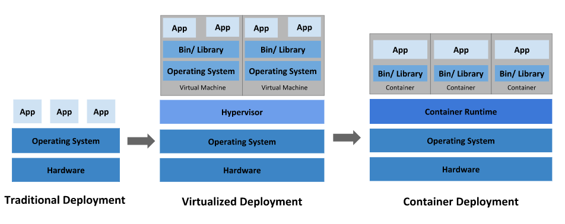
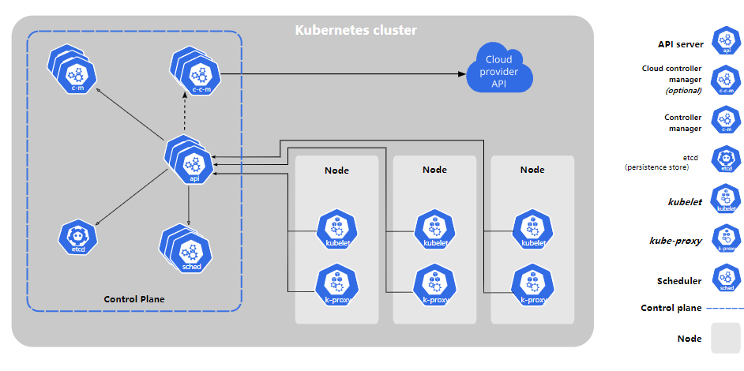

# Kubernetes

- **[集群环境搭建](集群环境搭建.md)**
- **[资源管理](资源管理.md)**
- **[Pod](Pod.md)**
- **[控制器](控制器.md)**
- **[流量负载](流量负载.md)**
- **[数据存储](数据存储.md)**
- **[安全认证](安全认证)**
- [Tutorials](Tutorials.md)

## Kubernetes介绍

#### 应用部署方式演变

**传统部署时代：**

- 优点：部署简单，无其他技术要求
-  缺点：资源不可隔离，如果一台机器部署了多个应用，某个应用故障导致资源占用大，会殃及其他应用

**虚拟化部署时代：**

- 优点：资源隔离，提供了一定程度的安全性
- 缺点：增加了操作系统，浪费了部分资源，虚拟机管理不够简单

**容器部署时代：**

- 优点：
  - 每个容器的资源隔离，又共享了宿主机的底层基础架构
  - 敏捷应用程序的创建和部署：与使用 VM 镜像相比，提高了容器镜像创建的简便性和效率
  -  持续开发、集成和部署：通过快速简单的回滚（由于镜像不可变性），支持可靠且频繁的 容器镜像构建和部署
  - 关注开发与运维的分离：在构建/发布时而不是在部署时创建应用程序容器镜像， 从而将应用程序与基础架构分离
  - 可观察性：不仅可以显示操作系统级别的信息和指标，还可以显示应用程序的运行状况和其他指标信号
  - 跨开发、测试和生产的环境一致性：在便携式计算机上与在云中相同地运行
  - 跨云和操作系统发行版本的可移植性：可在 Ubuntu、RHEL、CoreOS、本地、 Google Kubernetes Engine 和其他任何地方运行
  - 以应用程序为中心的管理：提高抽象级别，从在虚拟硬件上运行 OS 到使用逻辑资源在 OS 上运行应用程序
  - 松散耦合、分布式、弹性、解放的微服务：应用程序被分解成较小的独立部分， 并且可以动态部署和管理 - 而不是在一台大型单机上整体运行
  - 资源隔离：可预测的应用程序性能
  - 资源利用：高效率和高密度

- 缺点：
  - 学习成本高

#### 容器化部署带来了新问题

- 如果一个容器挂了，怎么样另外一个容器立刻启动替补停机的容器？
- 当并发访问变大的时候，怎样做到横向扩展容器的数量？

#### Kubernetes简介

[官方简介](https://kubernetes.io/zh/docs/concepts/overview/what-is-kubernetes/)

#### Kubernetes组件

[官方文档](https://kubernetes.io/zh/docs/concepts/overview/components/)

