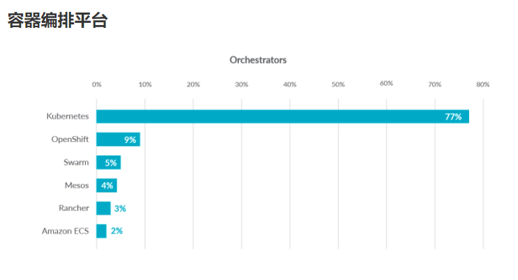
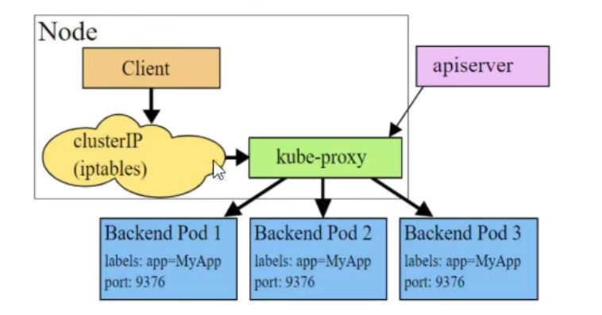
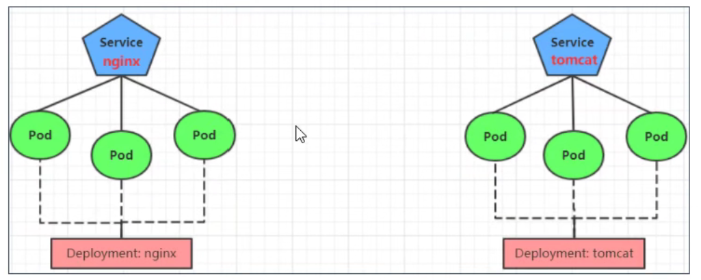
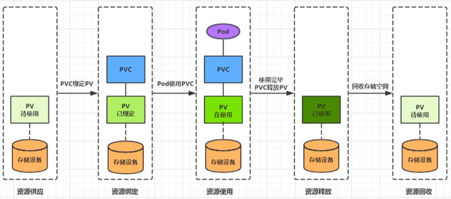
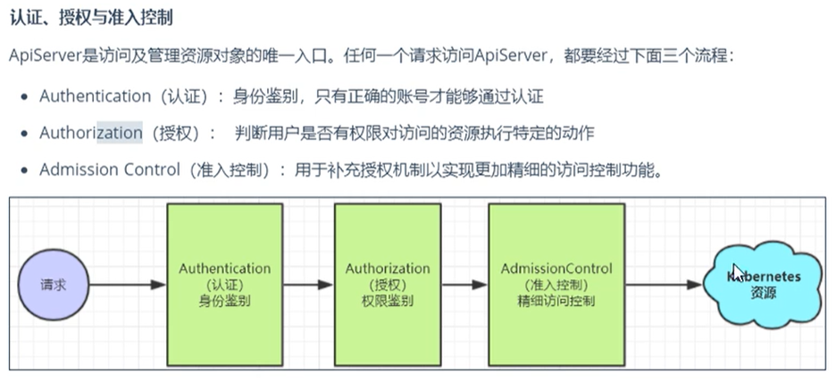

# Kubernetes

## Kubernetes介绍

#### 应用部署方式演变


**传统部署时代：**

- 优点：部署简单，无其他技术要求
-  缺点：资源不可隔离，如果一台机器部署了多个应用，某个应用故障导致资源占用大，会殃及其他应用

**虚拟化部署时代：**

- 优点：资源隔离，提供了一定程度的安全性
- 缺点：增加了操作系统，浪费了部分资源，虚拟机管理不够简单

**容器部署时代：**

- 优点：
  - 每个容器的资源隔离，又共享了宿主机的底层基础架构
  - 敏捷应用程序的创建和部署：与使用 VM 镜像相比，提高了容器镜像创建的简便性和效率
  -  持续开发、集成和部署：通过快速简单的回滚（由于镜像不可变性），支持可靠且频繁的 容器镜像构建和部署
  - 关注开发与运维的分离：在构建/发布时而不是在部署时创建应用程序容器镜像， 从而将应用程序与基础架构分离
  - 可观察性：不仅可以显示操作系统级别的信息和指标，还可以显示应用程序的运行状况和其他指标信号
  - 跨开发、测试和生产的环境一致性：在便携式计算机上与在云中相同地运行
  - 跨云和操作系统发行版本的可移植性：可在 Ubuntu、RHEL、CoreOS、本地、 Google Kubernetes Engine 和其他任何地方运行
  - 以应用程序为中心的管理：提高抽象级别，从在虚拟硬件上运行 OS 到使用逻辑资源在 OS 上运行应用程序
  - 松散耦合、分布式、弹性、解放的微服务：应用程序被分解成较小的独立部分， 并且可以动态部署和管理 - 而不是在一台大型单机上整体运行
  - 资源隔离：可预测的应用程序性能
  - 资源利用：高效率和高密度

- 缺点：
  - 学习成本高

#### 容器化部署带来了新问题

- 如果一个容器挂了，怎么样另外一个容器立刻启动替补停机的容器？
- 当并发访问变大的时候，怎样做到横向扩展容器的数量？

#### Kubernetes简介



[官方简介](https://kubernetes.io/zh/docs/concepts/overview/what-is-kubernetes/)

#### Kubernetes组件

[官方文档](https://kubernetes.io/zh/docs/concepts/overview/components/)


目录：

- [集群环境搭建](集群环境搭建.md)
- [资源管理](资源管理.md)
- [Pod](Pod.md)


## Pod控制器

#### Pod控制器介绍

按pod的被创建方式，可以分为两类：

- 自主式创建：k8s直接创建，这种pod删除后就没有了
- 控制器创建：通过控制器创建的pod，这种pod删除之后还会自动创建

> **`什么是Pod控制器`**
>
> ​    pod控制器是管理pod的中间层，使用pod控制之后，只需要告诉控制器我们需要什么样的pod，需要多少个，它就会创建出满足条件的pod并且确保每一个pod处于用户期望的状态，如果pod在运行中出现故障，控制器会基于指定的策略重启或者重建pod

#### ReplicaSet


```yaml
# 定义控制器
apiVersion: apps/v1
kind: ReplicaSet
metadata:
  name: pc-replica-set
  namespace: dev
  labels:
    app: replica-set-nginx
    
# 定义控制器元数据
spec:
  replicas: 3                                     # 副本数
  selector:
    matchLabels:                                  # 这里需要和pod的labels匹配
      app: replica-set-nginx
    # matchExpressions:
    # - {key: app, operator: In, values: ['nginx-replica-set']}
    
  # 定义pod创建模板
  template:
    metadata:
      name: pod-name-replica-set-nginx
      namespace: dev
      labels:
        app: replica-set-nginx
    spec:
      containers:
      - name: nginx1
        image: nginx
        imagePullPolicy: IfNotPresent
```

```sh
# 扩缩容方式一：
$ kubectl edit rs pc-replica-set -n dev

# 进入后修改replicas的数量后，wq保存退出即可
# 通过此方法也可以修改镜像版本等

# 扩缩容方式二：
$ kubectl scale rs pc-replica-set --replicas=2 -n dev
```


#### Deployment


Deployment主要功能：

- 支持ReplicaSet的所有功能
- **支持发布的停止、更新**
- **支持版本滚动更新和版本回退**

```yaml
apiVersion: apps/v1
kind: Deployment
metadata:
  name: pc-deployment
  namespace: dev
  labels:
    app: deployment-nginx
    
spec:
  replicas: 3                
  paused: false                           # deployment被创建后是否暂停pod的部署，默认false
  progressDeadlineSeconds: 600            # 部署超时时间(s)，默认600
  revisionHistoryLimit: 3                 # 保留历史版本，默认10
  minReadySeconds: 
  strategy:                               # 策略
    type: RollingUpdate                   # 滚动更新策略
    rollingUpdate:
      maxSurge: 30%                       # 最大额外可以存在的副本数，可以为百分比，也可以是整数
      maxUnavailable: 30%                 # 最大不可用状态的pod的最大值
  selector:
    matchLabels:                                  
      app: deployment-nginx
    # matchExpressions:
    # - {key: app, operator: In, values: ['nginx-replica-set']}

  template:
    metadata:
      name: pod-name-deployment-nginx
      namespace: dev
      labels:
        app: deployment-nginx
    spec:
      containers:
      - name: nginx1
        image: nginx
        imagePullPolicy: IfNotPresent
```

```sh
$ kubectl get deploy,rs,po -n dev

NAME                           READY   UP-TO-DATE   AVAILABLE   AGE
deployment.apps/deploy-nginx   0/3     3            0           15s
# UP-TO-DATE：目前在最新版本的pod数
# AVAILABLE：目前状态为可用的pod

NAME                                      DESIRED   CURRENT   READY   AGE
replicaset.apps/deploy-nginx-686b9c7f68   3         3         0       15s
# rs的名：deploy名 + 随机数

NAME                                READY   STATUS              RESTARTS   AGE
pod/deploy-nginx-686b9c7f68-d8bzv   0/1     ContainerCreating   0          15s
pod/deploy-nginx-686b9c7f68-jl9zh   0/1     ContainerCreating   0          15s
pod/deploy-nginx-686b9c7f68-ncsfm   0/1     ContainerCreating   0          15s
# pod名：rs名 + 随机数
```

##### 扩缩容

```sh
# 方式一
$ kubectl edit deploy pc-deployment -n dev

# 方式二
$ kubectl scale deploy pc-deployment --replicas=6 -n dev
```


##### 镜像更新

- 重建更新
- 滚动更新（默认）

```yaml
spec:
  strategy:
    type: RollingUpdate                # ReCreate/RollingUpdate(默认)
    rollingUpdate:                     # type: RollingUpdate 时才生效
      maxUnavailable: 25%
      maxSurge: 25%
```

测试

```sh
$ kubectl apply -f pc-deployment.yaml --record

# 更新版本
$ kubectl set image deploy pc-deployment nginx=nginx:1.17.1 -n dev

# 再次更新版本
$ kubectl set image deploy pc-deployment nginx=nginx:1.17.1 -n dev

# 查案版本信息
$ kubectl rollout history deploy pc-deployment -n dev
```


##### 版本回退

```sh
# 查看当前Deploy升级状态
$ kubectl rollout status deploy pc-deployment -n dev

# 查看升级历史记录
$ kubectl rollout history deploy pc-deployment -n dev

# 回退版本
$ kubectl rollout undo deploy pc-deployment --to-revision=1 -n dev 
```


##### 灰度发布

```sh
# 发布新版本后，立马暂停集群更新，此时旧版应用完整保留，并且创建多了一个新版本应用
$ kubectl set image deploy pc-deployment nginx=nginx:v1.17.2 -n dev \
&& kubectl rollout pause deploy pc-deployment -n dev

# 查看状态
$ kubectl rollout status deploy pc-deployment -n dev

# 现实正在等待更新

# 继续剩余更新
$ kubectl rollout resume deploy pc-deployment -n dev

# 查看rs信息
$ kubectl get rs -n dev

# 发现旧版rs的pod清零，新rs的pod全部启动成功
```


#### HPA

​    如果没有HPA，pod扩缩容的时候需要人工使用命令：`kubectl scale` 来完成，想要达到自动化，智能化，就需要HPA控制器

​    HPA可以获取每个pod的利用率，然后和HPA中定义的指标进行对比，同时计算出需要伸缩的具体值，最后实现pod数量的调整。


测试

```sh
# 1.安装metrics-server，用于收集指标信息

$ yum install git -y
$ git clone -b 0.3.6 metrics仓库
$ cd metrics-server/deploy/1.8+
$ vi metrics-server-deployment.yaml
```


```sh
# 修改完成后，安装metrics-server pod
$ kubectl apply -f ./

# 查看资源占用率
$ kubectl top pod -n dev


# 2.准备deployment和service

# 创建deployment
$ kubectl run nginx --image=nginx --requests=cpu=100m -n dev
# 创建service
$ kubectl expose deployment nginx --type=NodePort --port=80 -n dev

# 查看
$ kubectl get svc,deploy,po -n dev


# 3.部署HPA

--------------------- hpa.yaml
apiVersion: autoscaling/v1
kind: HorizontalPodAutoscaler
metadata:
  name: pc-hpa
  namespace: dev
spec:
  minReplicas: 1  # 最小pod数
  maxReplicas: 10 # 最大pod数
  targetCPUUtilizationPercentage: 3  # cpu使用率指标
  scaleTargetRef:
    apiVersion: apps/v1
    kind: Deployment     # 控制的是deploy
    name: nginx          # 控制的名为nginx的deploy
------------------------

# 创建hpa
$ kubectl create -f hpa.yaml

# 查看hpa
$ kubectl get hpa -n dev
```

#### DaemonSet (DS)


```yaml
apiVersion: apps/v1
kind: DaemonSet
metadata:
  name: ds-test
  namespace: dev
spec:
  revisionHistoryLimit: 3     # 保留的历史版本
  updateStrategy: 
    type: RollingUpdate
    rollingUpdate:
      maxUnavailable: 1
    selector:
      matchLables:
        app: ds-log-app
  template:
    metadata:
      labels:
        app: ds-log-app
    spec:
      containers:
      -
```

#### Job


## 流量负载

K8S的流量负载组件：

- Service：4层负载
- Ingress：7层负载

#### Service

##### 介绍


> **kube-proxy**
>
> ​    Service很多情况下只是一个概念，真正起作用的是`kube-proxy`服务进程，每个node节点上都运行着一个`kube-proxy`服务进程，当创建Service的时候通过api-server向etcd写入创建的service信息，而`kube-proxy`会基于监听的机制发现这种service的变化，然后它会将最新的service信息转换成对应的访问规则


kube-proxy支持三种工作模式：

- **userspace模式**

  - kube-proxy会为每一个service创建一个监听端口，发向clusterIP的请求被iptables（在内核空间）规则重定向到kube-proxy监听的端口上，kube-proxy根据LB算法选择一个提供服务的pod并和其建立连接，以将请求转发到pod上。
  - 该模式下，kube-proxy充当于一个4层的负载均衡器的角色。由于kube-proxy运行在userspace(用户空间)中，在进行转发处理时增加内核和用户空间的数据拷贝，虽然稳定，但是效率较低。
  - 

- **iptables模式（默认）**

  - kube-proxy为service后端的每个pod创建对应的iptables规则，直接将clusterIP的请求重定向到一个podIP
  - iptables的LB策略不够灵活，没有重试机制
  - 

- **ipvs模式（最佳）**

  - ipvs的转发效率比iptables更高，ipvs支持更多的LB算法

  - 

  - ```sh
    # 此模式必须安装ipvs内核模块
    # 开启ipvs
    $ kubectl edit cm kube-proxy -n kube-system
    # 修改配置项：mode: "ipvs"
    
    # 删除当前的pod让他重建
    $ kubectl delete pod -l k8s-app=kube-proxy -n kube-system
    # -l k8s-app=kube-proxy 按标签k8s-app=kube-proxy来选择
    
    # 查看
    ipvsadm -Ln
    ```


##### 类型

```yaml
kind: Service
metadata:
  name: service-name
  namespace: dev
spec:
  selector:
    app: deploy-nginx
  type:  # Service类型，制定Service的访问方式
  clusterIP: # 虚拟服务的ip地址，如果不写默认分配
  sessionAffinity: # session亲和性，支持ClusterIP、None两个选项。ClusterIP会让同一个ip访问固定的pod
  ports:
  - port: 3017 # service端口
    targetPort: 5003 # pod端口
    nodePort: 31192 # 主机端口
```

type的类型：

- ClusterIP：只能在集群内访问
- NodePort：在集群外部访问内部服务
- LoadBalancer：
- ExternalName：
- headLess：无头类型，将type设置成ClusterIP，然后clusterIP设置成None

##### 使用

**HeadLess**

用于自定义负载策略

```sh
# 随机进入一台服务内的pod
$ kubectl exec -it pod-name -n dev /bin/bash

# 查看默认域名解析器
$ cat /etc/resolv.conf

# 
dig @默认域名 service名称.命名空间.svc.cluster.local
```

**NodePort**

将service的端口映射到node的端口上


**LoadBalancer**

跟NodePort类似，目的都是向外暴露一个端口，区别在于LoadBalancer会在集群外部再做一个负载均衡设备，而这个设备需要外部环境的支持，外部服务发送到这个设备上的请求，会被设备负载之后转发到集群中


**ExternalName**


#### Ingress

##### 环境搭建

```sh
$ mkdir ingress-controller
$ cd ingress-controller

# 下载ingress-nginx
$ wget .../mandatory.yaml
$ wget .../service-nodeport.yaml

# 修改仓库镜像源

# 创建ingress-nginx
$ kubectl apply -f ./

# 查看ingress-nginx
$ kubectl get po -n ingress-nginx

# 查看service
$ kubectl get svc -n ingress-nginx
```

##### 搭建服务



注意：tomcat版本使用：tomcat:8.5-jre10-slim（这个版本带默认首页）

##### HTTP代理 

```sh
apiVersion: extensions/v1beta1
kind: Ingress
metadata:
  name: ingress-http
  namespace: dev
spec:
  rules:
  - host: nginx.web.com
    http:
      paths:
      - path: /
        backend: 
          serviceName: nginx-service
          servicePort: 80
  - host: tomcat.web.com
    http:										
      paths:
      - path: /
        backend:
          serviceName: tomcat-service
          servicePort: 80
```

## 数据存储

kubernetes的volumn支持多种类型：

- 简单存储：EmptyDir、HostPath、NFS
- 高级存储：PV、PVC
- 配置存储：ConfigMap、Secret

#### 基本存储

##### EmptyDir

EmptyDir是最基础的Volume类型，一个EmptyDir就是Host上的一个空目录

无需指定宿主机上对应的目录文件，因为k8s会自动分配一个目录，**当pod销毁时，EmptyDir中的数据也会永久删除**

```sh
------------------- pod-emptyDir.yaml
apiVersion: v1
kind: Pod
metadata:
  name: pod-volume
  namespace: dev
spec:
  containers:
  - name: nginx
    image: nginx:latest
    ports:
    - containerPort: 80
    volumeMounts:
    - name: log-volume
      mountPath: /var/log/nginx
  - name: busybox
    image: busybox:latest
    command: ['/bin/sh','-c','tail -f /logs/access.log']
    volumeMounts:
    - name: log-volume
      mountPath: /logs
  volumes:
  - name: log-volume
    emptyDir: {}
---------------------------

# 创建pod
kubectl apply -f pod-volume.yaml

# 通过podIP访问
# 查看指定容器的标准输出
$ kubectl logs -f pod-volume -n dev -c busybox

10.244.1.0 - - [06/Sep/2021:15:54:01 +0000] "GET / HTTP/1.1" 200 612 "-" "curl/7.61.1" "-"
```


##### HostPath

想要简单的将数据持久化到主机中，可以选择`HostPath`，`HostPath`就是将Node中一个实际目录挂载到Pod上


```sh
------------------- pod-hostpath.yaml
apiVersion: v1
kind: Pod
metadata:
  name: pod-volume
  namespace: dev
spec:
  containers:
  - name: nginx
    image: nginx:latest
    ports:
    - containerPort: 80
    volumeMounts:
    - name: log-volume
      mountPath: /var/log/nginx
  - name: busybox
    image: busybox:latest
    command: ['/bin/sh','-c','tail -f /logs/access.log']
    volumeMounts:
    - name: log-volume
      mountPath: /logs
  volumes:
  - name: log-volume
    hostPath: 
      path: /root/logs
      type: DirectoryOrCreate    # 目录存在就使用，不存在就创建
---------------------------

# 测试同上
# 进入pod部署的接Node查看目录已经被创建
# 删除pod后发现数据还在
```


##### NFS

`HostPath`可以解决数据持久化问题，但是一旦Node节点故障了，Pod如果转移到了别的节点，又会出现问题，此时需要准备单独的网路存储系统，比较常用的有NFS、CIFS

`NFS`是一个网络文件存储系统，可以搭建一台`NFS`服务器，然后将Pod中的存储直接连接到`NFS`系统上


```sh
# 1. 准备NFS服务器（在master上安装nfs是为了测试）
 
# 安装
$ yum install nfs-utils -y

# 准备一个共享目录
$ mkdir /root/data/nfs -pv

# 将共享目录以读写权限暴露给需要的网段的所有主机
$ vi /etc/exports

/root/data/nfs 192.168.177.0/24(rw,no_root_squash)

# 启动nfs服务
systemctl start nfs

# 2. 在其他节点上安装nfs驱动工具

# 安装
$ yum install nfs-utils -y

# 3. 编写pod

---------------- pod-nfs.yaml
apiVersion: v1
kind: Pod
metadata:
  name: pod-volume
  namespace: dev
spec:
  containers:
  - name: nginx
    image: nginx:latest
    ports:
    - containerPort: 80
    volumeMounts:
    - name: log-volume
      mountPath: /var/log/nginx
  - name: busybox
    image: busybox:latest
    command: ['/bin/sh','-c','tail -f /logs/access.log']
    volumeMounts:
    - name: log-volume
      mountPath: /logs
  volumes:
  - name: log-volume
    nfs: 
      server: 192.168.177.100  # nfs服务器地址
      path: /root/data/nfs    # 共享文件路径
---------------------------

# 4. 测试同上，最后看看/root/data/nfs是否有文件
```


#### 高级存储

##### PV和PVC

`NFS`虽然可以提供存储，但是要求用户会搭建`NFS`系统，并且会在yaml配置。k8s为了方便用户使用，屏蔽存储实现的细节，引入`PV`和`PVC`两种资源对象

- `PV`(Persistent Volume) 持久化卷，是对底层共享存储的一种抽象。一般情况`PV`由k8s管理员进行创建和配置，通过插件完成与共享存储的对接
- `PVC`(Persistent Volume Claim) 持久化卷声明，是用户对于存储需求的一种声明。其实就是用户向k8s系统发送出的一种资源需求申请


使用了PV和PVC之后，工作可以得到进一步的细分：

- 存储：存储工程师维护
- PV：k8s管理员维护
- PVC：k8s用户维护


##### PV

PV是存储资源的抽象

```yaml
apiVersion: v1
kind: PersistentVolume
metadata:
  name: pv1
spec:
  nfs:  # 存储类型的配置，与底层真正存储对应
  capacity:  # 容量
    storage: 2Gi
  accessModes:  #访问模式 (根据底层存储的不同，配置项有所不同)
  storageClassName:   # 存储类别，相当于给PC打标签
  persistentVolumeReclaimPolicy:   # 回收策略 (根据底层存储的不同，配置项有所不同)
  
 ------------
 # PV 是跨namespace的
 
 # accessModes 
 # - ReadWriteOnce (RWO): 读写权限，但是只能被单个节点挂载，PV只能被单个PVC挂载
 # - ReadOnlyMany (ROM): 只读权限，可以被多个节点挂载
 # - ReadWriteMany (RWM): 读写权限，可以被多个节点挂载
 
 # persistentVolumeReclaimPolicy
 # - Retain 保留数据
 # - Recycle 清楚PV中的数据
 # - Delete 后端存储删除 vloume 
 
 # storageClassName
 # - 具有特定类别的PV只能与请求了该类别的PVC进行绑定
 # - 为设定类别的PV只能与不请求任何类别的PVC进行绑定
 
# 状态：一个PV的生命周期中的不同阶段
# - Available：可用状态，还未被任何PVC绑定
# - Bound：已绑定状态
# - Released：PVC被删除，但是资源还未被集群重新声明
# - Failed：PV的自动回收失败
```

测试

```sh
# 创建共享目录
$ mkdir /root/data/{pv1,pv2,pv3} -pv

# 暴露服务
$ vi /etc/exports

/root/data/pv1 nfsIP(rw,no_root_squash)
/root/data/pv2 nfsIP(rw,no_root_squash)
/root/data/pv3 nfsIP(rw,no_root_squash)

# 重启服务
$ systemctl restart nfs

# 创建 pv.yaml

apiVersion: v1
kind: PersistentVolume
metadata:
  name: pv1
spec:
  nfs:  
  capacity:  
    storage: 1Gi
  accessModes: ['ReadWriteMany']
  persistentVolumeReclaimPolicy: Retain
---
apiVersion: v1
kind: PersistentVolume
metadata:
  name: pv2
spec:
  nfs:  
  capacity:  
    storage: 2Gi
  accessModes: ['ReadWriteMany']
  persistentVolumeReclaimPolicy: Retain
---
apiVersion: v1
kind: PersistentVolume
metadata:
  name: pv3
spec:
  nfs:  
  capacity:  
    storage: 3Gi
  accessModes: ['ReadWriteMany']
  persistentVolumeReclaimPolicy: Retain
  
# 创建pv
# 查看结果
$ kubectl get pv -o wide
```


##### PVC

```yaml
# 资源清单

apiVersion: v1
kind: PersistentVolumeClaim
metadata:
  name: pv1
spec: 
  selector:  # 采用标签选择PV
  resources: 
    requests:
      storage: 2Gi
  accessModes: 
  storageClassName:  
```

测试

```sh
# 创建使用pv的 pvc.yaml

apiVersion: v1
kind: PersistentVolumeClaim
metadata:
  name: pvc1
  namepsace: dev
spec:
  accessModes: ['ReadWriteMany']
  resources:
    requests:
      storage: 1Gi
---
apiVersion: v1
kind: PersistentVolumeClaim
metadata:
  name: pvc2
  namepsace: dev
spec:
  accessModes: ['ReadWriteMany']
  resources:
    requests:
      storage: 1Gi
---
apiVersion: v1
kind: PersistentVolumeClaim
metadata:
  name: pvc3
  namepsace: dev
spec:
  accessModes: ['ReadWriteMany']
  resources:
    requests:
      storage: 5Gi  # 测试
      
# 创建pvc
# 查看结果
$ kubectl get pvc -o wide

# pvc3创建失败
# pc3的状态是Available


# 创建使用pvc的pod

...
spec:
  containers:
  - name: busybox
    image: busybox:latest
    commands: ['/bin/sh','-c','while true;do echo pod1 >> /root/out.txt;sleep 2;done;']
    volumeMouts:
    - name: volume
      mountPath: /root/
  volumes:
  - name: volume
    persistentVolumeClaim:
      claimName: pvc1
      readOnly: false
        
...
```


##### 生命周期



注意：在资源释放状态时，PV还不能立马被使用，因为PV还有数据残留在存储设备上，只有在清除之后该PV才能再次使用


#### 配置存储

##### ConfigMap

用于存储配置信息

```yaml
# 配置清单

apiVersion: v1
kind: ConfigMap
metadata:
  name: configMap
  namepsace: dev
data:
  info:  # 被挂载后会被用于生成文件名
    username: admin
    password: 123
```

测试

```sh
# 挂载cm的pod

apiVersion: v1
kind: Pod
metadata:
  name: pod-cm
  namespace: dev
spec:
  containers:
  - name: nginx
    image: nginx:latest
    volumeMounts:
    - name: configMap1
      mountPath: /configMap/config
  volumes:
    name: configMap1
    configMap:
      name: configMap  # 在k8s中已存在的configMap
      
# 支持动态修改配置
$ kubectl edit cm configMap -n dev
```


##### Secret

ConfigMap以明文的形式存储，Secret用于存储敏感信息，密码、秘钥、证书等

```yaml
# 资源清单

apiVersion: v1
kind: Secret
metadata:
  name: secret
  namepsace: dev
type: Opaque
data:
  username: YWRtaW4=  # base64
  password: MTIz 
```


测试

```sh
# base64存储值
$ echo -n 'admin' | base64
$ echo -n 'admin' | 123

# 最后挂载后，进入挂载目录后值被自动解码
```


## 安全认证

