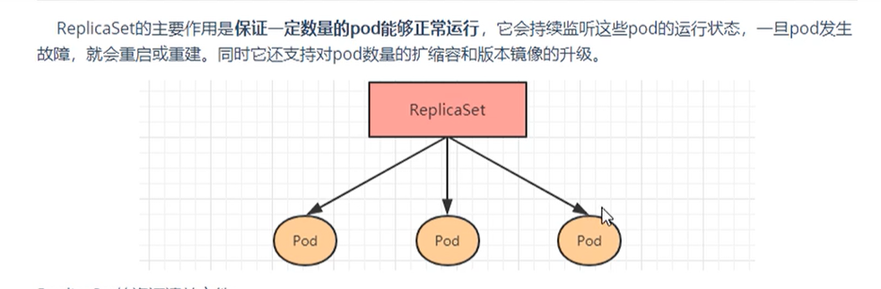
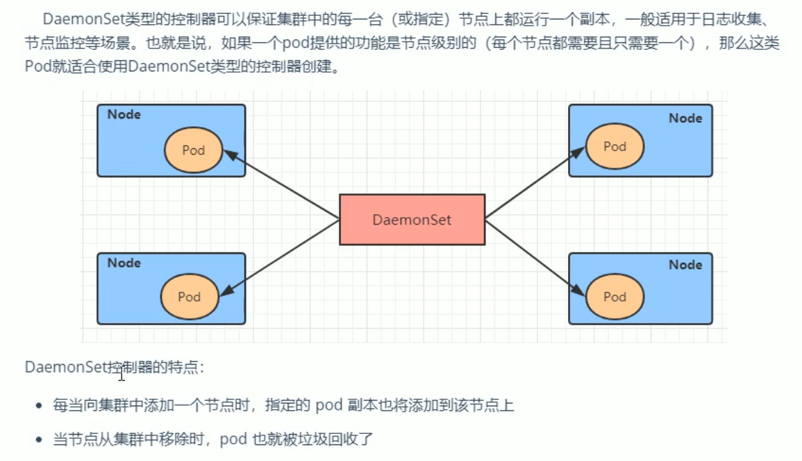

# 控制器

#### 控制器介绍

按pod的被创建方式，可以分为两类：

- 自主式创建：k8s直接创建，这种pod删除后就没有了
- 控制器创建：通过控制器创建的pod，这种pod删除之后还会自动创建

> **`什么是Pod控制器`**
>
> ​    pod控制器是管理pod的中间层，使用pod控制之后，只需要告诉控制器我们需要什么样的pod，需要多少个，它就会创建出满足条件的pod并且确保每一个pod处于用户期望的状态，如果pod在运行中出现故障，控制器会基于指定的策略重启或者重建pod

#### ReplicaSet



```yaml
# 定义控制器
apiVersion: apps/v1
kind: ReplicaSet
metadata:
  name: pc-replica-set
  namespace: dev
  labels:
    app: replica-set-nginx
    
# 定义控制器元数据
spec:
  replicas: 3                                     # 副本数
  selector:
    matchLabels:                                  # 这里需要和pod的labels匹配
      app: replica-set-nginx
    # matchExpressions:
    # - {key: app, operator: In, values: ['nginx-replica-set']}
    
  # 定义pod创建模板
  template:
    metadata:
      name: pod-name-replica-set-nginx
      namespace: dev
      labels:
        app: replica-set-nginx
    spec:
      containers:
      - name: nginx1
        image: nginx
        imagePullPolicy: IfNotPresent
```

```sh
# 扩缩容方式一：
$ kubectl edit rs pc-replica-set -n dev

# 进入后修改replicas的数量后，wq保存退出即可
# 通过此方法也可以修改镜像版本等

# 扩缩容方式二：
$ kubectl scale rs pc-replica-set --replicas=2 -n dev
```


#### Deployment


Deployment主要功能：

- 支持ReplicaSet的所有功能
- **支持发布的停止、更新**
- **支持版本滚动更新和版本回退**

```yaml
apiVersion: apps/v1
kind: Deployment
metadata:
  name: pc-deployment
  namespace: dev
  labels:
    app: deployment-nginx
    
spec:
  replicas: 3                
  paused: false                           # deployment被创建后是否暂停pod的部署，默认false
  progressDeadlineSeconds: 600            # 部署超时时间(s)，默认600
  revisionHistoryLimit: 3                 # 保留历史版本，默认10
  minReadySeconds: 
  strategy:                               # 策略
    type: RollingUpdate                   # 滚动更新策略
    rollingUpdate:
      maxSurge: 30%                       # 最大额外可以存在的副本数，可以为百分比，也可以是整数
      maxUnavailable: 30%                 # 最大不可用状态的pod的最大值
  selector:
    matchLabels:                                  
      app: deployment-nginx
    # matchExpressions:
    # - {key: app, operator: In, values: ['nginx-replica-set']}

  template:
    metadata:
      name: pod-name-deployment-nginx
      namespace: dev
      labels:
        app: deployment-nginx
    spec:
      containers:
      - name: nginx1
        image: nginx
        imagePullPolicy: IfNotPresent
```

```sh
$ kubectl get deploy,rs,po -n dev

NAME                           READY   UP-TO-DATE   AVAILABLE   AGE
deployment.apps/deploy-nginx   0/3     3            0           15s
# UP-TO-DATE：目前在最新版本的pod数
# AVAILABLE：目前状态为可用的pod

NAME                                      DESIRED   CURRENT   READY   AGE
replicaset.apps/deploy-nginx-686b9c7f68   3         3         0       15s
# rs的名：deploy名 + 随机数

NAME                                READY   STATUS              RESTARTS   AGE
pod/deploy-nginx-686b9c7f68-d8bzv   0/1     ContainerCreating   0          15s
pod/deploy-nginx-686b9c7f68-jl9zh   0/1     ContainerCreating   0          15s
pod/deploy-nginx-686b9c7f68-ncsfm   0/1     ContainerCreating   0          15s
# pod名：rs名 + 随机数
```

##### 扩缩容

```sh
# 方式一
$ kubectl edit deploy pc-deployment -n dev

# 方式二
$ kubectl scale deploy pc-deployment --replicas=6 -n dev
```


##### 镜像更新

- 重建更新
- 滚动更新（默认）

```yaml
spec:
  strategy:
    type: RollingUpdate                # ReCreate/RollingUpdate(默认)
    rollingUpdate:                     # type: RollingUpdate 时才生效
      maxUnavailable: 25%
      maxSurge: 25%
```

测试

```sh
$ kubectl apply -f pc-deployment.yaml --record

# 更新版本
$ kubectl set image deploy pc-deployment nginx=nginx:1.17.1 -n dev

# 再次更新版本
$ kubectl set image deploy pc-deployment nginx=nginx:1.17.1 -n dev

# 查案版本信息
$ kubectl rollout history deploy pc-deployment -n dev
```


##### 版本回退

```sh
# 查看当前Deploy升级状态
$ kubectl rollout status deploy pc-deployment -n dev

# 查看升级历史记录
$ kubectl rollout history deploy pc-deployment -n dev

# 回退版本
$ kubectl rollout undo deploy pc-deployment --to-revision=1 -n dev 
```


##### 灰度发布

```sh
# 发布新版本后，立马暂停集群更新，此时旧版应用完整保留，并且创建多了一个新版本应用
$ kubectl set image deploy pc-deployment nginx=nginx:v1.17.2 -n dev \
&& kubectl rollout pause deploy pc-deployment -n dev

# 查看状态
$ kubectl rollout status deploy pc-deployment -n dev

# 现实正在等待更新

# 继续剩余更新
$ kubectl rollout resume deploy pc-deployment -n dev

# 查看rs信息
$ kubectl get rs -n dev

# 发现旧版rs的pod清零，新rs的pod全部启动成功
```


#### HPA

​    如果没有HPA，pod扩缩容的时候需要人工使用命令：`kubectl scale` 来完成，想要达到自动化，智能化，就需要HPA控制器

​    HPA可以获取每个pod的利用率，然后和HPA中定义的指标进行对比，同时计算出需要伸缩的具体值，最后实现pod数量的调整。


测试

```sh
# 1.安装metrics-server，用于收集指标信息

$ yum install git -y
$ git clone -b 0.3.6 metrics仓库
$ cd metrics-server/deploy/1.8+
$ vi metrics-server-deployment.yaml
```


```sh
# 修改完成后，安装metrics-server pod
$ kubectl apply -f ./

# 查看资源占用率
$ kubectl top pod -n dev


# 2.准备deployment和service

# 创建deployment
$ kubectl run nginx --image=nginx --requests=cpu=100m -n dev
# 创建service
$ kubectl expose deployment nginx --type=NodePort --port=80 -n dev

# 查看
$ kubectl get svc,deploy,po -n dev


# 3.部署HPA

--------------------- hpa.yaml
apiVersion: autoscaling/v1
kind: HorizontalPodAutoscaler
metadata:
  name: pc-hpa
  namespace: dev
spec:
  minReplicas: 1  # 最小pod数
  maxReplicas: 10 # 最大pod数
  targetCPUUtilizationPercentage: 3  # cpu使用率指标
  scaleTargetRef:
    apiVersion: apps/v1
    kind: Deployment     # 控制的是deploy
    name: nginx          # 控制的名为nginx的deploy
------------------------

# 创建hpa
$ kubectl create -f hpa.yaml

# 查看hpa
$ kubectl get hpa -n dev
```

#### DaemonSet (DS)



```yaml
apiVersion: apps/v1
kind: DaemonSet
metadata:
  name: ds-test
  namespace: dev
spec:
  revisionHistoryLimit: 3     # 保留的历史版本
  updateStrategy: 
    type: RollingUpdate
    rollingUpdate:
      maxUnavailable: 1
    selector:
      matchLables:
        app: ds-log-app
  template:
    metadata:
      labels:
        app: ds-log-app
    spec:
      containers:
      -
```

#### Job

