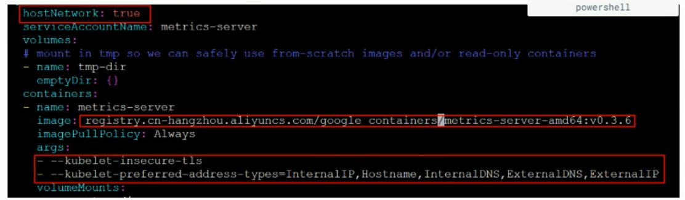

# 控制器

## 控制器介绍

按pod的被创建方式，可以分为两类：

- 自主式创建：k8s直接创建，这种pod删除后就没有了
- 控制器创建：通过控制器创建的pod，这种pod删除之后还会自动创建

> **`什么是Pod控制器`**
>
> ​    pod控制器是管理pod的中间层，使用pod控制之后，只需要告诉控制器我们需要什么样的pod，需要多少个，它就会创建出满足条件的pod并且确保每一个pod处于用户期望的状态，如果pod在运行中出现故障，控制器会基于指定的策略重启或者重建pod

## ReplicaSet


```yaml
# 定义控制器
apiVersion: apps/v1
kind: ReplicaSet
metadata:
  name: pc-replica-set
  namespace: dev
  labels:
    app: replica-set-nginx
    
# 定义控制器元数据
spec:
  replicas: 3                                     # 副本数
  selector:
    matchLabels:                                  # 这里需要和pod的labels匹配
      app: replica-set-nginx
    # matchExpressions:
    # - {key: app, operator: In, values: ['nginx-replica-set']}
    
  # 定义pod创建模板
  template:
    metadata:
      name: pod-name-replica-set-nginx
      namespace: dev
      labels:
        app: replica-set-nginx
    spec:
      containers:
      - name: nginx1
        image: nginx
        imagePullPolicy: IfNotPresent
```

```sh
# 扩缩容方式一：
$ kubectl edit rs pc-replica-set -n dev

# 进入后修改replicas的数量后，wq保存退出即可
# 通过此方法也可以修改镜像版本等

# 扩缩容方式二：
$ kubectl scale rs pc-replica-set --replicas=2 -n dev
```


## Deployment


Deployment主要功能：

- 支持ReplicaSet的所有功能
- **支持发布的停止、更新**
- **支持版本滚动更新和版本回退**

```yaml
apiVersion: apps/v1
kind: Deployment
metadata:
  name: pc-deployment
  namespace: dev
  labels:
    app: deployment-nginx
    
spec:
  replicas: 3                
  paused: false                           # deployment被创建后是否暂停pod的部署，默认false
  progressDeadlineSeconds: 600            # 部署超时时间(s)，默认600
  revisionHistoryLimit: 3                 # 保留历史版本，默认10
  minReadySeconds:                        # 指定新创建的pod在没有任何容器崩溃的情况下视为Ready最小秒数，默认为0，即一旦创建就表示可用（原本是配合livenessProbe部署启动耗时长的应用，被startupProbe替代？）
  strategy:                               # 策略
    type: RollingUpdate                   # 滚动更新策略
    rollingUpdate:
      maxSurge: 25%                       # 最大额外可以存在的副本数，可以为百分比，也可以是整数
      maxUnavailable: 25%                 # 最大不可用状态的pod的最大值
  selector:
    matchLabels:                                  
      app: deployment-nginx
    # matchExpressions:
    # - {key: app, operator: In, values: ['nginx-replica-set']}

  template:
    metadata:
      name: pod-name-deployment-nginx
      namespace: dev
      labels:
        app: deployment-nginx
    spec:
      containers:
      - name: nginx1
        image: nginx
        imagePullPolicy: IfNotPresent
```

```sh
$ kubectl get deploy,rs,po -n dev

NAME                           READY   UP-TO-DATE   AVAILABLE   AGE
deployment.apps/deploy-nginx   0/3     3            0           15s
# UP-TO-DATE：目前在最新版本的pod数
# AVAILABLE：目前状态为可用的pod

NAME                                      DESIRED   CURRENT   READY   AGE
replicaset.apps/deploy-nginx-686b9c7f68   3         3         0       15s
# rs的名：deploy名 + 随机数

NAME                                READY   STATUS              RESTARTS   AGE
pod/deploy-nginx-686b9c7f68-d8bzv   0/1     ContainerCreating   0          15s
pod/deploy-nginx-686b9c7f68-jl9zh   0/1     ContainerCreating   0          15s
pod/deploy-nginx-686b9c7f68-ncsfm   0/1     ContainerCreating   0          15s
# pod名：rs名 + 随机数
```

### 扩缩容

```sh
# 方式一：edit replicas number
$ kubectl edit deploy [deployName]

# 方式二：
$ kubectl scale deploy [deployName] --replicas=[num]
```


### 镜像更新

#### 滚动更新 RollingUpdate

滚动更新是默认的更新方式，按照指定的滚动策略，更新时先创建新RS，按策略在新RS中增加Pod副本数，在旧RS中减少Pod副本数，直至新RS中的Pod达到预期值

> 注意：当改了`spec.template`里面的东西会生成新的 `RS`，只修改`replicas`不会创建新`RS`

```yaml
spec:
  strategy:
    type: RollingUpdate                # ReCreate/RollingUpdate(默认)
    rollingUpdate:                     # type: RollingUpdate 时才生效
      maxUnavailable: 25%
      maxSurge: 25%
      
 

# 更新方式一：
# kubectl edit deploy [deployName]

# 更新方式二：
# --record                              # 记录详细更新步骤
# kubectl set image deploy [deployName] [containerName]=[newImage]
```

测试

```sh
$ kubectl apply -f pc-deployment.yaml --record

# 更新版本
$ kubectl set image deploy pc-deployment nginx=nginx:1.17.1 -n dev

# 再次更新版本
$ kubectl set image deploy pc-deployment nginx=nginx:1.17.1 -n dev

# 查案版本信息
$ kubectl rollout history deploy pc-deployment -n dev
```


#### 重建更新 Recreate

先全部删除旧的，再创建新的


#### 暂停更新

`kubectl edit`可以一次修改多个配置同时更新，而使用`kubectl set` 命令时只能更新一个配置，所以需要先设置Depoy暂停更新，等多次修改配置后，再让Deploy触发一次更新

```sh
# 暂停更新
# kubectl rollout pause deploy [deployName]
```


#### 恢复更新

```sh
# kubectl rollout resume deploy [deployName]
```


测试

```sh
$ kubectl rollout pause deploy nginx
$ kubectl set image deploy nginx nginx=nginx:latest --record
$ kubectl set image resources nginx -c nginx --limits=cpu=200m,memory=128Mi --record
$ kubectl rollout resume deploy nginx
```


### 版本回退

```sh
# 查看当前Deploy升级状态
# kubectl rollout status deploy [deployName]

# 查看升级历史记录
# --revision                # 查看指定版本的详细信息
# kubectl rollout history deploy [deployName]

# 回退版本
# --to-revision             # 回退到指定版本
# kubectl rollout undo deploy [deployName]
```


### 灰度发布

```sh
# 发布新版本后，立马暂停集群更新，此时旧版应用完整保留，并且创建多了一个新版本应用
$ kubectl set image deploy pc-deployment nginx=nginx:v1.17.2 -n dev \
&& kubectl rollout pause deploy pc-deployment -n dev

# 查看状态
$ kubectl rollout status deploy pc-deployment -n dev

# 现实正在等待更新

# 继续剩余更新
$ kubectl rollout resume deploy pc-deployment -n dev

# 查看rs信息
$ kubectl get rs -n dev

# 发现旧版rs的pod清零，新rs的pod全部启动成功
```


## StatefulSet

​	主要用于管理有状态应用程序的工作负载API对象。比如生产中，可以部署ES集群、MongoDB集群或者需要持久化的RabbitMQ集群、Redis集群、Kafka集群等。Eureka的部署比较适合StatefulSet，可以给每个Eureka实例创建一个唯一且固定的标识符，并且每个Eureka实例无需配置多余的Service，其余SpringBoot应用可以直接通过Eureka的Headless Service（无头服务）进行注册

> Eureka 的资源名称为： eureka-0、eureka-1、eureka-2
>
> Service（Headless Service）名称为： eureka-svc
>
> Eureka 集群之间的通信方式：eureka-0.eureka-svc.NAMESPACE

​	StatefulSet为每个Pod维护了一个粘性持久标识，绑定了PVC，在重新调度时也会保留，如：Redis-Sentinel-0、Redis-Sentinel-1、Redis-Sentinel-2。而StatefulSet创建的Pod一般使用Headless Servic进行通信，它没有ClusterIP，它使用的是EndPoint进行通信


### 案例：部署主从模式Redis

​	StatefulSet的机制是当前一个Pod调度完成后才会顺序的调度下一个Pod，比如用一个名为redis-ms的StatefulSet部署主从架构的Redis，第一个容器启动时，它的标识符为redis-ms-0，并且Pod内主机名也是redis-ms-0，主机名为redis-ms-0的容器作为主节点，其余从节点，那么从节点的配置使用不会更改的主节点的无头服务，配置如下：

```sh
# redis-ms-0.redis-ms[.public-service.svc.cluster.local] 如果节点在同一命名空间下可以省略中括号内容
port 6379
slaveof redis-ms-0.redis-ms.public-service.svc.cluster.local 6379
...
```


### 注意事项

- StatefukSet管理的Pod所使用的的存储必须由PV提供
- 删除一个StatefukSet时，不能保证对Pod的终止，要在StatefukSet中实现Pod的有序和正常终止，可以在删除前将StatefukSet的副本缩减为0
- StatefukSet 目前使用Headless Service负责Pod的网络身份和通信，需要提前创建此服务

**测试**

```sh
apiVersion: v1
kind: Service
metadata:
  name: nginx-svc
  labels:
    app: nginx
spec:
  ports:
  - port: 80
    name: web
  clusterIP: None                   # 无头服务
  selector:
    app: nginx
---
apiVersion: apps/v1
kind: StatefulSet
metadata:
  name: nginx-sts
  labels:
    app: nginx
spec:
  serviceName: nginx-svc             # 必填，指向一个已经存在的service
  replicas: 2
  selector:
    matchLabels:                     # 这里需要和pod的labels匹配
      app: nginx
  template:
    metadata:
      labels:
        app: nginx
    spec:
      containers:
      - name: nginx
        image: nginx:latest
        ports:
        - containerPort: 80
          name: web
----------------------------------

$ kubectl get svc,sts,po

NAME                 TYPE        CLUSTER-IP   EXTERNAL-IP   PORT(S)   AGE
service/kubernetes   ClusterIP   10.96.0.1    <none>        443/TCP   6d20h
service/nginx-svc    ClusterIP   None         <none>        80/TCP    2m33s

NAME                        READY   AGE
statefulset.apps/nginx-ss   2/2     2m33s

NAME             READY   STATUS    RESTARTS   AGE
pod/nginx-sts-0   1/1     Running   0          2m33s
pod/nginx-sts-1   1/1     Running   0          2m25s

 
--------------------------- pod-busybox.yml
apiVersion: v1
kind: Pod
metadata:
  name: busybox
  namespace: default
spec:
  containers:
  - image: busybox:1.28                # 使用其他版本有可能无法连通service
    name: busybox
    command: ["sh","-c","sleep 3600"]    
-----------------------------------

# 创建
$ kubectl apply -f pod-busybox.yml

# 进入容器查看dns解析
$ kubectl exec -it busybox -- sh
$ nslookup nginx-sts-0.nginx-svc
$ ping nginx-sts-0.nginx-svc
```


### 镜像更新

```yaml
spec:
  updateStrategy:
    type: RollingUpdate                # 默认RollingUpdate，OnDelete
    rollingUpdate:                     # type: RollingUpdate 时才生效
      partition: 0                     # 默认0，如果为2，那么只更新大于序号>=2的Pod
      
# type
# 	RollingUpdate：Pods倒叙更新
# 	OnDelete：某个Pod被删除后才更新
```

**测试**

```sh
# 修改前面创建的nginx-sts副本数为5
# 修改partition: 2
# 查看pod数量变化
$ kubectl get po 

# 修改pod镜像的nginx版本为1.15.3

#  查看pod镜像区别
$ kubectl get po -oyaml | grep image

# 发现只有后三个Pod被更新了
```


### 删除

- 级联删除：删除sts同时删除pods
- 非级联删除（不建议）：`kubectl delete sts stsName --cascade=false`


## HPA

​    如果没有HPA，pod扩缩容的时候需要人工使用命令：`kubectl scale` 来完成，想要达到自动化，智能化，就需要HPA控制器

​    HPA可以获取每个pod的利用率，然后和HPA中定义的指标进行对比，同时计算出需要伸缩的具体值，最后实现pod数量的调整。


测试

```sh
# 1.安装metrics-server，用于收集指标信息

$ yum install git -y
$ git clone -b 0.3.6 metrics仓库
$ cd metrics-server/deploy/1.8+
$ vi metrics-server-deployment.yaml
```



```sh
# 修改完成后，安装metrics-server pod
$ kubectl apply -f ./

# 查看资源占用率
$ kubectl top pod -n dev


# 2.准备deployment和service

# 创建deployment
$ kubectl run nginx --image=nginx --requests=cpu=100m -n dev
# 创建service
$ kubectl expose deployment nginx --type=NodePort --port=80 -n dev

# 查看
$ kubectl get svc,deploy,po -n dev


# 3.部署HPA

--------------------- hpa.yaml
apiVersion: autoscaling/v1
kind: HorizontalPodAutoscaler
metadata:
  name: pc-hpa
  namespace: dev
spec:
  minReplicas: 1  # 最小pod数
  maxReplicas: 10 # 最大pod数
  targetCPUUtilizationPercentage: 3  # cpu使用率指标
  scaleTargetRef:
    apiVersion: apps/v1
    kind: Deployment     # 控制的是deploy
    name: nginx          # 控制的名为nginx的deploy
------------------------

# 创建hpa
$ kubectl create -f hpa.yaml

# 查看hpa
$ kubectl get hpa -n dev
```


## DaemonSet (DS)

守护进程集


```yaml
apiVersion: apps/v1
kind: DaemonSet
metadata:
  name: ds-test
  namespace: dev
spec:
  revisionHistoryLimit: 3     # 保留的历史版本
  updateStrategy: 
    type: RollingUpdate
    rollingUpdate:
      maxUnavailable: 1
    selector:
      matchLables:
        app: ds-log-app
  template:
    metadata:
      labels:
        app: ds-log-app
    spec:
      containers:
      -
```


### 案例

#### 集群存储

ceph、glusterd

#### CNI网络插件

calico

#### 日志收集

fluentd、logstash、filebeat

#### 监控

node exporter

#### 服务暴露

ingress


#### 镜像更新

生产中一般使用 OnDelete，先在不重要的节点删除pod，然后等新的pod启动后观察是否有问题

```yaml
updateStrategy: 
  type: OnDelete
```


## Job


