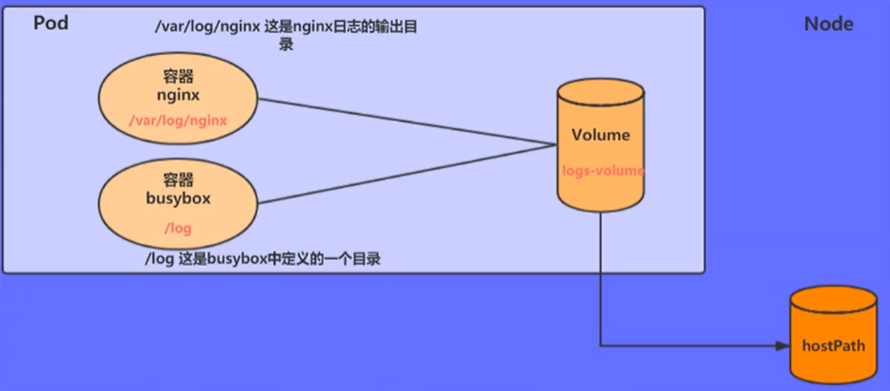
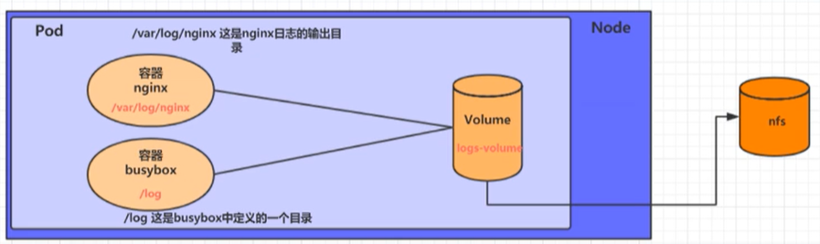

# 数据存储

kubernetes的volumn支持多种类型：

- 简单存储：EmptyDir、HostPath、NFS
- 高级存储：PV、PVC
- 配置存储：ConfigMap、Secret

## 基本存储

### EmptyDir

EmptyDir是最基础的Volume类型，一个EmptyDir就是Host上的一个空目录

无需指定宿主机上对应的目录文件，因为k8s会自动分配一个目录，**当pod销毁时，EmptyDir中的数据也会永久删除**

```sh
------------------- pod-emptyDir.yaml
apiVersion: v1
kind: Pod
metadata:
  name: pod-volume
  namespace: dev
spec:
  containers:
  - name: nginx
    image: nginx:latest
    ports:
    - containerPort: 80
    volumeMounts:
    - name: log-volume
      mountPath: /var/log/nginx
  - name: busybox
    image: busybox:latest
    command: ['/bin/sh','-c','tail -f /logs/access.log']
    volumeMounts:
    - name: log-volume
      mountPath: /logs
  volumes:
  - name: log-volume
    emptyDir: {}
---------------------------

# 创建pod
kubectl apply -f pod-volume.yaml

# 通过podIP访问
# 查看指定容器的标准输出
$ kubectl logs -f pod-volume -n dev -c busybox

10.244.1.0 - - [06/Sep/2021:15:54:01 +0000] "GET / HTTP/1.1" 200 612 "-" "curl/7.61.1" "-"
```


### HostPath

想要简单的将数据持久化到主机中，可以选择`HostPath`，`HostPath`就是将Node中一个实际目录挂载到Pod上



```sh
------------------- pod-hostpath.yaml
apiVersion: v1
kind: Pod
metadata:
  name: pod-volume
  namespace: dev
spec:
  containers:
  - name: nginx
    image: nginx:latest
    ports:
    - containerPort: 80
    volumeMounts:
    - name: log-volume
      mountPath: /var/log/nginx
  - name: busybox
    image: busybox:latest
    command: ['/bin/sh','-c','tail -f /logs/access.log']
    volumeMounts:
    - name: log-volume
      mountPath: /logs
  volumes:
  - name: log-volume
    hostPath: 
      path: /root/logs
      type: DirectoryOrCreate    # 目录存在就使用，不存在就创建
---------------------------

# 测试同上
# 进入pod部署的接Node查看目录已经被创建
# 删除pod后发现数据还在
```


### NFS

`HostPath`可以解决数据持久化问题，但是一旦Node节点故障了，Pod如果转移到了别的节点，又会出现问题，此时需要准备单独的网路存储系统，比较常用的有NFS、CIFS

`NFS`是一个网络文件存储系统，可以搭建一台`NFS`服务器，然后将Pod中的存储直接连接到`NFS`系统上



```sh
# 1. 准备NFS服务器（在master上安装nfs是为了测试）
 
# 安装
$ yum install nfs-utils -y

# 准备一个共享目录
$ mkdir /root/data/nfs -pv

# 将共享目录以读写权限暴露给需要的网段的所有主机
$ vi /etc/exports

/root/data/nfs 192.168.177.0/24(rw,no_root_squash)

# 启动nfs服务
systemctl start nfs

# 2. 在其他节点上安装nfs驱动工具

# 安装
$ yum install nfs-utils -y

# 3. 编写pod

---------------- pod-nfs.yaml
apiVersion: v1
kind: Pod
metadata:
  name: pod-volume
  namespace: dev
spec:
  containers:
  - name: nginx
    image: nginx:latest
    ports:
    - containerPort: 80
    volumeMounts:
    - name: log-volume
      mountPath: /var/log/nginx
  - name: busybox
    image: busybox:latest
    command: ['/bin/sh','-c','tail -f /logs/access.log']
    volumeMounts:
    - name: log-volume
      mountPath: /logs
  volumes:
  - name: log-volume
    nfs: 
      server: 192.168.177.100  # nfs服务器地址
      path: /root/data/nfs    # 共享文件路径
---------------------------

# 4. 测试同上，最后看看/root/data/nfs是否有文件
```


## 高级存储

### PV和PVC

`NFS`虽然可以提供存储，但是要求用户会搭建`NFS`系统，并且会在yaml配置。k8s为了方便用户使用，屏蔽存储实现的细节，引入`PV`和`PVC`两种资源对象

- `PV`(Persistent Volume) 持久化卷，是对底层共享存储的一种抽象。一般情况`PV`由k8s管理员进行创建和配置，通过插件完成与共享存储的对接
- `PVC`(Persistent Volume Claim) 持久化卷声明，是用户对于存储需求的一种声明。其实就是用户向k8s系统发送出的一种资源需求申请


使用了PV和PVC之后，工作可以得到进一步的细分：

- 存储：存储工程师维护
- PV：k8s管理员维护
- PVC：k8s用户维护


### PV

PV是存储资源的抽象

```yaml
apiVersion: v1
kind: PersistentVolume
metadata:
  name: pv1
spec:
  nfs:  # 存储类型的配置，与底层真正存储对应
  capacity:  # 容量
    storage: 2Gi
  accessModes:  #访问模式 (根据底层存储的不同，配置项有所不同)
  storageClassName:   # 存储类别，相当于给PC打标签
  persistentVolumeReclaimPolicy:   # 回收策略 (根据底层存储的不同，配置项有所不同)
  
 ------------
 # PV 是跨namespace的
 
 # accessModes 
 # - ReadWriteOnce (RWO): 读写权限，但是只能被单个节点挂载，PV只能被单个PVC挂载
 # - ReadOnlyMany (ROM): 只读权限，可以被多个节点挂载
 # - ReadWriteMany (RWM): 读写权限，可以被多个节点挂载
 
 # persistentVolumeReclaimPolicy
 # - Retain 保留数据
 # - Recycle 清楚PV中的数据
 # - Delete 后端存储删除 vloume 
 
 # storageClassName
 # - 具有特定类别的PV只能与请求了该类别的PVC进行绑定
 # - 为设定类别的PV只能与不请求任何类别的PVC进行绑定
 
# 状态：一个PV的生命周期中的不同阶段
# - Available：可用状态，还未被任何PVC绑定
# - Bound：已绑定状态
# - Released：PVC被删除，但是资源还未被集群重新声明
# - Failed：PV的自动回收失败
```

测试

```sh
# 创建共享目录
$ mkdir /root/data/{pv1,pv2,pv3} -pv

# 暴露服务
$ vi /etc/exports

/root/data/pv1 nfsIP(rw,no_root_squash)
/root/data/pv2 nfsIP(rw,no_root_squash)
/root/data/pv3 nfsIP(rw,no_root_squash)

# 重启服务
$ systemctl restart nfs

# 创建 pv.yaml

apiVersion: v1
kind: PersistentVolume
metadata:
  name: pv1
spec:
  nfs:  
  capacity:  
    storage: 1Gi
  accessModes: ['ReadWriteMany']
  persistentVolumeReclaimPolicy: Retain
---
apiVersion: v1
kind: PersistentVolume
metadata:
  name: pv2
spec:
  nfs:  
  capacity:  
    storage: 2Gi
  accessModes: ['ReadWriteMany']
  persistentVolumeReclaimPolicy: Retain
---
apiVersion: v1
kind: PersistentVolume
metadata:
  name: pv3
spec:
  nfs:  
  capacity:  
    storage: 3Gi
  accessModes: ['ReadWriteMany']
  persistentVolumeReclaimPolicy: Retain
  
# 创建pv
# 查看结果
$ kubectl get pv -o wide
```


### PVC

```yaml
# 资源清单

apiVersion: v1
kind: PersistentVolumeClaim
metadata:
  name: pv1
spec: 
  selector:  # 采用标签选择PV
  resources: 
    requests:
      storage: 2Gi
  accessModes: 
  storageClassName:  
```

测试

```sh
# 创建使用pv的 pvc.yaml

apiVersion: v1
kind: PersistentVolumeClaim
metadata:
  name: pvc1
  namepsace: dev
spec:
  accessModes: ['ReadWriteMany']
  resources:
    requests:
      storage: 1Gi
---
apiVersion: v1
kind: PersistentVolumeClaim
metadata:
  name: pvc2
  namepsace: dev
spec:
  accessModes: ['ReadWriteMany']
  resources:
    requests:
      storage: 1Gi
---
apiVersion: v1
kind: PersistentVolumeClaim
metadata:
  name: pvc3
  namepsace: dev
spec:
  accessModes: ['ReadWriteMany']
  resources:
    requests:
      storage: 5Gi  # 测试
      
# 创建pvc
# 查看结果
$ kubectl get pvc -o wide

# pvc3创建失败
# pc3的状态是Available


# 创建使用pvc的pod

...
spec:
  containers:
  - name: busybox
    image: busybox:latest
    commands: ['/bin/sh','-c','while true;do echo pod1 >> /root/out.txt;sleep 2;done;']
    volumeMouts:
    - name: volume
      mountPath: /root/
  volumes:
  - name: volume
    persistentVolumeClaim:
      claimName: pvc1
      readOnly: false
        
...
```


### 生命周期


注意：在资源释放状态时，PV还不能立马被使用，因为PV还有数据残留在存储设备上，只有在清除之后该PV才能再次使用

## 配置存储

### ConfigMap

- 方式一：当pod的环境变量
- 方式二：当作文件挂载到pod

[官方文档](https://kubernetes.io/zh/docs/concepts/configuration/configmap/)

用于存储配置信息

```yaml
# 配置清单

apiVersion: v1
kind: ConfigMap
metadata:
  name: configMap
  namepsace: dev
data:
  info:  # 被挂载后会被用于生成文件名
    username: admin
    password: 123
```

测试

```sh
# 挂载cm的pod

apiVersion: v1
kind: Pod
metadata:
  name: pod-cm
  namespace: dev
spec:
  containers:
  - name: nginx
    image: nginx:latest
    volumeMounts:
    - name: configMap1
      mountPath: /configMap/config
  volumes:
    name: configMap1
    configMap:
      name: configMap  # 在k8s中已存在的configMap
      
# 支持动态修改配置
$ kubectl edit cm configMap -n dev
```


### Secret

ConfigMap以明文的形式存储，Secret用于存储敏感信息，密码、秘钥、证书等

```yaml
# 资源清单

apiVersion: v1
kind: Secret
metadata:
  name: secret
  namepsace: dev
type: Opaque
data:
  username: YWRtaW4=  # base64
  password: MTIz 
```


测试

```sh
# base64存储值
$ echo -n 'admin' | base64
$ echo -n 'admin' | 123

# 最后挂载后，进入挂载目录后值被自动解码
```

