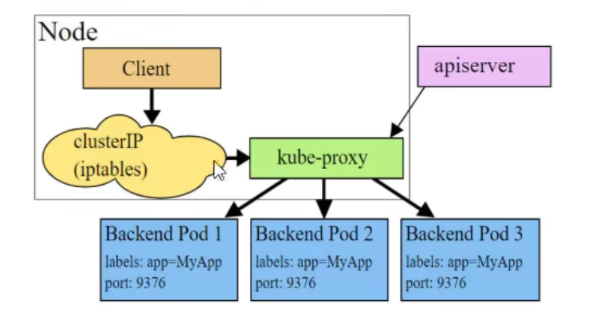
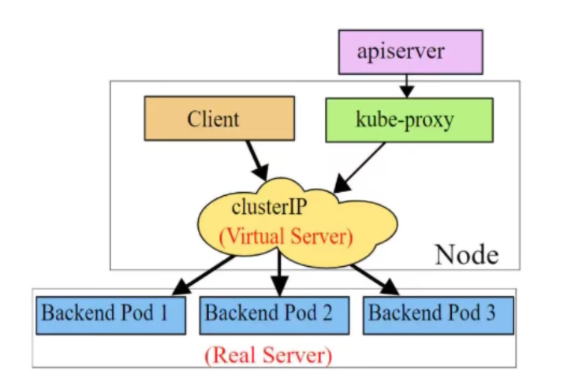
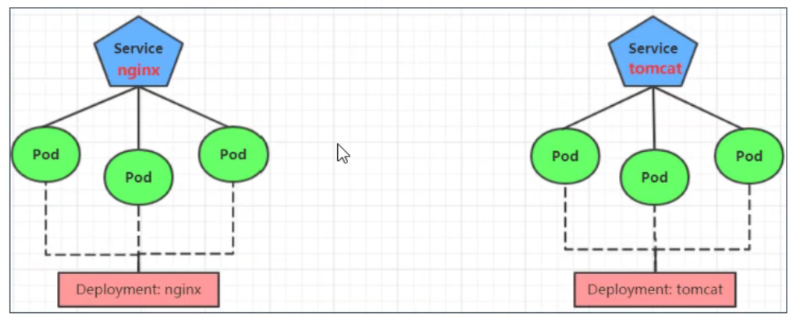

# 流量负载


K8S的流量负载组件：

- Service：4层负载
- Ingress：7层负载


## Service


> **kube-proxy**
>
> ​    Service很多情况下只是一个概念，真正起作用的是`kube-proxy`服务进程，每个node节点上都运行着一个`kube-proxy`服务进程，当创建Service的时候通过api-server向etcd写入创建的service信息，而`kube-proxy`会基于监听的机制发现这种service的变化，然后它会将最新的service信息转换成对应的访问规则


kube-proxy支持三种工作模式：

- **userspace模式**

  - kube-proxy会为每一个service创建一个监听端口，发向clusterIP的请求被iptables（在内核空间）规则重定向到kube-proxy监听的端口上，kube-proxy根据LB算法选择一个提供服务的pod并和其建立连接，以将请求转发到pod上。
  - 该模式下，kube-proxy充当于一个4层的负载均衡器的角色。由于kube-proxy运行在userspace(用户空间)中，在进行转发处理时增加内核和用户空间的数据拷贝，虽然稳定，但是效率较低。
  - 

- **iptables模式（默认）**

  - kube-proxy为service后端的每个pod创建对应的iptables规则，直接将clusterIP的请求重定向到一个podIP
  - iptables的LB策略不够灵活，没有重试机制
  - 

- **ipvs模式（最佳）**

  - ipvs的转发效率比iptables更高，ipvs支持更多的LB算法

  - 

  - ```sh
    # 此模式必须安装ipvs内核模块
    # 开启ipvs
    $ kubectl edit cm kube-proxy -n kube-system
    # 修改配置项：mode: "ipvs"
    
    # 删除当前的pod让他重建
    $ kubectl delete pod -l k8s-app=kube-proxy -n kube-system
    # -l k8s-app=kube-proxy 按标签k8s-app=kube-proxy来选择
    
    # 查看
    ipvsadm -Ln
    ```


### 资源清单

```yaml
apiVersion: v1
kind: Service
metadata:
  name: svc-deploy-nginx
  labels:
    app: deploy-nginx
spec:
  type: ClusterIP
  selector:
    app: deploy-nginx
  ports:
  - name: http
    protocol: TCP
    port: 8080       # serivce自己的端口
    targetPort: 80   # 代理的Pod的端口（后端应用的端口）
  - name: https
    port: 443
    protocol: TCP
    targetPort: 443
```


### Endpoints

每创建一个Service就会自动创建一个跟Service同名的Endpoints，Endpoints管理了所有匹配的Pod的IP端口

EndPoint会监听它所管理Pod的重建，同步新Pod的IP

```sh
# 查询EndPoint
$ kubectl get ep 
```


#### 案例：代理K8s外部的应用

希望在生产环境中使用某个固定的名称而非IP地址进行访问外部的中间件服务，相当于对外部应用做了一个映射，然后内部应用使用服务名称来访问，防止外部中间件因地址改动而影响内部应用的稳定，如：旧服务迁移到新K8s过渡阶段，某些服务未来得及迁移

```sh
# 创建Service (不配置selector，需要手动创建ep)
------------ svc-external.yml
apiVersion: v1
kind: Service
metadata:
  name: svc-external
  labels:
    app: svc-external
spec:
  ports:
  - name: http
    protocol: TCP
    port: 8080       # serivce自己的端口
    targetPort: 80   # 代理的Pod的端口（后端应用的端口）
-----------------
$ kubectl apply -f svc-external.yml 

# 创建Endpoints
------------- svc-ep-external.yml
apiVersion: v1
kind: Endpoints
metadata:
  name: svc-external      # 跟service同名，会自动建立联系
  labels:
    app: svc-external
subsets:
- addresses:
  - ip: 220.181.38.148     # 外部应用
  ports:
  - name: http
    port: 80
---------------
$ kubectl apply -f svc-ep-external.yml

# 查看serviceIP
$ kubectl get svc,ep

# 测试
$ curl 10.106.127.232 -I
HTTP/1.1 200 OK
...

$ curl baidu.com -I
HTTP/1.1 200 OK
...

```


### Service类型

```yaml
spec:
  type:    #
```

type的种类：

- ClusterIP：在集群内访问，默认值
- NodePort：在集群外部访问内部服务
- LoadBalancer：
- ExternalName：反代CNAME
- HeadLess（特殊）：无头类型，将type设置成ClusterIP，然后clusterIP设置成None


### **HeadLess**

​	不分配IP，在CoreDNS内直接使用 [ServiceName].[Namespace.svc.cluster.local] 访问，如果是同命名空间下的服务直接使用ServiceName即可访问，用于自定义负载策略

```sh
# 随机进入k8s的一个pod内
$ kubectl exec -it pod-name -n dev /bin/bash

# 查看默认域名解析器
$ cat /etc/resolv.conf

# 
dig @默认域名 service名称.命名空间.svc.cluster.local
```


### **NodePort**

在Node主机上打开一个端口，将Service的端口映射到Node的端口上


**资源清单**

```yaml
kind: Service
metadata:
  name: service-name
spec:
  selector:
    app: deploy-nginx
  type:  NodePort      #
  ports:
  - port: 80 
    targetPort: 80 
    nodePort: 31192    # 主机端口
```


### **LoadBalancer**

跟NodePort类似，目的都是向外暴露一个端口，区别在于LoadBalancer会在集群外部再做一个负载均衡设备，而这个设备需要外部环境的支持，外部服务发送到这个设备上的请求，会被设备负载之后转发到集群中


### **ExternalName**


**反代外部域名**

ep都不用配置

```sh
apiVersion: v1
kind: Service
metadata:
  name: svc-external-name
  labels:
    app: svc-external-name
spec:
  type: ExternalName
  externalName: www.baidu.com
```

> 注意：由于没有IP，需要配置CoreDNS才能访问
>
> Pod使用的是CoreDNS，所有我们可以进入一个busybox的Pod中测试
>
> `k8s-yml]# kubectl exec -it busybox -- sh`
>
> ```sh
> wget svc-external-name
> Connecting to svc-external-name (163.177.151.110:80)
> wget: server returned error: HTTP/1.1 403 Forbidden
> 
> # 这里反代出现了跨域，被百度拒绝
> ```


## Ingress

​	既然有了Service暴露服务，为什么还需要Ingress？

- Service比较多的时候，NodePort性能急速下降
- NodePort多的时候管理比较麻烦


​	Ingress 也是K8s所管理的资源，他有多种实现方式，如 nginx、istio、haproxy 等，nginx官方维护的 nginx-ingress，k8s官方维护的是 ingress-nginx，建议使用 ingress-nginx


### 环境搭建

​	安装Helm	[Helm官方安装文档](https://helm.sh/zh/docs/intro/install/)

​	使用Helm安装Ingress-nginx

​	a) 下载相关组件

```sh
$ helm repo add ingress-nginx https://kubernetes.github.io/ingress-nginx
$ helm repo update
$ helm pull ingress-nginx/ingress-nginx
$ mkdir temp
$ mv ingress-nginx/ingress-nginx ./temp
$ cd temp
$ tar xf ingress-nginx/ingress-nginx
$ cd ingress-nginx
$ ls

CHANGELOG.md  Chart.yaml  ci  OWNERS  README.md  templates  values.yaml
```


​	b) 修改配置

```sh
$ vim values.yaml

------------------
controller:
  name: controller
  image:
    registry: docker.io
    # 这个镜像可以在dockerhub上找
    image: willdockerhub/ingress-nginx-controller
    tag: "v1.0.0"
    # 删除digest
hostNetwork: true
dnsPolicy: ClusterFirstWithHostNet  
kind: DaemonSet
nodeSelector:
  kubernetes.io/os: linux
  ingress: "true"
type: ClusterIP
admissionWebhooks:
  patch:
    enabled: true
    image:
      registry: docker.io
      # 这个镜像可以在dockerhub上找
      image: jettech/kube-webhook-certgen
      tag: "v1.5.2"
      # 删除digest
      
-------------------
# 生产中如果Ingress不是部署在专有节点上那么还需要配置 resources
```

> Ingress-nginx的部署方式推荐 DaemonSet 方式，也可以使用 Deployment 部署，如果使用的是 Deployment hostNetwork 要设为 false
>
> 使用DS部署方式的优点：可以把Ingress的Pod固定到指定的节点上，然后直接在宿主机上暴露端口号，k8s外部的负载均衡就可以直接代理到Ingress
>
> 如果配置了 hostNetwork: true，dnsPolicy 需要配置为 ClusterFirstWithHostNet 否则Ingress的Pod访问不了k8s的Pod

​	c) 部署Ingress-nginx

```sh
 # 创建命名空间
 $ kubectl create ns ingress-nginx
 
 # 在需要部署Ingress的节点上打标签
 $ kubectl label nodes k8s-master3  ingress=true
 
 # 首次安装
 $ helm install ingress-nginx -n ingress-nginx .
 
 # (可选)中途修改配置
 $ helm upgrade --install ingress-nginx -n ingress-nginx .

# 查看结果
$ kubectl get po -n ingress-nginx -owide

NAME                             READY   STATUS    RESTARTS   AGE     IP                NODE        
ingress-nginx-controller-n4njs   1/1     Running   0          9m19s   192.168.177.102   k8s-master3   

```

​	d) Ingress 扩容

```sh
 # 在需要部署Ingress的节点上打标签
 $ kubectl label nodes k8s-master2 ingress=true
```

​	e) Ingress 缩容

```sh
# 注意剔除删除
# 1、先把k8s之外的负载均衡去除Ingress的IP
# 2、k8s删除Ingress

 $ kubectl label nodes k8s-master2 ingress-
```


### Ingress原理

​	Ingress-nginx 内部是 nginx + openresty，每一个部署了 ingress-nginx 的节点，80端口被会被nginx监听

```sh
# 在部署了	Ingress-nginx 的节点操作
$ netstat -lntp | grep 80
tcp        0      0 192.168.177.102:2380    0.0.0.0:*               LISTEN      2150/etcd           
tcp        0      0 0.0.0.0:80              0.0.0.0:*               LISTEN      2486668/nginx: mast 
tcp6       0      0 :::80                   :::*                    LISTEN      2486668/nginx: mast

# 查看nginx进程
$ ps aux | grep nginx

```


### Annotations

 	用于配置生成下发nginx配置文件

#### 重写

```yaml
apiVersion: networking.k8s.io/v1beta1
kind: Ingress
metadata:
  annotations:
    kubernetes.io/ingress.class: "nginx"            # 指定ingress来解析，ingress配置文件中有ingressClass这个配置
  name: rewrite-example
spec:
  rules:
  - host: rewrite.bar.com
    http:
      paths:
      - backend:
          serviceName: svc-deploy-nginx
          servicePort: 8080                   # service绑定的端口号，非关联的主机端口号
        path: /
```

**测试**

```sh
# 在测试的主机上配置hosts文件 ingress主机IP rewrite.bar.com 
# 直接访问 rewrite.bar.com 
# 由于配置了ingress ，相当于配置了 nginx，nginx已经在ingress的运行的节点上监听了80端口
# nginx会根据由ingress生成的配置文件，反代到指定的Service

# 进入容器查看所生成的nginx配置
$ kubectl exec -it ingress-nginx-controller-n4njs -- sh

# 查看匹配到的字符的后20行
$ grep "## start server rewrite.bar.com" nginx.conf -A 20
```


### 搭建服务



注意：tomcat版本使用：tomcat:8.5-jre10-slim（这个版本带默认首页）

### HTTP代理 

```sh
apiVersion: extensions/v1beta1
kind: Ingress
metadata:
  name: ingress-http
  namespace: dev
spec:
  rules:
  - host: nginx.web.com
    http:
      paths:
      - path: /
        backend: 
          serviceName: nginx-service
          servicePort: 80
  - host: tomcat.web.com
    http:										
      paths:
      - path: /
        backend:
          serviceName: tomcat-service
          servicePort: 80
```

## 