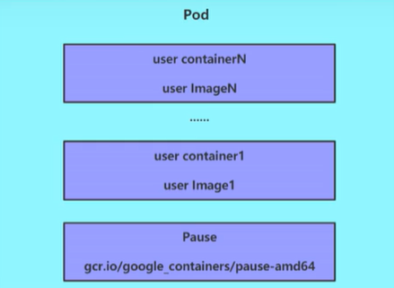
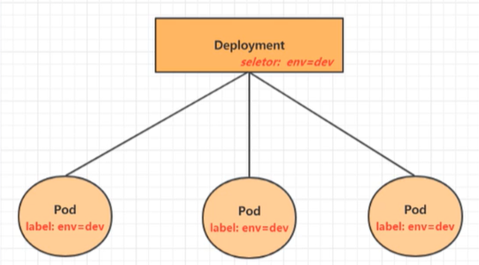
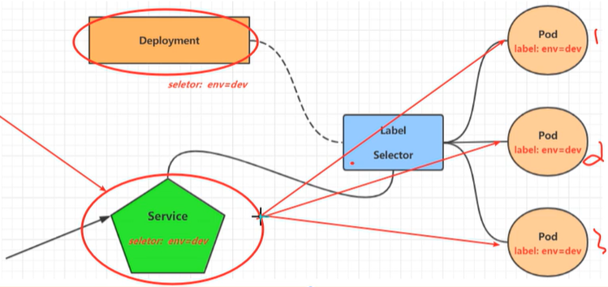

# 实战演练

## Namespace

隔离Pod的访问，主要作用是实现**多套环境的资源隔离**或**多租户的资源隔离**


**默认命名空间**

```sh
default                # 未执行ns的对象都被分配到default下
kube-node-lease        # 集群节点间的心跳维护
kube-public            # 任何人都可以访问的资源
kube-system            # 所有由K8s系统创建的资源都处于这个命名空间
```

**演练**

```sh
# 创建命名空间
$ kubectl create namespace dev

# 查看命名空间
$ kubectl get ns

NAME                   STATUS   AGE
default                Active   2d2h
dev                    Active   7s

# 删除命名空间，并且会自动删除该命名空间下的所有pod，因为pod都是运行在集群的各个节点上，所以删除命名空间是需要等待一段时间
$ kubectl delete ns dev
```


## Pod

pod是k8s的最小操作单元，程序运行在容器中，容器运行在pod中



Pause容器称为根容器，其他容器称为用户用气

```sh
# k8s的组件都是以pod的形式运行的
$ kubectl get po -n kube-system -o wide
NAME                              READY   STATUS    AGE    IP                NODE
coredns-7f89b7bc75-d9bnt          1/1     Running       2d3h   10.244.2.3        node2  
coredns-7f89b7bc75-vl2sj          1/1     Running       2d3h   10.244.2.2        node2
# k8s基础组件
etcd-master1                      1/1     Running       2d3h   192.168.177.100   master1  
kube-apiserver-master1            1/1     Running       2d3h   192.168.177.100   master1  
kube-controller-manager-master1   1/1     Running       2d3h   192.168.177.100   master1  
kube-scheduler-master1            1/1     Running       2d3h   192.168.177.100   master1
# 网络组件在每个节点都安装
kube-flannel-ds-4ch5v             1/1     Running       2d2h   192.168.177.100   master1
kube-flannel-ds-4df4x             1/1     Running       2d2h   192.168.177.101   node1    
kube-flannel-ds-tldc9             1/1     Running       2d2h   192.168.177.102   node2    
# 代理在每个节点都安装
kube-proxy-84rhw                  1/1     Running       2d3h   192.168.177.100   master1  
kube-proxy-hzs2c                  1/1     Running       2d3h   192.168.177.102   node2    
kube-proxy-j5xtj                  1/1     Running       2d3h   192.168.177.101   node1  
```

**演练**

```sh
# 在dev命名空间下运行pod，如果不指定命名空间默认在default命名空间下运行
$ kubectl run my-nginx --image=nginx -n dev

pod/pod123 created

# 查看已经运行的pod
$ kubectl get pod -n dev -o wide

NAME        READY   STATUS              RESTARTS   AGE   IP           NODE    
my-nginx    1/1     Running             0          93s   10.244.1.6   node1 

# 查看pod详细信息，查看容器创建过程，排错
$ kubectl describe po my-nginx

# 访问pod，使用k8s创建的网卡访问（该IP不稳定，用于测试）
$ curl 10.244.1.6

# 删除pod
$ kubectl delete pod pod123 -n dev

pod "pod123" deleted

# 再次查看已经运行的pod，发现该命名空间下已经没有pod了
# 注意：如果在删除pod的时候有deployment-pod控制器，那么删除pod后，pod控制器又会自动的重新创建一个新的pod，想要删除pod，就要删除pod控制器
```


## Label

- kv键值对

```sh
-----------------------------
apiVersion: v1
kind: Namespace
metadata:
  name: dev
  labels:
    version: "3.0"
    env: "test"
---
apiVersion: v1
kind: Pod
metadata:
  name: nginxpod
  namespace: dev
spec:
  containers:
  - name: nginx-containers
    image: nginx
-----------------------------
```

**标签选择器 lable selector**

- 基于等式
  - name=value
  - name!=value
- 基于集合
  - name in (v1,v2)
  - name not in (v1,v2)

**演练**

```sh
# 根据配置文件创建pod
$ kubectl apply -f pod-nginx.yaml

# 查看ns的label信息
$ kubectl describe ns dev

Name:         dev
Labels:       env=test
              version=3.0
Annotations:  <none>
Status:       Active

# 查看po并显示labels
$ kubectl get po -n dev --show-labels

NAME       READY   STATUS    RESTARTS   AGE   LABELS
nginxpod   1/1     Running   0          31s   <none>

# 添加label
$ kubectl label pod nginxpod -n dev env=test

pod/nginxpod labeled

# 更新label
$ kubectl label pod nginxpod -n dev env=dev --overwrite

# 再创建一个pod 
$ kubectl run nginx1 --image=nginx --port=80 -n dev

# 查看po并显示labels
$ kubectl get po -n dev --show-labels

NAME       READY   STATUS    RESTARTS   AGE     LABELS
nginx1     1/1     Running   0          31s     run=nginx1
nginxpod   1/1     Running   0          6m15s   env=dev

# 筛选
$ kubectl get po -n dev -l "env=dev"

NAME       READY   STATUS    RESTARTS   AGE
nginxpod   1/1     Running   0          7m46s

# 删除label
$ kubectl label po nginx1 -n dev run-

pod/nginx1 labeled
```


## Deployment

> pod 控制器的一种

在k8s中，pod是最小的控制单元，但是k8s很少直接控制pod，一搬都是通过pod控制器来完成。pod控制器用于pod的管理，确保pod资源符合预期的状态，当pod的资源出现故障时，会尝试进行重启或重建pod



**演练**

```sh
# 创建pod和deployment控制器
$  kubectl create deployment my-dep --image=nginx --port=80 --replicas=3 -n dev

# 查看结果
$ kubectl get deployment,po -n dev -o wide
NAME                     READY   UP-TO-DATE   AVAILABLE   AGE   CONTAINERS   IMAGES   SELECTOR
deployment.apps/my-dep   3/3     3            3           50s   nginx        nginx    app=my-dep

NAME                          READY   STATUS    RESTARTS   AGE   IP            NODE  
pod/my-dep-6949894f8c-8ndl9   1/1     Running   0          50s   10.244.2.14   node2
pod/my-dep-6949894f8c-q6h9m   1/1     Running   0          50s   10.244.2.13   node2
pod/my-dep-6949894f8c-xqb4z   1/1     Running   0          50s   10.244.1.10   node1

# 删除控制器
$ kubectl delete deploy my-dep -n dev
```

通过配置文件创建

```sh
-----------------------------
# 命名空间
apiVersion: v1
kind: Namespace
metadata:
  name: dev
  labels:
    version: "3.0"
    env: "test"
---
# 控制器
apiVersion: apps/v1
kind: Deployment
metadata:
  name: deploy-nginx
  namespace: dev
  labels:
    app: deploy-nginx
spec:
  # 副本数
  replicas: 3
  # 关联pod
  selector:
    matchLabels:
      app: deploy-nginx
  # 创建pod的模板
  template:
    metadata:
      labels:
        # 这里绑定了控制器
        app: deploy-nginx
    spec:
      containers:
      - name: nginx-containers
        image: nginx
        ports:
        - containerPort: 80
          protocol: TCP
-----------------------------
```

```sh
# 创建控制器和pod
$  kubectl apply -f deploy-nginx.yaml

# 查看结果
$ kubectl get deploy,po -n dev --show-labels -o wide

NAME                           READY   UP-TO-DATE   AVAILABLE   AGE   CONTAINERS         IMAGES   SELECTOR           LABELS
deployment.apps/deploy-nginx   3/3     3            3           15m   nginx-containers   nginx    app=deploy-nginx   app=deploy-nginx

NAME                                READY   STATUS    RESTARTS   AGE   IP            NODE    LABELS
pod/deploy-nginx-686b9c7f68-ct4wt   1/1     Running   0          15m   10.244.2.19   node2           app=deploy-nginx,pod-template-hash=686b9c7f68
pod/deploy-nginx-686b9c7f68-qm4fs   1/1     Running   0          15m   10.244.1.13   node1           app=deploy-nginx,pod-template-hash=686b9c7f68
pod/deploy-nginx-686b9c7f68-tstss   1/1     Running   0          15m   10.244.2.20   node2         app=deploy-nginx,pod-template-hash=686b9c7f6

# 通过pod ip访问
$ curl 10.244.2.19

# 删除其中的一个pod
$ kubectl delete pod deploy-nginx-686b9c7f68-ct4wt -n dev

# 由于deployment控制器会确保pod资源符合预期的状态，会把删除的pod重新创建
# 再次查看pod时发现还是存在3个pod，并且pod ip已经改变
```


## Service

虽然每个pod都会分配一个pod ip ，然后存在以下问题

- pod ip 会随着pod的重建而改变
- pod ip 仅在集群内可见的虚拟ip，外部无法访问

**service解决以上问题**

service 可以看作时一组同类pod**对外的访问接口**，借助service，应用可以方便的实现服务发现和负载均衡



**演练**

```sh
# 创建服务 kubectl service deploy [deploy-name] [args]
$ kubectl expose deploy deploy-nginx --name=svc-nginx --type=ClusterIP --port=80 --target-port=80 -n dev

# 查询
$ kubectl get svc -n dev

NAME        TYPE        CLUSTER-IP     EXTERNAL-IP   PORT(S)   AGE
svc-nginx   ClusterIP   10.106.35.71   <none>        80/TCP    25s

# 通过 cluster ip 访问
$ curl 10.106.35.71

# 此时还是只能在集群内部访问，通过--type=NodePort 让外部访问
$ kubectl expose deploy deploy-nginx --name=svc-nginx1 --type=NodePort --port=80 --target-port=80 -n dev

# 再次查询
$ kubectl get svc -n dev

NAME         TYPE        CLUSTER-IP      EXTERNAL-IP   PORT(S)        AGE
svc-nginx    ClusterIP   10.106.35.71    <none>        80/TCP         3m39s
svc-nginx1   NodePort    10.100.51.170   <none>        80:31058/TCP   12s

# 此时外部网路可以正常访问，并且实现了负载均衡
http://192.168.177.100:31058/

# 删除
$ kubectl delete svc svc-nginx svc-nginx1 -n dev

service "svc-nginx" deleted
service "svc-nginx1" deleted
```

通过配置文件创建

```sh
-----------------------------
# 服务
apiVersion: v1
kind: Service
metadata:
  name: svc-nginx
  namespace: dev
spec:
  type: ClusterIP
  ports:
  - port: 80
    protocol: TCP
    targetPort: 80
  # clusterIP: 0.106.35.100
  # 关联deployment
  selector:
      app: deploy-nginx
  
-----------------------------
```

