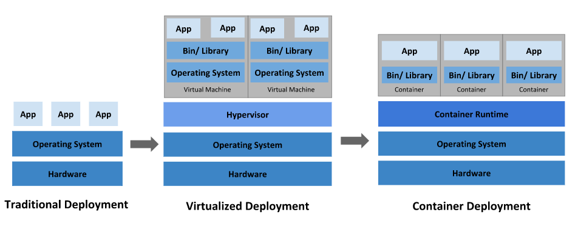
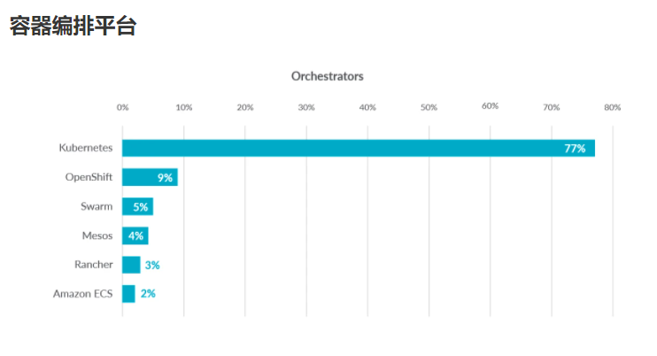

# Kubernetes

## Kubernetes介绍

#### 应用部署方式演变



**传统部署时代：**

```sh
# 优点：部署简单，无其他技术要求
# 缺点：资源不可隔离，如果一台机器部署了多个应用，某个应用故障导致资源占用大，会殃及其他应用
```

**虚拟化部署时代：**

```sh
# 优点：资源隔离，提供了一定程度的安全性
# 缺点：增加了操作系统，浪费了部分资源，虚拟机管理不够简单
```

**容器部署时代：**

```sh
# 优点：
	每个容器的资源隔离，又共享了宿主机的底层基础架构
	敏捷应用程序的创建和部署：与使用 VM 镜像相比，提高了容器镜像创建的简便性和效率。
    持续开发、集成和部署：通过快速简单的回滚（由于镜像不可变性），支持可靠且频繁的 容器镜像构建和部署。
    关注开发与运维的分离：在构建/发布时而不是在部署时创建应用程序容器镜像， 从而将应用程序与基础架构分离。
    可观察性：不仅可以显示操作系统级别的信息和指标，还可以显示应用程序的运行状况和其他指标信号。
    跨开发、测试和生产的环境一致性：在便携式计算机上与在云中相同地运行。
    跨云和操作系统发行版本的可移植性：可在 Ubuntu、RHEL、CoreOS、本地、 Google Kubernetes Engine 和其他任何地方运行。
    以应用程序为中心的管理：提高抽象级别，从在虚拟硬件上运行 OS 到使用逻辑资源在 OS 上运行应用程序。
    松散耦合、分布式、弹性、解放的微服务：应用程序被分解成较小的独立部分， 并且可以动态部署和管理 - 而不是在一台大型单机上整体运行。
    资源隔离：可预测的应用程序性能。
    资源利用：高效率和高密度。
# 缺点：
	学习成本高
	
```

#### 容器化部署带来了新问题

- 如果一个容器挂了，怎么样另外一个容器立刻启动替补停机的容器？
- 当并发访问变大的时候，怎样做到横向扩展容器的数量？

#### Kubernetes简介



[官方简介](https://kubernetes.io/zh/docs/concepts/overview/what-is-kubernetes/)

#### Kubernetes组件

[官方文档](https://kubernetes.io/zh/docs/concepts/overview/components/)


##  集群环境搭建

- 搭建测试环境集群：1主2从
- 3台2核2G内存服务器
- 系统版本：centos 8
- Docker版本：20.10.8
- K8s版本：v1.20.10

#### 环境初始化

```sh
# 设置主机名后重启，主机名在创建k8s集群时会使用
$ hostnamectl set-hostname [主机名]

# 以下命令再所有机器上执行
# 主机域名配置
# 企业中推荐使用内部的DNS服务器
$ vi /etc/hosts
192.168.177.100 master1
192.168.177.101 node1
192.168.177.102 node2

# 测试是否有效
$ ping node1
PING node1 (192.168.177.101) 56(84) bytes of data.

# 时间同步
# Kubernetes集群需要服务器时间精准一至，企业中建议配置内部的时间同步服务器
# 启动chronyd服务
$ systemctl start chronyd && systemctl enable chronyd

# 测试
$ date
2021年 08月 26日 星期四 21:49:54 EDT

# 禁用iptables和firewalld服务(可选：测试环境)
# Kubernetes和Docker在运行中会产生大量的iptables规则，为了不让系统规则和它们混淆，关闭系统规则
$ systemctl stop firewalld && systemctl disable firewalld
$ systemctl stop iptables && systemctl disable iptables

# 禁用selinux  (待查证)
# selinux是linux系统下的一个安全服务，如果不关闭它，在安装集群时会产生各种各样的问题
$ vi /etc/selinux/config
SELINUX=disabled

# 重启后生效

# 禁用swap分区（虚拟内存分区）
# 它的作用是在物理内存使用完之后，将磁盘空间虚拟成内存来使用，启动swap设备会对系统的性能产生非常负面的影响，因此Kubernetes要求每个节点都要禁用swap设备，但是也可以在安装的过程中进行参数配置来允许swap分区被启用
$ vi /etc/fstab
#/dev/mapper/cl-swap     swap                    swap    defaults        0 0

# 重启后生效

# 允许 iptables 检查桥接流量，修改linux内核参数（Kubernetes要求）
# Kubernetes支持几种不同的网络附加解决方案。接下来安装flannel网络插件，我们需要做的第一件事是我们需要在所有服务器上设置一个sysctl值，包括主节点
$ cat <<EOF | sudo tee /etc/modules-load.d/k8s.conf
br_netfilter
EOF

$ cat <<EOF | sudo tee /etc/sysctl.d/k8s.conf
net.bridge.bridge-nf-call-ip6tables = 1
net.bridge.bridge-nf-call-iptables = 1
EOF

$ sysctl --system

# 加载模块
$ modprobe br_netfilter
# 查看模块是否加载
$ lsmod | grep br_netfilter

# 配置ipvs
# Kubernetes中service有两种代理模型，iptables，ipvs，后者性能更高，需要手动载入ipvs模块
# 安装ipset,ipvsadm
$ yum install ipset ipvsadm -y
# 添加需要加载的模块写入脚本文件
$ cat << EOF >/etc/sysconfig/modules/ipvs.modules
#!/bin/bash
modprobe -- ip_vs
modprobe -- ip_vs_rr
modprobe -- ip_vs_wrr
modprobe -- ip_vs_sh
modprobe -- nf_conntrack
EOF
# centos8.3 找不到nf_conntrack_ipv4模块 ,更换为nf_conntrack试试
# modprobe -- nf_conntrack_ipv4

$ chmod +x /etc/sysconfig/modules/ipvs.modules
# $ modprobe nf_conntrack_ipv4
$ modprobe nf_conntrack
$ /bin/bash /etc/sysconfig/modules/ipvs.modules

# 重启服务器
$ reboot

# 查看配置是否生效
$ getenforce
Disabled
$ free -m
              total        used        free      shared  buff/cache   available
Mem:           1790         190        1371           8         228        1436
Swap:             0           0           0

```

#### 安装Docker

```sh
yum install -y yum-utils
# 国内仓库
yum-config-manager --add-repo http://mirrors.aliyun.com/docker-ce/linux/centos/docker-ce.repo

yum install docker-ce docker-ce-cli containerd.io

# 查看当前镜像源中支持的docker版本
yum list docker-ce --showduplicates
Docker CE Stable - x86_64     48 kB/s |  15 kB     00:00    
可安装的软件包
docker-ce.x86_64      3:19.03.13-3.el8         docker-ce-stabl
# 安装指定版本
yum install --setopt=obsoletes=0 docker-ce-19.03.15 docker-ce-cli-19.03.15 containerd.io -y
# --setopt=obsoletes=0 此参数为取消安装包取代关系，有时候有些旧的安装包被新的安装包取代了，安装的时候就会自动安装新的。

# 添加配置文件
# Docker默认情况下使用Cgroup Driver为cgroupfs，而K8s推荐使用systemd替代cgroupfs
mkdir /etc/docker
cat << EOF >/etc/docker/daemon.json
{
    "exec-opts": ["native.cgroupdriver=systemd"],
    "registry-mirrors": [
            "https://registry.aliyuncs.com"
          ]
}
EOF

# 启动Docker
systemctl start docker && systemctl enable docker
# 查看Docker信息
$ docker info 
 ...
 Cgroup Driver: systemd

```

#### 安装K8S组件

你需要在每台机器上安装以下的软件包：

- `kubeadm`：用来初始化集群的指令。
- `kubelet`：在集群中的每个节点上用来启动 Pod 和容器等。
- `kubectl`：用来与集群通信的命令行工具。

```sh
# 由于K8s的镜像源在国外，速度比较慢，更换为国内镜像源
cat << EOF > /etc/yum.repos.d/kubernetes.repo
[kubernetes]
name=Kubernetes
baseurl=https://mirrors.aliyun.com/kubernetes/yum/repos/kubernetes-el7-x86_64/
enabled=1
gpgcheck=1
repo_gpgcheck=1
gpgkey=https://mirrors.aliyun.com/kubernetes/yum/doc/yum-key.gpg https://mirrors.aliyun.com/kubernetes/yum/doc/rpm-package-key.gpg
EOF

# 安装（最新版本可能会有一些组件的不兼容，如网络组件）
yum install -y kubelet kubeadm kubectl
# 查看当前镜像源中支持的docker版本
yum list kubeadm --showduplicates
# 安装指定版本
yum install -y --setopt=obsoletes=0 kubelet-1.20.10-0 kubeadm-1.20.10-0 kubectl-1.20.10-0

# 配置kubelet的cgroup
cat << EOF > /etc/sysconfig/kubelet
KUBELET_CGROUP_ARGS="--cgroup-driver=systemd"
KUBE_PROXY_MODE="ipvs"
EOF

# 设置开机启动
$ systemctl restart kubelet && systemctl enable kubelet

# 使用kubeadm安装k8s集群时，会到docker镜像仓库下载k8s所需组件的镜像
# 查看需要下载的镜像
$ kubeadm config images list

I0830 02:12:32.470444    8646 version.go:254] remote version is much newer: v1.22.1; falling back to: stable-1.20
k8s.gcr.io/kube-apiserver:v1.20.10
k8s.gcr.io/kube-controller-manager:v1.20.10
k8s.gcr.io/kube-scheduler:v1.20.10
k8s.gcr.io/kube-proxy:v1.20.10
k8s.gcr.io/pause:3.2
k8s.gcr.io/etcd:3.4.13-0
k8s.gcr.io/coredns:1.7.

# 由于k8s.gcr.io国内无法访问，所以需要替换镜像源

# 拉取镜像
# 方法一
$ kubeadm config images pull --image-repository registry.aliyuncs.com/google_containers
# 如果中途找不到最新的 coredns，那么就单独下载latest版本，修改名字为指定的版本

# 下载
$ docker pull registry.aliyuncs.com/google_containers/coredns:latest
# 改名
$ docker tag registry.aliyuncs.com/google_containers/coredns:latest registry.aliyuncs.com/google_containers/coredns:v1.8.4

# 方法二
$ images=(
    kube-apiserver:v1.17.17
    kube-controller-manager:v1.17.17
    kube-scheduler:v1.17.17
    kube-proxy:v1.17.17
    pause:3.1
    etcd:3.4.3-0
    coredns:1.6.5
)

for image in ${images[@]}
do
	docker pull registry.aliyuncs.com/google_containers/${image}
	docker tag registry.aliyuncs.com/google_containers/${image} k8s.gcr.io/${image}
	docker image rm registry.aliyuncs.com/google_containers/${image}
done
```

#### 集群初始化

```sh
# 下面的操作只需要在master节点上执行
# 创建集群，会自动下载kubernetes所需的组件
$ kubeadm init \
--image-repository registry.aliyuncs.com/google_containers \
--pod-network-cidr=10.244.0.0/16 \
--apiserver-advertise-address=192.168.177.111 \
--kubernetes-version=v1.20.10 \
--node-name=master1

#   --node-name（重点）：如果执行当前命令的主机名不是域名，需要指定node-name参数
#   --kubernetes-version：kubernetes版本
#   --pod-network-cidr：指明 pod 网络可以使用的 IP 地址段。如果设置了这个参数，控制平面将会为每一个节点自动分配 CIDRs
#	--apiserver-advertise-address ： 主节点Ip,为master(控制面板)节点的 API server 设置广播地址

Your Kubernetes control-plane has initialized successfully!
To start using your cluster, you need to run the following as a regular user:
  mkdir -p $HOME/.kube
  sudo cp -i /etc/kubernetes/admin.conf $HOME/.kube/config
  sudo chown $(id -u):$(id -g) $HOME/.kube/config
Alternatively, if you are the root user, you can run:
  export KUBECONFIG=/etc/kubernetes/admin.conf
You should now deploy a pod network to the cluster.
Run "kubectl apply -f [podnetwork].yaml" with one of the options listed at:
  https://kubernetes.io/docs/concepts/cluster-administration/addons/
Then you can join any number of worker nodes by running the following on each as root:
kubeadm join 192.168.177.100:6443 --token lsnex0.2tnwvfj3kl2c0ziz \
	--discovery-token-ca-cert-hash sha256:479d6791a9108e17a6e04d405ae95564c414acb756bd13043ab5a5910412dd0a 
#############

# 创建集群成功后，按提示创建目录和文件

# 创建集群加入令牌
$ kubeadm token create
# 其他节点加入集群
# kubeadm join [api-server-endpoint] [flags]
$ kubeadm join 192.168.177.100:6443 \
--discovery-token eeqqgv.ytlyhleqb5i7w4v4 \
--discovery-token-ca-cert-hash sha256:1a78b6956df07f02d330505afa7c299bd339b6d8ac2c3e36539e6ec2f6554419

# 查看集群状态
$ kubectl get nodes
NAME     STATUS     ROLES                  AGE     VERSION
master   NotReady   control-plane,master   19m     v1.22.1
node1    NotReady   <none>                 7m38s   v1.22.1
node2    NotReady   <none>                 11m     v1.22.1

# 可以看到所有节点的状态都为未准备，是因为还未安装网络插件
```

#### 安装网络插件

k8s支持多种网络插件，比如flannel、calico、canal等，以下使用[flannel](https://github.com/flannel-io/flannel#flannel)

```sh
# 以下操作再master节点执行
$ wget https://raw.githubusercontent.com/coreos/flannel/master/Documentation/kube-flannel.yml

# 修改文件中的quay.io仓库为quay-mirror.qiniu.com

# 使用配置文件启动flannel
$ kubectl apply -f flannel.yml

# 再次查看集群状态
$ kubectl get po -n kube-system

NAME                               READY   STATUS              RESTARTS   AGE
coredns-7f89b7bc75-mg85w           0/1     Pending             0          11m
coredns-7f89b7bc75-twgb2           0/1     Pending             0          11m
etcd-master11                      1/1     Running             0          12m
kube-apiserver-master11            1/1     Running             0          12m
kube-controller-manager-master11   1/1     Running             0          12m
kube-flannel-ds-6ftfn              0/1     Init:ErrImagePull   0          3m19s
kube-proxy-7lm2m                   1/1     Running             0          11m
kube-scheduler-master11            1/1     Running             0          12m

# 发现kube-flannel-ds-6ftfn 镜像无法拉取，问题出在了flannel安装文件中的镜像源
# 在dockerhub中查找flannel，使用一个靠前的镜像仓库，然后替换即可
# 删除原来的配置
$ kubectl delete -f flannel.yml
# 修改好flannel.yml文件中的镜像源后再安装
```


```sh
# 配置完等待1分钟
$ kubectl get po -n kube-system
NAME                               READY   STATUS    RESTARTS   AGE
coredns-7f89b7bc75-mg85w           1/1     Running   0          32m
coredns-7f89b7bc75-twgb2           1/1     Running   0          32m
etcd-master11                      1/1     Running   0          32m
kube-apiserver-master11            1/1     Running   0          32m
kube-controller-manager-master11   1/1     Running   0          32m
kube-flannel-ds-rdn56              1/1     Running   0          108s
kube-proxy-7lm2m                   1/1     Running   0          32m
kube-scheduler-master11            1/1     Running   0          32m

```


#### 安装异常处理

- 删除集群、退出已加入的集群

  ```sh
  kubeadm reset -f
  ```

- 卸载集群，重新创建集群后提示证书不正确

  ```sh
  [root@master ~]# kubectl get nodes
  Unable to connect to the server: x509: certificate signed by unknown authority (possibly because of "crypto/rsa: verification error" while trying to verify candidate authority certificate "kubernetes")
  
  # 处理办法：删除目录后重新创建集群
  $ rm -rf $HOME/.kube
  ```

- kubectl get nodes无法获取信息

  ```sh
  [root@master ~]# kubectl get nodes
  The connection to the server localhost:8080 was refused - did you specify the right host or port?
  
  $ mkdir -p $HOME/.kube
  $ sudo cp -i /etc/kubernetes/admin.conf $HOME/.kube/config
  $ sudo chown $(id -u):$(id -g) $HOME/.kube/config
  ```

  