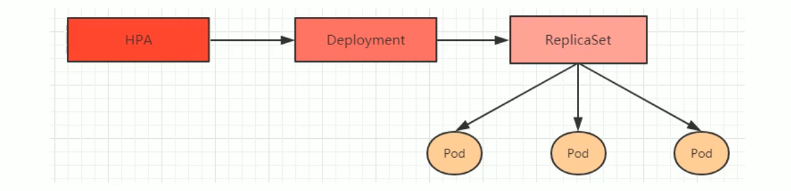

#### Deployment

##### 扩缩容

```sh
# 方式一
$ kubectl edit deploy pc-deployment -n dev

# 方式二
$ kubectl scale deploy pc-deployment --replicas=6 -n dev
```


##### 镜像更新

- 重建更新
- 滚动更新（默认）

```yaml
spec:
  strategy:
    type: RollingUpdate                # ReCreate/RollingUpdate(默认)
    rollingUpdate:                     # type: RollingUpdate 时才生效
      maxUnavailable: 25%
      maxSurge: 25%
```

测试

```sh
$ kubectl apply -f pc-deployment.yaml --record

# 更新版本
$ kubectl set image deploy pc-deployment nginx=nginx:1.17.1 -n dev

# 再次更新版本
$ kubectl set image deploy pc-deployment nginx=nginx:1.17.1 -n dev

# 查案版本信息
$ kubectl rollout history deploy pc-deployment -n dev
```


##### 版本回退

```sh
# 查看当前Deploy升级状态
$ kubectl rollout status deploy pc-deployment -n dev

# 查看升级历史记录
$ kubectl rollout history deploy pc-deployment -n dev

# 回退版本
$ kubectl rollout undo deploy pc-deployment --to-revision=1 -n dev 
```


##### 灰度发布

```sh
# 发布新版本后，立马暂停集群更新，此时旧版应用完整保留，并且创建多了一个新版本应用
$ kubectl set image deploy pc-deployment nginx=nginx:v1.17.2 -n dev \
&& kubectl rollout pause deploy pc-deployment -n dev

# 查看状态
$ kubectl rollout status deploy pc-deployment -n dev

# 现实正在等待更新

# 继续剩余更新
$ kubectl rollout resume deploy pc-deployment -n dev

# 查看rs信息
$ kubectl get rs -n dev

# 发现旧版rs的pod清零，新rs的pod全部启动成功
```


#### HPA

​    如果没有HPA，pod扩缩容的时候需要人工使用命令：`kubectl scale` 来完成，想要达到自动化，智能化，就需要HPA控制器

​    HPA可以获取每个pod的利用率，然后和HPA中定义的指标进行对比，同时计算出需要伸缩的具体值，最后实现pod数量的调整。



测试

```sh
# 1.安装metrics-server，用于收集指标信息

$ yum install git -y
$ git clone -b 0.3.6 metrics仓库
$ cd metrics-server/deploy/1.8+
$ vi metrics-server-deployment.yaml
```


```sh
# 修改完成后，安装metrics-server pod
$ kubectl apply -f ./

# 查看资源占用率
$ kubectl top pod -n dev


# 2.准备deployment和service

# 创建deployment
$ kubectl run nginx --image=nginx --requests=cpu=100m -n dev
# 创建service
$ kubectl expose deployment nginx --type=NodePort --port=80 -n dev

# 查看
$ kubectl get svc,deploy,po -n dev


# 3.部署HPA

--------------------- hpa.yaml
apiVersion: autoscaling/v1
kind: HorizontalPodAutoscaler
metadata:
  name: pc-hpa
  namespace: dev
spec:
  minReplicas: 1  # 最小pod数
  maxReplicas: 10 # 最大pod数
  targetCPUUtilizationPercentage: 3  # cpu使用率指标
  scaleTargetRef:
    apiVersion: apps/v1
    kind: Deployment     # 控制的是deploy
    name: nginx          # 控制的名为nginx的deploy
------------------------

# 创建hpa
$ kubectl create -f hpa.yaml

# 查看hpa
$ kubectl get hpa -n dev
```

#### DaemonSet (DS)


```yaml
apiVersion: apps/v1
kind: DaemonSet
metadata:
  name: ds-test
  namespace: dev
spec:
  revisionHistoryLimit: 3     # 保留的历史版本
  updateStrategy: 
    type: RollingUpdate
    rollingUpdate:
      maxUnavailable: 1
    selector:
      matchLables:
        app: ds-log-app
  template:
    metadata:
      labels:
        app: ds-log-app
    spec:
      containers:
      -
```

#### Job


## 流量负载

K8S的流量负载组件：Service，Ingress

#### Service


#### Ingress

