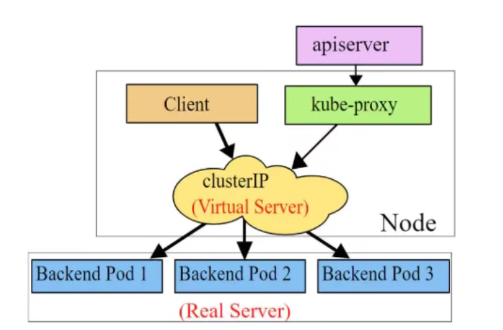

#### Deployment

##### 扩缩容

```sh
# 方式一
$ kubectl edit deploy pc-deployment -n dev

# 方式二
$ kubectl scale deploy pc-deployment --replicas=6 -n dev
```


##### 镜像更新

- 重建更新
- 滚动更新（默认）

```yaml
spec:
  strategy:
    type: RollingUpdate                # ReCreate/RollingUpdate(默认)
    rollingUpdate:                     # type: RollingUpdate 时才生效
      maxUnavailable: 25%
      maxSurge: 25%
```

测试

```sh
$ kubectl apply -f pc-deployment.yaml --record

# 更新版本
$ kubectl set image deploy pc-deployment nginx=nginx:1.17.1 -n dev

# 再次更新版本
$ kubectl set image deploy pc-deployment nginx=nginx:1.17.1 -n dev

# 查案版本信息
$ kubectl rollout history deploy pc-deployment -n dev
```


##### 版本回退

```sh
# 查看当前Deploy升级状态
$ kubectl rollout status deploy pc-deployment -n dev

# 查看升级历史记录
$ kubectl rollout history deploy pc-deployment -n dev

# 回退版本
$ kubectl rollout undo deploy pc-deployment --to-revision=1 -n dev 
```


##### 灰度发布

```sh
# 发布新版本后，立马暂停集群更新，此时旧版应用完整保留，并且创建多了一个新版本应用
$ kubectl set image deploy pc-deployment nginx=nginx:v1.17.2 -n dev \
&& kubectl rollout pause deploy pc-deployment -n dev

# 查看状态
$ kubectl rollout status deploy pc-deployment -n dev

# 现实正在等待更新

# 继续剩余更新
$ kubectl rollout resume deploy pc-deployment -n dev

# 查看rs信息
$ kubectl get rs -n dev

# 发现旧版rs的pod清零，新rs的pod全部启动成功
```


#### HPA

​    如果没有HPA，pod扩缩容的时候需要人工使用命令：`kubectl scale` 来完成，想要达到自动化，智能化，就需要HPA控制器

​    HPA可以获取每个pod的利用率，然后和HPA中定义的指标进行对比，同时计算出需要伸缩的具体值，最后实现pod数量的调整。


测试

```sh
# 1.安装metrics-server，用于收集指标信息

$ yum install git -y
$ git clone -b 0.3.6 metrics仓库
$ cd metrics-server/deploy/1.8+
$ vi metrics-server-deployment.yaml
```


```sh
# 修改完成后，安装metrics-server pod
$ kubectl apply -f ./

# 查看资源占用率
$ kubectl top pod -n dev


# 2.准备deployment和service

# 创建deployment
$ kubectl run nginx --image=nginx --requests=cpu=100m -n dev
# 创建service
$ kubectl expose deployment nginx --type=NodePort --port=80 -n dev

# 查看
$ kubectl get svc,deploy,po -n dev


# 3.部署HPA

--------------------- hpa.yaml
apiVersion: autoscaling/v1
kind: HorizontalPodAutoscaler
metadata:
  name: pc-hpa
  namespace: dev
spec:
  minReplicas: 1  # 最小pod数
  maxReplicas: 10 # 最大pod数
  targetCPUUtilizationPercentage: 3  # cpu使用率指标
  scaleTargetRef:
    apiVersion: apps/v1
    kind: Deployment     # 控制的是deploy
    name: nginx          # 控制的名为nginx的deploy
------------------------

# 创建hpa
$ kubectl create -f hpa.yaml

# 查看hpa
$ kubectl get hpa -n dev
```

#### DaemonSet (DS)


```yaml
apiVersion: apps/v1
kind: DaemonSet
metadata:
  name: ds-test
  namespace: dev
spec:
  revisionHistoryLimit: 3     # 保留的历史版本
  updateStrategy: 
    type: RollingUpdate
    rollingUpdate:
      maxUnavailable: 1
    selector:
      matchLables:
        app: ds-log-app
  template:
    metadata:
      labels:
        app: ds-log-app
    spec:
      containers:
      -
```

#### Job


## 流量负载

K8S的流量负载组件：

- Service：4层负载
- Ingress：7层负载

#### Service

##### 介绍


> **kube-proxy**
>
> ​    Service很多情况下只是一个概念，真正起作用的是`kube-proxy`服务进程，每个node节点上都运行着一个`kube-proxy`服务进程，当创建Service的时候通过api-server向etcd写入创建的service信息，而`kube-proxy`会基于监听的机制发现这种service的变化，然后它会将最新的service信息转换成对应的访问规则


kube-proxy支持三种工作模式：

- **userspace模式**

  - kube-proxy会为每一个service创建一个监听端口，发向clusterIP的请求被iptables（在内核空间）规则重定向到kube-proxy监听的端口上，kube-proxy根据LB算法选择一个提供服务的pod并和其建立连接，以将请求转发到pod上。
  - 该模式下，kube-proxy充当于一个4层的负载均衡器的角色。由于kube-proxy运行在userspace(用户空间)中，在进行转发处理时增加内核和用户空间的数据拷贝，虽然稳定，但是效率较低。
  - 

- **iptables模式（默认）**

  - kube-proxy为service后端的每个pod创建对应的iptables规则，直接将clusterIP的请求重定向到一个podIP
  - iptables的LB策略不够灵活，没有重试机制
  - 

- **ipvs模式（最佳）**

  - ipvs的转发效率比iptables更高，ipvs支持更多的LB算法

  - 

  - ```sh
    # 此模式必须安装ipvs内核模块
    # 开启ipvs
    $ kubectl edit cm kube-proxy -n kube-system
    # 修改配置项：mode: "ipvs"
    
    # 删除当前的pod让他重建
    $ kubectl delete pod -l k8s-app=kube-proxy -n kube-system
    # -l k8s-app=kube-proxy 按标签k8s-app=kube-proxy来选择
    
    # 查看
    ipvsadm -Ln
    ```


##### 类型

```yaml
kind: Service
metadata:
  name: service-name
  namespace: dev
spec:
  selector:
    app: deploy-nginx
  type:  # Service类型，制定Service的访问方式
  clusterIP: # 虚拟服务的ip地址，如果不写默认分配
  sessionAffinity: # session亲和性，支持ClusterIP、None两个选项。ClusterIP会让同一个ip访问固定的pod
  ports:
  - port: 3017 # service端口
    targetPort: 5003 # pod端口
    nodePort: 31192 # 主机端口
```

type的类型：

- ClusterIP：只能在集群内访问
- NodePort：在集群外部访问内部服务
- LoadBalancer：
- ExternalName：
- headLess：无头类型，将type设置成ClusterIP，然后clusterIP设置成None

##### 使用

**HeadLess**

用于自定义负载策略

```sh
# 随机进入一台服务内的pod
$ kubectl exec -it pod-name -n dev /bin/bash

# 查看默认域名解析器
$ cat /etc/resolv.conf

# 
dig @默认域名 service名称.命名空间.svc.cluster.local
```

**NodePort**

将service的端口映射到node的端口上


**LoadBalancer**

跟NodePort类似，目的都是向外暴露一个端口，区别在于LoadBalancer会在集群外部再做一个负载均衡设备，而这个设备需要外部环境的支持，外部服务发送到这个设备上的请求，会被设备负载之后转发到集群中


**ExternalName**


#### Ingress

##### 环境搭建

```sh
$ mkdir ingress-controller
$ cd ingress-controller

# 下载ingress-nginx
$ wget .../mandatory.yaml
$ wget .../service-nodeport.yaml

# 修改仓库镜像源

# 创建ingress-nginx
$ kubectl apply -f ./

# 查看ingress-nginx
$ kubectl get po -n ingress-nginx

# 查看service
$ kubectl get svc -n ingress-nginx
```

##### 搭建服务


注意：tomcat版本使用：tomcat:8.5-jre10-slim（这个版本带默认首页）

##### HTTP代理 

```sh
apiVersion: extensions/v1beta1
kind: Ingress
metadata:
  name: ingress-http
  namespace: dev
spec:
  rules:
  - host: nginx.web.com
    http:
      paths:
      - path: /
        backend: 
          serviceName: nginx-service
          servicePort: 80
  - host: tomcat.web.com
    http:										
      paths:
      - path: /
        backend:
          serviceName: tomcat-service
          servicePort: 80
```

## 数据存储

