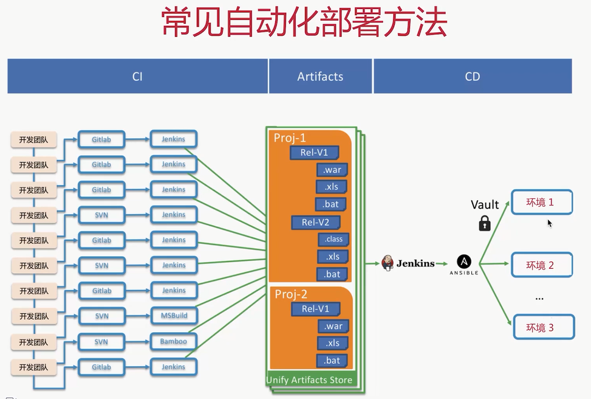

## 持续集成

​	单体应用拆分成微服务，就需要方法来组装这些服务，成为可联合运行的微服务架构。这个方法就是持续集成

- 持续集成其实是一种软件开发实践，帮组团队成员频繁集成他们的工作，通常每个项目每天至少集成一次，从而每天有可测试的版本
- 每个集成使用自动化构建来实现打包和测试，快速验证问题。许多团队发现持续集成显著的降低了集成遇到的错误，使团队能够更加迅速地开发


区别：


软件生命周期：


## 持续部署

​	**为什么需要持续部署：**

- 传统部署方式依赖手工部署，容易出错
- 生成环境依赖手工配置进行变更
- 熬夜加班进行上线部署

​	**持续部署的定义：**

- 软件部署：将软件按照期望的状态，部署到目标及其上的期望路径
- 持续部署：自动化的将一个或多个软件尽可能快的，稳定的，可重复的联合部署到目标机器，以便进行软件功能的验证和实际运行。可能是在云环境中自动部署、app升级、更新网站

​	**软件生命周期：**

- 自动化部署：ansible
- 应用与配置分离，一次构建，多处运行：spring cloud config
- 提供应用健康监测的接口：spring cloud actuator



几种部署方式：


```c#
// 考核利润          
		   //1
            new SRow(new SCell("一、营业收入"))
                .SetFormulas(new Dictionary<int, string> {{2, "+"}, {3, "+"}}, ">1"),
            //2
            new SRow(new SCell("   主营业务收入")).AddDatabind(Condition.Equals(C1, "6001")),
            //3
            new SRow(new SCell("   其他业务收入")).AddDatabind(Condition.Equals(C1, "6051")),
            //4
            new SRow(new SCell("二、总成本费用"))
                .SetFormulas(new Dictionary<int, string> {{5, "+"}, {6, "+"}, {7, "+"}, {8, "+"}, {9, "+"}}, ">1"),
            //5
            new SRow(new SCell("   营业成本"))
                .AddDatabind(Condition.Equals(C1, "6401"))
                .AddDatabind(Condition.Equals(C1, "6402")),
            //6
            new SRow(new SCell("   销售费用")).AddDatabind(Condition.Equals(C1, "6601")),
            //7
            new SRow(new SCell("   管理费用")).AddDatabind(Condition.Equals(C1, "6602")),
            //8
            new SRow(new SCell("   财务费用")).AddDatabind(Condition.Equals(C1, "6603")),
            //9
            new SRow(new SCell("   税金及附加")).AddDatabind(Condition.Equals(C1, "6403")),
            //10
            new SRow(new SCell("三、营业利润"))
                .SetFormulas(new Dictionary<int, string> {{1, "+"}, {4, "-"}}, ">1"),
            //11
            new SRow(new SCell("   加：其他收益")).AddDatabind(Condition.Equals(C1, "6117")),
            //12
            new SRow(new SCell("   加：投资收益")).AddDatabind(Condition.Equals(C1, "6111")),
            //13
            new SRow(new SCell("   加：营业外收入")).AddDatabind(Condition.Equals(C1, "6301")),
            //14
            new SRow(new SCell("   加：资产处置损益")).AddDatabind(Condition.Equals(C1, "6115")),
            //15
            new SRow(new SCell("   减：营业外支出")).AddDatabind(Condition.Equals(C1, "6711")),
            //16
            new SRow(new SCell("   减：资产减值损失")).AddDatabind(Condition.Equals(C1, "6701")),
            //17
            new SRow(new SCell("四、利润总额"))
                .SetFormulas(
                    new Dictionary<int, string>
                        {{10, "+"}, {11, "+"}, {12, "+"}, {13, "+"}, {14, "+"}, {15, "-"}, {16, "-"}},
                    ">1"),
            //18
            new SRow(new SCell("   减：所得税费用")).AddDatabind(Condition.Equals(C1, "6801")),
            //19
            new SRow(new SCell("五、净利润"))
                .SetFormulas(new Dictionary<int, string> {{17, "+"}, {18, "-"}}, ">1")
```

