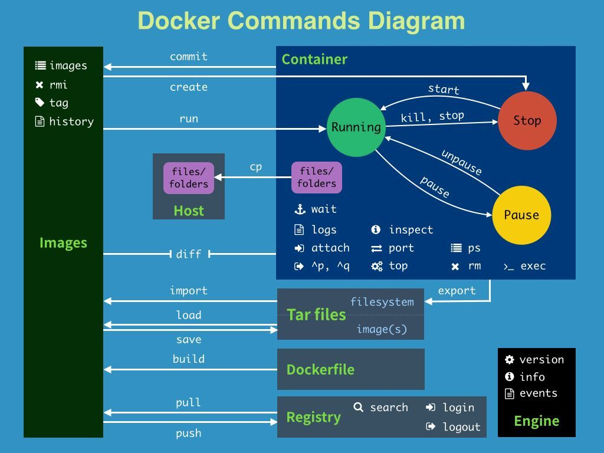
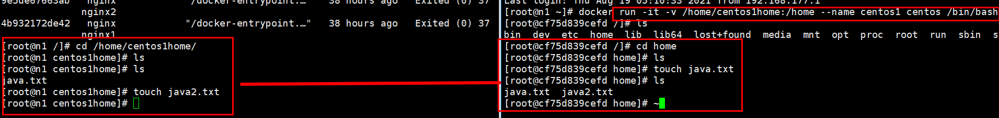
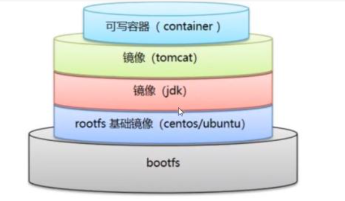
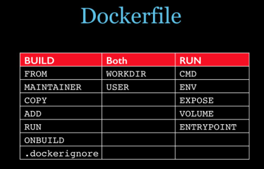
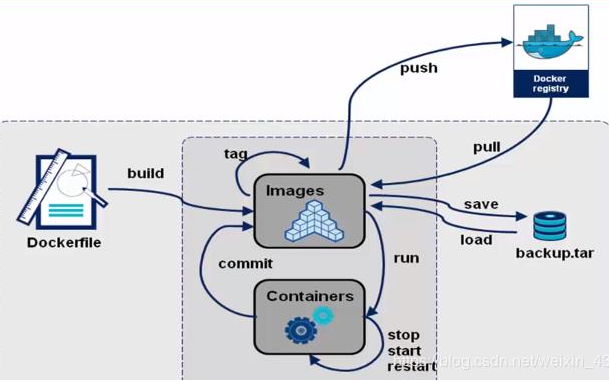
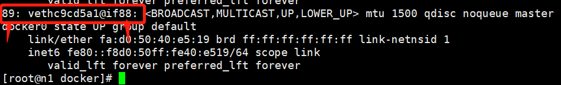
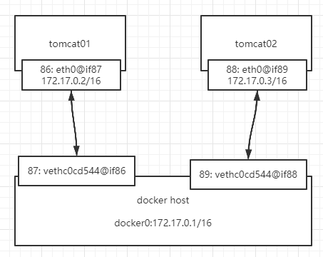

# docker 安装

[官方安装连接](https://docs.docker.com/engine/install/centos/#install-using-the-repository)

# docker 常用命令

```sh
# docker info

Client:
 Debug Mode: false

Server:
 Containers: 0
  Running: 0
  Paused: 0
  Stopped: 0
 Images: 0                           # 镜像个数
 Server Version: 19.03.15          
 Storage Driver: overlay2            # 存储驱动，运行 xfs_info / 命令，如果 ftype=1 才支持
  Backing Filesystem: xfs
  Supports d_type: true
  Native Overlay Diff: true
 Logging Driver: json-file           # json-file  表示日志在本地缓存，重启后清除
 Cgroup Driver: systemd
 Plugins:
  Volume: local
  Network: bridge host ipvlan macvlan null overlay
  Log: awslogs fluentd gcplogs gelf journald json-file local logentries splunk syslog
 Swarm: inactive                     # swarm 未启动
 Runtimes: runc                      # 运行容器的标准
 Default Runtime: runc
 Init Binary: docker-init
 containerd version: e25210fe30a0a703442421b0f60afac609f950a3
 runc version: v1.0.1-0-g4144b63
 init version: fec3683
 Security Options:
  seccomp
   Profile: default
 Kernel Version: 4.18.0-240.1.1.el8_3.x86_64
 Operating System: CentOS Linux 8
 OSType: linux
 Architecture: x86_64
 CPUs: 2
 Total Memory: 1.748GiB
 Name: k8s-master1
 ID: 6T35:TC72:KPKK:LQYH:LPYQ:UXXS:3B7V:XSGR:JOKU:NUN2:GHHI:UAFC
 Docker Root Dir: /var/lib/docker          # 生产中使用ssd，最好使用一个单独的硬盘挂载，不跟docker一起
 Debug Mode: false
 Registry: https://index.docker.io/v1/
 Labels:
 Experimental: false
 Insecure Registries:
  127.0.0.0/8
 Registry Mirrors:
  https://registry.aliyuncs.com/            # 生产中使用公司自己的镜像仓库
 Live Restore Enabled: false                # 生产中需要打开，修改daemon.json重启服务时，不会把正在运行的容器重启

```


## 帮助命令

```sh
# docker 命令 --help
```


## 镜像命令

**搜索镜像**

```sh
# docker search [OPTIONS] TERM
	--filter , -f		# 根据条件过滤
	--format		Pretty-print search using a Go template
	--limit	25	Max number of search results
	--no-trunc		    # 不截断描述信息输出

# 搜索stars大于10000 并且描述信息不被截断
[root@n1 ~]# docker search -f=stars=10000 --no-trunc nginx 
NAME      DESCRIPTION                STARS     OFFICIAL   AUTOMATED
nginx     Official build of Nginx.   15325     [OK] 
```

**下载镜像**

```sh
# docker pull 镜像名[:版本]
```

**提交镜像**

```sh
# 以现有状态的容器保存为新镜像，用于保存已配置好的容器
# docker commit -m "" -a "" 容器id 镜像名:Tag
```

**镜像安全扫描**

构建映像后，最好使用该`docker scan`命令扫描它的安全漏洞。Docker 已与[Snyk](http://snyk.io/)合作提供漏洞扫描服务。

```sh
# docker scan 镜像id
```

**查看用于在图像中创建每个图层的命令**

```sh
 # docker [image] history 镜像id
```

**删除镜像**

```sh
# docker image rm -f 85c4fd090900
	-f 强制删除，镜像有实例化的容器存在时强制删除
```

**修改镜像名称标签**

```sh
# docker tag 镜像id 新镜像名:tag
# 会创建一个新的镜像，原镜像保留
```


## 容器命令

```sh
# docker run [OPTIONS] IMAGE[:TAG|@DIGEST] [COMMAND] [ARG...]
```


## 常用其他命令

**容器后台运行**

```shell
# docker run -d 镜像名

[root@n1 ~]# docker run -d centos
1161172cdb21d611814c27e439194a23d0f81bc978f1e62c201a6ebe62c54690
[root@n1 ~]# docker ps
CONTAINER ID   IMAGE     COMMAND   CREATED   STATUS    PORTS     NAMES

# 问题：docker ps 发现 centos 停止了
# 常见的坑，docker 容器后台运行时，就必须要有一个前台程序，docker发现没有前台程序就会停止
# 如：nginx容器启动后，发现没有提供服务，就会立刻停止
```

**查看日志**

```sh
# docker logs -f -t --tail 10 容器名，发现没有日志
	-f 持续输出日志
	-t 显示时间戳
	-n,--tail 显示日志条数

# 自己编写一段shell脚本
"while true;do echo vansama;sleep 1;done"

# 前台运行循环脚本，使容器不终止
docker run -d centos /bin/sh -c "while true;do echo vansama;sleep 1;done"
```

**查看容器进程信息**

```sh
# docker top 容器id

[root@n1 bin]# docker top ec56d0a01e00
UID                 PID                 PPID                C                   STIME               TTY                 TIME                CMD
root                304538              304518              0                   15:58               ?                   00:00:00            /bin/sh -c while true;do echo vansama;sleep 1;done
root                304614              304538              0                   15:59               ?                   00:00:00            /usr/bin/coreutils --coreutils-prog-shebang=sleep /usr/bin/sleep 1

```

**查看容器元数据**

```sh
# docker inspect 容器id

[root@n1 bin]# docker inspect ec56d0a01e00
[
    {
        "Id": "ec56d0a01e0072ef5752cffd9a2d6de175e6e3ee856917d60cb7df78e7bfe9fc",
        "Created": "2021-08-17T19:58:46.284125436Z",
        "Path": "/bin/sh",
        "Args": [
            "-c",
            "while true;do echo vansama;sleep 1;done"
        ],
        "State": {
            "Status": "running",
            "Running": true,
...
```

**进入当前正在运行的容器**

```sh
# 通常都是以后台的方式运行容器，需要修改配置时，需要进入运行中的容器

# 方式一（常用）
# docker exec -it 容器id /bin/bash  #以新的命令终端进入容器
[root@n1 bin]# docker exec -it ec56d0a01e00 /bin/bash
[root@ec56d0a01e00 /]# ls
bin  dev  etc  home  lib  lib64  lost+found  media  mnt  opt  proc  root  run  sbin  srv  sys  tmp  usr  var

# 方式二
# docker attach 容器id    #直接进入正在运行的命令行，不会启动新的进程
# 假如以：docker run -d centos /bin/sh -c "while true;do echo vansama;sleep 1;done" 创建了容器并运行
# 如果使用 docker attach 容器id 进入容器，会看到不停地在打印日志
```

**从容器内拷贝文件到主机上**

```sh
# docker cp 容器id:文件全路径 主机路径

[root@n1 ~]# docker cp 407945fb3053:/home/aa.js .
[root@n1 ~]# ls
1  aa.js 

```


## 小结




# Docker 镜像

# 容器数据卷

## 什么是容器数据卷

数据如果在容器中，容器中的数据会被删除

==需求：容器中的数据持久化保存在本地==

## 卷命令

```sh
# docker volume
# ls 显示所有匿名挂载卷和具名挂载卷
# inspect 显示挂载卷的详细信息
```


## 使用数据卷

```sh
# docker run -v [主机目录：]容器目录
# -v 容器目录            # 匿名挂载
# -v 卷名:容器目录        # 具名挂载 （常用）
# -v 主机目录：容器目录    # 指定路径挂载

[root@n1 ~]# docker run -it -v /home/centos1home:/home --name centos1 centos /bin/bash
```



## 实战-mysql

```sh
$ docker run --name mysql1 -v /home/mysql/conf:/etc/mysql/conf.d -v /home/mysql/data:/var/lib/mysql -e MYSQL_ROOT_PASSWORD=123456 -d mysql
```


## 匿名挂载和具名挂载

**匿名挂载和具名挂载都是在run命令-v参数中未指定主机目录**

```sh
# 匿名挂载卷
$ docker run -v /home centos

# 具名挂载卷
$ docker run -v test:/home centos

[root@n1 home]# docker volume ls
DRIVER    VOLUME NAME
local     486d903f8c4e71cf696a268d35cf293a66050cd230ace47f99e552c4fa3bb0f7
local     0865cad07344f4f79b6e03128e3a3ce21e384d4b327e3e554d7df57ef99bc45b
local     dae78e62adb93760f10c45378e35d3d7c28eeb0ebfd9924d4f6807e7c70f9254
local     testv

[root@n1 home]# docker volume inspect dae78e62adb93760f10c45378e35d3d7c28eeb0ebfd9924d4f6807e7c70f9254
[
    {
        "CreatedAt": "2021-08-19T20:01:30-04:00",
        "Driver": "local",
        "Labels": null,
        "Mountpoint": "/var/lib/docker/volumes/dae78e62adb93760f10c45378e35d3d7c28eeb0ebfd9924d4f6807e7c70f9254/_data",
        "Name": "dae78e62adb93760f10c45378e35d3d7c28eeb0ebfd9924d4f6807e7c70f9254",
        "Options": null,
        "Scope": "local"
    }
]

```

## 扩展

```sh
# 通过 -v 容器目录：ro rw 改变读写权限
# ro readonly  只能在主机操作，不能在容器中操作
# rw read/write

$ docker run -v test:/home:ro centos
```

## 容器数据卷同步

```sh
# docker run --volumes-from 父容器id 镜像名

# $ docker run --name mysql1 -v /etc/mysql/conf.d -v /var/lib/mysql -e MYSQL_ROOT_PASSWORD=123456 -d mysql1

# $ docker run --name mysql1 --volumes-from mysql1 -e MYSQL_ROOT_PASSWORD=123456 -d mysql2

# 这个时候可以实现以上两个文件夹的数据同步
# 其中一个容器被删除，同步容器的卷内容不会被删除，因为是复制
```


# Dockerfile

## 介绍

用于构建docker镜像







## 编写 Dockerfile

```sh
FROM centos
MAINTAINER Vsansama<aa@qq.com>

# 设置环境变量
ENV MYPATH /usr/local
# 设置工作目录，镜像实例化为容器并进入后会直接进入该指定的目录
WORKDIR $MYPATH

# 在容器中执行命令
RUN yum -y install vim
RUN yum -y install net-tools

# 暴露端口
EXPOSE 80

# 在容器实例化后运行的命令
# *生产中一般不使用CMD命名，通过k8s动态直接传入或者读取配置文件传入
# 如果是使用中括号命令，获取不到环境变量的值 如：CMD ［＂echo＂， ＂$MYPATH＂］
CMD echo $MYPATH
CMD echo "----end----"
#CMD /bin/bash            
```


## CMD和ENTRYPOINT

**CMD**

```sh
FROM centos
# 不能使用单引号
CMD ["ls","-a"]

# 运行容器
[root@n1 docker]# docker run mycentos3:1.0
.dockerenv
bin
...

# 运行容器时追加参数
# 容器把 -l 当作完整的命令 所以报错
[root@n1 docker]# docker run mycentos3:1.0 -l
docker: Error response from daemon: OCI runtime create failed: container_linux.go:380: starting container process caused: exec: "-l": executable file not found in $PATH: unknown.

# 运行容器时追加命令会替换CMD
[root@n1 docker]# docker run mycentos3:1.0 ls -l
total 0
lrwxrwxrwx.   1 root root   7 Nov  3  2020 bin -> usr/bin
drwxr-xr-x.   5 root root 340 Aug 21 14:08 dev
...

# 如果 CMD 和 Entrypoint 同时存在 CMD 会成为 Entrypoint 的参数
```

**ENTRYPOINT**

```sh
FROM centos
ENTRYPOINT ["ls","-a"]

# 运行容器时可以直接追加参数
[root@n1 docker]# docker run mycentos-entrypoint:1.0 -l
total 0
-rwxr-xr-x.   1 root root   0 Aug 21 14:13 .dockerenv
```


## 小镜像制作

```sh
# 小镜像: Alpine  busybox   空镜像scratch
FROM alpine
  
RUN adduser -D dot
RUN mkdir -p /opt/dot

ENV test test_env

ENTRYPOINT echo $test
```


## 多阶段制作镜像

普通应用镜像的制作

```sh
# 创建 go hello world 程序
$ vim main.go

package main
import "fmt"

func main(){
    fmt.Printf("hello world\n")
}

# 制作镜像
FROM golang:alpine3.14
  
WORKDIR /opt

COPY main.go .

RUN go build main.go

CMD ./main


# 构建镜像
$ docker build -t go:my .

# 运行镜像
$ docker run go:my

hello world
```

> **多阶段镜像制作**
>
> 上面虽然能制作好镜像，但是镜像大小达到了300M，在生产环境是不被允许的

```dockerfile
# 编译镜像
FROM golang:alpine3.14
  
WORKDIR /opt

COPY main.go .

RUN go build main.go

# 运行镜像
FROM alpine

COPY --from=0 /opt/main /

CMD ./main
```

> 此时发现镜像的大小仅**7M**


## 发布镜像

```sh
# docker login -u 123
```


## 小结



# Docker 网络

```sh
[root@n1 docker]# docker run -d --name tomcat -p 8080:8080 tomcat
19ac161d82e2ae22ecba34fb1932077d9540314f4111cf47b5964d8f43bf94ef

# 查看容器网络接口
[root@n1 docker]# docker exec -it tomcat ip addr
...
86: eth0@if87: <BROADCAST,MULTICAST,UP,LOWER_UP> mtu 1500 qdisc noqueue state UP group default 
    link/ether 02:42:ac:11:00:02 brd ff:ff:ff:ff:ff:ff link-netnsid 0
    inet 172.17.0.2/16 brd 172.17.255.255 scope global eth0
       valid_lft forever preferred_lft forever

# eth0@if87 是docker分配的一个网卡 地址是172.17.0.2/16

# 查看主机网卡
[root@n1 docker]# ip addr
...
3: docker0: <NO-CARRIER,BROADCAST,MULTICAST,UP> mtu 1500 qdisc noqueue state DOWN group default 
    link/ether 02:42:8a:ca:67:0f brd ff:ff:ff:ff:ff:ff
    inet 172.17.0.1/16 brd 172.17.255.255 scope global docker0
       valid_lft forever preferred_lft forever
    inet6 fe80::42:8aff:feca:670f/64 scope link 
       valid_lft forever preferred_lft forever

# 只要安装了docker就会创建一个docker0的网卡，[172.17].0.1/16，所以主机可以Ping通容器内部

# 再次在主机执行
[root@n1 docker]# ip addr
...
3: docker0: <BROADCAST,MULTICAST,UP,LOWER_UP> mtu 1500 qdisc noqueue state UP group default 
    link/ether 02:42:8a:ca:67:0f brd ff:ff:ff:ff:ff:ff
    inet 172.17.0.1/16 brd 172.17.255.255 scope global docker0
       valid_lft forever preferred_lft forever
    inet6 fe80::42:8aff:feca:670f/64 scope link 
       valid_lft forever preferred_lft forever
87: vethc0cd544@if86: <BROADCAST,MULTICAST,UP,LOWER_UP> mtu 1500 qdisc noqueue master docker0 state UP group default 
    link/ether 5e:5c:ea:2a:f4:e7 brd ff:ff:ff:ff:ff:ff link-netnsid 0
    inet6 fe80::5c5c:eaff:fe2a:f4e7/64 scope link 
       valid_lft forever preferred_lft forever
       
# 发现每启动一个容器，主机也会创建一个网卡，并且主机的网卡需要比容器的网卡序号多1
```

**veth-pair：就是一对虚拟网络设备接口，一端连着协议，一端彼此相连**






## --link 容器互联

```sh
# docker 

[root@n1 docker]# docker ps
CONTAINER ID   IMAGE     COMMAND             CREATED       STATUS       PORTS                                       NAMES
87978f4afd51   tomcat    "catalina.sh run"   3 hours ago   Up 3 hours   0.0.0.0:8181->8080/tcp, :::8181->8080/tcp   tomcat1
19ac161d82e2   tomcat    "catalina.sh run"   3 hours ago   Up 3 hours   0.0.0.0:8080->8080/tcp, :::8080->8080/tcp   tomcat

# 默认情况容器间无法直接通过容器名互联
[root@n1 docker]# docker exec -it tomcat1 ping tomcat
ping: tomcat: Name or service not known

# --link
[root@n1 docker]# docker run -d -p 8282:8080 --name tomcat2 --link tomcat tomcat
b3cbf7a46a8630260edadb2a36683c755c264ca5f50828bd2350115f5571a29e

# 实现通过容器名互联
[root@n1 docker]# docker exec -it tomcat2 ping tomcat
PING tomcat (172.17.0.2) 56(84) bytes of data.
64 bytes from tomcat (172.17.0.2): icmp_seq=1 ttl=64 time=0.121 ms

# --link 其实就是修改了容器的hosts文件
[root@n1 docker]# docker exec -it tomcat2 cat /etc/hosts
127.0.0.1	localhost
::1	localhost ip6-localhost ip6-loopback
ff02::2	ip6-allrouters
172.17.0.2	tomcat 19ac161d82e2
172.17.0.4	b3cbf7a46a86

## --link 不推荐使用，配置麻烦 ##
## docker0问题：默认不支持容器名访问 需要使用 --link ##
```

## 自定义网络容器互联

**docker运行的过程中如果修改了防火墙的状态，那么已有的network会失效，需要重启docker才恢复正常**

```sh
[root@n1 docker]# docker network ls
NETWORK ID     NAME      DRIVER    SCOPE
7f19223bd079   bridge    bridge    local
d62d9ab8b078   host      host      local
108630d1e6b4   none      null      local

# bridge 桥接（默认）
# host 共享宿主机网络
# none 不配置网络
```

**创建**

```sh
# docker network create --driver bridge --subnet 192.168.0.0/16 --gateway 192.168.0.1 mynet

# 查看结果
[root@n1 docker]# docker network ls
1b95ecb7666a   mynet     bridge    local

[root@n1 docker]# ip addr
...
94: br-1b95ecb7666a: <NO-CARRIER,BROADCAST,MULTICAST,UP> mtu 1500 qdisc noqueue state DOWN group default 
    link/ether 02:42:43:4b:d8:73 brd ff:ff:ff:ff:ff:ff
    inet 192.168.0.1/16 brd 192.168.255.255 scope global br-1b95ecb7666a
       valid_lft forever preferred_lft forever

[root@n1 docker]# docker network inspect mynet
[
    {
        "Name": "mynet",
        "Id": "1b95ecb7666af9485ac97c70d5e4eace9b952f467fd164da7f5b50182ddd370d",
        "Created": "2021-08-21T17:10:54.316380232-04:00",
        "Scope": "local",
        "Driver": "bridge",
        "EnableIPv6": false,
        "IPAM": {
            "Driver": "default",
            "Options": {},
            "Config": [
                {
                    "Subnet": "192.168.0.0/16",
                    "Gateway": "192.168.0.1"
                }
            ]
        },
        "Internal": false,
        "Attachable": false,
        "Ingress": false,
        "ConfigFrom": {
            "Network": ""
        },
        "ConfigOnly": false,
        "Containers": {},
        "Options": {},
        "Labels": {}
    }
]

```

**使用**

```sh
# --net 等于 --network 
# docker run -d -p 8080:8080 --name tomcat1 --net mynet tomcat
# docker run -d -p 8181:8080 --name tomcat2 --network mynet tomcat

# 通过容器名 ping 
[root@n1 docker]# docker exec -it tomcat2 ping tomcat1
PING tomcat1 (192.168.0.2) 56(84) bytes of data.
64 bytes from tomcat1.mynet (192.168.0.2): icmp_seq=1 ttl=64 time=0.112 ms

# 推荐使用，好处：
	通过自定义网络docker帮我们维护好了对应的关系
```


## 网络互通

现在在同一网络内的容器可以互通，但不同网络内的容器如何互通？

```sh
# docker network connect [OPTIONS] NETWORK CONTAINER
```

测试打通

```sh
# 创建一个使用docker0网络的容器
# docker run -d -p 9090:8080 --name tomcat-docker0 tomcat
33387a64bf8d53bb2199b0375f1251750e55641ba7c4197e46808e447016c41c

# docker exec -it tomcat-docker0 ping tomcat1
ping: tomcat1: Name or service not known
# 发现无法ping通不同网络下的容器

# docker network connect mynet tomcat-docker0

# docker exec -it tomcat-docker0 ping tomcat1
PING tomcat1 (192.168.0.2) 56(84) bytes of data.
64 bytes from tomcat1.mynet (192.168.0.2): icmp_seq=1 ttl=64 time=0.148 ms
# 成功打通

# docker exec -it tomcat-docker0 ip addr
...
99: eth0@if100: <BROADCAST,MULTICAST,UP,LOWER_UP> mtu 1500 qdisc noqueue state UP group default 
    link/ether 02:42:ac:11:00:02 brd ff:ff:ff:ff:ff:ff link-netnsid 0
    inet 172.17.0.2/16 brd 172.17.255.255 scope global eth0
       valid_lft forever preferred_lft forever
101: eth1@if102: <BROADCAST,MULTICAST,UP,LOWER_UP> mtu 1500 qdisc noqueue state UP group default 
    link/ether 02:42:c0:a8:00:04 brd ff:ff:ff:ff:ff:ff link-netnsid 0
    inet 192.168.0.4/16 brd 192.168.255.255 scope global eth1
       valid_lft forever preferred_lft forever
# 发现其实就是在容器中加多了一个虚拟网卡 101: eth1@if102
```

## 实战-redis集群

**创建redis集群配置文件**

```sh
# 脚本创建集群配置文件

for i in $(seq 1 6)
do
mkdir -p /home/redis/node-${i}/conf
touch /home/redis/node-${i}/conf/redis.conf
cat << EOF >/home/redis/node-${i}/conf/redis.conf
port 6379
bind 0.0.0.0
cluster-enabled yes
cluster-config-file nodes.conf
cluster-announce-ip 172.38.0.1${i}
cluster-announce-port 6379
cluster-announce-bus-port 16379
appendonly yes
EOF
done


# 说明
cat << EOF >/home/redis/node-${i}/conf/redis.conf
EOF

# 分解：
	cat << EOF
	...
	EOF
# EOF中间的内容会被拼接到cat的输入流
	cat << EOF >文件名
# cat 的输出流重定向到文件，把内容复制到文件中
```

**创建网络**

```sh
[root@n1 home]# docker network create --subnet 172.38.0.0/16  redisnet
b1b06afde371cad232f69c80fef50980bf21572922fe9d01e1ce27faa55213d0
[root@n1 home]# docker network ls
NETWORK ID     NAME       DRIVER    SCOPE
b1b06afde371   redisnet   bridge    local

```

**创建容器**

[dockerhub redis 启动方式](https://registry.hub.docker.com/_/redis)

```sh
for i in $(seq 1 6)
do
docker run -d -p 637${i}:6379 -p 1637${i}:16379 --name redis${i}  \
-v /home/redis/node-${i}/conf:/usr/local/etc/redis \
-v /home/redis/node-${i}/data:/data \
--network redisnet --ip 172.38.0.1${i} redis \
redis-server /usr/local/etc/redis/redis.conf
done

# redis-server /usr/local/etc/redis/redis.conf 是启动redis服务
```

**配置redis集群**

```sh
# docker exec -it redis1 /bin/sh

# redis-cli --cluster create 172.38.0.11:6379 172.38.0.12:6379 172.38.0.13:6379 172.38.0.14:6379 172.38.0.15:6379 172.38.0.16:6379 --cluster-replicas 1

root@56aaab6a8717:/data# redis-cli --cluster create 172.38.0.11:6379 172.38.0.12:6379 172.38.0.13:6379 172.38.0.14:6379 172.38.0.15:6379 172.38.0.16:6379 --cluster-replicas 1

# 结果
>>> Performing hash slots allocation on 6 nodes...
Master[0] -> Slots 0 - 5460
Master[1] -> Slots 5461 - 10922
Master[2] -> Slots 10923 - 16383
Adding replica 172.38.0.15:6379 to 172.38.0.11:6379
Adding replica 172.38.0.16:6379 to 172.38.0.12:6379
Adding replica 172.38.0.14:6379 to 172.38.0.13:6379
M: 0164b722b1f3756f7c52b9810943b205580bda92 172.38.0.11:6379
   slots:[0-5460] (5461 slots) master
   ...
S: 5831bf90c2d135733066a48c7061c78ccf9435be 172.38.0.14:6379
   replicates cb474b0be7ca48bbbb64c6400b2f515fb38cee58
   ...
Can I set the above configuration? (type 'yes' to accept): yes
>>> Nodes configuration updated
>>> Assign a different config epoch to each node
>>> Sending CLUSTER MEET messages to join the cluster
Waiting for the cluster to join
...
[OK] All nodes agree about slots configuration.
>>> Check for open slots...
>>> Check slots coverage...
[OK] All 16384 slots covered.

# 查看集群信息
root@56aaab6a8717:/data# redis-cli
127.0.0.1:6379> cluster info
cluster_state:ok
cluster_slots_assigned:16384
cluster_slots_ok:16384
cluster_slots_pfail:0
cluster_slots_fail:0
cluster_known_nodes:6
cluster_size:3
cluster_current_epoch:6
cluster_my_epoch:1
cluster_stats_messages_ping_sent:46
cluster_stats_messages_pong_sent:49
cluster_stats_messages_sent:95
cluster_stats_messages_ping_received:44
cluster_stats_messages_pong_received:46
cluster_stats_messages_meet_received:5
cluster_stats_messages_received:95

# 查看集群节点
127.0.0.1:6379> cluster nodes
5831bf90c2d135733066a48c7061c78ccf9435be 172.38.0.14:6379@16379 slave cb474b0be7ca48bbbb64c6400b2f515fb38cee58 0 1629587209000 3 connected
50a6a45e02ab2304d12447db920293f6f4998a54 172.38.0.16:6379@16379 slave 7c28966c6728bdafb25bf6165d7326e27982c3db 0 1629587213000 2 connected
7c28966c6728bdafb25bf6165d7326e27982c3db 172.38.0.12:6379@16379 master - 0 1629587213318 2 connected 5461-10922
0164b722b1f3756f7c52b9810943b205580bda92 172.38.0.11:6379@16379 myself,master - 0 1629587207000 1 connected 0-5460
8fcd5293798bd33c1a7e885bb4d9d73d30dfe3db 172.38.0.15:6379@16379 slave 0164b722b1f3756f7c52b9810943b205580bda92 0 1629587211243 1 connected
cb474b0be7ca48bbbb64c6400b2f515fb38cee58 172.38.0.13:6379@16379 master - 0 1629587211000 3 connected 10923-16383
```

**使用**

```sh
# docker exec -it redis1 /bin/bash

# 必须通过-c参数连接redis
# redis-cli -c

# set k1 1

# 连接其他的redis发现已经也可以查询

72.38.0.13:6379> get k1
-> Redirected to slot [449] located at 172.38.0.11:6379
```

