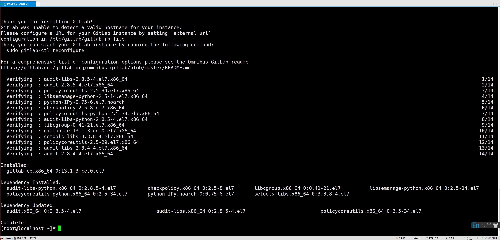

# Gitlab


## 安装

**国内的源速度比较快**/**阿里源**/**清华源**

PS：还可以自己搭建本地yum源的服务器，集群内部为了速度，可以搭建本地yum源

```sh
vim /etc/yum.repos.d/gitlab-ce.repo

[gitlab-ce]
name=Gitlab CE Repository
baseurl=https://mirrors.tuna.tsinghua.edu.cn/gitlab-ce/yum/el$releasever/
gpgcheck=0
enabled=1

yum makecache && yum install -y gitlab-ce
```



### 修改配置文件进行配置

```sh
vim /etc/gitlab/gitlab.rb

external_url 'http://IP'

gitlab-ctl reconfigure
```

### 访问登录

```sh
# 默认账号 root
# 默认密码
cat /etc/gitlab/initial_root_password
```


## Issues

### 里程碑 milestone


## 常见问题


## 面试题

### Redis搭建这个服务的时候有哪些要点？

Redis 默认密码的问题服务器不安全 有可能被黑

