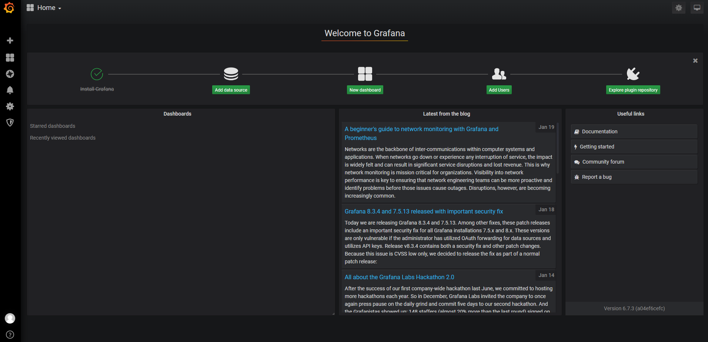

# Grafana

## 安装

1、离线安装

- 下载rpm离线安装包 

  grafana-6.7.3-1.x86_64.rpm

- 安装

  ```sh
  # localinstall: 自动安装所需依赖
  yum localinstall -y grafana-6.7.3-1.x86_64.rpm
  systemctl daemon-reload
  ```

- 运行

  ```sh
  systemctl start grafana-server && systemctl enable grafana-server
  ```

- 测试

  IP:3000

  

  初始账号/密码: admin/admin

  

## 导入数据源


## 导入仪表板


