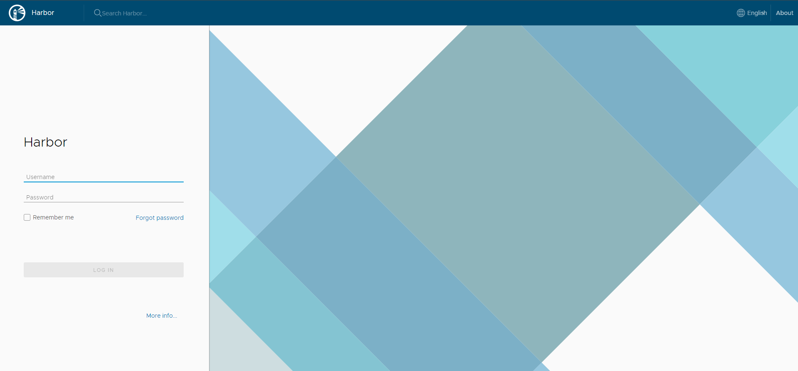
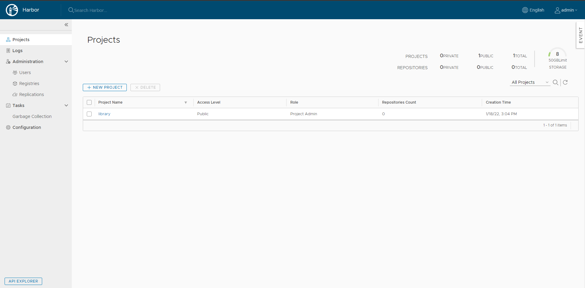
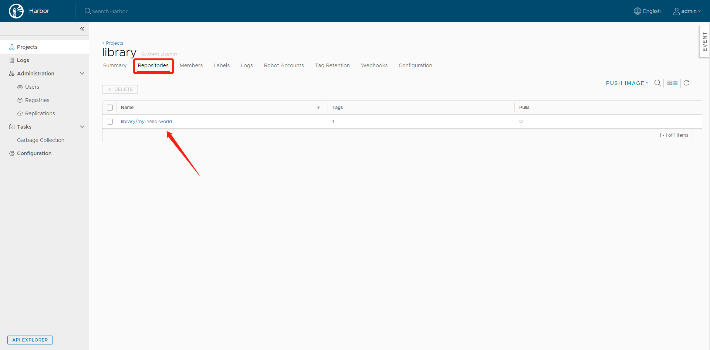

# Harbor

容器私有镜像仓库，依赖docker、docker-compose

## 安装

[官方安装文档](https://goharbor.io/docs/2.4.0/install-config/installation-prereqs/)

```sh
# 下载好离线安装包，解压
# 修改配置
vim harbor.yml

hostname: IP
# admin默认密码
harbor_admin_password: Harbor12345

# 执行脚本，下载相关容器镜像
./prepare

# 执行脚本
./install

docker ps
IMAGE             
goharbor/harbor-jobservice:v1.9.4 
goharbor/nginx-photon:v1.9.4
goharbor/harbor-core:v1.9.4
goharbor/registry-photon:v2.7.1-patch-2819-2553-v1.9.4
goharbor/harbor-db:v1.9.4
goharbor/harbor-portal:v1.9.4
goharbor/harbor-registryctl:v1.9.4
goharbor/redis-photon:v1.9.4
goharbor/harbor-log:v1.9.4

# 运行后会在harbor目录创建docker-compose.yml，重启服务器或重启docker需要手动运行重启harbor容器
```

### 将harbor安装为服务

注意docker-compose和harbor的安装目录

```sh
vim /lib/systemd/system/harbor.service

[Unit]
Description=harbor
After=docker.service systemd-networkd.service systemd-resolved.service
Requires=docker.service
Documentation=http://github.com/vmware/harbor

[Service]
Type=simple
Restart=on-failure
RestartSec=5
ExecStart=/usr/bin/docker-compose -f  /opt/harbor/docker-compose.yml up
ExecStop=/usr/bin/docker-compose -f  /opt/harbor/docker-compose.yml down

[Install]
WantedBy=multi-user.target


# 开启启动
systemctl enable harbor.service
```

## 测试

默认账号/密码：admin/Harbor12345



主界面



## 客户端

### 配置私库

```sh
vim /etc/docker/daemon.json

{
   "registry-mirrors" : [
        "https://9wlwfm48.mirror.aliyuncs.com"
   ],
   "insecure-registries":[
        "10.0.0.99"
   ]
}

systemctl daemon-reload
systemctl restart docker
```

### 连接

```sh
docker login 10.0.0.99

Username: admin
Password: 

WARNING! Your password will be stored unencrypted in /root/.docker/config.json.
Configure a credential helper to remove this warning. See
https://docs.docker.com/engine/reference/commandline/login/#credentials-store

Login Succeeded

```

### 自定义镜像推送到私库

```sh
docker pull hello-world

# 10.0.0.99/library/my-hello-world:v1
# 10.0.0.99: harbor镜像仓库地址
# library: harbor项目名
# my-hello-world: 镜像名
# v1: tag
docker tag hello-world:latest 10.0.0.99/library/my-hello-world:v1

# 推送
docker push 10.0.0.99/library/my-hello-world:v1
```

