# Jenkins

## 安装

### 安装jdk

```sh
yum install -y java-1.8.0-openjdk*

export JAVA_HOME=/usr/lib/jvm/java-1.8.0-openjdk-1.8.0.312.b07-2.el8_5.x86_64
export PATH=$PATH:$JAVA_HOME/bin:$JAVA_HOME/jre/bin
```

### 安装jenkins

```sh
# 参考清华源 https://mirrors.tuna.tsinghua.edu.cn/jenkins/redhat-stable/
yum install -y https://mirrors.tuna.tsinghua.edu.cn/jenkins/redhat-stable/jenkins-2.263.2-1.1.noarch.rpm
```

### 运行

```sh
systemctl start jenkins

# 运行jenkins服务，访问jenkins主页后，会在/var/lib/jenkins/生成一堆文件
```

### 修改插件源

```sql
sed -i 's/http:\/\/updates.jenkins-ci.org\/download/https:\/\/mirrors.tuna.tsinghua.edu.cn\/jenkins/g' /var/lib/jenkins/updates/default.json && sed -i 's/http:\/\/www.google.com/https:\/\/www.baidu.com/g' /var/lib/jenkins/updates/default.json

systemctl restart jenkins
```


## 配置

```sh
vim /etc/sysconfig/jenkins

# 端口
# 用戶
```


## 插件安裝

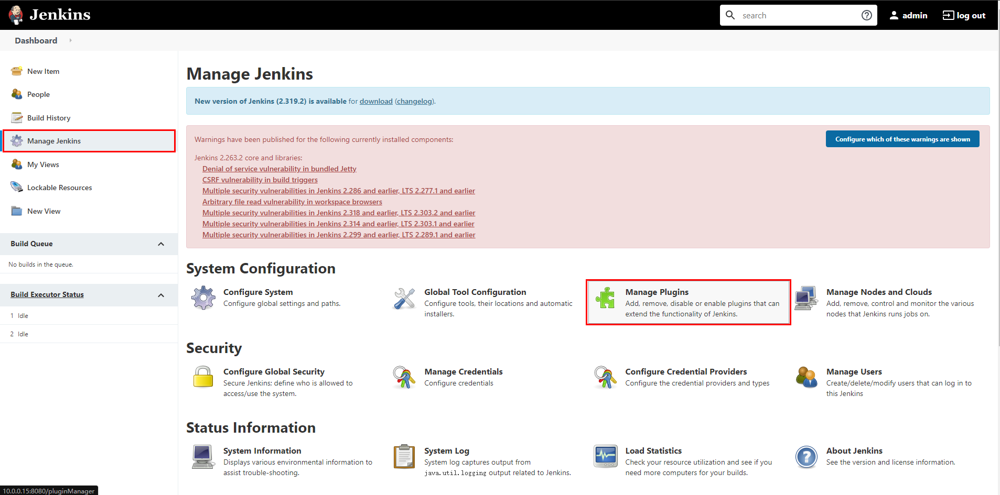


### maven

jenkins利用maven插件调用本地maven构建基于maven的java项目

在服务器手动安装指定版本的maven

```sh
# 下载 https://maven.apache.org/download.cgi
#      https://dlcdn.apache.org/maven/maven-3/
wget https://dlcdn.apache.org/maven/maven-3/3.6.3/binaries/apache-maven-3.6.3-bin.tar.gz

tar -zxf apache-maven-3.6.3-bin.tar.gz
mv apache-maven-3.6.3-bin.tar.gz maven

# 配置环境变量
vim /etc/profile
export M2_HOME=/usr/local/maven
export PATH=$PATH:$JAVA_HOME/bin:$JAVA_HOME/jre/bin:$M2_HOME/bin
source /etc/profile

# 配置maven仓库源
vim maven_path/conf/settings.xml

<mirror>
    <id>nexus-aliyun</id>
    <name>Nexus aliyun</name>
    <url>http://maven.aliyun.com/nexus/content/groups/public/</url>
    <mirrorOf>central</mirrorOf>
</mirror>

# 验证
mvn -v
```

**jenkins安装maven插件**

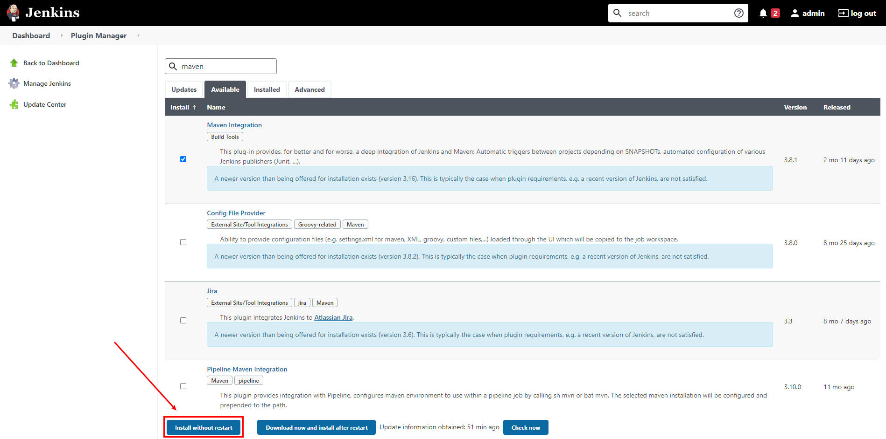

### git

jenkins利用git拉取gitlab源码仓库，再利用maven编译打包

```sh
yum install -y git
```

**jenkins安装gitlab插件**

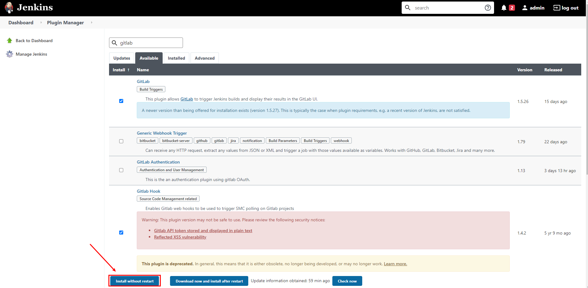

### 配置工具路径

访问http://IP/configureTools/配置

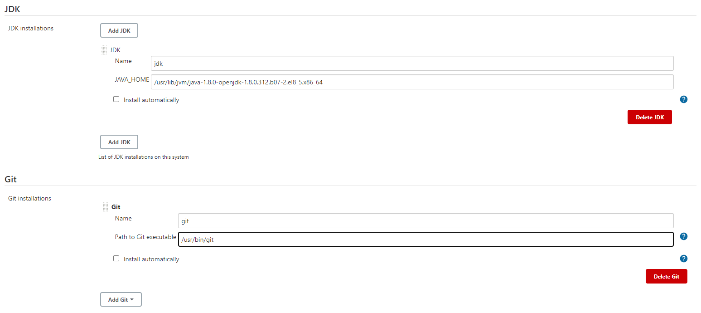

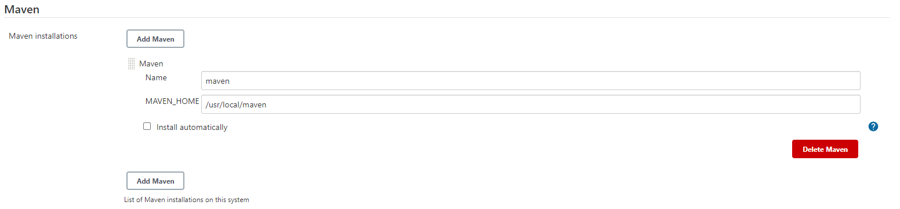

## 测试

### 手动构建、发布maven项目

创建任务

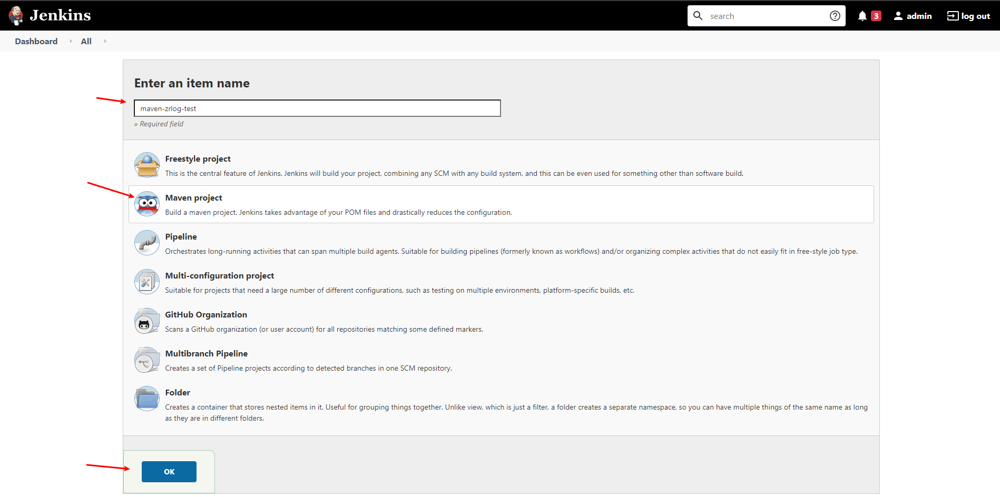

删除旧的构建配置

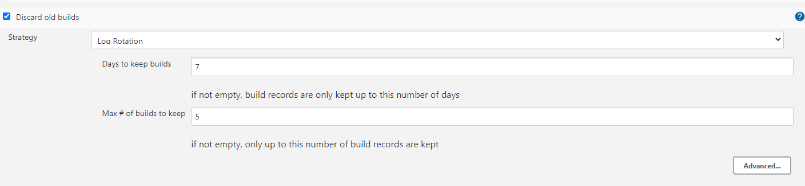

项目仓库，第一次需要配置gitlab的账号密码，以后可以直接选择

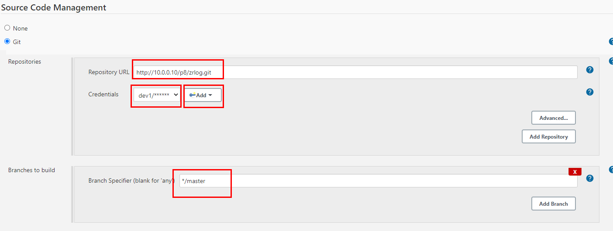

maven构建命令，跳过测试环节

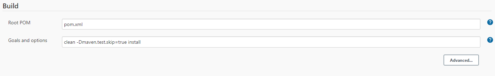

立即构建

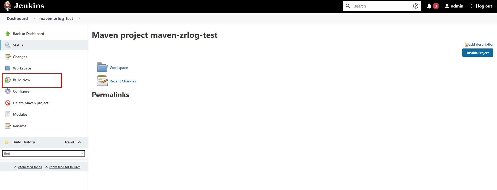

查看构建信息

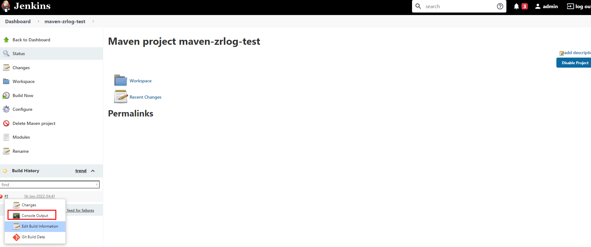

构建成功

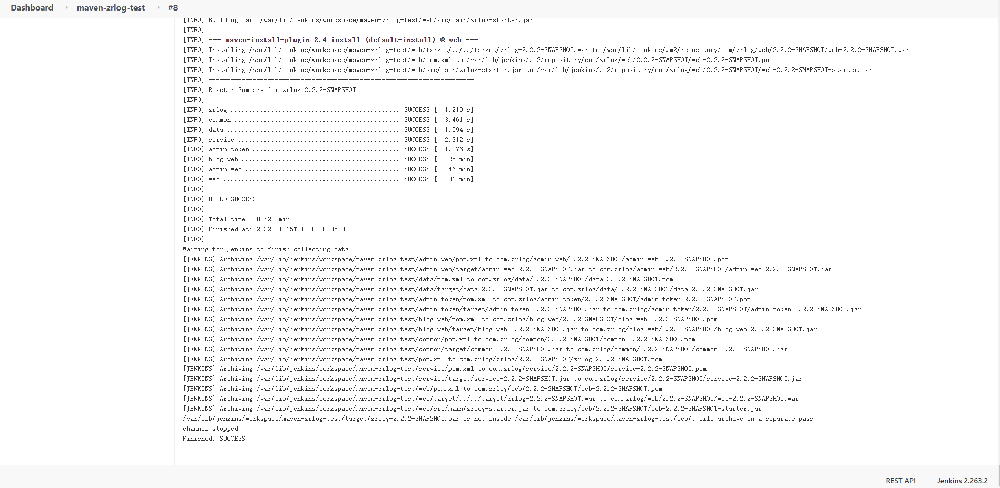

### 自动化构建、发布

在上面的基础继续配置

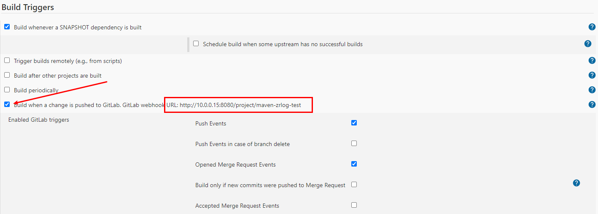

勾选上面的选项后，点击右面的高级打开更多配置项，获取秘钥

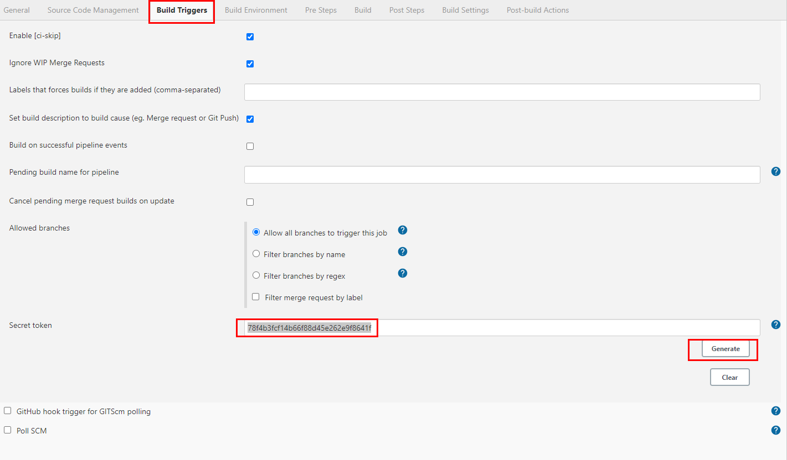

在gitlab的项目中配置webhooks

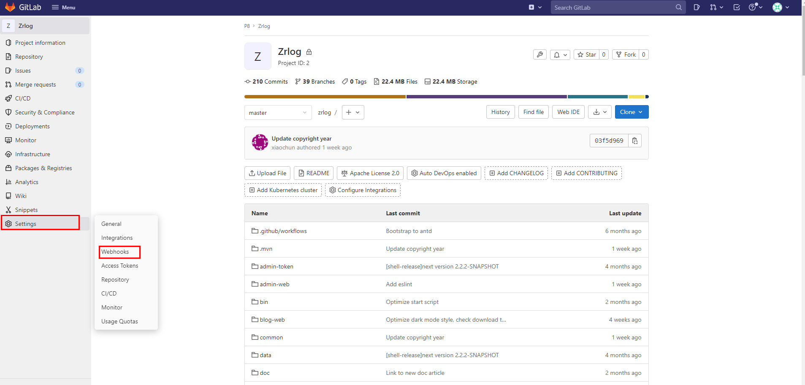

将jenkins的配置粘贴过来

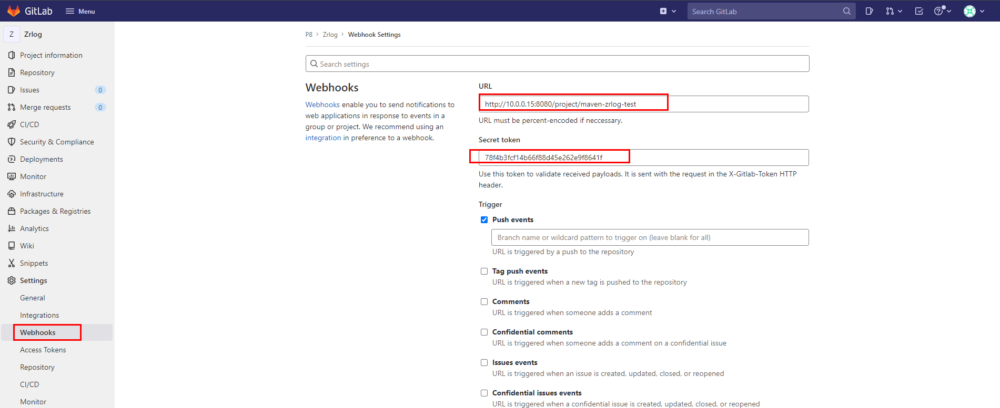

最后添加webhooks的时候报错

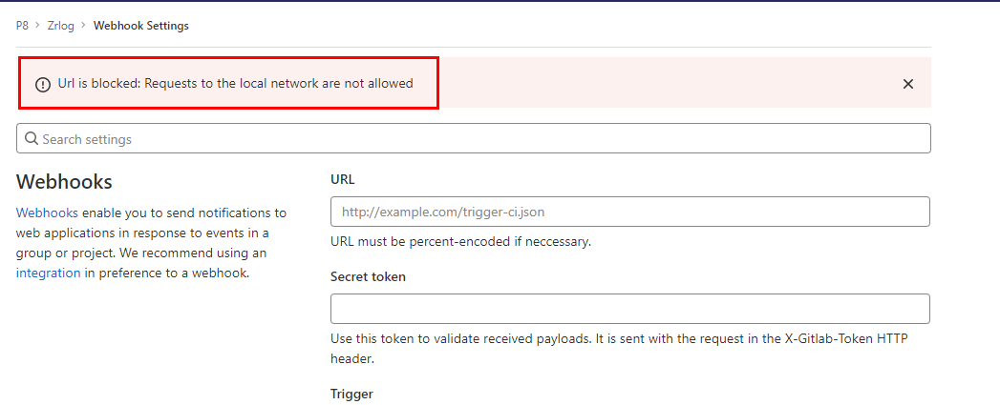

配置gitlab，解决错误

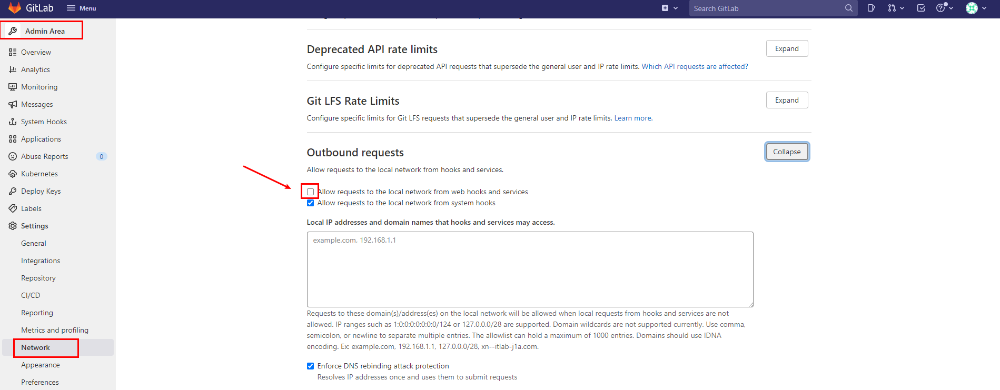

重新添加webhooks成功

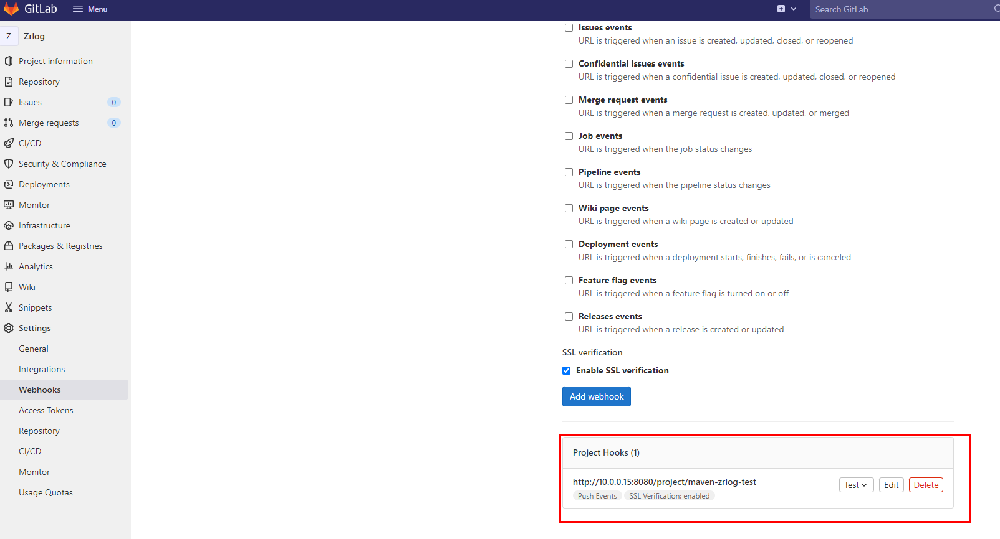        

修改项目代码并提交，观察jenkins正在自动构建

### war包部署

安装插件

### jar包部署


## 常见问题

### 界面等待时间长


```sh
vim /var/lib/jenkins/hudson.model.UpdateCenter.xml

<?xml version='1.1' encoding='UTF-8'?>
<sites>
  <site>
    <id>default</id>
    <url>https://mirrors.tuna.tsinghua.edu.cn/jenkins/updates/update-center.json</url>
  </site>
</sites>

```

