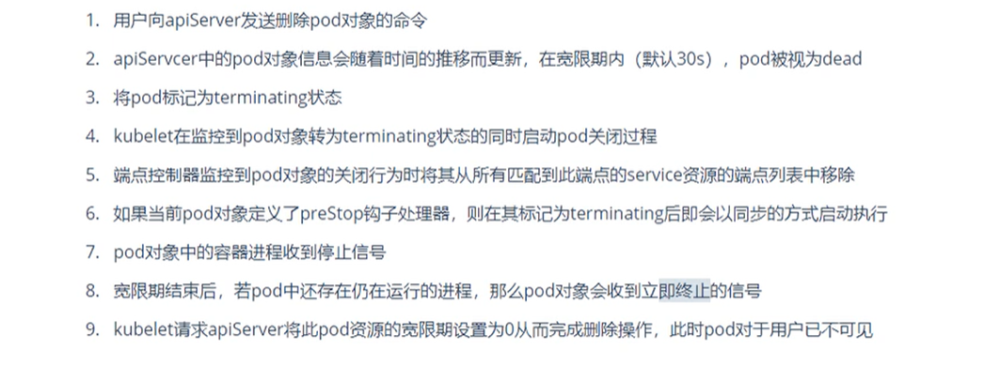
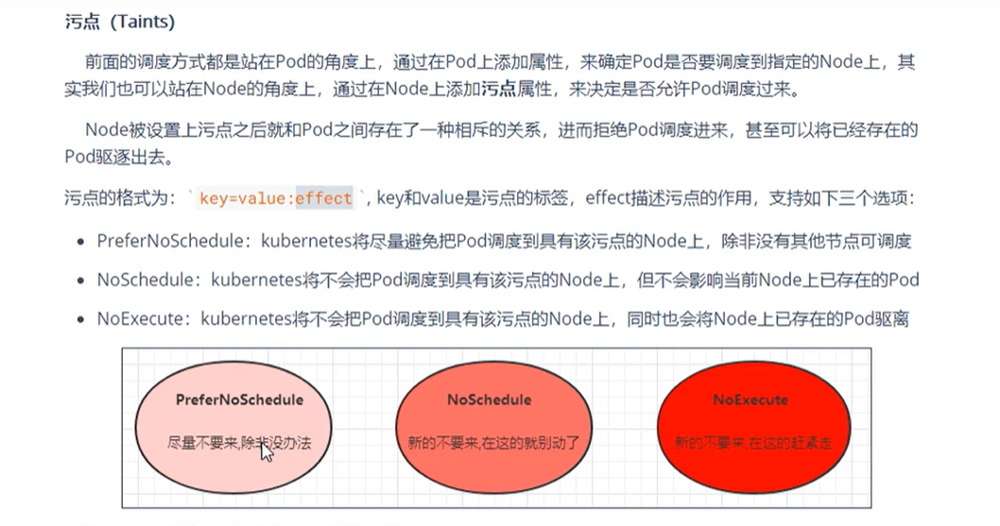

# Pod

## Pod介绍

K8s最小的操作单元，一个Pod可以包含一个或多个的容器

**Pause容器**

特殊的每个Pod都会带一个叫做**Pause**的容器，主要负责僵尸进程的回收管理，通过Pause容器可以让同一个Pod里面的多个容器共享存储，网络，PID，IPC等

### Pod结构


### Pod定义

```sh
# 查看资源的定义项
$ kubectl explain pod
# 结果中说明了需要配置的版本

$ kubectl explain pod.metadata
```

**定义配置**

```sh
apiVersion: v1          # 必选，版本号 kubectl api-versions
kind: Pod               # 必选，资源类型 kubectl api-resources
metadata:               # 必选，元素据，主要是资源标识的说明
  name: nginx           # 必须小写
  namespace: dev
  labels:               # 标签，用于筛选
    k1: v1
    k2: v2
  annotations:          # 注释
    version: 1
spec:                   # 必选，规格，详细说明
  containers:
  - name: nginx1
    image: nginx
    command:            # 容器启动命令列表，如果不指定，使用打包时的启动命令
    -
    args:               # 容器启动时的参数列表
    -
    env: 
    -
    ports:              # 容器需要暴露的端口列表
    -
    resources:          # 资源限制和资源请求的设置
  initContainers:       # 容器启动之前执行的一些初始化操作
  - command: ["sh","-c","echo asdsad"]
    image: busybox
  nodeName:             # 指定node节点调度
  nodeSelector:         # node节点调度选择器
  hostNetwork:          # 是否使用主机网络模式，默认为false，如果设置true，使用宿主机网络
  volumes:              
  restartPolicy:        # 重启策略
status:                 # pod状态，不需要人为配置，由k8s自动维护 kubectl get po podname -o yaml
```

**测试**

```sh
apiVersion: v1
kind: Pod
metadata:
  name: pod-base
  namespace: dev
spec:
  containers:
  - name: nginx
    image: nginx
  - name: busybox
    image: busybox
------------------
$ kubectl apply -f pod-base.yaml
$ kubectl get po pod-base -n dev

NAME       READY   STATUS     RESTARTS   AGE
pod-base   1/2     NotReady   2          115s
# 发现该pod中只ready了一个容器

$ kubectl describe po pod-base -n dev
# 发现busybox一直在重试，后续解决

# 查看集群操作事件，可用来做监控
$ kubectl get event
```


## Pod配置

### 镜像拉取策略

> imagePullPolicy

- 如果镜像指定了tag，默认策略为：IfNotPresent
- 如果镜像没有指定tag，默认策略为：Always
- Nerver 每次都从镜像仓库拉取

### 启动命令

```sh
# busybox 并不是一个程序，而是一个工具类，这个容器没有一个进程占据，它会自动关闭，解决办法是让它一直运行

--------------------
apiVersion: v1
kind: Pod
metadata:
  name: pod-command
  namespace: dev
spec:
  containers:
  - name: nginx
    image: nginx
    imagePullPolicy: IfNotPresent
  - name: busybox
    image: busybox
    imagePullPolicy: IfNotPresent
    command: 
    - "/bin/sh"
    - "-c"
    - "touch tmp/hello.txt;while true;do /bin/echo $(date +%T) > /tmp/hello.txt;sleep 5;done;"
--------------------

# 进入容器
$ kubectl exec -it pod-command -n dev -c busybox /bin/sh
```


### 环境变量

```sh
spec:
 containers:
    env:
    - name: "pwd"          # 这种方法不推荐，后续推荐
      value: "123"
    - name: "user"
      value: "123"
```


### 端口设置


```sh
------------------
apiVersion: v1
kind: Pod
metadata:
  name: pod-port
  namespace: dev
spec:
  containers:
  - name: nginx1
    image: nginx
    imagePullPolicy: IfNotPresent
    ports:
    - name: nginx-port1               # 端口名称，如果指定，同一个pod中唯一
      protocol: TCP                   # TCP UDP
      containerPort: 80               # 容器要监听的端口，同一个pod中唯一
      # hostPort                      # 一般不设置，将外部端口绑定到的主机IP
  - name: nginx2
    image: nginx
    imagePullPolicy: IfNotPresent
    ports:
    - name: nginx-port2
      protocol: TCP
      containerPort: 8080
```


### 资源配额


```sh
spec:
  containers:
    resources:
      limits:                  # 资源限制
        cpu: "2"               # cpu核数限制 2 = 2000m
        memory: "10Gi"         # 内存限制
      requests:                # 资源需求
        cpu: "1"               # 至少需要1核
        memory: "10Mi"         # 至少需要10M
```


## Pod生命周期


**pod的装填**

- 挂起 Pending        # api-server已经创建了pod资源对象，但它尚未被调度完成或者仍处于下载镜像的过程
- 运行中 Running    # pod已经被调度到某个节点，并且所有容器都已经被kubelet创建完成 
- 成功 Succeeded   # pod中的所有容器都已经成功终止并且不会被重启
- 失败 Faild             # 所有容器都已经终止，但至少有一个容器终止失败，即容器返回了非0值的退出状态
- 未知 Unknown     # api-server无法获取pod的状态信息


### 创建和终止

**创建**


**终止**




### 初始化容器

 

```sh
apiVersion: v1
kind: Pod
metadata:
  name: pod-initcontainer
  namespace: dev
spec:
  containers:
  - name: nginx1
    image: nginx
    imagePullPolicy: IfNotPresent
  initContainers:
  - name: test-mysql
    # 乱写的测试
    image: busybox
    imagePullPolicy: IfNotPresent
    # 一直ping直到成功
    command: ['sh','-c','until ping 192.168.109.201 -c 1;do echo waiting for mysql...;sleep 2 done;']
  - name: test-redis
    image: busybox
    imagePullPolicy: IfNotPresent
    command: ['sh','-c','until ping 192.168.109.202 -c 1;do echo waiting for redis...;sleep 2 done;']
-------------------------

# 运行pod后，发现状态是init:0/2

# 添加网卡
ifconfig ens33:t1 192.168.109.201 netmask 255.255.0.0 up
# 发现状态是 init:1/2

# 添加网卡
ifconfig ens33:t1 192.168.109.202 netmask 255.255.0.0 up
# 发现pod状态是 Running

```


### 钩子函数

- 容器启动后 **postStart**：容器创建之后执行，如果失败了会重启容器
  - **一般初始化工作会使用 initContainners 中做**
  - 不能保证在 containners 的 `CMD` 或`EntryPoint`之前触发
- 容器终止前 **preStop**：容器终止之前执行，执行完成之后容器将成功终止，在其完成之前会阻塞删除容器的操作
  - 资源中有一个叫 `terminationGracePeriodSeconds`的配置，默认30s，是资源被删除时的一个宽限期
  - 当一个容器被删除时的流程：
    - K8s执行preStop指定的指令
    - EndPoint删除该Pod的IP地址
    - Pod的状态改为Terminating
  - 使用场景：
    - 如果项目使用了Eureka做注册中心，preStop先去请求Eureka接口，把自己的IP地址和端口进行下线，Eureka从注册表删除该应用的IP地址，通常还需要让容器先停留一段时间完成剩余工作


钩子处理器支持三种方式定义动作：

- Exec：在容器内执行命令，如果返回值为0，表示健康（ **echo $?** 可以查看命令执行的结果值）

  - ```sh
    spec:
      containers:
      - lifecycle:
          postStart:
            exec:
              command:
              - cat
              - /tmp/healthy
    ```
    
  - 示例：零宕机下线

  - ```sh
    spec:
      terminationGracePeriodSeconds: 30
      containers:
      - lifecycle:
          postStart:
            exec:
              command: ["sh","-c","slepp 35"]
    ```

  - 

- TCPSocket：尝试访问指定的socket

  - ```sh
    lifecycle:
      postStart:
        tcpSocket:
          port: 8080
    ```

- HTTPGet：访问一个地址，如果状态码在200~400，表示健康

  - ```sh
    lifecycle:
      postStart:
        httpGet:
          port: 80
          path: /
          host: www.baidu.com
          scheme: HTTP
    ```

**测试**

```yaml
...
spec:
    lifecycle: 
      postStart:
        exec:
          command: ['sh','-c','echo vansama on post start > /usr/share/nginx/html/index.html']
      preStop:
        exec:
          command: ["/usr/sbin/nginx","-s","quit"]
```


### 容器探测

零宕机应用发布

- 存活性探针 livenessProbe：用于检测当前实例是否处理正常运行状态，如果不是，容器将被重启
- 就绪性探针 readinessProbe：用于检测应用实例当前是否可以接受请求，如果不能，k8s不会转发流量
- startupProbe：1.16版本后添加，用于检测容器内进程是否完全启动，优先于其他的探针执行，直到它成功为止

#### livenessProbe

> **说明：** livenessProbe不等待readinessProbe成功。 如果要在执livenessProbe之前等待，应该使用 initialDelaySeconds 或 startupProbe。

#### readinessProbe

有时候，应用程序会暂时性的不能提供通信服务。 例如，应用程序在启动时可能需要加载很大的数据或配置文件，或是启动后要依赖等待外部服务。 在这种情况下，既不想杀死应用程序，也不想给它发送请求。 Kubernetes 提供了就绪探测器来发现并缓解这些情况。 容器所在 Pod 上报还未就绪的信息，并且不接受通过 Kubernetes Service 的流量。

> **说明：** 就绪探测器在容器的整个生命周期中保持运行状态。

#### startupProbe

一般用于启动过程比较长，启动时间不确定的应用检测，用它加上livenessProbe来解决此类问题，如果单独使用livenessProbe，那么要增加失败次数或者检测间隔时间，此时如果容器在运行期间挂了，那么会延长容器的故障发现时长。为了解决此类问题，可以配合startupProbe，在startupProbe中增加失败次数或者检测间隔时间，只有启动的时候执行一次，后续存活性探测不受影响

[startupProbe](https://zhuanlan.zhihu.com/p/121596793?utm_source=wechat_timeline)

```yaml
# startupProbe  启动检查
----------------------------------
startupProbe:                     #健康检查方式：[readinessProbe,livenessProbe,StartupProbe]
  failureThreshold: 3             #检测失败3次表示未就绪
  httpGet:                        #请求方式
    path: /ready                  #请求路径
    port: 8182                    #请求端口
    scheme: HTTP                  #请求协议
  periodSeconds: 10               #检测间隔
  successThreshold: 1             #检查成功为2次表示就绪
  timeoutSeconds: 1               #检测失败1次表示未就绪
----------------------------------
```


### 重启策略


## Pod调度


### 定向调度

配置定向调度，会跳过schedule的调度逻辑，**如果配置的调度节点不存在，则pod无法启动**

```yaml
# nodeName 节点名调度
...
spec:
  nodeName: node1
------------------
# nodeSelector label选择调度
...
spec:
  nodeSelector: 
    k1: v1
```


### 亲和性调度

- nodeAffinity：以node为目标，在亲和度大的node上调度pod
- podAffinity：以pod为目标，在亲和度大的pod的node上调度pod
- podAntiAffinity：以pod为目标，不在指定pod的node上调度

> 亲和性：如果两个应用频繁交互，那就用亲和性让两个应用尽可能靠近，减少网络通信损耗
>
> 反亲和性：当部署的应用采用多副本部署时，有必要采用反亲和性让各个应用打散分部到各个node上，提高可用性

**nodeAffinity**

```yaml
spec:
  affinity:
    nodeAffinity:                                                # 如果另外定义了nodeSelector，需要同时满足条件才能调度
      requiredDuringSchedulingIgnoredDuringExecution:            # 硬性限制，必须满足的条件
        nodeSelectorTerms:                                       # 存在多个时，满足一个即可调度
        - matchFields:                                           # 匹配节点字段
          - key: 键
            operator: Exists                                     # 关系符：In NotIn Exists Gt Lt DoesNotExists
            value: 值
        - matchExpressions:                                      # 匹配节点标签（推荐）存在多个时，满足所有才能调度
          - key:
            operator: In                                         # 关系符
            values:
            
      preferredDuringSchedulingIgnoredDuringExecution:           # 软性限制，优先选择满足条件
        weight: 1                                                # 权重
```

测试

```yaml
apiVersion: v1
kind: Pod
metadata:
  name: pod-node-affinity
  namespace: dev
spec:
  containers:
  - name: nginx1
    image: nginx
    imagePullPolicy: IfNotPresent
  affinity:
    nodeAffinity: 
      requiredDuringSchedulingIgnoredDuringExecution: 
        nodeSelectorTerms: 
        - matchExpressions:
          - key: env
            operator: In
            values: ['dev1']
            
# 结果状态为Pending，因为没有一个node的label存在env=dev1
NAME                            READY   STATUS             RESTARTS   AGE
pod-node-affinity               0/1     Pending            0          21s
```

**podAffinity**

```yaml
spec:
  affinity:
    nodeAffinity:                                                # 
      requiredDuringSchedulingIgnoredDuringExecution:            # 硬性限制，必须满足的条件
        namespace:                                               # 指定惨遭的命名空间
        topologkey:                                              # 指定调用域
        labelSelector:
          matchExpressions: 
          matchLabels:                                           # 用于指定matchExpressions数组
```

```sh
# topologkey
#   kubernetes.io/hostname（常用）
#   kubernetes.io/os
```


**podAntiAffinity**

配置方式同podAffinity


**拓朴域 topologKey**

​	拓扑域使亲和度可以达到更细粒度的控制，不同的node中label的key和value相同表示为同一拓扑域，如：area=beijing


测试：利用拓扑域实现多地多机房部署


### 污点taint调度



```sh
# 设置污点
$ kubectl taint nodes node1 key=value:effect

# 去除污点
$ kubectl taint nodes node1 key:effect-

# 去除所有污点
$ kubectl taint nodes node1 key-
```

 **测试**

```sh
$ kubectl describe node master1

Taints:             node-role.kubernetes.io/master:NoSchedule
# master节点默认是NoSchedule
```


### 容忍


**测试**

```sh
apiVersion: v1
kind: Pod
metadata:
  name: pod-node-affinity
  namespace: dev
spec:
  containers:
  - name: nginx1
    image: nginx
    imagePullPolicy: IfNotPresent
  tolerations:
  - key: "tag"            # 要容忍的污点k
    operator: "Equal"
    value: "test"         
    effect: "NoExecute"
    # tolerationSeconds: 60 # 当容忍规则为NoExecute时生效，标识pod在node上的停留时间（少用）
```

