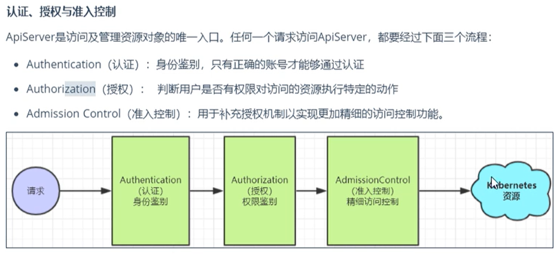

## 安全认证




## RBAC

[官方文档](https://kubernetes.io/zh/docs/reference/access-authn-authz/rbac/)

### Role

​	角色，包含一组权限，Namespace隔离

资源清单

```yaml
apiVersion: rbac.authorization.k8s.io/v1
kind: Role
metadata:
  annotations:
    meta.helm.sh/release-name: ingress-nginx
    meta.helm.sh/release-namespace: ingress-nginx
  creationTimestamp: "2021-09-18T03:36:42Z"
  labels:
    app.kubernetes.io/name: ingress-nginx
    helm.sh/chart: ingress-nginx-4.0.1
  managedFields:
  - apiVersion: rbac.authorization.k8s.io/v1
    manager: helm
    operation: Update
    time: "2021-09-18T03:36:42Z"
  name: ingress-nginx
  namespace: ingress-nginx
rules:
- apiGroups:            # 一个权限组
  - ""
  resources:            # 资源名称
  - namespaces
  verbs:                # 资源操作权限
  - get
- apiGroups:
  - ""
  resources:
  - configmaps
  - pods
  - secrets
  - endpoints
  verbs:
  - get
  - list
  - watch
- apiGroups:
  - networking.k8s.io
  resources:
  - ingresses
  verbs:
  - get
  - list
  - watch
- apiGroups:
  - ""
  resourceNames:                 # 只能对 resources 中的资源名称为 ingress-controller-leader 的资源操作
  - ingress-controller-leader
  resources:
  - configmaps
  verbs:
  - get
  - update

```


### ClusterRole

​	相对于Role的区别在于，ClusterRole作用于整个集群

```sh
# 测试
$ kubectl get clusterrole view -oyaml
```

资源清单

```yaml
apiVersion: rbac.authorization.k8s.io/v1
kind: ClusterRole
metadata:
  # "namespace" 被忽略，因为 ClusterRoles 不受名字空间限制
  name: secret-reader
rules:
- apiGroups: [""]
  # 在 HTTP 层面，用来访问 Secret 对象的资源的名称为 "secrets"
  resources: ["secrets"]
  verbs: ["get", "watch", "list"]
```


### RoleBinding

​	作用于Namespace，将Role或ClusterRole绑定到User、Group、ServiceAccount

资源清单

```yaml
apiVersion: rbac.authorization.k8s.io/v1
# 此角色绑定允许 "jane" 读取 "default" 名字空间中的 Pods
kind: RoleBinding
metadata:
  name: read-pods
  namespace: default         # 在此命名空间中的 subjects
subjects:
# 你可以指定不止一个“subject（主体）”
- kind: User
  name: jane # "name" 是区分大小写的
  apiGroup: rbac.authorization.k8s.io
roleRef:
  # "roleRef" 指定与某 Role 或 ClusterRole 的绑定关系
  kind: Role # 此字段必须是 Role 或 ClusterRole
  name: pod-reader     # 此字段必须与你要绑定的 Role 或 ClusterRole 的名称匹配
  apiGroup: rbac.authorization.k8s.io

```


### ClusterRoleBingding

​	作用于集群


### ServiceAccount

​	指定到deploy、daemonSet、pod等资源上，让这些资源拥有ServiceAccount所绑定角色的所有权限

```sh
# 创建sa
$ kubectl create sa test

# 查看
$ kubectl get secret

# 发现多了一个以sa名称开头的secret

# 查看secret详细信息，里面有token字段，可以用于登录一些dashboard系统
$ kubectl describe secret test-token-pr6c6
```

