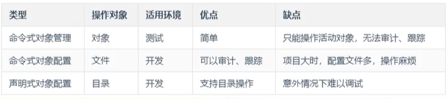

# 资源管理

## 资源介绍


### 资源管理方式

- 命令式对象管理

  - ```sh
    kubectl run [pod控制器名称]/[pod名称] [args]
    ```

- 命令式对象配置

  - ```sh
    kubectl create/patch -f nginx-pod.yaml
    ```

- 声明式对象配置（用于创建和更新资源的结合体）

  - ```sh
    kubectl apply -f nginx-pod.yaml
    ```



#### 命令式对象管理

```sh
# kubectl command type [name] [flags]
#   command: create, get, delete
#	type: nodes, pod[po], service[svc]...

# 查看所有可用type，包含type的简写
$ kubectl api-resources

# 查看	pod
$ kubectl get po nginx-6799fc88d8-z49rp -o wide

NAME                     READY   STATUS    RESTARTS   AGE   IP           NODE    NOMINATED NODE 
nginx-6799fc88d8-z49rp   1/1     Running   0          42m   10.244.2.6   node2   <none>           

```


#### 命令式对象配置

```sh
# 创建一个nginxpod.yaml
$ vi nginxpod.yaml

-----------------------------
# 创建命名空间
apiVersion: v1
kind: Namespace
metadata:
  name: dev
---
# 创建pod
apiVersion: v1
kind: Pod
metadata:
  name: nginxpod
  namespace: dev
spec:
  # 创建容器
  containers:
  - name: nginx-containers
    image: nginx
-----------------------------

# 创建
$ kubectl create -f nginxpod.yaml 

namespace/dev created
pod/nginxpod created

# 删除
$ kubectl delete -f nginxpod.yaml 

namespace "dev" deleted
pod "nginxpod" deleted

```


#### 声明式对象配置

```sh
# 使用上面创建好的nginxpod.yaml

# 创建
$ kubectl apply -f nginxpod.yaml 

namespace/dev created
pod/nginxpod created

# 再次运行
$ kubectl apply -f nginxpod.yaml 

namespace/dev unchanged
pod/nginxpod unchanged

# 如果yaml文件修改过，如镜像的版本修改了，那么再次运行就会修改pod
```


## 准入控制

### LimitRanges

​	[官方文档](https://kubernetes.io/zh/docs/concepts/policy/limit-range/)

​	默认情况下， Kubernetes 集群上的容器运行使用的[计算资源](https://kubernetes.io/zh/docs/concepts/configuration/manage-resources-containers/)没有限制。 使用资源配额，集群管理员可以以[名字空间](https://kubernetes.io/zh/docs/concepts/overview/working-with-objects/namespaces/)为单位，限制其资源的使用与创建。 在命名空间中，一个 Pod 或 Container 最多能够使用命名空间的资源配额所定义的 CPU 和内存用量。 有人担心，一个 Pod 或 Container 会垄断所有可用的资源。 LimitRange 是在命名空间内限制资源分配（给多个 Pod 或 Container）的策略对象。

一个 *LimitRange（限制范围）* 对象提供的限制能够做到：

- 在一个命名空间中实施对每个 Pod 或 Container 最小和最大的资源使用量的限制。
- 在一个命名空间中实施对每个 PersistentVolumeClaim 能申请的最小和最大的存储空间大小的限制。
- 在一个命名空间中实施对一种资源的申请值和限制值的比值的控制。
- 设置一个命名空间中对计算资源的默认申请/限制值，并且自动的在运行时注入到多个 Container 中


###  ResourceQuotas

​	[官方文档](https://kubernetes.io/zh/docs/concepts/policy/resource-quotas/)

​	当多个用户或团队共享具有固定节点数目的集群时，人们会担心有人使用超过其基于公平原则所分配到的资源量。资源配额是帮助管理员解决这一问题的工具。

​	资源配额，通过 `ResourceQuota` 对象来定义，对每个命名空间的资源消耗总量提供限制。 它可以限制命名空间中某种类型的对象的总数目上限，也可以限制命令空间中的 Pod 可以使用的计算资源的总上限。


### QOS 服务质量

​	当k8s服务器的资源不够用的时候，k8s会删除一些资源来保证k8s服务的正常

- Guaranteed ：最高服务质量，limit 和 request 配置的值一致，最后被删除
- Burstable ：不稳定的，limit 和 request 配置的值不一致
- BestEffort ：尽力而为，没有配置 limit 和 request ，最先被删除


### PodPreset

​	在 Pod 创建时，用户可以使用 PodPreset 对象将特定信息注入 Pod 中，这些信息可以包括 Secret、卷、卷挂载和环境变量


#### 开启PodPreset

​	[官方文档](https://v1-18.docs.kubernetes.io/zh/docs/concepts/workloads/pods/podpreset/)

#### 使用PodPreset

​	[官方文档](https://v1-18.docs.kubernetes.io/zh/docs/tasks/inject-data-application/podpreset/)

```yaml
apiVersion: settings.k8s.io/v1alpha1
kind: PodPreset
metadata:
  name: allow-database
spec:
  selector:            # 不写匹配所有Pod？
    matchLabels:
      role: frontend
  env:
    - name: DB_PORT
      value: "6379"
  volumeMounts:                                          # 所有Pod挂载宿主机时区文件，同步Pod时间
    - mountPath: /usr/share/zoneinfo/Asia/Shanghai
      name: tz-config
      readOnly: true
    - mountPath: /etc/localtime
      name: tz-config2                   # podPreset 不允许挂载同名volume
      readOnly: true
    - mountPath: /etc/timezone
      name: timezone
      readOnly: true
  volumes:
    - name: tz-config
      hostPath: 
        path: /usr/share/zoneinfo/Asia/Shanghai
    - name: tz-config2
      hostPath: 
        path: /usr/share/zoneinfo/Asia/Shanghai
    - name: timezone
      hostPath:
        path: /etc/timezone
```

> 配置一个annotation可以让pod忽略podPreset


## 扩展：kubectl

> kubectl默认不支持在node节点上运行

kubectl的运行需要配置的，它的配置文件是$HOME/.kube，如果想要在node节点上运行命令，需要将master的.kube文件复制到node节点上

```sh
scp -r ~/.kube node1:~/
```

