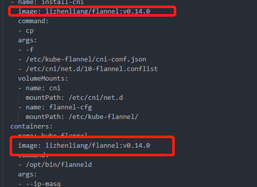
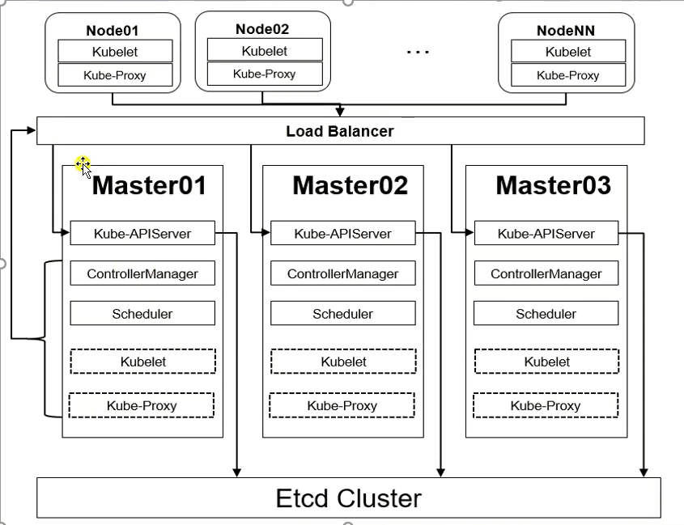
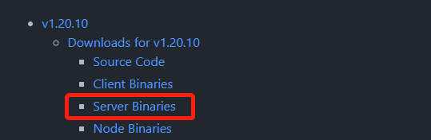

# 集群环境搭建

## Kubeadm搭建单机集群

- 搭建测试环境集群：1主2从
- 3台2核2G内存服务器
- 系统版本：centos 8
- Docker版本：20.10.8
- K8s版本：v1.20.10

### 环境初始化

```sh
# 设置主机名后重启，主机名在创建k8s集群时会使用
$ hostnamectl set-hostname [主机名]

# 以下命令再所有机器上执行
# 主机域名配置
# 企业中推荐使用内部的DNS服务器
$ vi /etc/hosts
192.168.76.100 master1
192.168.76.101 node1
192.168.76.102 node2

# 测试是否有效
$ ping node1
PING node1 (192.168.76.101) 56(84) bytes of data.

# 时间同步
# Kubernetes集群需要服务器时间精准一至，企业中建议配置内部的时间同步服务器
# 启动chronyd服务
$ systemctl start chronyd && systemctl enable chronyd

# 测试
$ date
2021年 08月 26日 星期四 21:49:54 EDT

# 禁用iptables和firewalld服务(可选：测试环境)
# Kubernetes和Docker在运行中会产生大量的iptables规则，为了不让系统规则和它们混淆，关闭系统规则
$ systemctl stop firewalld && systemctl disable firewalld
$ systemctl stop iptables && systemctl disable iptables

# 禁用selinux  (待查证)
# selinux是linux系统下的一个安全服务，如果不关闭它，在安装集群时会产生各种各样的问题
$ vi /etc/selinux/config
SELINUX=disabled

# 重启后生效

# 禁用swap分区（虚拟内存分区）
# 它的作用是在物理内存使用完之后，将磁盘空间虚拟成内存来使用，启动swap设备会对系统的性能产生非常负面的影响，因此Kubernetes要求每个节点都要禁用swap设备，但是也可以在安装的过程中进行参数配置来允许swap分区被启用
$ vi /etc/fstab
#/dev/mapper/cl-swap     swap                    swap    defaults        0 0

# 重启后生效

# 允许 iptables 检查桥接流量，修改linux内核参数（Kubernetes要求）
# Kubernetes支持几种不同的网络附加解决方案。接下来安装flannel网络插件，我们需要做的第一件事是我们需要在所有服务器上设置一个sysctl值，包括主节点
$ cat <<EOF | sudo tee /etc/modules-load.d/k8s.conf
br_netfilter
EOF

$ cat <<EOF | sudo tee /etc/sysctl.d/k8s.conf
net.bridge.bridge-nf-call-ip6tables = 1
net.bridge.bridge-nf-call-iptables = 1
EOF

$ sysctl --system

# 加载模块
$ modprobe br_netfilter
# 查看模块是否加载
$ lsmod | grep br_netfilter

# 配置ipvs
# Kubernetes中service有两种代理模型，iptables，ipvs，后者性能更高，需要手动载入ipvs模块
#
# ipvs：监听master节点增加和删除service以及endpoint的消息，调用Netlink接口创建相应的ipvs规则，将流量转发到
#       对应的Pod上
# 安装ipset,ipvsadm
$ yum install ipset ipvsadm -y
# 添加需要加载的模块写入脚本文件
$ cat << EOF >/etc/sysconfig/modules/ipvs.modules
#!/bin/bash
modprobe -- ip_vs
modprobe -- ip_vs_rr
modprobe -- ip_vs_wrr
modprobe -- ip_vs_sh
modprobe -- nf_conntrack
EOF
# centos8.3 找不到nf_conntrack_ipv4模块 ,更换为nf_conntrack试试
# modprobe -- nf_conntrack_ipv4

$ chmod +x /etc/sysconfig/modules/ipvs.modules
# $ modprobe nf_conntrack_ipv4
$ modprobe nf_conntrack
$ /bin/bash /etc/sysconfig/modules/ipvs.modules

# 重启服务器
$ reboot

# 查看配置是否生效
$ getenforce
Disabled
$ free -m
              total        used        free      shared  buff/cache   available
Mem:           1790         190        1371           8         228        1436
Swap:             0           0           0

```


### 安装Docker

```sh
yum install -y yum-utils
# 国内仓库
yum-config-manager --add-repo http://mirrors.aliyun.com/docker-ce/linux/centos/docker-ce.repo

yum install docker-ce docker-ce-cli containerd.io

# 查看当前镜像源中支持的docker版本
yum list docker-ce --showduplicates
Docker CE Stable - x86_64     48 kB/s |  15 kB     00:00    
可安装的软件包
docker-ce.x86_64      3:19.03.13-3.el8         docker-ce-stabl
# 安装指定版本
yum install --setopt=obsoletes=0 docker-ce-19.03.15 docker-ce-cli-19.03.15 containerd.io -y
# --setopt=obsoletes=0 此参数为取消安装包取代关系，有时候有些旧的安装包被新的安装包取代了，安装的时候就会自动安装新的。

# 添加配置文件
# Docker默认情况下使用Cgroup Driver为cgroupfs，而K8s推荐使用systemd替代cgroupfs
mkdir /etc/docker
cat << EOF >/etc/docker/daemon.json
{
    "exec-opts": ["native.cgroupdriver=systemd"],
    "registry-mirrors": [
            "https://registry.aliyuncs.com"
          ]
}
EOF

# 启动Docker
systemctl start docker && systemctl enable docker
# 查看Docker信息
$ docker info 
 ...
 Cgroup Driver: systemd

```


### 安装K8s组件

你需要在每台机器上安装以下的软件包：

- `kubeadm`：用来初始化集群的指令。
- `kubelet`：在集群中的每个节点上用来启动 Pod 和容器等。
- `kubectl`：用来与集群通信的命令行工具。

```sh
# 由于K8s的镜像源在国外，速度比较慢，更换为国内镜像源
cat << EOF > /etc/yum.repos.d/kubernetes.repo
[kubernetes]
name=Kubernetes
baseurl=https://mirrors.aliyun.com/kubernetes/yum/repos/kubernetes-el7-x86_64/
enabled=1
gpgcheck=1
repo_gpgcheck=1
gpgkey=https://mirrors.aliyun.com/kubernetes/yum/doc/yum-key.gpg https://mirrors.aliyun.com/kubernetes/yum/doc/rpm-package-key.gpg
EOF

# 安装（最新版本可能会有一些组件的不兼容，如网络组件）
yum install -y kubelet kubeadm kubectl
# 查看当前镜像源中支持的docker版本
yum list kubeadm --showduplicates
# 安装指定版本
yum install -y --setopt=obsoletes=0 kubelet-1.20.10-0 kubeadm-1.20.10-0 kubectl-1.20.10-0

# 配置kubelet的cgroup
cat << EOF > /etc/sysconfig/kubelet
KUBELET_CGROUP_ARGS="--cgroup-driver=systemd"
KUBE_PROXY_MODE="ipvs"
EOF

# 设置开机启动
$ systemctl restart kubelet && systemctl enable kubelet

# 使用kubeadm安装k8s集群时，会到docker镜像仓库下载k8s所需组件的镜像
# 查看需要下载的镜像
$ kubeadm config images list

I0830 02:12:32.470444    8646 version.go:254] remote version is much newer: v1.22.1; falling back to: stable-1.20
k8s.gcr.io/kube-apiserver:v1.20.10
k8s.gcr.io/kube-controller-manager:v1.20.10
k8s.gcr.io/kube-scheduler:v1.20.10
k8s.gcr.io/kube-proxy:v1.20.10
k8s.gcr.io/pause:3.2
k8s.gcr.io/etcd:3.4.13-0
k8s.gcr.io/coredns:1.7.

# 由于k8s.gcr.io国内无法访问，所以需要替换镜像源

# 拉取镜像
# 方法一
$ kubeadm config images pull --image-repository registry.aliyuncs.com/google_containers
# 如果中途找不到最新的 coredns，那么就单独下载latest版本，修改名字为指定的版本

# 下载
$ docker pull registry.aliyuncs.com/google_containers/coredns:latest
# 改名
$ docker tag registry.aliyuncs.com/google_containers/coredns:latest registry.aliyuncs.com/google_containers/coredns:v1.8.4

# 方法二
$ images=(
    kube-apiserver:v1.17.17
    kube-controller-manager:v1.17.17
    kube-scheduler:v1.17.17
    kube-proxy:v1.17.17
    pause:3.1
    etcd:3.4.3-0
    coredns:1.6.5
)

for image in ${images[@]}
do
	docker pull registry.aliyuncs.com/google_containers/${image}
	docker tag registry.aliyuncs.com/google_containers/${image} k8s.gcr.io/${image}
	docker image rm registry.aliyuncs.com/google_containers/${image}
done
```


### 集群初始化

```sh
# 下面的操作只需要在master节点上执行
# 创建集群，会自动下载kubernetes所需的组件
$ kubeadm init \
--image-repository registry.aliyuncs.com/google_containers \
--pod-network-cidr=10.244.0.0/16 \
--apiserver-advertise-address=192.168.76.111 \
--kubernetes-version=v1.20.10 \
--node-name=master1

#   --node-name（重点）：如果执行当前命令的主机名不是域名，需要指定node-name参数
#   --kubernetes-version：kubernetes版本
#   --pod-network-cidr：指明 pod 网络可以使用的 IP 地址段。如果设置了这个参数，控制平面将会为每一个节点自动分配 CIDRs
#	--apiserver-advertise-address ： 主节点Ip,为master(控制面板)节点的 API server 设置广播地址

Your Kubernetes control-plane has initialized successfully!
To start using your cluster, you need to run the following as a regular user:
  mkdir -p $HOME/.kube
  sudo cp -i /etc/kubernetes/admin.conf $HOME/.kube/config
  sudo chown $(id -u):$(id -g) $HOME/.kube/config
Alternatively, if you are the root user, you can run:
  export KUBECONFIG=/etc/kubernetes/admin.conf
You should now deploy a pod network to the cluster.
Run "kubectl apply -f [podnetwork].yaml" with one of the options listed at:
  https://kubernetes.io/docs/concepts/cluster-administration/addons/
Then you can join any number of worker nodes by running the following on each as root:
kubeadm join 192.168.76.100:6443 --token lsnex0.2tnwvfj3kl2c0ziz \
	--discovery-token-ca-cert-hash sha256:479d6791a9108e17a6e04d405ae95564c414acb756bd13043ab5a5910412dd0a 
#############

# 创建集群成功后，按提示创建目录和文件

# 创建集群加入令牌
$ kubeadm token create
# 其他节点加入集群
# kubeadm join [api-server-endpoint] [flags]
$ kubeadm join 192.168.76.100:6443 \
--discovery-token eeqqgv.ytlyhleqb5i7w4v4 \
--discovery-token-ca-cert-hash sha256:1a78b6956df07f02d330505afa7c299bd339b6d8ac2c3e36539e6ec2f6554419

# 查看集群状态
$ kubectl get nodes
NAME     STATUS     ROLES                  AGE     VERSION
master   NotReady   control-plane,master   19m     v1.22.1
node1    NotReady   <none>                 7m38s   v1.22.1
node2    NotReady   <none>                 11m     v1.22.1

# 可以看到所有节点的状态都为未准备，是因为还未安装网络插件
```


### 安装网络插件

K8s支持多种网络插件，比如flannel、calico、canal等，以下使用[flannel](https://github.com/flannel-io/flannel#flannel)

```sh
# 以下操作再master节点执行
$ wget https://raw.githubusercontent.com/coreos/flannel/master/Documentation/kube-flannel.yml

# 修改文件中的quay.io仓库为quay-mirror.qiniu.com

# 使用配置文件启动flannel
$ kubectl apply -f flannel.yml

# 再次查看集群状态
$ kubectl get po -n kube-system

NAME                               READY   STATUS              RESTARTS   AGE
coredns-7f89b7bc75-mg85w           0/1     Pending             0          11m
coredns-7f89b7bc75-twgb2           0/1     Pending             0          11m
etcd-master11                      1/1     Running             0          12m
kube-apiserver-master11            1/1     Running             0          12m
kube-controller-manager-master11   1/1     Running             0          12m
kube-flannel-ds-6ftfn              0/1     Init:ErrImagePull   0          3m19s
kube-proxy-7lm2m                   1/1     Running             0          11m
kube-scheduler-master11            1/1     Running             0          12m

# 发现kube-flannel-ds-6ftfn 镜像无法拉取，问题出在了flannel安装文件中的镜像源
# 在dockerhub中查找flannel，使用一个靠前的镜像仓库，然后替换即可
# 删除原来的配置
$ kubectl delete -f flannel.yml
# 修改好flannel.yml文件中的镜像源后再安装
```




```sh
# 配置完等待1分钟
$ kubectl get po -n kube-system
NAME                               READY   STATUS    RESTARTS   AGE
coredns-7f89b7bc75-mg85w           1/1     Running   0          32m
coredns-7f89b7bc75-twgb2           1/1     Running   0          32m
etcd-master11                      1/1     Running   0          32m
kube-apiserver-master11            1/1     Running   0          32m
kube-controller-manager-master11   1/1     Running   0          32m
kube-flannel-ds-rdn56              1/1     Running   0          108s
kube-proxy-7lm2m                   1/1     Running   0          32m
kube-scheduler-master11            1/1     Running   0          32m

```


### 安装DashBoard

[官方安装教程](https://kubernetes.io/zh/docs/tasks/access-application-cluster/web-ui-dashboard/)

注意：国内用户搭建的时候替换yaml中的镜像即可

**访问**

```sh
# 创建账号
$ kubectl create serviceaccount dashboard-admin -n kubernetes-dashboard

# 授权
$ kubectl create clusterrolebinding dashboard-admin-rb --clusterrole=cluster-admin --serviceaccount=kubernetes-dashboard:dashboard-admin

# 获取账号token
$ kubectl get secrets -n kubernetes-dashboard | grep dashboard-admin

# 得到 secretvalue

# 获取token
$ kubectl describe secret secretvalue -n kubernetes-dashboard
```


### 安装异常处理

- 删除集群、退出已加入的集群

  ```sh
  kubeadm reset -f
  ```

- 卸载集群，重新创建集群后提示证书不正确

  ```sh
  $ kubectl get nodes
  
  Unable to connect to the server: x509: certificate signed by unknown authority (possibly because of "crypto/rsa: verification error" while trying to verify candidate authority certificate "kubernetes")
  
  # 处理办法：删除目录后重新创建集群
  $ rm -rf $HOME/.kube
  ```

- kubectl get nodes无法获取信息

  ```sh
  [root@master ~]# kubectl get nodes
  The connection to the server localhost:8080 was refused - did you specify the right host or port?
  
  $ mkdir -p $HOME/.kube
  $ sudo cp -i /etc/kubernetes/admin.conf $HOME/.kube/config
  $ sudo chown $(id -u):$(id -g) $HOME/.kube/config
  ```


### 测试

```sh
# 部署nginx
$ kubectl create deployment nginx --image=nginx

# 暴露端口
$ kubectl expose deployment nginx --port=80 --type=NodePort

# 查看服务状态
$ kubectl get pod,svc

# 查看pod的详细信息，包括创建过程
$ kubectl describe pod podname
```

  

## Kubeadm搭建高可用集群



- 搭建测试环境集群：3主2从
- 5台2核2G服务器
- 系统版本：centos 8.4
- 内核版本：4.18
- Docker版本：19.03.15
- K8s版本：v1.20.10

### 环境初始化

```sh
# 设置主机名
$ hostnamectl set-hostname k8s-master1
...

# 如果是通过VMware克隆的节点，修改机器id，否则可能会出现ipv6重复的错误
$ cp /etc/machine-id /etc/machine-id-bak
$ rm /etc/machine-id
$ systemd-machine-id-setup

# 配置域
$ vi /etc/hosts

192.168.76.100 k8s-master1
192.168.76.101 k8s-master2
192.168.76.102 k8s-master3
192.168.76.236 k8s-master-lb # vip（任意一个同网段，公司内网IP不重复，PING不通的IP）
192.168.76.103 k8s-node1
192.168.76.104 k8s-node2

# 关闭防火墙、
$ systemctl stop firewalld && systemctl disable firewalld

# 关闭 dnsmasq
$ systemctl stop dnsmasq && systemctl disable dnsmasq

# （Centos8关闭后ens33网卡没了？？？）关闭 NetworkManager（如果不关闭需要额外配置，否则pod过多宿主机不稳定）
$ systemctl stop NetworkManager && systemctl disable NetworkManager

# 禁用selinux
$ vi /etc/selinux/config

SELINUX=disabled

# 禁用swap分区
$ vi /etc/fstab

#/dev/mapper/cl-swap     swap                    swap    defaults        0 0

# 安装常用工具
$ yum -y install wget jq psmisc vim net-tools telnet yum-utils device-mapper-persistent-data lvm2 git

# 时间同步
--centos8----------- chronyd
$ systemctl start chronyd && systemctl enable chronyd
# 配置ntp服务端（可选？）
$ vi /etc/chrony.conf

# 解开注释
allow 192.168.0.0/16

$ systemctl restart chronyd

# 配置ntp客户端（可选？）
$ vi /etc/chrony.conf

# 加在顶部
Server  192.168.0.016

$ systemctl restart chronyd
--centos7----------- ntpdate
# 安装ntpdate
$ rpm -ivh http://mirrors.wlnmp.com/centos/wlnmp-release-centos.noarch.rpm
$ yum install ntpdate -y

# 同步阿里云时间
$ ln -sf /usr/share/zoneinfo/Asia/Shanghai /etc/localtime
$ echo 'Asia/Shanghai' >/etc/timezone
$ ntpdate time2.aliyun.com

# 定时同步
$ crontab -e

*/5 * * * * ntpdate time2.aliyun.com
--------------


# 所有节点配置连接数最大值，默认1024
# 临时
$ ulimit  -SHn 65535

# 永久
$ vi /etc/security/limits.conf

# 末尾添加
* soft nofile 655360
* hard nofile 131072
* soft nproc 655350
* hard nproc 655350
* soft memlock unlimited
* hard memlock unlimited

```


### 升级系统和内核 （Centos7）

如果使用的是centos7，需要升级内核到7.9版本，避免出现意外的异常发生，如：提示磁盘空间不足，其实磁盘空间充足，宿主机重启

```sh
# 查看系统版本
$ cat /etc/redhat-release

# 升级系统
$ yum update -y  && reboot

# 查看内核版本
$ uname -a

# 升级内核到4.18+
# 网上下载指定版本的内核
# 安装内核
# 修改默认使用内核
$ grub2-set-default 0 && grub2-mkconfig -o /etc/grub2.cfg
$ grubby --arg="user_namespace.enable=1" --update-kernel="$(grubby --default-kernel)"

# 检查版本
$ grubby --default-kernel

# 重启后进入系统内核选择界面时多了新版本内核的选择
```


### 内核配置

**ipvsadm 生产环境首选**

```sh
# 配置使用 ipvsadm 替代 iptables
$ yum install ipvsadm ipset sysstat conntrack libseccomp -y

# 配置ipvs模块
$ vim /etc/modules-load.d/ipvs.conf 

ip_vs
ip_vs_lc
ip_vs_wlc
ip_vs_rr
ip_vs_wrr
ip_vs_lblc
ip_vs_lblcr
ip_vs_dh
ip_vs_sh
ip_vs_fo
ip_vs_nq
ip_vs_sed
ip_vs_ftp
ip_vs_sh
#nf_conntrack_ipv4 (内核版本4.18+改为nf_conntrack)
nf_conntrack
ip_tables
ip_set
xt_set
ipt_set
ipt_rpfilter
ipt_REJECT
ipip

# 加载
$ systemctl enable --now systemd-modules-load.service

# 开启一些k8s集群中必须的内核参数，所有节点配置k8s内核
$ cat <<EOF > /etc/sysctl.d/k8s.conf
net.bridge.bridge-nf-call-iptables = 1
net.bridge.bridge-nf-call-ip6tables = 1

net.ipv4.ip_forward = 1
fs.may_detach_mounts = 1
vm.overcommit_memory=1
vm.panic_on_oom=0
fs.inotify.max_user_watches=89100
fs.file-max=52706963
fs.nr_open=52706963
net.netfilter.nf_conntrack_max=2310720

net.ipv4.tcp_keepalive_time = 600
net.ipv4.tcp_keepalive_probes = 3
net.ipv4.tcp_keepalive_intvl =15
net.ipv4.tcp_max_tw_buckets = 36000
net.ipv4.tcp_tw_reuse = 1
net.ipv4.tcp_max_orphans = 327680
net.ipv4.tcp_orphan_retries = 3
net.ipv4.tcp_syncookies = 1
net.ipv4.tcp_max_syn_backlog = 16384
net.ipv4.ip_conntrack_max = 65536
net.ipv4.tcp_max_syn_backlog = 16384
net.ipv4.tcp_timestamps = 0
net.core.somaxconn = 16384
EOF

$ sysctl --system

# 需要重启

# 查看
lsmod | grep --color=auto -e ip_vs -e nf_
```

**iptables （测试）**

```sh
# 允许 iptables 检查桥接流量
$ cat <<EOF | sudo tee /etc/modules-load.d/k8s.conf
br_netfilter
EOF
$ cat <<EOF | sudo tee /etc/sysctl.d/k8s.conf
net.bridge.bridge-nf-call-ip6tables = 1
net.bridge.bridge-nf-call-iptables = 1
EOF
$sudo sysctl --system
# 加载模块
$ modprobe br_netfilter
# 查看模块是否加载
$ lsmod | grep br_netfilter

# 需要重启

# 查看
$ lsmod | grep br_netfilter
```


### 安装Docker

```sh
# 国内仓库
$ yum-config-manager --add-repo http://mirrors.aliyun.com/docker-ce/linux/centos/docker-ce.repo

# 查看docker版本列表
$ yum list docker-ce --showduplicates

# 安装指定版本
$ yum install --setopt=obsoletes=0 docker-ce-19.03.15 docker-ce-cli-19.03.15 containerd.io -y

# 添加配置文件
$ mkdir /etc/docker
$ cat << EOF >/etc/docker/daemon.json
{
    "exec-opts": ["native.cgroupdriver=systemd"],
    "registry-mirrors": [
            "https://registry.aliyuncs.com"
          ]
}
EOF

# 启动Docker
$ systemctl start docker && systemctl enable docker
# 查看Docker信息
$ docker info 
```


### 安装K8s组件

```sh
# 在所有节点操作，因为主机节点要初始化、工作节点要加入主节点
# 添加K8s仓库源
$ cat << EOF > /etc/yum.repos.d/kubernetes.repo
[kubernetes]
name=Kubernetes
baseurl=https://mirrors.aliyun.com/kubernetes/yum/repos/kubernetes-el7-x86_64/
enabled=1
gpgcheck=1
repo_gpgcheck=1
gpgkey=https://mirrors.aliyun.com/kubernetes/yum/doc/yum-key.gpg https://mirrors.aliyun.com/kubernetes/yum/doc/rpm-package-key.gpg
EOF

# 查看当前镜像源中支持的docker版本
$ yum list kubeadm --showduplicates

# 安装指定版本  暂时不安装 
$ yum install -y --setopt=obsoletes=0 kubeadm-1.20.10-0 kubelet-1.20.10-0 kubectl-1.20.10-0

# 配置kubelet的cgroup
# KUBELET_CGROUP_ARGS="--pod-infra-container-image=registry.aliyuncs.com/google_containers/pause-amd64:3.2" 可以单独指定K8s组件版本
$ cat << EOF > /etc/sysconfig/kubelet
KUBELET_CGROUP_ARGS="--cgroup-driver=systemd"
KUBE_PROXY_MODE="ipvs"
EOF

# 设置开机启动
$ systemctl restart kubelet && systemctl enable kubelet

# （在主节点上操作）拉取k8s组件镜像
$ kubeadm config images pull --image-repository registry.aliyuncs.com/google_containers
```


### 高可用组件安装

```sh
# 在所有master节点上操作
$ yum install -y keepalived haproxy

# 配置 haproxy
$ vim /etc/haproxy/haproxy.cfg

global
  maxconn  2000
  ulimit-n  16384
  log  127.0.0.1 local0 err
  stats timeout 30s

defaults
  log global
  mode  http
  option  httplog
  timeout connect 5000
  timeout client  50000
  timeout server  50000
  timeout http-request 15s
  timeout http-keep-alive 15s

frontend monitor-in
  bind *:33305
  mode http
  option httplog
  monitor-uri /monitor

frontend k8s-master
  bind 0.0.0.0:16443
  bind 127.0.0.1:16443
  mode tcp
  option tcplog
  tcp-request inspect-delay 5s
  default_backend k8s-master

backend k8s-master
  mode tcp
  option tcplog
  option tcp-check
  balance roundrobin
  default-server inter 10s downinter 5s rise 2 fall 2 slowstart 60s maxconn 250 maxqueue 256 weight 100
  server k8s-master1	192.168.76.100:6443  check
  server k8s-master2	192.168.76.101:6443  check
  server k8s-master3	192.168.76.102:6443  check
  
# 配置 keepalive
# 注意替换成每个节点自己的IP
$ mkdir /etc/keepalived
$ vim /etc/keepalived/keepalived.conf 

! Configuration File for keepalived
global_defs {
    router_id LVS_DEVEL
script_user root
    enable_script_security
}
vrrp_script chk_apiserver {
    script "/etc/keepalived/check_apiserver.sh"
    interval 5
    weight -5
    fall 2  
    rise 1
}
vrrp_instance VI_1 {
    state MASTER    # master1是MASTER 备机为 BACKUP
    interface ens33   # 这里为本机网卡名
    mcast_src_ip 192.168.76.100    # 这里为本机IP
    virtual_router_id 51
    priority 101    # master1 是101，备机为 100
    advert_int 2
    authentication {
        auth_type PASS
        auth_pass K8SHA_KA_AUTH
    }
    virtual_ipaddress {
        192.168.76.236
    }
    # 健康检查
    track_script {
       chk_apiserver
    }
}

# 配置 keepalive 健康检查脚本
$ vim /etc/keepalived/check_apiserver.sh 

#!/bin/bash

err=0
for k in $(seq 1 3)
do
    check_code=$(pgrep haproxy)
    if [[ $check_code == "" ]]; then
        err=$(expr $err + 1)
        sleep 1
        continue
    else
        err=0
        break
    fi
done

if [[ $err != "0" ]]; then
    echo "systemctl stop keepalived"
    /usr/bin/systemctl stop keepalived
    exit 1
else
    exit 0
fi

$ chmod +x /etc/keepalived/check_apiserver.sh
$ systemctl daemon-reload
$ systemctl start haproxy && systemctl start keepalived
$ systemctl enable haproxy && systemctl enable keepalived

# 查看16443端口是否起来
$ netstat -lntp

# 查看vip是否正常，出现 "Escape character is '^]'." 表示正常
$ telnet 192.168.76.236 16443
```


### 集群初始化

在主节点上操作

```sh
# 创建 kube-init.yaml
apiVersion: kubeadm.k8s.io/v1beta2
bootstrapTokens:
- groups:
  - system:bootstrappers:kubeadm:default-node-token
  token: 7t2weq.bjbawausm0jaxury
  ttl: 24h0m0s     # token过期时间
  usages:
  - signing
  - authentication
kind: InitConfiguration
localAPIEndpoint:
  advertiseAddress: 192.168.76.100     # master1IP
  bindPort: 6443
nodeRegistration:
  criSocket: /var/run/dockershim.sock
  name: k8s-master1                    # hostname
  taints:                               # 污点
  - effect: NoSchedule
    key: node-role.kubernetes.io/master
---
apiServer:
  certSANs:
  - 192.168.76.236   # 
  timeoutForControlPlane: 4m0s
apiVersion: kubeadm.k8s.io/v1beta2
certificatesDir: /etc/kubernetes/pki
clusterName: kubernetes
controlPlaneEndpoint: 192.168.76.236:16443   # 如果不是高可用集群，使用master1IP
controllerManager: {}
dns:
  type: CoreDNS
etcd:
  local:
    dataDir: /var/lib/etcd
imageRepository: registry.aliyuncs.com/google_containers  # 修改镜像源
kind: ClusterConfiguration
kubernetesVersion: v1.20.10     # 注意当前使用的版本
networking:
  dnsDomain: cluster.local
  podSubnet: 172.168.0.0/16     # 替换pod网段
  serviceSubnet: 10.96.0.0/12   # 替换service网段
scheduler: {}

# 更新kubeadm文件
$ kubeadm config migrate --old-config kube-init.yaml --new-config new-kube-init.yaml

# 初始化
$ kubeadm init --config new-kube-init.yaml  --upload-certs

# root用户配置使用kubectl
$ cat <<EOF >> /root/.bashrc
export KUBECONFIG=/etc/kubernetes/admin.conf
EOF

$ source /root/.bashrc

# 查看节点状态
$ kubectl get nodes

# 采用初始化安装方式，所有的系统组件均以容器的方式运行并且在kube-system命名空间内，此时可以查看Pod状态
$ kubectl get pods -n kube-system -o wide
```


### 节点加入集群

```sh
# 生成token
$ kubeadm token create --print-join-command

# 查看最新生成的token
$ kubeadm get secret -n kube-system

# 查看token详细信息
$ kubeadm get secret -n kube-system secret-name -oyaml

# master节点加入额外需要
$ kubeadm init phase upload-certs --upload-certs

# master 节点加入集群 (注意：这里使用的是vip)
$ kubeadm join 192.168.76.236:16443 --token q2up5y.r8z4wvzyyoblv0cn \
--discovery-token-ca-cert-hash sha256:81750dc534cf8c2a5dbca5d9cfdcbb38fc65608db2d296af54ad6868720d347b \
--control-plane --certificate-key bc13195a7aa80c43be9fb732a3ec52d6b4499a0396cc9f965f44351ce6379c91

# worker节点加入集群
$ kubeadm join 192.168.76.236:16443 --token q2up5y.r8z4wvzyyoblv0cn \
--discovery-token-ca-cert-hash sha256:81750dc534cf8c2a5dbca5d9cfdcbb38fc65608db2d296af54ad6868720d347b
```


### 安装Calico网络组件

```sh
# calico模板 https://github.com/dotbalo/k8s-ha-install/blob/manual-installation-v1.20.x/calico/calico-etcd.yaml

# 修改calico-etcd.yaml的以下位置

# 替换master节点IP
$ sed -i 's#etcd_endpoints: "http://<ETCD_IP>:<ETCD_PORT>"#etcd_endpoints: "https://192.168.76.100:2379,https://192.168.76.101:2379,https://192.168.76.102:2379"#g' calico-etcd.yaml

# 替换ca
$ ETCD_CA=`cat /etc/kubernetes/pki/etcd/ca.crt | base64 | tr -d '\n'`
$ ETCD_CERT=`cat /etc/kubernetes/pki/etcd/server.crt | base64 | tr -d '\n'`
$ ETCD_KEY=`cat /etc/kubernetes/pki/etcd/server.key | base64 | tr -d '\n'`
$ sed -i "s@# etcd-key: null@etcd-key: ${ETCD_KEY}@g; s@# etcd-cert: null@etcd-cert: ${ETCD_CERT}@g; s@# etcd-ca: null@etcd-ca: ${ETCD_CA}@g" calico-etcd.yaml

$ sed -i 's#etcd_ca: ""#etcd_ca: "/calico-secrets/etcd-ca"#g; s#etcd_cert: ""#etcd_cert: "/calico-secrets/etcd-cert"#g; s#etcd_key: "" #etcd_key: "/calico-secrets/etcd-key" #g' calico-etcd.yaml

$ POD_SUBNET=`cat /etc/kubernetes/manifests/kube-controller-manager.yaml | grep cluster-cidr= | awk -F= '{print $NF}'`
 
$ sed -i 's@# - name: CALICO_IPV4POOL_CIDR@- name: CALICO_IPV4POOL_CIDR@g; s@#   value: "192.168.0.0/16"@  value: '"${POD_SUBNET}"'@g' calico-etcd.yaml

# 替换镜像地址
# 由于国内墙的原因，下载k8s所需的镜像经常会出现问题，可以先在每个节点用docker下载好指定的版本的镜像后再安装calico
# 示例：
$ sed -i 's#registry.cn-beijing.aliyuncs.com/dotbalo#calico#g' calico-etcd.yaml


# 安装
$ kubectl apply -f calico-etcd.yaml
```


### 部署Metrics Server

在新版的Kubernetes中系统资源的采集均使用Metrics-server，可以通过Metrics采集节点和Pod的内存、磁盘、CPU和网络的使用率。

将master1节点的front-proxy-ca.crt复制到所有Worker Node

```sh
scp /etc/kubernetes/pki/front-proxy-ca.crt k8s-node1:/etc/kubernetes/pki/front-proxy-ca.crt
scp /etc/kubernetes/pki/front-proxy-ca.crt k8s-node(其他节点自行拷贝):/etc/kubernetes/pki/front-proxy-ca.crt
```

安装metrics server

```sh
# 模板 https://github.com/dotbalo/k8s-ha-install/blob/manual-installation-v1.20.x/metrics-server-0.4.x-kubeadm/comp.yaml

# 如果metrics-server无法启动，注释掉这几个参数
#
# todo 如何正确添加证书
#
--requestheader-client-ca-file=/etc/kubernetes/pki/front-proxy-ca.crt # change to front-proxy-ca.crt for kubeadm
--requestheader-username-headers=X-Remote-User
--requestheader-group-headers=X-Remote-Group
--requestheader-extra-headers-prefix=X-Remote-Extra-

# 安装
$ kubectl create -f comp.yaml

# 查看度量值标
$ kubectl top node
```


### 部署Dashboard - Kuboard


### 扩展

#### 配置网络模式为ipvs

按上面的方法搭建完成后发现网络还是iptables，可以动态修改

```sh
# 在master1节点上执行，编辑 mode 配置为 ipvs
$ kubectl edit cm kube-proxy -n kube-system

# 滚动更新 kube-proxy 的 pod
$ kubectl patch daemonset kube-proxy -p "{\"spec\":{\"template\":{\"metadata\":{\"annotations\":{\"date\":\"`date + '%s'`\"}}}}}" -n kube-system

# 验证kube-proxy模式
curl 127.0.0.1:10249/proxyMode
```


#### master节点部署pod

master节点有污点，不能部署pod，在测试学习时为了节省资源，可以把master节点的污点去掉

```sh
# kubectl taint nodes node1 key:effect-
kubectl taint node -l node-role.kubernetes.io/master node-role.kubernetes.io/master:NoSchedule-

# 查看结果
curl 127.0.0.1:10249/proxyMode
```


### 安装异常处理

####  IPV6重复

ipv6 duplicate address detected

```sh
$ cp /etc/machine-id /etc/machine-id-bak
$ rm /etc/machine-id
$ systemd-machine-id-setup
```


## 以二进制的方式搭建集群

在集群容器规模大了以后，kubeadm搭建的集群会存在性能问题，kubeadm安装的集群，核心组件是以容器的方式运行，启动速度不够快，集群过期时间可自定义，kubeadm默认是一年

- 搭建测试环境集群：3主1从  （3主无污点）
- 5台2核2G服务器
- 系统版本：centos 8.4
- 内核版本：4.18
- Docker版本：19.03.15
- K8s版本：v1.20.10

### 环境搭建

同上一章

```sh
# 配置免密登录

# master1 节点免密登录其他节点，阿里云或者AWS上需要单独一台kubectl服务器
# 在master1上生成证书
$ ssh-keygen -t rsa

# 将公钥发送到其他节点
# ssh-copy-id    # 将本地公钥拷贝到远程节点的authorized_keys文件中，并且设置远程服务器的权限
# -i             # 指定公钥文件
$ for i in k8s-master2 k8s-master3 k8s-node1;do ssh-copy-id -i .ssh/id_rsa.pub $i;done
```

### 安装K8s组件

版本：

- kube-proxy:  v1.20.10
- kube-apiserver:  v1.20.10
- kube-controller-manager:  v1.20.10
- kubectl:  v1.20.10
- kubelet:  v1.20.10
- kube-scheduler:  v1.20.10
- etcd:  3.4.13
- coredns:  1.7.0
- pause:  3.2

```sh
# 查看kube组件版本信息
https://github.com/kubernetes/kubernetes/tree/master/CHANGELOG

# 下载kube组件
$ wget https://dl.k8s.io/v1.20.10/kubernetes-server-linux-amd64.tar.gz
# etcd组件
$ wget https://github.com/etcd-io/etcd/releases/download/v3.4.13/etcd-v3.4.13-linux-amd64.tar.gz

# 解压K8s组件到/usr/local/bin目录
$ tar -xf kubernetes-server-linux-amd64.tar.gz --strip-components=3 -C /usr/local/bin kubernetes/server/bin/kube{let,ctl,-apiserver,-controller-manager,-scheduler,-proxy}

$ tar -xf etcd-v3.4.13-linux-amd64.tar.gz --strip-components=1 -C /usr/local/bin etcd-v3.4.13-linux-amd64/etcd{,ctl}

# 复制到其他节点
for i in k8s-master2 k8s-master3 k8s-node1;do echo ${i}; scp /usr/local/bin/etc* ${i}:/usr/local/bin/;scp /usr/local/bin/kube* ${i}:/usr/local/bin/ ;done

# git 下载其余组件
$ git clone https://github.com/Brucewangyue/k8s-ha-install.git
$ git checkout manual-installation-v1.20.x
```




### 生成证书

**关键步骤，不能出错**

证书都是在master1节点生成，再拷贝到其他相应的节点

#### 下载生成证书工具

```sh
# master1 下载生成证书工具
$ wget "https://pkg.cfssl.org/R1.2/cfssl_linux-amd64" -O /usr/local/bin/cfssl
$ wget "https://pkg.cfssl.org/R1.2/cfssljson_linux-amd64" -O /usr/local/bin/cfssljson
$ chmod +x /usr/local/bin/cfssl /usr/local/bin/cfssljson
```

####  生成etcd证书

```sh
# master1创建etcd证书目录
$ mkdir /etc/etcd/ssl -p

# 生成etcd证书
# 使用CSR文件（证书签名请求文件）来生成ca证书（用于颁发客户端证书）
$ cd /root/k8s-ha-install/pki
$ cfssl gencert -initca etcd-ca-csr.json | cfssljson -bare /etc/etcd/ssl/etcd-ca

# 结果
$ ls /etc/etcd/ssl/

etcd-ca.csr  etcd-ca-key.pem  etcd-ca.pem

# 颁发客户端证书
# -hostname 在生成时可以预留多一些
$ cfssl gencert -ca=/etc/etcd/ssl/etcd-ca.pem \
-ca-key=/etc/etcd/ssl/etcd-ca-key.pem \
-config=ca-config.json \
-hostname=127.0.0.1,k8s-master1,k8s-master2,k8s-master3,k8s-master4,k8s-master5,192.168.76.100,192.168.76.101,192.168.76.102 \
-profile=kubernetes \
etcd-csr.json | cfssljson -bare /etc/etcd/ssl/etcd

# 结果
$ ls /etc/etcd/ssl

etcd-ca.csr  etcd-ca-key.pem  etcd-ca.pem  etcd.csr  etcd-key.pem  etcd.pem

# 复制证书到其余master节点
$ for n in k8s-master2 k8s-master3;do
       ssh ${n} "mkdir -p /etc/etcd/ssl" 
       for f in etcd-ca-key.pem etcd-ca.pem etcd-key.pem etcd.pem;do
           scp /etc/etcd/ssl/${f} ${n}:/etc/etcd/ssl/${f}
       done
   done  
```

#### 生成api-server证书

```sh
# 所有节点创建k8s证书目录
$ mkdir -p /etc/kubernetes/pki

# master1 节点生成ca证书
$ cfssl gencert -initca ca-csr.json | cfssljson -bare /etc/kubernetes/pki/ca

# 结果
$ ls /etc/kubernetes/pki/

ca.csr  ca-key.pem  ca.pem

# 颁发apiserver客户端证书，注意自己的api-service网段
# 10.96.0是service的网段
$ cfssl gencert -ca=/etc/kubernetes/pki/ca.pem \
-ca-key=/etc/kubernetes/pki/ca-key.pem \
-config=ca-config.json \
-hostname=10.96.0.1,127.0.0.1,192.168.76.236,kubernetes,kubernetes.default,kubernetes.default.svc,kubernetes.default.svc.cluster,kubernetes.default.svc.cluster.local,192.168.76.100,192.168.76.101,192.168.76.102,k8s-master1,k8s-master2,k8s-master3 \
-profile=kubernetes \
apiserver-csr.json | cfssljson -bare /etc/kubernetes/pki/apiserver

# 结果
$ ls /etc/kubernetes/pki/

apiserver.csr  apiserver-key.pem  apiserver.pem  ca.csr  ca-key.pem  ca.pem

# 生成apiserver聚合ca证书
$ cfssl gencert -initca front-proxy-ca-csr.json | cfssljson -bare /etc/kubernetes/pki/front-proxy-ca

# 结果
$ ls /etc/kubernetes/pki/

apiserver.csr  apiserver-key.pem  apiserver.pem  ca.csr  ca-key.pem  ca.pem  front-proxy-ca.csr  front-proxy-ca-key.pem  front-proxy-ca.pem

# 颁发apiserver聚合证书。requestheader-client-xxx  requestheader-allowed-xxx
$ cfssl gencert -ca=/etc/kubernetes/pki/front-proxy-ca.pem \
-ca-key=/etc/kubernetes/pki/front-proxy-ca-key.pem \
-config=ca-config.json \
-profile=kubernetes \
front-proxy-client-csr.json | cfssljson -bare /etc/kubernetes/pki/front-proxy-client
```

#### 生成controller-manager证书

```sh
$ cfssl gencert -ca=/etc/kubernetes/pki/ca.pem \
-ca-key=/etc/kubernetes/pki/ca-key.pem \
-config=ca-config.json \
-profile=kubernetes \
manager-csr.json | cfssljson -bare /etc/kubernetes/pki/controller-manager

# 通信配置
# 设置一个集群项
$ kubectl config set-cluster kubernetes \
--certificate-authority=/etc/kubernetes/pki/ca.pem \
--embed-certs=true \
--server=https://192.168.76.236:8443 \
--kubeconfig=/etc/kubernetes/controller-manager.kubeconfig

Cluster "kubernetes" set.

# 设置一个用户项
$ kubectl config set-credentials system:kube-controller-manager \
--client-certificate=/etc/kubernetes/pki/controller-manager.pem \
--client-key=/etc/kubernetes/pki/controller-manager-key.pem \
--embed-certs=true \
--kubeconfig=/etc/kubernetes/controller-manager.kubeconfig

User "system:kube-controller-manager" set

# 设置一个上下文
$ kubectl config set-context system:kube-controller-manager@kubernetes \
--cluster=kubernetes \
--user=system:kube-controller-manager \
--kubeconfig=/etc/kubernetes/controller-manager.kubeconfig

Context "system:kube-controller-manager@kubernetes" created.

# 指定默认环境
$ kubectl config use-context system:kube-controller-manager@kubernetes \
--kubeconfig=/etc/kubernetes/controller-manager.kubeconfig

Switched to context "system:kube-controller-manager@kubernetes".
```


#### 生成scheduler证书

```sh
$ cfssl gencert -ca=/etc/kubernetes/pki/ca.pem \
-ca-key=/etc/kubernetes/pki/ca-key.pem \
-config=ca-config.json \
-profile=kubernetes \
scheduler-csr.json | cfssljson -bare /etc/kubernetes/pki/scheduler

# 通信配置
$ kubectl config set-cluster kubernetes \
--certificate-authority=/etc/kubernetes/pki/ca.pem \
--embed-certs=true \
--server=https://192.168.76.236:8443 \
--kubeconfig=/etc/kubernetes/scheduler.kubeconfig

# 设置一个用户项
$ kubectl config set-credentials system:kube-scheduler \
--client-certificate=/etc/kubernetes/pki/scheduler.pem \
--client-key=/etc/kubernetes/pki/scheduler-key.pem \
--embed-certs=true \
--kubeconfig=/etc/kubernetes/scheduler.kubeconfig

# 设置一个上下文
$ kubectl config set-context system:kube-scheduler@kubernetes \
--cluster=kubernetes \
--user=system:kube-scheduler \
--kubeconfig=/etc/kubernetes/scheduler.kubeconfig

# 指定默认环境
$ kubectl config use-context system:kube-scheduler@kubernetes \
--kubeconfig=/etc/kubernetes/scheduler.kubeconfig
```

#### 生成admin证书

用于管理k8s集群

```sh
$ cfssl gencert -ca=/etc/kubernetes/pki/ca.pem \
-ca-key=/etc/kubernetes/pki/ca-key.pem \
-config=ca-config.json \
-profile=kubernetes \
admin-csr.json | cfssljson -bare /etc/kubernetes/pki/admin

# 通信配置
$ kubectl config set-cluster kubernetes \
--certificate-authority=/etc/kubernetes/pki/ca.pem \
--embed-certs=true \
--server=https://192.168.76.236:8443 \
--kubeconfig=/etc/kubernetes/admin.kubeconfig

# 设置一个用户项
$ kubectl config set-credentials kubernetes-admin \
--client-certificate=/etc/kubernetes/pki/admin.pem \
--client-key=/etc/kubernetes/pki/admin-key.pem \
--embed-certs=true \
--kubeconfig=/etc/kubernetes/admin.kubeconfig

# 设置一个上下文
$ kubectl config set-context kubernetes-admin@kubernetes \
--cluster=kubernetes \
--user=kubernetes-admin \
--kubeconfig=/etc/kubernetes/admin.kubeconfig

# 指定默认环境
$ kubectl config use-context kubernetes-admin@kubernetes \
--kubeconfig=/etc/kubernetes/admin.kubeconfig
```


#### 创建ServiceAccount Key

```sh
$ openssl genrsa -out /etc/kubernetes/pki/sa.key 2048
$ openssl rsa -in /etc/kubernetes/pki/sa.key -pubout -out /etc/kubernetes/pki/sa.pub
```


#### 拷贝k8s证书

```sh
$ for n in k8s-master2 k8s-master3;do
       for f in $(ls /etc/kubernetes/pki | grep -v etcd);do
           scp /etc/kubernetes/pki/${f} ${n}:/etc/kubernetes/pki/${f}
       done
       for f in admin.kubeconfig controller-manager.kubeconfig scheduler.kubeconfig;do
           scp /etc/kubernetes/${f} ${n}:/etc/kubernetes/${f}
       done
   done 
   
# 查看证书文件
$ ls /etc/kubernetes/pki | wc -l
```


### Etcd配置

三个etcd节点集群，只能挂1个

生产中etcd节点必须使用SSD硬盘

```sh
# 每个master节点配置不同，注意修改
$ vim /etc/etcd/etcd.config.yaml

name: 'k8s-master1'         # 修改点
data-dir: /var/lib/etcd        # 关键数据目录
wal-dir: /var/lib/etcd/wal
snapshot-count: 5000
heartbeat-interval: 100
election-timeout: 1000
quota-backend-bytes: 0
listen-peer-urls: 'https://192.168.76.100:2380'       # 修改点
listen-client-urls: 'https://192.168.76.100:2379,http://127.0.0.1:2379'     # 修改点
max-snapshots: 3
max-wals: 5
cors:
initial-advertise-peer-urls: 'https://192.168.76.100:2380'     # 修改点
advertise-client-urls: 'https://192.168.76.100:2379'           # 修改点
discovery:
discovery-fallback: 'proxy'
discovery-proxy:
discovery-srv:
initial-cluster: 'k8s-master1=https://192.168.76.100:2380,k8s-master2=https://192.168.76.101:2380,k8s-master3=https://192.168.76.102:2380'    # 修改点
initial-cluster-token: 'etcd-k8s-cluster'
initial-cluster-state: 'new'            # 新集群，初始化数据
strict-reconfig-check: false
enable-v2: true
enable-pprof: true
proxy: 'off'
proxy-failure-wait: 5000
proxy-refresh-interval: 30000
proxy-dial-timeout: 1000
proxy-write-timeout: 5000
proxy-read-timeout: 0
client-transport-security:
  # ca-file: '/etc/etcd/ssl/etcd-ca.pem'
  cert-file: '/etc/etcd/ssl/etcd.pem'
  key-file: '/etc/etcd/ssl/etcd-key.pem'
  client-cert-auth: true
  trusted-ca-file: '/etc/etcd/ssl/etcd-ca.pem'
  auto-tls: true
peer-transport-security:
  # ca-file: '/etc/etcd/ssl/etcd-ca.pem'
  cert-file: '/etc/etcd/ssl/etcd.pem'
  key-file: '/etc/etcd/ssl/etcd-key.pem'
  peer-client-cert-auth: true
  trusted-ca-file: '/etc/etcd/ssl/etcd-ca.pem'
  auto-tls: true
debug: false
log-package-levels:
log-outputs: [default]
force-new-cluster: false
```


**创建 Service**

```sh
# 所有 master 节点操作
$ vim /usr/lib/systemd/system/etcd.service

[Unit]
Description=Etcd Service
Documentation=https://coreos.com/etcd/docs/latest/
After=network.target

[Service]
Type=notify
ExecStart=/usr/local/bin/etcd --config-file=/etc/etcd/etcd.config.yaml
Restart=on-failure
RestartSec=10
LimitNOFILE=65536

[Install]
WantedBy=multi-user.target
Alias=etcd3.service

# After=network.target         # 在网络之后下载
# ExecStart                    # 执行的命令
# WantedBy=multi-user.target   # 如果enable该服务，将会在 multi-user.target.wants创建记录


# 查看现有运行服务
$ systemctl --type=service

# 将之前创建的etcd证书软连接到常用目录
$ mkdir /etc/kubernetes/pki/etcd
$ ln -s /etc/etcd/ssl/* /etc/kubernetes/pki/etcd
$ systemctl daemon-reload
$ systemctl enable --now etcd

# 如果etcd服务无法启动，一般是证书配置不正确
# 查看日志
$ tail -f /var/log/messages

# 查看etcd状态
$ export ETCDCTL_API=3
$ etcdctl --endpoints="192.168.76.100:2379,192.168.76.101:2379,192.168.76.102:2379" --cacert=/etc/kubernetes/pki/etcd/etcd-ca.pem --cert=/etc/kubernetes/pki/etcd/etcd.pem --key=/etc/kubernetes/pki/etcd/etcd-key.pem endpoint status --write-out=table

+---------------------+------------------+---------+---------+-----------+------------+-----------+------------+
|      ENDPOINT       |        ID        | VERSION | DB SIZE | IS LEADER | IS LEARNER | RAFT TERM | RAFT INDEX | 
+---------------------+------------------+---------+---------+-----------+------------+-----------+------------+
| 192.168.76.100:2379 | 4b1bd10104da9ca8 |  3.4.13 |   20 kB |     false |      false |         2 |          8 |   
| 192.168.76.101:2379 | daed0af4b900e71a |  3.4.13 |   20 kB |      true |      false |         2 |          8 |   
| 192.168.76.102:2379 |   154568029925c2 |  3.4.13 |   20 kB |     false |      false |         2 |          8 |   
+---------------------+------------------+---------+---------+-----------+------------+-----------+------------+ 
```

### 高可用配置

如果在云上搭建k8s，无需安装`keepalived` `haproxy`，阿里云slb（仍需要安装haproxy？），腾讯云elb

```sh
# 在所有master节点上操作
$ yum install -y keepalived haproxy

# 配置 haproxy
$ vim /etc/haproxy/haproxy.cfg

global
  maxconn  2000
  ulimit-n  16384
  log  127.0.0.1 local0 err
  stats timeout 30s

defaults
  log global
  mode  http
  option  httplog
  timeout connect 5000
  timeout client  50000
  timeout server  50000
  timeout http-request 15s
  timeout http-keep-alive 15s

frontend k8s-master
  bind 0.0.0.0:8443
  bind 127.0.0.1:8443       # 8443 api-server高可用统一对外端口（可以自定义）
  mode tcp
  option tcplog
  tcp-request inspect-delay 5s
  default_backend k8s-master

backend k8s-master
  mode tcp
  option tcplog
  option tcp-check
  balance roundrobin
  default-server inter 10s downinter 5s rise 2 fall 2 slowstart 60s maxconn 250 maxqueue 256 weight 100
  server k8s-master1	192.168.76.100:6443  check
  server k8s-master2	192.168.76.101:6443  check
  server k8s-master3	192.168.76.102:6443  check
  
# 配置 keepalive
# 注意替换成每个节点自己的IP
$ vim /etc/keepalived/keepalived.conf 

! Configuration File for keepalived
global_defs {
    router_id LVS_DEVEL
script_user root
    enable_script_security
}
vrrp_script chk_apiserver {
    script "/etc/keepalived/check_apiserver.sh"
    interval 5
    weight -5
    fall 2  
    rise 1
}
vrrp_instance VI_1 {
    state MASTER    # master1是MASTER 备机为 BACKUP
    interface ens33   # 这里为本机网卡名
    mcast_src_ip 192.168.76.100    # 这里为本机IP
    virtual_router_id 51
    priority 101    # master1 是101，备机为 100
    #nopreempt
    advert_int 2
    authentication {
        auth_type PASS
        auth_pass K8SHA_KA_AUTH
    }
    virtual_ipaddress {
        192.168.76.236
    }
    # 健康检查
    track_script {
       chk_apiserver
    }
}

# 配置 keepalive 健康检查脚本
$ vim /etc/keepalived/check_apiserver.sh 

#!/bin/bash

err=0
for k in $(seq 1 3)
do
    check_code=$(pgrep haproxy)
    if [[ $check_code == "" ]]; then
        err=$(expr $err + 1)
        sleep 1
        continue
    else
        err=0
        break
    fi
done

if [[ $err != "0" ]]; then
    echo "systemctl stop keepalived"
    /usr/bin/systemctl stop keepalived
    exit 1
else
    exit 0
fi

$ chmod +x /etc/keepalived/check_apiserver.sh
$ systemctl daemon-reload
$ systemctl enable --now haproxy && systemctl enable --now keepalived

# 查看8443端口是否起来
$ netstat -lntp

# 查看vip是否正常
$ telnet 192.168.76.236 8443

Trying 192.168.76.236...
Connected to 192.168.76.236.
Escape character is '^]'.
Connection closed by foreign host.

```


### K8s组件配置

```sh
# 所有节点创建目录
$ mkdir /etc/kubernetes/manifests/ /etc/systemd/system/kubelet.service.d /var/lib/kubelet /var/log/kubernetes
```

#### apiserver

```sh
# 所有 master 节点创建 kube-apiserver.service
$ vim /usr/lib/systemd/system/kube-apiserver.service

# --insecure-port=0 关闭不安全端口
# --advertise-address **每个节点的IP
# --etcd-servers **master集群的地址

[Unit]
Description=Kubernetes API Server
Documentation=https://github.com/kubernetes/kubernetes
After=network.target

[Service]
ExecStart=/usr/local/bin/kube-apiserver \
		-v=2 \
		--logtostderr=true \
		--allow-privileged=true \
		--bind-address=0.0.0.0 \
		--secure-port=6443 \
		
		--insecure-port=0 \
		
		--advertise-address=192.168.76.100 \
		--service-cluster-ip-range=10.96.0.0/12 \
		--service-node-port-range=30000-32767 \
		
		--etcd-servers=https://192.168.76.100:2380,https://192.168.76.101:2380,https://192.168.76.102:2380 \
		--etcd-cafile=/etc/kubernetes/pki/etcd/etcd-ca.pem \
		--etcd-certfile=/etc/kubernetes/pki/etcd/etcd.pem \
		--etcd-keyfile=/etc/kubernetes/pki/etcd/etcd-key.pem \
		--client-ca-file=/etc/kubernetes/pki/ca.pem \
		--tls-cert-file=/etc/kubernetes/pki/apiserver.pem \
		--tls-private-key-file=/etc/kubernetes/pki/apiserver-key.pem \
		--kubelet-client-certificate=/etc/kubernetes/pki/apiserver.pem \
		--kubelet-client-key=/etc/kubernetes/pki/apiserver-key.pem \
		--service-account-key-file=/etc/kubernetes/pki/sa.pub \
		--service-account-signing-key-file=/etc/kubernetes/pki/sa.key \
		--service-account-issuer=http://kubernetes.default.svc.cluster.local \
		--kubelet-preferred-address-types=InternalIP,ExternalIP,Hostname  \
		--enable-admission-plugins=NamespaceLifecycle,LimitRanger,ServiceAccount,DefaultStorageClass,DefaultTolerationSeconds,NodeRestriction,ResourceQuota  \
         --authorization-mode=Node,RBAC  \
         --enable-bootstrap-token-auth=true  \
         --requestheader-client-ca-file=/etc/kubernetes/pki/front-proxy-ca.pem  \
         --proxy-client-cert-file=/etc/kubernetes/pki/front-proxy-client.pem  \
         --proxy-client-key-file=/etc/kubernetes/pki/front-proxy-client-key.pem  \
         --requestheader-allowed-names=aggregator  \
         --requestheader-group-headers=X-Remote-Group  \
         --requestheader-extra-headers-prefix=X-Remote-Extra-  \
         --requestheader-username-headers=X-Remote-User 
		
Restart=on-failure
RestartSec=10
LimitNOFILE=65536

[Install]
WantedBy=multi-user.target

# 启动aipserver  /etc/kubernetes/pki/etcd.pem 
$ systemctl daemon-reload && systemctl enable --now kube-apiserver

# 查看日志
$ tail -f /var/log/messages | grep kube-apiserver

# 查看状态
$ systemctl status kube-apiserver
```

#### controller-manager

```sh
# 所有master节点
vim /usr/lib/systemd/system/kube-controller-manager.service

# --cluster-cidr   pod的网段

[Unit]
Description=Kubernetes Controller Manager
Documentation=https://github.com/kubernetes/kubernetes
After=network.target

[Service]
ExecStart=/usr/local/bin/kube-controller-manager \
	  --v=2 \
      --logtostderr=true \
      --address=127.0.0.1 \
      --root-ca-file=/etc/kubernetes/pki/ca.pem \
      --cluster-signing-cert-file=/etc/kubernetes/pki/ca.pem \
      --cluster-signing-key-file=/etc/kubernetes/pki/ca-key.pem \
      --service-account-private-key-file=/etc/kubernetes/pki/sa.key \
      --kubeconfig=/etc/kubernetes/controller-manager.kubeconfig \
      --leader-elect=true \
      --use-service-account-credentials=true \
      --node-monitor-grace-period=40s \
      --node-monitor-period=5s \
      --pod-eviction-timeout=2m0s \
      --controllers=*,bootstrapsigner,tokencleaner \
      --allocate-node-cidrs=true \
      --cluster-cidr=172.168.0.0/16 \
      --requestheader-client-ca-file=/etc/kubernetes/pki/front-proxy-ca.pem \
      --node-cidr-mask-size=24
		
Restart=always
RestartSec=10

[Install]
WantedBy=multi-user.target


# 启动aipserver
$ systemctl daemon-reload && systemctl enable --now kube-controller-manager

# 查看日志
$ tail -f /var/log/messages | grep kube-controller-manager

# 查看状态
$ systemctl status kube-controller-manager

# 
```


#### scheduler

```sh
# 所有master节点
vim /usr/lib/systemd/system/kube-scheduler.service


[Unit]
Description=Kubernetes Scheduler
Documentation=https://github.com/kubernetes/kubernetes
After=network.target

[Service]
ExecStart=/usr/local/bin/kube-scheduler \
	  --v=2 \
      --logtostderr=true \
      --address=127.0.0.1 \
      --leader-elect=true \
      --kubeconfig=/etc/kubernetes/scheduler.kubeconfig
		
Restart=always
RestartSec=10

[Install]
WantedBy=multi-user.target


# 启动aipserver
$ systemctl daemon-reload && systemctl enable --now kube-scheduler

# 查看日志
$ tail -f /var/log/messages | kube-scheduler

# 查看状态
$ systemctl status kube-scheduler

```


### TLS Bootstrapping 配置

```sh
# 在 master1 节点操作
# bootstrap-kubelet.kubeconfig文件没有？
$ kubectl config set-cluster kubernetes --certificate-authority=/etc/kubernetes/pki/ca.pem --embed-certs=true --server=https://192.168.76.236:8443 --kubeconfig=/etc/kubernetes/bootstrap-kubelet.kubeconfig

$ kubectl config set-credentials tls-bootstrap-token-user --token=c8ad9c.2e4d610cf3e7426e --kubeconfig=/etc/kubernetes/bootstrap-kubelet.kubeconfig

$ kubectl config set-context tls-bootstrap-token-user@kubernetes --cluster=kubernetes --user=tls-bootstrap-token-user --kubeconfig=/etc/kubernetes/bootstrap-kubelet.kubeconfig

$ kubectl config use-context tls-bootstrap-token-user@kubernetes --kubeconfig=/etc/kubernetes/bootstrap-kubelet.kubeconfig

# kubectl 访问权限
$ mkdir -p /root/.kube; cp /etc/kubernetes/admin.kubeconfig /root/.kube/config

# 创建bootstrap用于颁发证书
$ kubectl create -f bootstrap.secret.yaml 

#

```


### Node节点配置

```sh
# 复制证书到所有节点
$ for NODE in k8s-node1; do
     ssh $NODE mkdir -p /etc/kubernetes/pki /etc/etcd/ssl  /etc/etcd/ssl
     for FILE in etcd-ca.pem etcd.pem etcd-key.pem; do
       scp /etc/etcd/ssl/$FILE $NODE:/etc/etcd/ssl/
     done
     for FILE in /etc/kubernetes/pki/ca.pem /etc/kubernetes/pki/ca-key.pem /etc/kubernetes/pki/front-proxy-ca.pem bootstrap-kubelet.kubeconfig; do
       scp /etc/kubernetes/$FILE $NODE:/etc/kubernetes/${FILE}
 done
 done
 
 # 所有节点创建
 $ mkdir -p /var/lib/kubelet /var/log/kubernetes /etc/systemd/system/kubelet.service.d /etc/kubernetes/manifests/
 
 # 所有节点配置kubelet
 $ vim  /usr/lib/systemd/system/kubelet.service
 
 [Unit]
Description=Kubernetes Kubelet
Documentation=https://github.com/kubernetes/kubernetes
After=docker.service
Requires=docker.service

[Service]
ExecStart=/usr/local/bin/kubelet

Restart=always
StartLimitInterval=0
RestartSec=10

[Install]
WantedBy=multi-user.target

# 配置kubelet服务的配置文件
$ vim  /etc/systemd/system/kubelet.service.d/10-kubelet.conf

[Service]
Environment="KUBELET_KUBECONFIG_ARGS=--bootstrap-kubeconfig=/etc/kubernetes/bootstrap-kubelet.kubeconfig --kubeconfig=/etc/kubernetes/kubelet.kubeconfig"
Environment="KUBELET_SYSTEM_ARGS=--network-plugin=cni --cni-conf-dir=/etc/cni/net.d --cni-bin-dir=/opt/cni/bin"
Environment="KUBELET_CONFIG_ARGS=--config=/etc/kubernetes/kubelet-conf.yml"
Environment="KUBELET_EXTRA_ARGS=--node-labels=node.kubernetes.io/node='' --pod-infra-container-image=registry.cn-hangzhou.aliyuncs.com/google_containers/pause-amd64:3.2"
ExecStart=
ExecStart=/usr/local/bin/kubelet $KUBELET_KUBECONFIG_ARGS $KUBELET_CONFIG_ARGS $KUBELET_SYSTEM_ARGS $KUBELET_EXTRA_ARGS

# 创建kubelet配置
$ vim /etc/kubernetes/kubelet-conf.yml

apiVersion: kubelet.config.k8s.io/v1beta1
kind: KubeletConfiguration
address: 0.0.0.0
port: 10250
readOnlyPort: 10255
authentication:
  anonymous:
    enabled: false
  webhook:
    cacheTTL: 2m0s
    enabled: true
  x509:
    clientCAFile: /etc/kubernetes/pki/ca.pem
authorization:
  mode: Webhook
  webhook:
    cacheAuthorizedTTL: 5m0s
    cacheUnauthorizedTTL: 30s
cgroupDriver: cgroupfs
cgroupsPerQOS: true
clusterDNS:
- 10.96.0.10      # 这里是coredns地址，默认是k8s service的第10个
clusterDomain: cluster.local
containerLogMaxFiles: 5
containerLogMaxSize: 10Mi
contentType: application/vnd.kubernetes.protobuf
cpuCFSQuota: true
cpuManagerPolicy: none
cpuManagerReconcilePeriod: 10s
enableControllerAttachDetach: true
enableDebuggingHandlers: true
enforceNodeAllocatable:
- pods
eventBurst: 10
eventRecordQPS: 5
evictionHard:
  imagefs.available: 15%
  memory.available: 100Mi
  nodefs.available: 10%
  nodefs.inodesFree: 5%
evictionPressureTransitionPeriod: 5m0s
failSwapOn: true
fileCheckFrequency: 20s
hairpinMode: promiscuous-bridge
healthzBindAddress: 127.0.0.1
healthzPort: 10248
httpCheckFrequency: 20s
imageGCHighThresholdPercent: 85
imageGCLowThresholdPercent: 80
imageMinimumGCAge: 2m0s
iptablesDropBit: 15
iptablesMasqueradeBit: 14
kubeAPIBurst: 10
kubeAPIQPS: 5
makeIPTablesUtilChains: true
maxOpenFiles: 1000000
maxPods: 110
nodeStatusUpdateFrequency: 10s
oomScoreAdj: -999
podPidsLimit: -1
registryBurst: 10
registryPullQPS: 5
resolvConf: /etc/resolv.conf
rotateCertificates: true
runtimeRequestTimeout: 2m0s
serializeImagePulls: true
staticPodPath: /etc/kubernetes/manifests
streamingConnectionIdleTimeout: 4h0m0s
syncFrequency: 1m0s
volumeStatsAggPeriod: 1m0s


# 所有节点启动kubelet
$ systemctl daemon-reload
$ systemctl enable --now kubelet

# 查看系统日志
$ tail -f /var/log/messages

# 如果最后看到network connection的异常代表启动成功，这个异常等安装完网络插件就好了
```


### 安装kube-proxy

```sh
# 在 master1 节点操作
$ cd /root/k8s-ha-install

#
$ kubectl create serviceaccount kube-proxy -n kube-system 
$ kubectl create clusterrolebinding system:kube-proxy \         
--clusterrole system:node-proxier \
--serviceaccount kube-system:kube-proxy 

$ SECRET=$(kubectl -n kube-system get sa/kube-proxy \
    --output=jsonpath='{.secrets[0].name}')
$ JWT_TOKEN=$(kubectl -n kube-system get secret/$SECRET \
--output=jsonpath='{.data.token}' | base64 -d)
$ PKI_DIR=/etc/kubernetes/pki

# 生成kube-proxy配置文件
$ kubectl config set-cluster kubernetes \    
--certificate-authority=/etc/kubernetes/pki/ca.pem --embed-certs=true     \
--server=https://192.168.76.236:8443 --kubeconfig=/etc/kubernetes/kube-proxy.kubeconfig

$ kubectl config set-credentials kubernetes \
--token=${JWT_TOKEN} --kubeconfig=/etc/kubernetes/kube-proxy.kubeconfig

$ kubectl config set-context kubernetes \
--cluster=kubernetes --user=kubernetes --kubeconfig=/etc/kubernetes/kube-proxy.kubeconfig

$ kubectl config use-context kubernetes --kubeconfig=/etc/kubernetes/kube-proxy.kubeconfig

# 
# 修改 /root/k8s-ha-install/kube-proxy/kube-proxy.conf的clusterCIDR为自定义的pod网段

# 发送配置文件到其他所有节点
$ for NODE in k8s-master01 k8s-master02 k8s-master03; do
     scp /etc/kubernetes/kube-proxy.kubeconfig $NODE:/etc/kubernetes/kube-proxy.kubeconfig
     scp kube-proxy/kube-proxy.conf $NODE:/etc/kubernetes/kube-proxy.conf
     scp kube-proxy/kube-proxy.service $NODE:/usr/lib/systemd/system/kube-proxy.service
 done

$ for NODE in k8s-node01 k8s-node02; do
     scp /etc/kubernetes/kube-proxy.kubeconfig $NODE:/etc/kubernetes/kube-proxy.kubeconfig
     scp kube-proxy/kube-proxy.conf $NODE:/etc/kubernetes/kube-proxy.conf
     scp kube-proxy/kube-proxy.service $NODE:/usr/lib/systemd/system/kube-proxy.service
 done
 
# 所有节点启动kube-proxy
$ systemctl daemon-reload
$ systemctl enable --now kube-proxy
```


### 安装Calico

```sh
# 在 master1 节点操作
$ cd /root/k8s-ha-install/Calico

# 修改 calico-etcd.yaml 

# 替换master节点IP
$ sed -i 's#etcd_endpoints: "http://<ETCD_IP>:<ETCD_PORT>"#etcd_endpoints: "https://192.168.76.100:2379,https://192.168.76.101:2379,https://192.168.76.102:2379"#g' calico-etcd.yaml

# 替换ca
$ ETCD_CA=`cat /etc/kubernetes/pki/etcd/etcd-ca.pem | base64 | tr -d '\n'`
$ ETCD_CERT=`cat /etc/kubernetes/pki/etcd/etcd.pem | base64 | tr -d '\n'`
$ ETCD_KEY=`cat /etc/kubernetes/pki/etcd/etcd-key.pem | base64 | tr -d '\n'`
$ sed -i "s@# etcd-key: null@etcd-key: ${ETCD_KEY}@g; s@# etcd-cert: null@etcd-cert: ${ETCD_CERT}@g; s@# etcd-ca: null@etcd-ca: ${ETCD_CA}@g" calico-etcd.yaml

$ sed -i 's#etcd_ca: ""#etcd_ca: "/calico-secrets/etcd-ca"#g; s#etcd_cert: ""#etcd_cert: "/calico-secrets/etcd-cert"#g; s#etcd_key: "" #etcd_key: "/calico-secrets/etcd-key" #g' calico-etcd.yaml

$ POD_SUBNET=`cat /etc/kubernetes/manifests/kube-controller-manager.yaml | grep cluster-cidr= | awk -F= '{print $NF}'`
 
$ sed -i 's@# - name: CALICO_IPV4POOL_CIDR@- name: CALICO_IPV4POOL_CIDR@g; s@#   value: "192.168.0.0/16"@  value: '"${POD_SUBNET}"'@g' calico-etcd.yaml

# 替换镜像地址
# 由于国内墙的原因，下载k8s所需的镜像经常会出现问题，可以先在每个节点用docker下载好指定的版本的镜像后再安装calico
# 示例：
$ sed -i 's#registry.cn-beijing.aliyuncs.com/dotbalo#calico#g' calico-etcd.yaml

# 替换网段
$ sed -i 's@# - name: CALICO_IPV4POOL_CIDR@- name: CALICO_IPV4POOL_CIDR@g;s@#   value:"10.96.0.0/16"@   value: "172.168.0.0/12"@g' calico-etcd.yaml

# 创建
$ kubectl create -f calico.yaml 

# 查看node状态
$ kubectl get node
```

