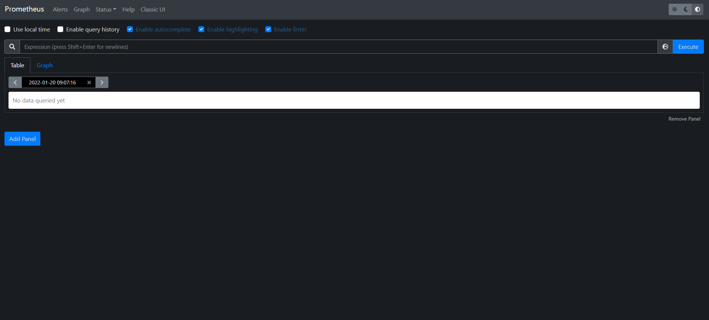

# Prometheus

## 介绍

[官网](https://prometheus.io/)


## 安装

- 安装基础软件

  ```sh
  yum install -y vim lrzsz wget
  ```

  

- 安装go

  ```sh
  # 版本 go1.15.2.linux-amd64
  tar go1.15.2.linux-amd64.tar.gz
  mv go /usr/local
  
  # 添加环境变量
  vim /etc/profile
  
  export GOROOT=/usr/local/go
  export PATH=$PATH:$GOROOT/bin
  
  source /etc/profile
  ```

- 安装prometheus

  - 下载

    ```sh
    wget https://github.com/prometheus/prometheus/releases/download/v2.33.0-rc.1/prometheus-2.33.0-rc.1.linux-amd64.tar.gz -O /usr/local/prometheus
    ```

  - 安装为服务

    ```sh
    vim /etc/systemd/system/prometheus.service
    
    [Unit]
    Description=Prometheus
    Documentation=Prometheus
    
    [Service]
    ExecStart=/usr/local/prometheus/prometheus --config.file=/usr/local/prometheus/prometheus.yml --storage.tsdb.path=/data/prometheus --web.enable-lifecycle --storage.tsdb.retention.time=180d
    Restart=on-failure
    
    [Install]
    WantedBy=multi-user.target
    ```

  - 运行

    ```sh
    systemctl start prometheus && systemctl enable prometheus
    ```

  - 测试

    IP:9090/graph

    

  


## 插件

### node_exporter


