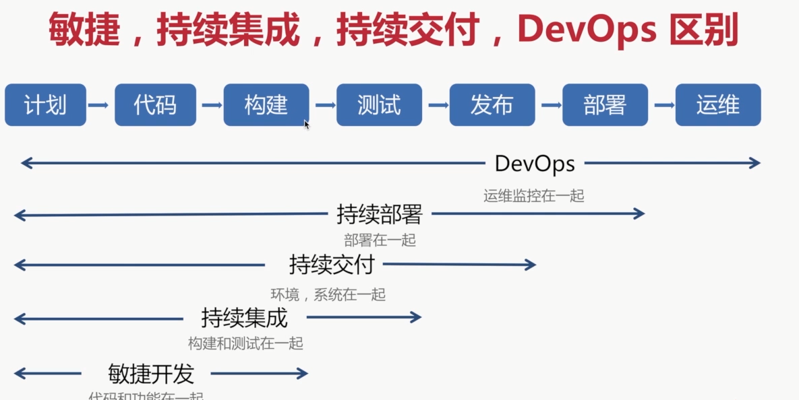
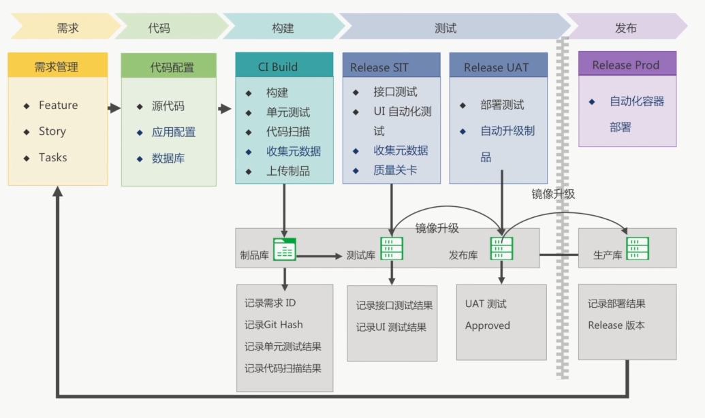
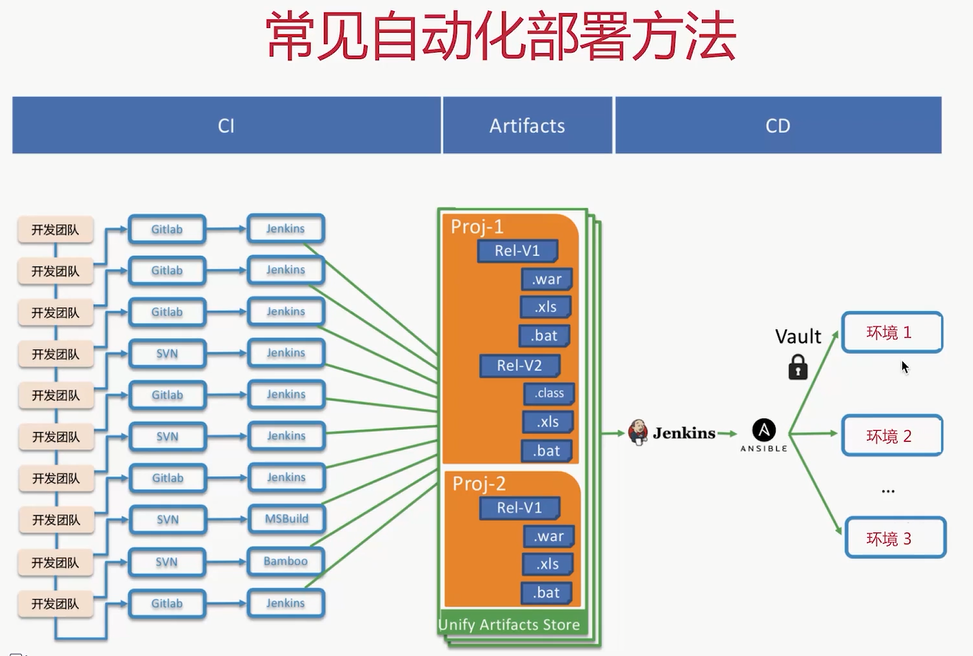
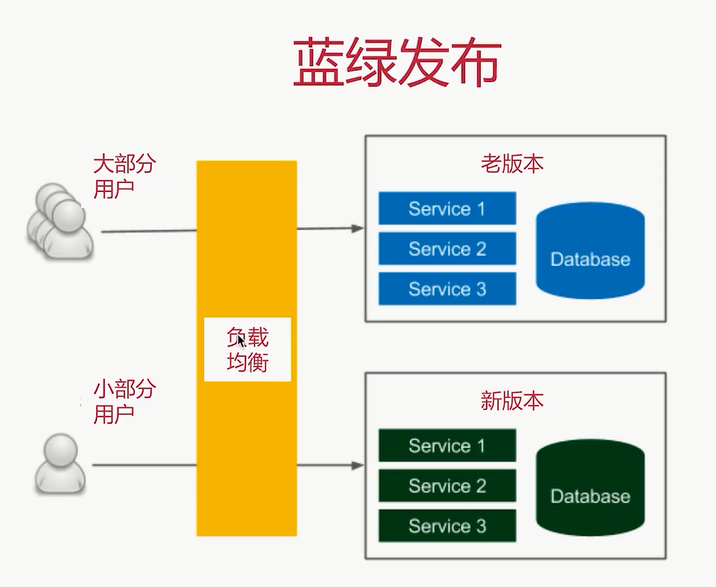
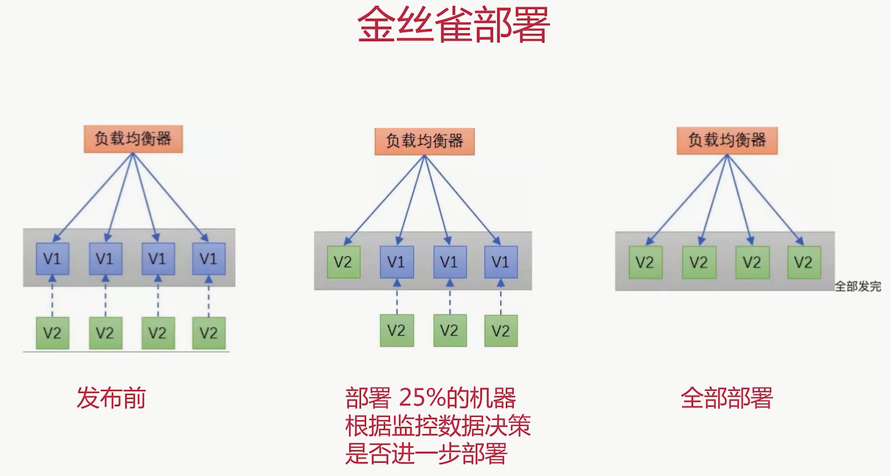

## 持续集成

​	单体应用拆分成微服务，就需要方法来组装这些服务，成为可联合运行的微服务架构。这个方法就是持续集成

- 持续集成其实是一种软件开发实践，帮组团队成员频繁集成他们的工作，通常每个项目每天至少集成一次，从而每天有可测试的版本
- 每个集成使用自动化构建来实现打包和测试，快速验证问题。许多团队发现持续集成显著的降低了集成遇到的错误，使团队能够更加迅速地开发

区别：

软件生命周期：

## 持续部署

​	**为什么需要持续部署：**

- 传统部署方式依赖手工部署，容易出错
- 生成环境依赖手工配置进行变更
- 熬夜加班进行上线部署

​	**持续部署的定义：**

- 软件部署：将软件按照期望的状态，部署到目标及其上的期望路径
- 持续部署：自动化的将一个或多个软件尽可能快的，稳定的，可重复的联合部署到目标机器，以便进行软件功能的验证和实际运行。可能是在云环境中自动部署、app升级、更新网站

​	**软件生命周期：**

- 自动化部署：ansible
- 应用与配置分离，一次构建，多处运行：spring cloud config
- 提供应用健康监测的接口：spring cloud actuator

几种部署方式：

