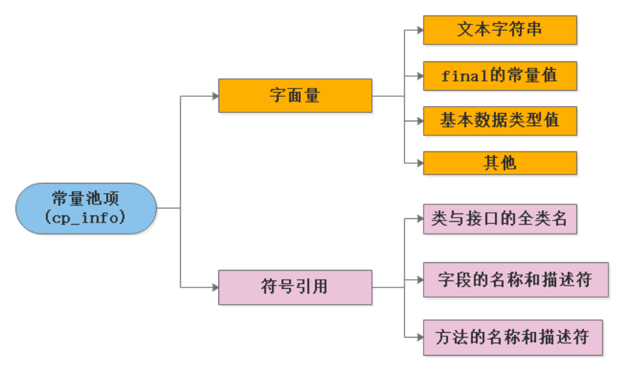
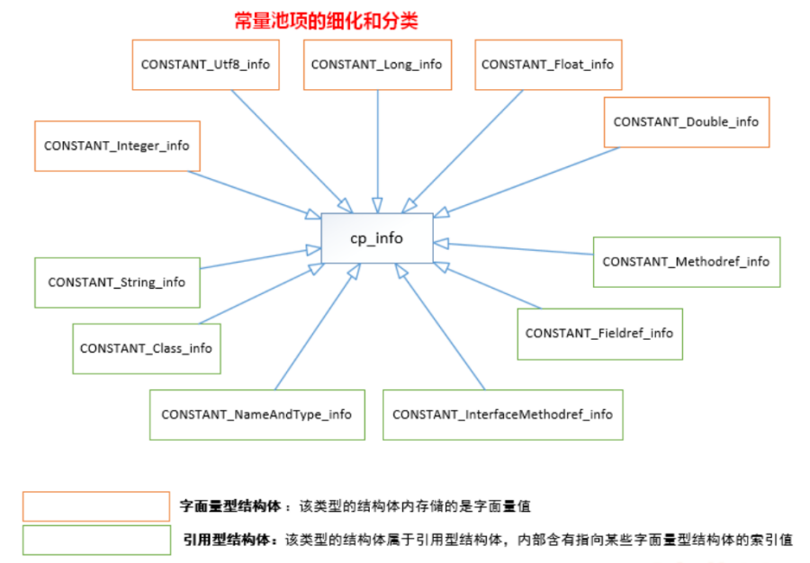
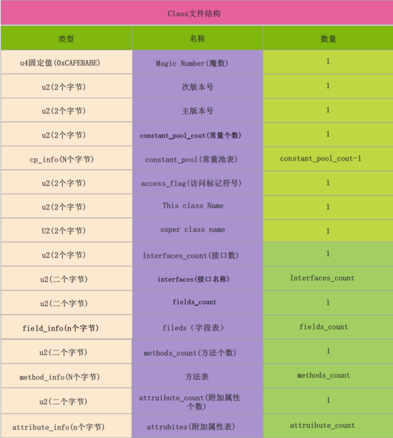
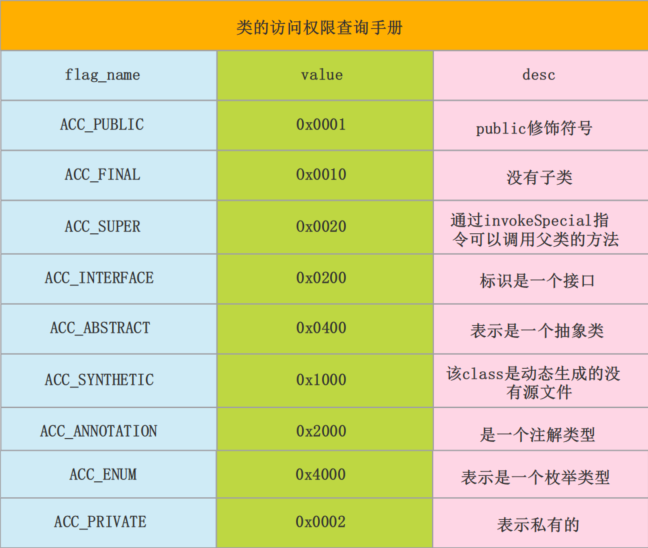
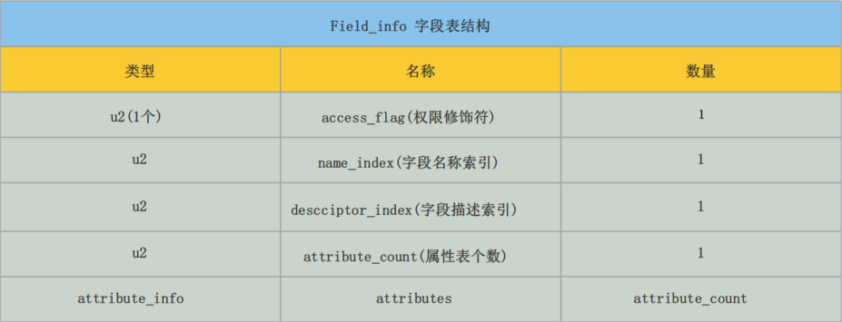
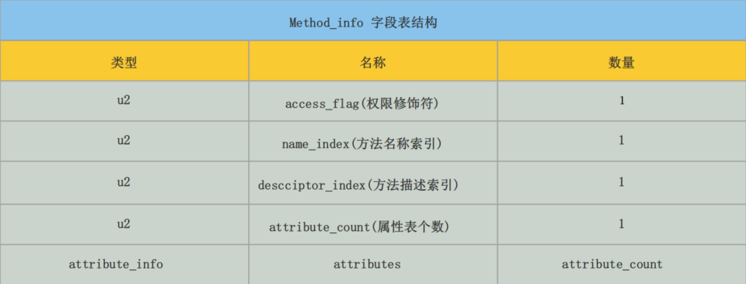

## 通过一份java代码理解字节码

```java
package com.tuling.smlz.jvm.classbyatecode;

public class TulingByteCode {

    private String userName;

    public String getUserName() {
        return userName;
    }

    public void setUserName(String userName) {
        this.userName = userName;
    }
}
```

**通过我们javap -verbose TulingByteCode .class反编译**

```java
//表示我们通过反编译的来源是哪个字节码文件
Classfile /D:/work_space/idea_space/spring-cloud-source/tuling-jvm/target/classes/com/tuling/smlz/jvm/classbyatecode/TulingByteCode.class
  //最后修改日期；文件大小
  Last modified 2019-11-5; size 629 bytes
  //文件的md5值
  MD5 checksum a0a9c001787f00738627278b0946a388
  //.class文件是通过哪个源文件编译过来的
  Compiled from "TulingByteCode.java"
  //字节码的详细信息
public class com.tuling.smlz.jvm.classbyatecode.TulingByteCode
  //jdk的次版本号
  minor version: 0
  //jdk的主版本号
  major version: 52
  //访问权限
  flags: ACC_PUBLIC, ACC_SUPER
  //常量池
Constant pool:
   #1 = Methodref          #4.#21         // java/lang/Object."<init>":()V
   #2 = Fieldref           #3.#22         // com/tuling/smlz/jvm/classbyatecode/TulingByteCode.userName:Ljava/lang/String;
   #3 = Class              #23            // com/tuling/smlz/jvm/classbyatecode/TulingByteCode
   #4 = Class              #24            // java/lang/Object
   #5 = Utf8               userName
   #6 = Utf8               Ljava/lang/String;
   #7 = Utf8               <init>
   #8 = Utf8               ()V
   #9 = Utf8               Code
  #10 = Utf8               LineNumberTable
  #11 = Utf8               LocalVariableTable
  #12 = Utf8               this
  #13 = Utf8               Lcom/tuling/smlz/jvm/classbyatecode/TulingByteCode;
  #14 = Utf8               getUserName
  #15 = Utf8               ()Ljava/lang/String;
  #16 = Utf8               setUserName
  #17 = Utf8               (Ljava/lang/String;)V
  #18 = Utf8               MethodParameters
  #19 = Utf8               SourceFile
  #20 = Utf8               TulingByteCode.java
  #21 = NameAndType        #7:#8          // "<init>":()V
  #22 = NameAndType        #5:#6          // userName:Ljava/lang/String;
  #23 = Utf8               com/tuling/smlz/jvm/classbyatecode/TulingByteCode
  #24 = Utf8               java/lang/Object
{ 
  //构造方法
  public com.tuling.smlz.jvm.classbyatecode.TulingByteCode();
    descriptor: ()V
    flags: ACC_PUBLIC
    Code:
      stack=1, locals=1, args_size=1
         0: aload_0
         1: invokespecial #1                  // Method java/lang/Object."<init>":()V
         4: return
      LineNumberTable:
        line 6: 0
      LocalVariableTable:
        Start  Length  Slot  Name   Signature
            0       5     0  this   Lcom/tuling/smlz/jvm/classbyatecode/TulingByteCode;
  //get方法
  public java.lang.String getUserName();
    descriptor: ()Ljava/lang/String;
    flags: ACC_PUBLIC
    Code:
      stack=1, locals=1, args_size=1
         0: aload_0
         1: getfield      #2                  // Field userName:Ljava/lang/String;
         4: areturn
      LineNumberTable:
        line 11: 0
      LocalVariableTable:
        Start  Length  Slot  Name   Signature
            0       5     0  this   Lcom/tuling/smlz/jvm/classbyatecode/TulingByteCode;
  //set方法
  public void setUserName(java.lang.String);
    descriptor: (Ljava/lang/String;)V
    flags: ACC_PUBLIC
    Code:
      stack=2, locals=2, args_size=2
         0: aload_0
         1: aload_1
         2: putfield      #2                  // Field userName:Ljava/lang/String;
         5: return
      LineNumberTable:
        line 15: 0
        line 16: 5
      LocalVariableTable:
        Start  Length  Slot  Name   Signature
            0       6     0  this   Lcom/tuling/smlz/jvm/classbyatecode/TulingByteCode;
            0       6     1 userName   Ljava/lang/String;
    MethodParameters:
      Name                           Flags
      userName
}
SourceFile: "TulingByteCode.java"
```

**class文件通过16进制查看器打开如下**

通过16进制查看器打开的文件结构是以单个字节来显示，因为一个16进制数可以通过4位来表示,一个字节8位可以表示二个16进制数


**class文件结构图** 


**我们通过javap -verbose来分析一个字节码的时候，将会分析字节码文件的魔数,主 次版本号,常量池，类信息，类的构造方法，类的中的方法信息，类变量与成员变量等信息.**

**魔数:** **文件的开头的 四个字节 是固定 值位** **0xCAFEBABE**


**次版本号(minor version):二个字节00 00 表示jdk的次版本号** 


**主版本号(major version):二个字节 00 34 表示为jdk的主版本号，34对于10进制为52** 

**那么52代表的是1.8，51代表的是1.7 等等一直类推下去** 

**所以通过主次版本号来确定我们jdk的版本是1.8.0** 


**常量池入口，占用二个字节,表示常量池中的个数=00 19 (25)-1=24个, 为啥需要-1，因为常量池中的第0个位置被我们的jvm占用了表示为null 所以我们通过编译出来的常量池索引是从1开始的**

```java
Constant pool:
   #1 = Methodref          #4.#21         // java/lang/Object."<init>":()V
   #2 = Fieldref           #3.#22         // com/tuling/smlz/jvm/classbyatecode/TulingByteCode.userName:Ljava/lang/String;
   #3 = Class              #23            // com/tuling/smlz/jvm/classbyatecode/TulingByteCode
   #4 = Class              #24            // java/lang/Object
   #5 = Utf8               userName
   #6 = Utf8               Ljava/lang/String;
   #7 = Utf8               <init>
   #8 = Utf8               ()V
   #9 = Utf8               Code
  #10 = Utf8               LineNumberTable
  #11 = Utf8               LocalVariableTable
  #12 = Utf8               this
  #13 = Utf8               Lcom/tuling/smlz/jvm/classbyatecode/TulingByteCode;
  #14 = Utf8               getUserName
  #15 = Utf8               ()Ljava/lang/String;
  #16 = Utf8               setUserName
  #17 = Utf8               (Ljava/lang/String;)V
  #18 = Utf8               MethodParameters
  #19 = Utf8               SourceFile
  #20 = Utf8               TulingByteCode.java
  #21 = NameAndType        #7:#8          // "<init>":()V
  #22 = NameAndType        #5:#6          // userName:Ljava/lang/String;
  #23 = Utf8               com/tuling/smlz/jvm/classbyatecode/TulingByteCode
  #24 = Utf8               java/lang/Object
```

**常量池结构表如图所示**

**u1,u2,u4,u8分别代表1个字节,2个字节,4个字节,8个字节的无符号数**


**我们的常量池可以看作我们的java class类的一个资源仓库(比如Java类定的方法和变量信息),我们后面的方法 类的信息的描述信息都是通过索引去常量池中获取。**

**常量池中主要存放两种常量,一种是字面量  一种是符号引用**






## [todo](https://note.youdao.com/ynoteshare/index.html?id=a21875fd4ab6e14a445d07e750cc6930&type=note&_time=1646465559139)


## class 文件结构参照表










## class 常量池类型分类


## 指令参照表

栈和局部变量操作 

将常量压入栈的指令 

aconst_null 将null对象引用压入栈 

iconst_m1 将int类型常量-1压入栈 

iconst_0 将int类型常量0压入栈 

iconst_1 将int类型常量1压入**操作数栈** 

iconst_2 将int类型常量2压入栈 

iconst_3 将int类型常量3压入栈 

iconst_4 将int类型常量4压入栈 

iconst_5 将int类型常量5压入栈 

lconst_0 将long类型常量0压入栈 

lconst_1 将long类型常量1压入栈 

fconst_0 将float类型常量0压入栈 

fconst_1 将float类型常量1压入栈 

dconst_0 将double类型常量0压入栈 

dconst_1 将double类型常量1压入栈 

bipush 将一个8位带符号整数压入栈 

sipush 将16位带符号整数压入栈 

ldc 把常量池中的项压入栈 

ldc_w 把常量池中的项压入栈（使用宽索引） 

ldc2_w 把常量池中long类型或者double类型的项压入栈（使用宽索引） 

从栈中的局部变量中装载值的指令 

iload 从局部变量中装载int类型值 

lload 从局部变量中装载long类型值 

fload 从局部变量中装载float类型值 

dload 从局部变量中装载double类型值 

aload 从局部变量中装载引用类型值（

refernce） 

iload_0 从局部变量0中装载int类型值 

iload_1 从局部变量1中装载int类型值 

iload_2 从局部变量2中装载int类型值 

iload_3 从局部变量3中装载int类型值 

lload_0 从局部变量0中装载long类型值 

lload_1 从局部变量1中装载long类型值 

lload_2 从局部变量2中装载long类型值 

lload_3 从局部变量3中装载long类型值 

fload_0 从局部变量0中装载float类型值 

fload_1 从局部变量1中装载float类型值fload_2 从局部变量2中装载float类型值 

fload_3 从局部变量3中装载float类型值 

dload_0 从局部变量0中装载double类型值 

dload_1 从局部变量1中装载double类型值 

dload_2 从局部变量2中装载double类型值 

dload_3 从局部变量3中装载double类型值 

aload_0 从局部变量0中装载引用类型值 

aload_1 从局部变量1中装载引用类型值 

aload_2 从局部变量2中装载引用类型值 

aload_3 从局部变量3中装载引用类型值 

iaload 从数组中装载int类型值 

laload 从数组中装载long类型值 

faload 从数组中装载float类型值 

daload 从数组中装载double类型值 

aaload 从数组中装载引用类型值 

baload 从数组中装载byte类型或boolean类型值 

caload 从数组中装载char类型值 

saload 从数组中装载short类型值 

将栈中的值存入局部变量的指令 

istore 将int类型值存入局部变量 

lstore 将long类型值存入局部变量 

fstore 将float类型值存入局部变量 

dstore 将double类型值存入局部变量 

astore 将将引用类型或returnAddress类型值存入局部变量 

istore_0 将int类型值存入局部变量0 

istore_1 将int类型值存入局部变量1 

istore_2 将int类型值存入局部变量2 

istore_3 将int类型值存入局部变量3 

lstore_0 将long类型值存入局部变量0 

lstore_1 将long类型值存入局部变量1 

lstore_2 将long类型值存入局部变量2 

lstore_3 将long类型值存入局部变量3 

fstore_0 将float类型值存入局部变量0 

fstore_1 将float类型值存入局部变量1 

fstore_2 将float类型值存入局部变量2 

fstore_3 将float类型值存入局部变量3 

dstore_0 将double类型值存入局部变量0 

dstore_1 将double类型值存入局部变量1dstore_2 将double类型值存入局部变量2 

dstore_3 将double类型值存入局部变量3 

astore_0 将引用类型或returnAddress类型值存入局部变量0 

astore_1 将引用类型或returnAddress类型值存入局部变量1 

astore_2 将引用类型或returnAddress类型值存入局部变量2 

astore_3 将引用类型或returnAddress类型值存入局部变量3 

iastore 将int类型值存入数组中 

lastore 将long类型值存入数组中 

fastore 将float类型值存入数组中 

dastore 将double类型值存入数组中 

aastore 将引用类型值存入数组中 

bastore 将byte类型或者boolean类型值存入数组中 

castore 将char类型值存入数组中 

sastore 将short类型值存入数组中 

wide指令 

wide 使用附加字节扩展局部变量索引 

通用(无类型）栈操作 

nop 不做任何操作 

pop 弹出栈顶端一个字长的内容 

pop2 弹出栈顶端两个字长的内容 

dup 复制栈顶部一个字长内容 

dup_x1 复制栈顶部一个字长的内容，然后将复制内容及原来弹出的两个字长的内容压入 

栈

dup_x2 复制栈顶部一个字长的内容，然后将复制内容及原来弹出的三个字长的内容压入 

栈

dup2 复制栈顶部两个字长内容 

dup2_x1 复制栈顶部两个字长的内容，然后将复制内容及原来弹出的三个字长的内容压入 

栈

dup2_x2 复制栈顶部两个字长的内容，然后将复制内容及原来弹出的四个字长的内容压入 

栈

swap 交换栈顶部两个字长内容 

类型转换 

i2l 把int类型的数据转化为long类型 

i2f 把int类型的数据转化为float类型 

i2d 把int类型的数据转化为double类型 

l2i 把long类型的数据转化为int类型 

l2f 把long类型的数据转化为float类型 

l2d 把long类型的数据转化为double类型f2i 把float类型的数据转化为int类型 

f2l 把float类型的数据转化为long类型 

f2d 把float类型的数据转化为double类型 

d2i 把double类型的数据转化为int类型 

d2l 把double类型的数据转化为long类型 

d2f 把double类型的数据转化为float类型 

i2b 把int类型的数据转化为byte类型 

i2c 把int类型的数据转化为char类型 

i2s 把int类型的数据转化为short类型 

整数运算 

iadd 执行int类型的加法 

ladd 执行long类型的加法 

isub 执行int类型的减法 

lsub 执行long类型的减法 

imul 执行int类型的乘法 

lmul 执行long类型的乘法 

idiv 执行int类型的除法 

ldiv 执行long类型的除法 

irem 计算int类型除法的余数 

lrem 计算long类型除法的余数 

ineg 对一个int类型值进行取反操作 

lneg 对一个long类型值进行取反操作 

iinc 把一个常量值加到一个int类型的局部变量上 

逻辑运算 

移位操作 

ishl 执行int类型的向左移位操作 

lshl 执行long类型的向左移位操作 

ishr 执行int类型的向右移位操作 

lshr 执行long类型的向右移位操作 

iushr 执行int类型的向右逻辑移位操作 

lushr 执行long类型的向右逻辑移位操作 

按位布尔运算 

iand 对int类型值进行“逻辑与”操作 

land 对long类型值进行“逻辑与”操作 

ior 对int类型值进行“逻辑或”操作 

lor 对long类型值进行“逻辑或”操作 

ixor 对int类型值进行“逻辑异或”操作 

lxor 对long类型值进行“逻辑异或”操作浮点运算 

fadd 执行float类型的加法 

dadd 执行double类型的加法 

fsub 执行float类型的减法 

dsub 执行double类型的减法 

fmul 执行float类型的乘法 

dmul 执行double类型的乘法 

fdiv 执行float类型的除法 

ddiv 执行double类型的除法 

frem 计算float类型除法的余数 

drem 计算double类型除法的余数 

fneg 将一个float类型的数值取反 

dneg 将一个double类型的数值取反 

对象和数组 

对象操作指令 

new 创建一个新对象 

checkcast 确定对象为所给定的类型 

getfield 从对象中获取字段 

putfield 设置对象中字段的值 

getstatic 从类中获取静态字段 

putstatic 设置类中静态字段的值 

instanceof 判断对象是否为给定的类型 

数组操作指令 

newarray 分配数据成员类型为基本上数据类型的新数组 

anewarray 分配数据成员类型为引用类型的新数组 

arraylength 获取数组长度 

multianewarray 分配新的多维数组 

控制流 

条件分支指令 

ifeq 如果等于0，则跳转 

ifne 如果不等于0，则跳转 

iflt 如果小于0，则跳转 

ifge 如果大于等于0，则跳转 

ifgt 如果大于0，则跳转 

ifle 如果小于等于0，则跳转 

if_icmpcq 如果两个int值相等，则跳转 

if_icmpne 如果两个int类型值不相等，则跳转 

if_icmplt 如果一个int类型值小于另外一个int类型值，则跳转if_icmpge 如果一个int类型值大于或者等于另外一个int类型值，则跳转 

if_icmpgt 如果一个int类型值大于另外一个int类型值，则跳转 

if_icmple 如果一个int类型值小于或者等于另外一个int类型值，则跳转 

ifnull 如果等于null，则跳转 

ifnonnull 如果不等于null，则跳转 

if_acmpeq 如果两个对象引用相等，则跳转 

if_acmpnc 如果两个对象引用不相等，则跳转 

比较指令 

lcmp 比较long类型值 

fcmpl 比较float类型值（当遇到NaN时，返回-1） 

fcmpg 比较float类型值（当遇到NaN时，返回1） 

dcmpl 比较double类型值（当遇到NaN时，返回-1） 

dcmpg 比较double类型值（当遇到NaN时，返回1） 

无条件转移指令 

goto 无条件跳转 

goto_w 无条件跳转（宽索引） 

表跳转指令 

tableswitch 通过索引访问跳转表，并跳转 

lookupswitch 通过键值匹配访问跳转表，并执行跳转操作 

异常

athrow 抛出异常或错误 

finally子句 

jsr 跳转到子例程 

jsr_w 跳转到子例程（宽索引） 

rct 从子例程返回 

方法调用与返回 

方法调用指令 

invokcvirtual 运行时按照对象的类来调用实例方法 

invokespecial 根据编译时类型来调用实例方法 

invokestatic 调用类（静态）方法 

invokcinterface 调用接口方法 

方法返回指令 

ireturn 从方法中返回int类型的数据 

lreturn 从方法中返回long类型的数据 

freturn 从方法中返回float类型的数据 

dreturn 从方法中返回double类型的数据 

areturn 从方法中返回引用类型的数据 

return 从方法中返回，返回值为void线程同步 

montiorenter 进入并获取对象监视器 

monitorexit 释放并退出对象监视器 

JVM指令助记符 

变量到操作数栈：iload,iload_,lload,lload_,fload,fload_,dload,dload_,aload,aload_ 

操作数栈到变量： 

istore,istore_,lstore,lstore_,fstore,fstore_,dstore,dstor_,astore,astore_ 

常数到操作数栈： 

bipush,sipush,ldc,ldc_w,ldc2_w,aconst_null,iconst_ml,iconst_,lconst_,fconst_,dconst_ 

加：iadd,ladd,fadd,dadd 

减：isub,lsub,fsub,dsub 

乘：imul,lmul,fmul,dmul 

除：idiv,ldiv,fdiv,ddiv 

余数：irem,lrem,frem,drem 

取负：ineg,lneg,fneg,dneg 

移位：ishl,lshr,iushr,lshl,lshr,lushr 

按位或：ior,lor 

按位与：iand,land 

按位异或：ixor,lxor 

类型转换：i2l,i2f,i2d,l2f,l2d,f2d(放宽数值转换) 

i2b,i2c,i2s,l2i,f2i,f2l,d2i,d2l,d2f(缩窄数值转换) 

创建类实便：new 

创建新数组：newarray,anewarray,multianwarray 

访问类的域和类实例域：getfield,putfield,getstatic,putstatic 

把数据装载到操作数栈：baload,caload,saload,iaload,laload,faload,daload,aaload 

从操作数栈存存储到数组： 

bastore,castore,sastore,iastore,lastore,fastore,dastore,aastore 

获取数组长度：arraylength 

检相类实例或数组属性：instanceof,checkcast 

操作数栈管理：pop,pop2,dup,dup2,dup_xl,dup2_xl,dup_x2,dup2_x2,swap 

有条件转移：ifeq,iflt,ifle,ifne,ifgt,ifge,ifnull,ifnonnull,if_icmpeq,if_icmpene, 

if_icmplt,if_icmpgt,if_icmple,if_icmpge,if_acmpeq,if_acmpne,lcmp,fcmpl 

fcmpg,dcmpl,dcmpg 

复合条件转移：tableswitch,lookupswitch 

无条件转移：goto,goto_w,jsr,jsr_w,ret 

调度对象的实便方法：invokevirtual 

调用由接口实现的方法：invokeinterface 

调用需要特殊处理的实例方法：invokespecial调用命名类中的静态方法：invokestatic 

方法返回：ireturn,lreturn,freturn,dreturn,areturn,return 

异常：athrow 

finally关键字的实现使用：

jsr,jsr_w,ret