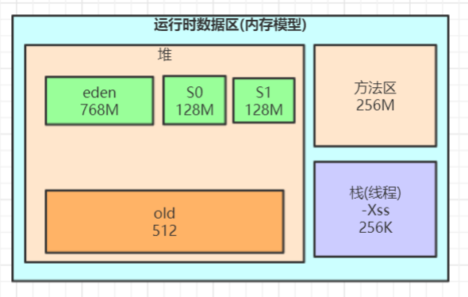

## CPU

### 死锁排查、死循环、锁等待

示例代码

```java
public class DeadLockTest {

   private static Object lock1 = new Object();
   private static Object lock2 = new Object();

   public static void main(String[] args) {
      new Thread(() -> {
         synchronized (lock1) {
            try {
               System.out.println("thread1 begin");
               Thread.sleep(5000);
            } catch (InterruptedException e) {
            }
            synchronized (lock2) {
               System.out.println("thread1 end");
            }
         }
      }).start();

      new Thread(() -> {
         synchronized (lock2) {
            try {
               System.out.println("thread2 begin");
               Thread.sleep(5000);
            } catch (InterruptedException e) {
            }
            synchronized (lock1) {
               System.out.println("thread2 end");
            }
         }
      }).start();

      System.out.println("main thread end");
   }
}
```

查看各个线程的CPU使用率排名

```sh
top 
```

再根据排名第一的进程ID，查询出子线程

```sh
top -Hp pid
```

使用jstack、pid和nid(pid的16进制)进行排查

```sh
# nid
printf '%x\n' pid

# -C5 查看匹配到的行的前后5行
jstack pid | grep nid -C5 –color

# 我们可以使用命令cat jstack.log | grep "java.lang.Thread.State" | sort -nr | uniq -c来对jstack的状态有一个整体的把握

# sort命令是帮我们依据不同的数据类型进行排序，其语法及常用参数格式：
#	-n 依照数值的大小排序
#	-r 以相反的顺序来排序
# uniq 可检查文本文件中重复出现的行列
#	-c或--count 在每列旁边显示该行重复出现的次数。
```

通常我们会比较关注WAITING、TIMED_WAITING和BLOCKED


- "Thread-1" 线程名
- prio=5 优先级=5
- tid=0x000000001fa9e000 线程id
- nid=0x2d64 线程对应的本地线程标识nid
- **java.lang.Thread.State**: BLOCKED 线程状态


还可以用jvisualvm自动检测死锁 


**远程连接jvisualvm**

**启动普通的jar程序JMX端口配置：**

```sh
# -Dcom.sun.management.jmxremote.port 为远程机器的JMX端口
# -Djava.rmi.server.hostname 为远程机器IP
java -Dcom.sun.management.jmxremote.port=8888 -Djava.rmi.server.hostname=192.168.65.60 -Dcom.sun.management.jmxremote.ssl=false -Dcom.sun.management.jmxremote.authenticate=false -jar microservice-eureka-server.jar
```

**tomcat的JMX配置：在catalina.sh文件里的最后一个JAVA_OPTS的赋值语句下一行增加如下配置行** 

```txt
JAVA_OPTS="$JAVA_OPTS ‐Dcom.sun.management.jmxremote.port=8888 ‐Djava.rmi.server.hostname=192.168.50.60 ‐Dcom.sun.ma nagement.jmxremote.ssl=false ‐Dcom.sun.management.jmxremote.authenticate=false"
```


### GC频繁

查看GC信息

```sh
# 1000表示采样间隔(ms)
jstat -gc pid 1000
```


### 上下文切换频繁

针对频繁上下文问题，我们可以使用vmstat命令来进行查看

```sh
vmstat 1
```


cs(context switch)一列则代表了上下文切换的次数。如果我们希望对特定的pid进行监控那么可以使用

```sh
yum install -y sysstat
pidstat -w pid
```

cswch和nvcswch表示自愿及非自愿切换


## 磁盘

查看文件系统状态

```sh
df -hl
```

更多时候，磁盘问题还是性能上的问题。我们可以

```sh
iostat -d -k -x
```


最后一列%util可以看到每块磁盘写入的程度，而rrqm/s以及wrqm/s分别表示读写速度，一般就能帮助定位到具体哪块磁盘出现问题了

另外我们还需要知道是哪个进程在进行读写，一般来说开发自己心里有数，或者用iotop命令来进行定位文件读写的来源


不过这边拿到的是tid，我们要转换成pid

```sh
readlink -f /proc/*/task/tid/../..
```

找到pid之后就可以看这个进程具体的读写情况cat /proc/pid/io

我们还可以通过lsof命令来确定具体的文件读写情况

```sh
yum install -y lsof
lsof -p pid
```


## 内存

内存问题排查起来相对比CPU麻烦一些，场景也比较多。主要包括OOM、GC问题 和 堆外内存。一般来讲，我们会先用free命令先来检查一发内存的各种情况

```sh
free
```


### OOM

JVM中的内存不足，OOM大致可以分为以下几种：

**1.Exception in thread "main" java.lang.OutOfMemoryError: unable to create new native thread**

这个意思是没有足够的内存空间给线程分配java栈，基本上还是线程池代码写的有问题，比如说忘记shutdown，所以说应该首先从代码层面来寻找问题，使用jstack或者jmap

如果一切都正常，JVM方面可以通过指定Xss来减少单个thread stack的大小

另外也可以在系统层面，可以通过修改/etc/security/limits.confnofile和nproc来增大os对线程的限制


**2.Exception in thread "main" java.lang.OutOfMemoryError: Java heap space**

这个意思是堆的内存占用已经达到-Xmx设置的最大值，应该是最常见的OOM错误了

解决思路仍然是先应该在代码中找，怀疑存在内存泄漏，通过jstack和jmap去定位问题。如果说一切都正常，才需要通过调整Xmx的值来扩大内存


**3.Caused by: java.lang.OutOfMemoryError: Meta space**

这个意思是元数据区的内存占用已经达到XX:MaxMetaspaceSize设置的最大值，排查思路和上面的一致，参数方面可以通过XX:MaxPermSize来进行调整(这里就不说1.8以前的永久代了)


### Stack Overflow

栈内存溢出，这个大家见到也比较多

**1.Exception in thread "main" java.lang.StackOverflowError**

表示线程栈需要的内存大于Xss值，同样也是先进行排查，参数方面通过Xss来调整，但调整的太大可能又会引起OOM


### 使用JMAP定位代码内存泄漏

上述关于OOM和StackOverflow的代码排查方面，我们一般使用JMAP来导出dump文件

```sh
jmap -dump:format=b,file=filename.hprof pid
```

通过**mat(Eclipse Memory Analysis Tools)**导入dump文件进行分析，内存泄漏问题一般我们直接选Leak Suspects即可，mat给出了内存泄漏的建议

另外也可以选择Top Consumers来查看最大对象报告。和线程相关的问题可以选择thread overview进行分析。除此之外就是选择Histogram类概览来自己慢慢分析


### GC问题和线程

gc问题除了影响cpu也会影响内存，排查思路也是一致的。一般先使用jstat来查看分代变化情况，比如youngGC或者fullGC次数是不是太多呀；EU、OU等指标增长是不是异常呀等

线程的话太多而且不被及时gc也会引发oom，大部分就是之前说的unable to create new native thread。除了jstack细细分析dump文件外，我们一般先会看下总体线程，通过

```sh
pstree -p pid |wc -l
# 或
ls -l /proc/pid/task | wc -l
```


### 堆外内存

如果碰到堆外内存溢出，那可真是太不幸了

首先堆外内存溢出表现就是物理常驻内存增长快，报错的话视使用方式都不确定

- 如果由于使用Netty导致的，那错误日志里可能会出现OutOfDirectMemoryError错误
- 如果直接是DirectByteBuffer，那会报OutOfMemoryError: Direct buffer memory

堆外内存溢出往往是和NIO的使用相关，一般我们先通过pmap来查看下进程占用的内存情况

```sh
# 查看对应pid倒序前30大的内存段
pmap -x pid | sort -rn -k3 | head -30
```

这边可以再一段时间后再跑一次命令看看内存增长情况，或者和正常机器比较可疑的内存段在哪里

我们如果确定有可疑的内存端，需要通过gdb来分析

```sh
gdb --batch --pid {pid} -ex "dump memory filename.dump {内存起始地址} {内存起始地址+内存块大小}"
```

获取dump文件后可用heaxdump进行查看，不过大多数看到的都是二进制乱码

```sh
hexdump -C filename | less
```

NMT是Java7U40引入的HotSpot新特性，配合jcmd命令我们就可以看到具体内存组成了

需要在启动参数中加入 -XX:NativeMemoryTracking=summary 或者 -XX:NativeMemoryTracking=detail，会有略微性能损耗

一般对于堆外内存缓慢增长直到爆炸的情况来说，可以先设一个基线

```sh
jcmd pid VM.native_memory baseline
```

然后等放一段时间后再去看看内存增长的情况，通过

```sh
# diff级别 detail.diff summary.diff
jcmd pid VM.native_memory detail.diff
```


可以看到jcmd分析出来的内存十分详细，包括堆内、线程以及gc(所以上述其他内存异常其实都可以用nmt来分析)，这边堆外内存我们重点关注Internal的内存增长，如果增长十分明显的话那就是有问题了

detail级别的话还会有具体内存段的增长情况，如下图

此外在系统层面，我们还可以使用strace命令来监控内存分配

```sh
strace -f -e "brk,mmap,munmap" -p pid
```

内存分配信息主要包括了pid和内存地址

不过其实上面那些操作也很难定位到具体的问题点，关键还是要看错误日志栈，找到可疑的对象，搞清楚它的回收机制，然后去分析对应的对象

比如DirectByteBuffer分配内存的话，是需要full GC或者手动system.gc来进行回收的(所以最好不要使用-XX:+DisableExplicitGC)

那么其实我们可以跟踪一下DirectByteBuffer对象的内存情况，通过

```sh
jmap -histo:live pid
# 手动触发fullGC
```

看看堆外内存有没有被回收。如果被回收了，那么大概率是堆外内存本身分配的太小了，通过-XX:MaxDirectMemorySize进行调整。如果没有什么变化，那就要使用jmap去分析那些不能被gc的对象，以及和DirectByteBuffer之间的引用关系了


### GC问题

堆内内存泄漏总是和GC异常相伴。不过GC问题不只是和内存问题相关，还有可能引起CPU负载、网络问题等系列并发症，只是相对来说和内存联系紧密些，所以我们在此单独总结一下GC相关问题

我们在cpu章介绍了使用jstat来获取当前GC分代变化信息。而更多时候，我们是通过GC日志来排查问题的，在启动参数中加上-verbose:gc -XX:+PrintGCDetails -XX:+PrintGCDateStamps -XX:+PrintGCTimeStamps来开启GC日志

针对gc日志，我们就能大致推断出youngGC与fullGC是否过于频繁或者耗时过长，从而对症下药。我们下面将对G1垃圾收集器来做分析，这边也建议大家使用G1  -XX:+UseG1GC

### YoungGC过频繁

youngGC频繁一般是短周期小对象较多，先考虑是不是Eden区/新生代设置的太小了，看能否通过调整-Xmn、-XX:SurvivorRatio等参数设置来解决问题。如果参数正常，但是young gc频率还是太高，就需要使用Jmap和MAT对dump文件进行进一步排查了

### YoungGC耗时过长

耗时过长问题就要看GC日志里耗时耗在哪一块了。以G1日志为例，可以关注Root Scanning、Object Copy、Ref Proc等阶段。Ref Proc耗时长，就要注意引用相关的对象。Root Scanning耗时长，就要注意线程数、跨代引用。Object Copy则需要关注对象生存周期。而且耗时分析它需要横向比较，就是和其他项目或者正常时间段的耗时比较。比如说图中的Root Scanning和正常时间段比增长较多，那就是起的线程太多了

### 触发FullGC

G1中更多的还是mixedGC，但mixedGC可以和youngGC思路一样去排查。触发fullGC了一般都会有问题，G1会退化使用Serial收集器来完成垃圾的清理工作，暂停时长达到秒级别，可以说是半跪了。fullGC的原因可能包括以下这些，以及参数调整方面的一些思路：

- 并发阶段失败：在并发标记阶段，MixGC之前老年代就被填满了，那么这时候G1就会放弃标记周期。这种情况，可能就需要增加堆大小，或者调整并发标记线程数-XX:ConcGCThreads
- 晋升失败：在GC的时候没有足够的内存供存活/晋升对象使用，所以触发了Full GC。这时候可以通过-XX:G1ReservePercent来增加预留内存百分比，减少-XX:InitiatingHeapOccupancyPercent来提前启动标记，-XX:ConcGCThreads来增加标记线程数也是可以的
- 大对象分配失败：大对象找不到合适的region空间进行分配，就会进行fullGC，这种情况下可以增大内存或者增大-XX:G1HeapRegionSize。程序主动执行System.gc()：不要随便写就对了

另外，我们可以在启动参数中配置-XX:HeapDumpPath=/xxx/dump.hprof来dump fullGC相关的文件，并通过jinfo来进行gc前后的dump

> jinfo -flag +HeapDumpBeforeFullGC pid 
>
> jinfo -flag +HeapDumpAfterFullGC pid

这样得到2份dump文件，对比后主要关注被gc掉的问题对象来定位问题


## 网络

涉及到网络层面的问题一般都比较复杂，场景多，定位难，成为了大多数开发的噩梦，应该是最复杂的了。这里会举一些例子，并从tcp层、应用层以及工具的使用等方面进行阐述

### 超时

超时错误大部分处在应用层面，所以这块着重理解概念。超时大体可以分为连接超时和读写超时，某些使用连接池的客户端框架还会存在获取连接超时和空闲连接清理超时

- 读写超时。readTimeout/writeTimeout，有些框架叫做so_timeout或者socketTimeout，均指的是数据读写超时。注意这边的超时大部分是指逻辑上的超时。soa的超时指的也是读超时。读写超时一般都只针对客户端设置
- 连接超时。connectionTimeout，客户端通常指与服务端建立连接的最大时间。服务端这边connectionTimeout就有些五花八门了，jetty中表示空闲连接清理时间，tomcat则表示连接维持的最大时间
- 其他。包括连接获取超时connectionAcquireTimeout和空闲连接清理超时idleConnectionTimeout。多用于使用连接池或队列的客户端或服务端框架

我们在设置各种超时时间中，需要确认的是尽量保持客户端的超时小于服务端的超时，以保证连接正常结束

在实际开发中，我们关心最多的应该是接口的读写超时了

如何设置合理的接口超时是一个问题。如果接口超时设置的过长，那么有可能会过多地占用服务端的tcp连接。而如果接口设置的过短，那么接口超时就会非常频繁

服务端接口明明rt降低，但客户端仍然一直超时又是另一个问题。这个问题其实很简单，客户端到服务端的链路包括网络传输、排队以及服务处理等，每一个环节都可能是耗时的原因


### TCP队列溢出

tcp队列溢出是个相对底层的错误，它可能会造成超时、rst等更表层的错误。因此错误也更隐蔽，所以我们单独说一说


如上图所示，这里有两个队列：

- syns queue(半连接队列）
- accept queue（全连接队列）

三次握手，在server收到client的syn后，把消息放到syns queue，回复syn+ack给client，server收到client的ack，如果这时accept queue没满，那就从syns queue拿出暂存的信息放入accept queue中，否则按tcp_abort_on_overflow指示的执行

**tcp_abort_on_overflow**

/proc/sys/net/ipv4/tcp_abort_on_overflow 

- 0：表示如果三次握手第三步的时候accept queue满了那么server扔掉client发过来的ack
- 1：表示第三步的时候如果全连接队列满了，server发送一个rst包给client，表示废掉这个握手过程和这个连接，意味着日志里可能会有很多connection reset / connection reset by peer

**那么在实际开发中，我们怎么能快速定位到tcp队列溢出呢？**

netstat命令

```sh
yum install -y net-tools
netstat -s | egrep "listen|LISTEN"
```

- overflowed表示全连接队列溢出的次数
- sockets dropped表示半连接队列溢出的次数

ss命令

显示socket状态，它是一个非常实用、快速、有效的跟踪IP连接和sockets的新工具

```sh
# -l 显示本地打开的所有端口
# -n --numeric 不解析服务名称
# -t 显示所有tcp socket
ss -lnt
```

**!!此时的Send-Q 表示listen端口上的全连接队列最大为5，Recv-Q为全连接队列当前使用了多少**

接着我们看看怎么设置全连接、半连接队列大小吧：

- 全连接队列的大小取决于min(backlog, somaxconn)。backlog是在socket创建的时候传入的，somaxconn是一个os级别的系统参数
- 半连接队列的大小取决于max(64,/proc/sys/net/ipv4/tcp_max_syn_backlog)

在日常开发中，我们往往使用servlet容器作为服务端，所以我们有时候也需要关注容器的连接队列大小。在tomcat中backlog叫做acceptCount，在jetty里面则是acceptQueueSize

### RST异常

RST包表示连接重置，用于关闭一些无用的连接，通常表示异常关闭，区别于四次挥手

在实际开发中，我们往往会看到connection reset / connection reset by peer错误，这种情况就是RST包导致的

**端口不存在**

如果像不存在的端口发出建立连接SYN请求，那么服务端发现自己并没有这个端口则会直接返回一个RST报文，用于中断连接

**主动代替FIN终止连接**

一般来说，正常的连接关闭都是需要通过FIN报文实现，然而我们也可以用RST报文来代替FIN，表示直接终止连接。实际开发中，可设置SO_LINGER数值来控制，这种往往是故意的，来跳过TIMED_WAIT，提供交互效率，不闲就慎用

**客户端或服务端有一边发生了异常，该方向对端发送RST以告知关闭连接**

我们上面讲的tcp队列溢出发送RST包其实也是属于这一种。这种往往是由于某些原因，一方无法再能正常处理请求连接了(比如程序崩了，队列满了)，从而告知另一方关闭连接

**接收到的TCP报文不在已知的TCP连接内**

比如，一方机器由于网络实在太差TCP报文失踪了，另一方关闭了该连接，然后过了许久收到了之前失踪的TCP报文，但由于对应的TCP连接已不存在，那么会直接发一个RST包以便开启新的连接

**一方长期未收到另一方的确认报文，在一定时间或重传次数后发出RST报文**

这种大多也和网络环境相关了，网络环境差可能会导致更多的RST报文

之前说过RST报文多会导致程序报错，在一个已关闭的连接上读操作会报connection reset，而在一个已关闭的连接上写操作则会报connection reset by peer。通常我们可能还会看到broken pipe错误，这是管道层面的错误，表示对已关闭的管道进行读写，往往是在收到RST，报出connection reset错后继续读写数据报的错，这个在glibc源码注释中也有介绍

我们在排查故障时候怎么确定有RST包的存在呢？当然是使用tcpdump命令进行抓包，并使用wireshark进行简单分析了

```sh
# en0表示监听的网卡
tcpdump -i en0 tcp -w xxx.cap
```

接下来我们通过wireshark打开抓到的包，可能就能看到如下图所示，红色的就表示RST包了


### TIME_WAIT和CLOSE_WAIT

TIME_WAIT和CLOSE_WAIT是啥意思相信大家都知道。在线上时，我们可以直接用命令netstat -n | awk '/^tcp/ {++S[$NF]} END {for(a in S) print a, S[a]}'来查看time-wait和close_wait的数量

用ss命令会更快

```sh
ss -ant | awk '{++S[$1]} END {for(a in S) print a, S[a]}'
```

**time_wait**

time_wait的存在一是为了丢失的数据包被后面连接复用，二是为了在2MSL的时间范围内正常关闭连接。它的存在其实会大大减少RST包的出现

过多的time_wait在短连接频繁的场景比较容易出现。这种情况可以在服务端做一些内核参数调优:

> \#表示开启重用。允许将TIME-WAIT sockets重新用于新的TCP连接，默认为0，表示关闭net.ipv4.tcp_tw_reuse = 1#表示开启TCP连接中TIME-WAIT sockets的快速回收，默认为0，表示关闭net.ipv4.tcp_tw_recycle = 1

当然我们不要忘记在NAT环境下因为时间戳错乱导致数据包被拒绝的坑了，另外的办法就是改小tcp_max_tw_buckets，超过这个数的time_wait都会被干掉，不过这也会导致报time wait bucket table overflow的错

**close_wait**

close_wait往往都是因为应用程序写的有问题，没有在ACK后再次发起FIN报文。close_wait出现的概率甚至比time_wait要更高，后果也更严重。往往是由于某个地方阻塞住了，没有正常关闭连接，从而渐渐地消耗完所有的线程。

想要定位这类问题，最好是通过jstack来分析线程堆栈来排查问题，具体可参考上述章节。这里仅举一个例子。

开发同学说应用上线后CLOSE_WAIT就一直增多，直到挂掉为止，jstack后找到比较可疑的堆栈是大部分线程都卡在了

countdownlatch.await方法，找开发同学了解后得知使用了多线程但是确没有catch异常，修改后发现异常仅仅是最简单的升级sdk后常出现的class not found。


## Jmap

**此命令可以用来查看内存信息，实例个数以及占用内存大小** 


打开log.txt，文件内容如下：


- num：序号 
- instances：实例数量 
- bytes：占用空间大小 
- class name：类名称:`[C is a char[]，[S is a short[]，[I is a int[]，[B is a byte[]，[[I is a int[][]`

**堆信息**


**堆内存dump**：当前程序内存的快照

```sh
jmap ‐dump:format=b,file=eureka.hprof 14660
```


也可以设置内存溢出自动导出dump文件(内存很大的时候，可能会导不出来) 

1. -XX:+HeapDumpOnOutOfMemoryError 
2. -XX:HeapDumpPath=./ （路径） 

```java
public class OOMTest {
   public static List<Object> list = new ArrayList<>();

   // JVM设置    
   // -Xms10M -Xmx10M -XX:+PrintGCDetails -XX:+HeapDumpOnOutOfMemoryError -XX:HeapDumpPath=D:\jvm.dump 
   public static void main(String[] args) {
      List<Object> list = new ArrayList<>();
      int i = 0;
      int j = 0;
      while (true) {
         list.add(new User(i++, UUID.randomUUID().toString()));
         new User(j--, UUID.randomUUID().toString());
      }
   }
}
```

**可以用jvisualvm命令工具导入该dump文件分析** 


## Jstack


## Jinfo

查看正在运行的Java应用程序的扩展参数 

查看jvm的参数 


查看java系统参数 


## Jstat

jstat命令可以查看堆内存各部分的使用量，以及加载类的数量。命令的格式如下： 

jstat [-命令选项] [vmid] [间隔时间(毫秒)] [查询次数] 

注意：使用的jdk版本是jdk8 

**垃圾回收统计** 

**jstat -gc pid 最常用**，可以评估程序内存使用及GC压力整体情况


- S0C：第一个幸存区的大小，单位KB
- S1C：第二个幸存区的大小
- S0U：第一个幸存区的使用大小
- S1U：第二个幸存区的使用大小
- EC：伊甸园区的大小
- EU：伊甸园区的使用大小
- OC：老年代大小
- OU：老年代使用大小
- MC：方法区大小(元空间)
- MU：方法区使用大小
- CCSC:压缩类空间大小
- CCSU:压缩类空间使用大小
- YGC：年轻代垃圾回收次数
- YGCT：年轻代垃圾回收消耗时间，单位s
- FGC：老年代垃圾回收次数 
- FGCT：老年代垃圾回收消耗时间，单位s
- GCT：垃圾回收消耗总时间，单位s

**堆内存统计**


- NGCMN：新生代最小容量
- NGCMX：新生代最大容量
- NGC：当前新生代容量
- S0C：第一个幸存区大小
- S1C：第二个幸存区的大小
- EC：伊甸园区的大小
- OGCMN：老年代最小容量
- OGCMX：老年代最大容量
- OGC：当前老年代大小
- OC:当前老年代大小
- MCMN:最小元数据容量
- MCMX：最大元数据容量
- MC：当前元数据空间大小
- CCSMN：最小压缩类空间大小
- CCSMX：最大压缩类空间大小
- CCSC：当前压缩类空间大小
- YGC：年轻代gc次数
- FGC：老年代GC次数

**新生代垃圾回收统计**


- S0C：第一个幸存区的大小
- S1C：第二个幸存区的大小
- S0U：第一个幸存区的使用大小
- S1U：第二个幸存区的使用大小
- TT:对象在新生代存活的次数
- MTT:对象在新生代存活的最大次数
- DSS:期望的幸存区大小
- EC：伊甸园区的大小
- EU：伊甸园区的使用大小
- YGC：年轻代垃圾回收次数
- YGCT：年轻代垃圾回收消耗时间

**新生代内存统计**


- NGCMN：新生代最小容量
- NGCMX：新生代最大容量
- NGC：当前新生代容量
- S0CMX：最大幸存1区大小
- S0C：当前幸存1区大小
- S1CMX：最大幸存2区大小
- S1C：当前幸存2区大小
- ECMX：最大伊甸园区大小
- EC：当前伊甸园区大小
- YGC：年轻代垃圾回收次数
- FGC：老年代回收次数

**老年代垃圾回收统计**


- MC：方法区大小
- MU：方法区使用大小
- CCSC:压缩类空间大小
- CCSU:压缩类空间使用大小
- OC：老年代大小
- OU：老年代使用大小
- YGC：年轻代垃圾回收次数
- FGC：老年代垃圾回收次数
- FGCT：老年代垃圾回收消耗时间
- GCT：垃圾回收消耗总时间

**老年代内存统计**


- OGCMN：老年代最小容量
- OGCMX：老年代最大容量
- OGC：当前老年代大小
- OC：老年代大小
- YGC：年轻代垃圾回收次数
- FGC：老年代垃圾回收次数
- FGCT：老年代垃圾回收消耗时间
- GCT：垃圾回收消耗总时间

**元数据空间统计**


- MCMN:最小元数据容量
- MCMX：最大元数据容量
- MC：当前元数据空间大小 
- CCSMN：最小压缩类空间大小
- CCSMX：最大压缩类空间大小
- CCSC：当前压缩类空间大小
- YGC：年轻代垃圾回收次数
- FGC：老年代垃圾回收次数
- FGCT：老年代垃圾回收消耗时间
- GCT：垃圾回收消耗总时间


- S0：幸存1区当前使用比例
- S1：幸存2区当前使用比例
- E：伊甸园区使用比例
- O：老年代使用比例
- M：元数据区使用比例
- CCS：压缩使用比例
- YGC：年轻代垃圾回收次数
- FGC：老年代垃圾回收次数
- FGCT：老年代垃圾回收消耗时间
- GCT：垃圾回收消耗总时间

**JVM运行情况预估**

用 jstat gc -pid 命令可以计算出如下一些关键数据，有了这些数据就可以采用之前介绍过的优化思路，先给自己的系统设置一些初始性的JVM参数，比如堆内存大小，年轻代大小，Eden和Survivor的比例，老年代的大小，大对象的阈值，大龄对象进入老年代的阈值等。

- **年轻代对象增长的速率**

  可以执行命令 jstat -gc pid 1000 10 (每隔1秒执行1次命令，共执行10次)，通过观察EU(eden区的使用)来估算每秒eden大概新增多少对象，如果系统负载不高，可以把频率1秒换成1分钟，甚至10分钟来观察整体情况。注意，一般系统可能有高峰期和日常期，所以需要在不同的时间分别估算不同情况下对象增长速率。

- **Young GC的触发频率和每次耗时**

  知道年轻代对象增长速率我们就能推根据eden区的大小推算出Young GC大概多久触发一次，Young GC的平均耗时可以通过 YGCT/YGC 公式算出，根据结果我们大概就能知道**系统大概多久会因为Young GC的执行而卡顿多久。**

- **每次Young GC后有多少对象存活和进入老年代**

  这个因为之前已经大概知道Young GC的频率，假设是每5分钟一次，那么可以执行命令 jstat -gc pid 300000 10 ，观察每次结果eden，survivor和老年代使用的变化情况，在每次gc后eden区使用一般会大幅减少，survivor和老年代都有可能增长，这些增长的对象就是每次Young GC后存活的对象，同时还可以看出每次Young GC后进去老年代大概多少对象，从而可以推算出**老年代对象增长速率。**

- **Full GC的触发频率和每次耗时**

  知道了老年代对象的增长速率就可以推算出Full GC的触发频率了，Full GC的每次耗时可以用公式 FGCT/FGC 计算得出。

- **优化思路**其实简单来说就是尽量让每次Young GC后的存活对象小于Survivor区域的50%，都留存在年轻代里。尽量别让对象进入老年代。尽量减少Full GC的频率，避免频繁Full GC对JVM性能的影响。


## MAT

Eclipse Memory Analysis Tools


## Arthas

阿里巴巴出品

**Arthas** 是 Alibaba 在 2018 年 9 月开源的 **Java 诊断**工具。支持 JDK6+， 采用命令行交互模式，可以方便的定位和诊断线上程序运行问题。**Arthas** 官方文档十分详细，详见：[*https://alibaba.github.io/arthas*](https://alibaba.github.io/arthas)

### **Arthas使用场景**

得益于 **Arthas** 强大且丰富的功能，让 **Arthas** 能做的事情超乎想象。下面仅仅列举几项常见的使用情况，更多的使用场景可以在熟悉了 **Arthas** 之后自行探索。

1. 是否有一个全局视角来查看系统的运行状况？
2. 为什么 CPU 又升高了，到底是哪里占用了 CPU ？
3. 运行的多线程有死锁吗？有阻塞吗？
4. 程序运行耗时很长，是哪里耗时比较长呢？如何监测呢？
5. 这个类从哪个 jar 包加载的？为什么会报各种类相关的 Exception？
6. 我改的代码为什么没有执行到？难道是我没 commit？分支搞错了？
7. 遇到问题无法在线上 debug，难道只能通过加日志再重新发布吗？
8. 有什么办法可以监控到 JVM 的实时运行状态？

### **Arthas使用**

```sh
# github下载arthas
wget https://alibaba.github.io/arthas/arthas-boot.jar
# 或者 Gitee 下载
wget https://arthas.gitee.io/arthas-boot.jar
```

用java -jar运行即可，可以识别机器上所有Java进程(我们这里之前已经运行了一个Arthas测试程序，代码见下方)


```java
package com.tuling.jvm;

import java.util.HashSet;

public class Arthas {

    private static HashSet hashSet = new HashSet();

    public static void main(String[] args) {
        // 模拟 CPU 过高
        cpuHigh();
        // 模拟线程死锁
        deadThread();
        // 不断的向 hashSet 集合增加数据
        addHashSetThread();
    }

    /**
     * 不断的向 hashSet 集合添加数据
     */
    public static void addHashSetThread() {
        // 初始化常量
        new Thread(() -> {
            int count = 0;
            while (true) {
                try {
                    hashSet.add("count" + count);
                    Thread.sleep(1000);
                    count++;
                } catch (InterruptedException e) {
                    e.printStackTrace();
                }
            }
        }).start();
    }

    public static void cpuHigh() {
        new Thread(() -> {
            while (true) {

            }
        }).start();
    }

    /**
     * 死锁
     */
    private static void deadThread() {
        /** 创建资源 */
        Object resourceA = new Object();
        Object resourceB = new Object();
        // 创建线程
        Thread threadA = new Thread(() -> {
            synchronized (resourceA) {
                System.out.println(Thread.currentThread() + " get ResourceA");
                try {
                    Thread.sleep(1000);
                } catch (InterruptedException e) {
                    e.printStackTrace();
                }
                System.out.println(Thread.currentThread() + "waiting get resourceB");
                synchronized (resourceB) {
                    System.out.println(Thread.currentThread() + " get resourceB");
                }
            }
        });

        Thread threadB = new Thread(() -> {
            synchronized (resourceB) {
                System.out.println(Thread.currentThread() + " get ResourceB");
                try {
                    Thread.sleep(1000);
                } catch (InterruptedException e) {
                    e.printStackTrace();
                }
                System.out.println(Thread.currentThread() + "waiting get resourceA");
                synchronized (resourceA) {
                    System.out.println(Thread.currentThread() + " get resourceA");
                }
            }
        });
        threadA.start();
        threadB.start();
    }
}
```

选择进程序号1，进入进程信息操作


输入**dashboard**可以查看整个进程的运行情况，线程、内存、GC、运行环境信息：


输入 **thread加上线程ID** 可以查看线程堆栈


输入 **thread -b** 可以查看线程死锁 


输入 **jad加类的全名** 可以反编译，这样可以方便我们查看线上代码是否是正确的版本


使用 **ognl** 命令可以查看线上系统变量的值，甚至可以修改变量的值 


更多命令使用可以用help命令查看，或查看文档：https://alibaba.github.io/arthas/commands.html#arthas 


## **GC日志详解** 

对于java应用我们可以通过一些配置把程序运行过程中的gc日志全部打印出来，然后分析gc日志得到关键性指标，分析GC原因，调优JVM参数。

打印GC日志方法，在JVM参数里增加参数，%t 代表时间

```sh
-Xloggc:./gc-%t.log -XX:+PrintGCDetails -XX:+PrintGCDateStamps  -XX:+PrintGCTimeStamps -XX:+PrintGCCause  
-XX:+UseGCLogFileRotation -XX:NumberOfGCLogFiles=10 -XX:GCLogFileSize=100M
```

Tomcat则直接加在JAVA_OPTS变量里。

### **如何分析GC日志**

运行程序加上对应gc日志

```sh
java -jar -Xloggc:./gc-%t.log -XX:+PrintGCDetails -XX:+PrintGCDateStamps  -XX:+PrintGCTimeStamps -XX:+PrintGCCause  
-XX:+UseGCLogFileRotation -XX:NumberOfGCLogFiles=10 -XX:GCLogFileSize=100M microservice-eureka-server.jar
```

下图中是我截取的JVM刚启动的一部分GC日志 


我们可以看到图中第一行红框，是项目的配置参数。这里不仅配置了打印GC日志，还有相关的VM内存参数

第二行红框中的是在这个GC时间点发生GC之后相关GC情况

1. 对于**2.909：**  这是从jvm启动开始计算到这次GC经过的时间，前面还有具体的发生时间日期。
2. Full GC(Metadata GC Threshold)指这是一次full gc，括号里是gc的原因， PSYoungGen是年轻代的GC，ParOldGen是老年代的GC，Metaspace是元空间的GC
3. 6160K->0K(141824K)，这三个数字分别对应GC之前占用年轻代的大小，GC之后年轻代占用，以及整个年轻代的大小
4. 112K->6056K(95744K)，这三个数字分别对应GC之前占用老年代的大小，GC之后老年代占用，以及整个老年代的大小
5. 6272K->6056K(237568K)，这三个数字分别对应GC之前占用堆内存的大小，GC之后堆内存占用，以及整个堆内存的大小
6. 20516K->20516K(1069056K)，这三个数字分别对应GC之前占用元空间内存的大小，GC之后元空间内存占用，以及整个元空间内存的大小
7. 0.0209707是该时间点GC总耗费时间。 

从日志可以发现几次fullgc都是由于元空间不够导致的，所以我们可以将元空间调大点

```sh
java -jar -Xloggc:./gc-adjust-%t.log -XX:MetaspaceSize=256M -XX:MaxMetaspaceSize=256M -XX:+PrintGCDetails -XX:+PrintGCDateStamps  
-XX:+PrintGCTimeStamps -XX:+PrintGCCause  -XX:+UseGCLogFileRotation -XX:NumberOfGCLogFiles=10 -XX:GCLogFileSize=100M 
microservice-eureka-server.jar
```

调整完我们再看下gc日志发现已经没有因为元空间不够导致的fullgc了

对于CMS和G1收集器的日志会有一点不一样，也可以试着打印下对应的gc日志分析下，可以发现gc日志里面的gc步骤跟我们之前讲过的步骤是类似的

```java
public class HeapTest {

    byte[] a = new byte[1024 * 100];  //100KB

    public static void main(String[] args) throws InterruptedException {
        ArrayList<HeapTest> heapTests = new ArrayList<>();
        while (true) {
            heapTests.add(new HeapTest());
            Thread.sleep(10);
        }
    }
}
```

### **CMS**

```sh
-Xloggc:d:/gc-cms-%t.log -Xms50M -Xmx50M -XX:MetaspaceSize=256M -XX:MaxMetaspaceSize=256M -XX:+PrintGCDetails -XX:+PrintGCDateStamps  
 -XX:+PrintGCTimeStamps -XX:+PrintGCCause  -XX:+UseGCLogFileRotation -XX:NumberOfGCLogFiles=10 -XX:GCLogFileSize=100M 
 -XX:+UseParNewGC -XX:+UseConcMarkSweepGC   
```

### **G1**

```sh
-Xloggc:d:/gc-g1-%t.log -Xms50M -Xmx50M -XX:MetaspaceSize=256M -XX:MaxMetaspaceSize=256M -XX:+PrintGCDetails -XX:+PrintGCDateStamps  
 -XX:+PrintGCTimeStamps -XX:+PrintGCCause  -XX:+UseGCLogFileRotation -XX:NumberOfGCLogFiles=10 -XX:GCLogFileSize=100M -XX:+UseG1GC 
```

上面的这些参数，能够帮我们查看分析GC的垃圾收集情况。但是如果GC日志很多很多，成千上万行。就算你一目十行，看完了，脑子也是一片空白。所以我们可以借助一些功能来帮助我们分析，这里推荐一个gceasy([https://gceasy.io](https://gceasy.io/))，可以上传gc文件，然后他会利用可视化的界面来展现GC情况。具体下图所示 


上图我们可以看到年轻代，老年代，以及永久代的内存分配，和最大使用情况


上图我们可以看到堆内存在GC之前和之后的变化，以及其他信息。 

这个工具还提供基于机器学习的JVM智能优化建议，当然现在这个功能需要付费

**JVM参数汇总查看命令** 

java -XX:+PrintFlagsInitial 表示打印出所有参数选项的默认值 

java -XX:+PrintFlagsFinal 表示打印出所有参数选项在运行程序时生效的值 


## 案例

### 案例一： jstack找出占用cpu最高的线程堆栈信息

```java
package com.tuling.jvm;

/**
 * 运行此代码，cpu会飙高
 */
public class Math {

    public static final int initData = 666;
    public static User user = new User();

    public int compute() {  //一个方法对应一块栈帧内存区域
        int a = 1;
        int b = 2;
        int c = (a + b) * 10;
        return c;
    }

    public static void main(String[] args) {
        Math math = new Math();
        while (true){
            math.compute();
        }
    }
}
```

1，使用命令top -p <pid> ，显示你的java进程的内存情况，pid是你的java进程号，比如19663


2，按H，获取每个线程的内存情况 


3，找到内存和cpu占用最高的线程tid，比如19664 

4，转为十六进制得到 0x4cd0，此为线程id的十六进制表示

5，执行 jstack 19663|grep -A 10 4cd0，得到线程堆栈信息中 4cd0 这个线程所在行的后面10行，从堆栈中可以发现导致cpu飙高的调 

用方法 


6，查看对应的堆栈信息找出可能存在问题的代码 

### 案例二：**系统频繁Full GC导致系统卡顿是怎么回事**

- 机器配置：2核4G
- JVM内存大小：2G`
- 系统运行时间：7天
- 期间发生的Full GC次数和耗时：500多次，200多秒
- 期间发生的Young GC次数和耗时：1万多次，500多秒

大致算下来每天会发生70多次Full GC，平均每小时3次，每次Full GC在400毫秒左右；

每天会发生1000多次Young GC，每分钟会发生1次，每次Young GC在50毫秒左右。

JVM参数设置如下：

```sh
-Xms1536M -Xmx1536M -Xmn512M -Xss256K -XX:SurvivorRatio=6  -XX:MetaspaceSize=256M -XX:MaxMetaspaceSize=256M 
-XX:+UseParNewGC  -XX:+UseConcMarkSweepGC  -XX:CMSInitiatingOccupancyFraction=75 -XX:+UseCMSInitiatingOccupancyOnly 
```


大家可以结合**对象挪动到老年代那些规则**推理下我们这个程序可能存在的一些问题

经过分析感觉可能会由于对象动态年龄判断机制导致full gc较为频繁

为了给大家看效果，我模拟了一个示例程序(见课程对应工程代码：jvm-full-gc)，打印了jstat的结果如下：

```sh
jstat -gc 13456 2000 10000
```


对于对象动态年龄判断机制导致的full gc较为频繁可以先试着优化下JVM参数，把年轻代适当调大点：

```sh
-Xms1536M -Xmx1536M -Xmn1024M -Xss256K -XX:SurvivorRatio=6  -XX:MetaspaceSize=256M -XX:MaxMetaspaceSize=256M 
-XX:+UseParNewGC  -XX:+UseConcMarkSweepGC  -XX:CMSInitiatingOccupancyFraction=92 -XX:+UseCMSInitiatingOccupancyOnly 
```



优化完发现没什么变化，**full gc的次数比minor gc的次数还多了** 


我们可以推测下full gc比minor gc还多的原因有哪些？

1. 元空间不够导致的多余full gc
2. 显示调用System.gc()造成多余的full gc，这种一般线上尽量通过-XX:+DisableExplicitGC参数禁用，如果加上了这个JVM启动参数，那么代码中调用System.gc()没有任何效果
3. 老年代空间分配担保机制

最快速度分析完这些我们推测的原因以及优化后，我们发现young gc和full gc依然很频繁了，而且看到有大量的对象频繁的被挪动到老年代，这种情况我们可以借助jmap命令大概看下是什么对象


查到了有大量User对象产生，这个可能是问题所在，但不确定，还必须找到对应的代码确认，如何去找对应的代码了？

1、代码里全文搜索生成User对象的地方(适合只有少数几处地方的情况)

2、如果生成User对象的地方太多，无法定位具体代码，我们可以同时分析下占用cpu较高的线程，一般有大量对象不断产生，对应的方法代码肯定会被频繁调用，占用的cpu必然较高

可以用上面讲过的jstack或jvisualvm来定位cpu使用较高的代码，最终定位到的代码如下：

```java
import java.util.ArrayList;

@RestController
public class IndexController {

    @RequestMapping("/user/process")
    public String processUserData() throws InterruptedException {
        ArrayList<User> users = queryUsers();

        for (User user: users) {
            //TODO 业务处理
            System.out.println("user:" + user.toString());
        }
        return "end";
    }

    /**
     * 模拟批量查询用户场景
     * @return
     */
    private ArrayList<User> queryUsers() {
        ArrayList<User> users = new ArrayList<>();
        for (int i = 0; i < 5000; i++) {
            users.add(new User(i,"zhuge"));
        }
        return users;
    }
}
```

同时，java的代码也是需要优化的，一次查询出500M的对象出来，明显不合适，要根据之前说的各种原则尽量优化到合适的值，尽量消除这种朝生夕死的对象导致的full gc

### 案例三：内存泄露到底是怎么回事

再给大家讲一种情况，一般电商架构可能会使用多级缓存架构，就是redis加上JVM级缓存，大多数同学可能为了图方便对于JVM级缓存就简单使用一个hashmap，于是不断往里面放缓存数据，但是很少考虑这个map的容量问题，结果这个缓存map越来越大，一直占用着老年代的很多空间，时间长了就会导致full gc非常频繁，这就是一种内存泄漏，对于一些老旧数据没有及时清理导致一直占用着宝贵的内存资源，时间长了除了导致full gc，还有可能导致OOM。

这种情况完全可以考虑采用一些成熟的JVM级缓存框架来解决，比如ehcache等自带一些LRU数据淘汰算法的框架来作为JVM级的缓存。

补充：

- **内存溢出（Out Of Memory）** ：就是申请内存时，JVM没有足够的内存空间。通俗说法就是去蹲坑发现坑位满了。
- **内存泄露 （Memory Leak）**：就是申请了内存，但是没有释放，导致内存空间浪费。通俗说法就是有人占着茅坑不拉屎。