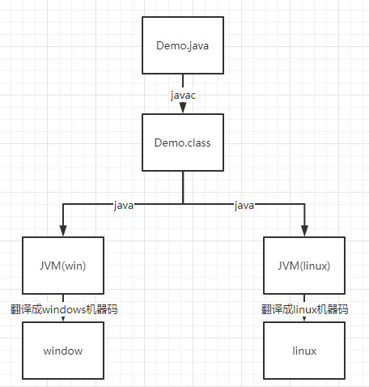
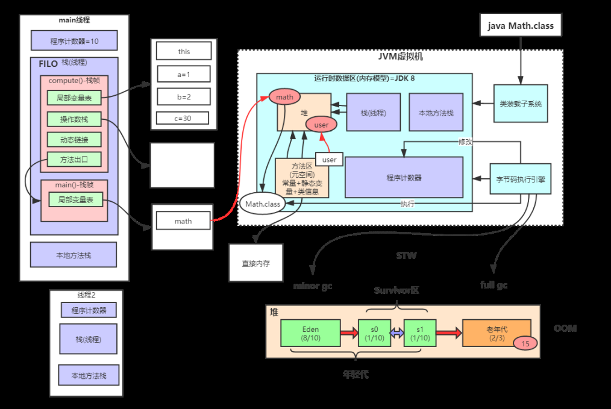
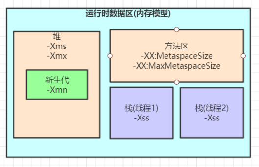
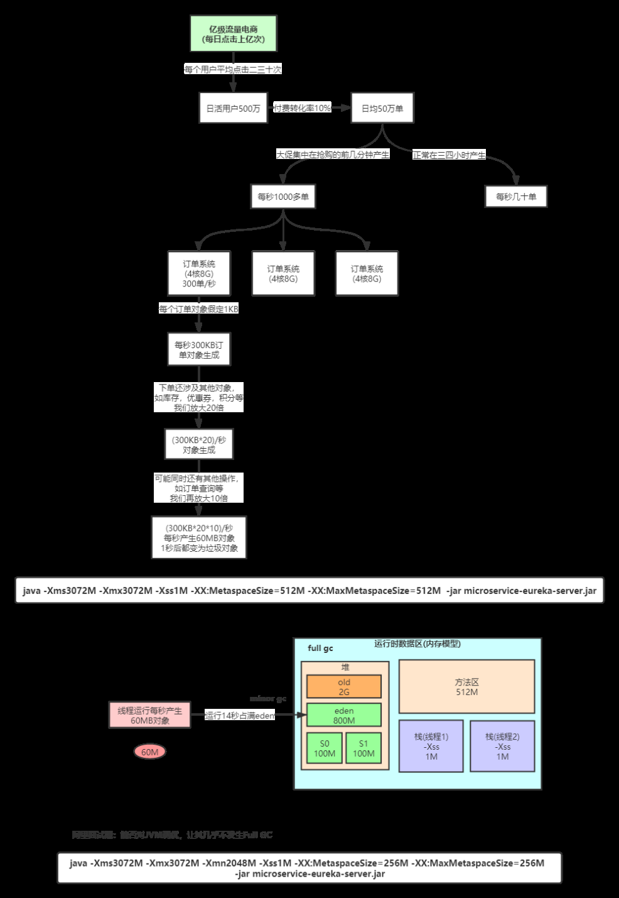
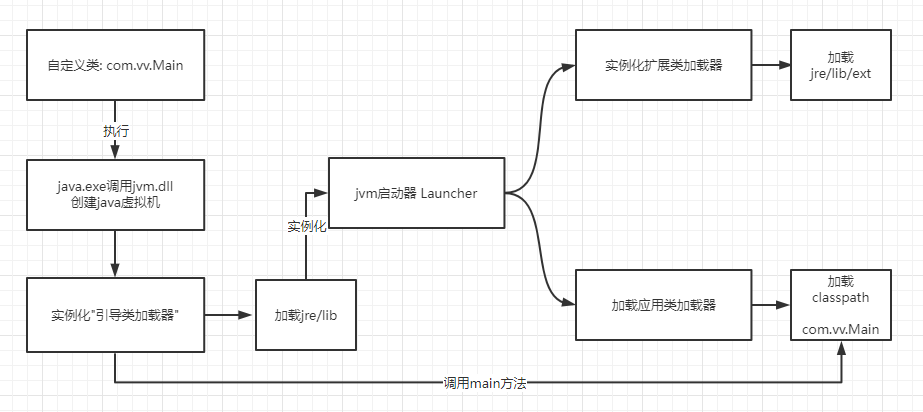
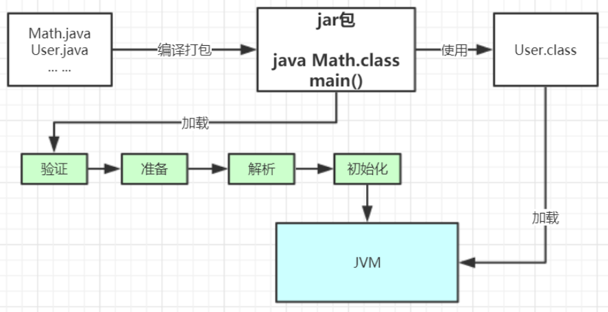
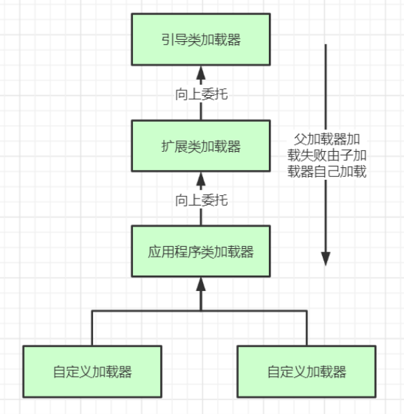
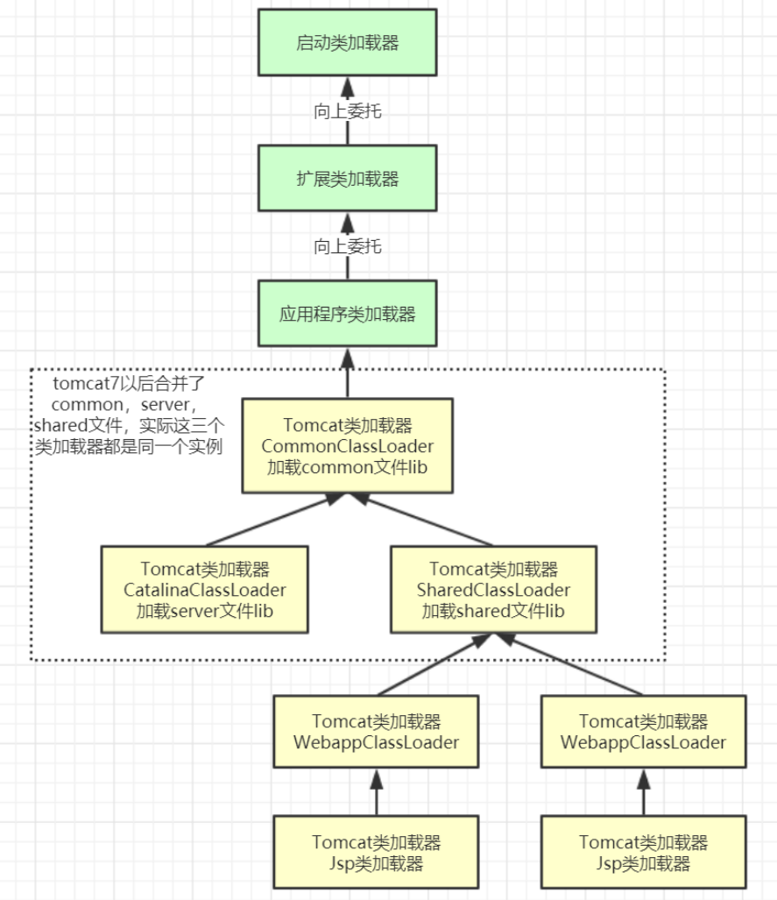
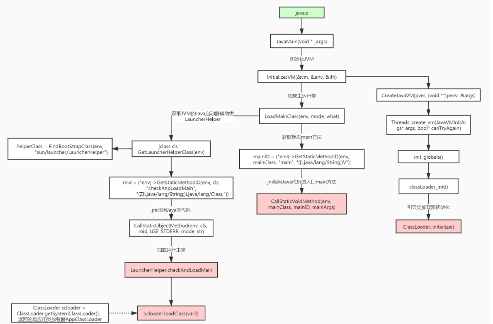

## Java语言跨平台性



## JVM整体结构及内存模型 ??




**补充一个问题：**

**在minor gc过程中对象挪动后，引用如何修改？**

对象在堆内部挪动的过程其实是复制，原有区域对象还在，一般不直接清理，JVM内部清理过程只是将对象分配指针移动到区域的头位置即可，比如扫描s0区域，扫到gcroot引用的非垃圾对象是将这些对象**复制**到s1或老年代，最后扫描完了将s0区域的对象分配指针移动到区域的起始位置即可，s0区域之前对象并不直接清理，当有新对象分配了，原有区域里的对象也就被清除了。

minor gc在根扫描过程中会记录所有被扫描到的对象引用(在年轻代这些引用很少，因为大部分都是垃圾对象不会扫描到)，如果引用的对象被复制到新地址了，最后会一并更新引用指向新地址。

这里面内部算法比较复杂，感兴趣可以参考R大的这篇文章：

https://www.zhihu.com/question/42181722/answer/145085437

https://hllvm-group.iteye.com/group/topic/39376#post-257329

## JVM内存参数设置



Spring Boot程序的JVM参数设置格式(Tomcat启动直接加在bin目录下catalina.sh文件里)： 

```sh
java ‐Xms2048M ‐Xmx2048M ‐Xmn1024M ‐Xss512K ‐XX:MetaspaceSize=256M ‐XX:MaxMetaspaceSize=256M ‐jar microservice‐eurek a‐server.jar
```

- -Xss：每个线程的栈大小
- -Xms：设置堆的初始可用大小，默认物理内存的1/64 
- -Xmx：设置堆的最大可用大小，默认物理内存的1/4
- -Xmn：新生代大小
- -XX:NewRatio：默认2表示新生代占年老代的1/2，占整个堆内存的1/3。
- -XX:SurvivorRatio：默认8表示一个survivor区占用1/8的Eden内存，即1/10的新生代内存。
- 关于元空间的JVM参数有两个：-XX:MetaspaceSize=N和 -XX:MaxMetaspaceSize=N
  - **-XX：MaxMetaspaceSize**： 设置元空间最大值， 默认是-1， 即不限制， 或者说只受限于本地内存大小。
  - **-XX：MetaspaceSize**： 指定元空间触发Fullgc的初始阈值(元空间无固定初始大小)， 以字节为单位，默认是21M左右，达到该值就会触发full gc进行类型卸载， 同时收集器会对该值进行调整： 如果释放了大量的空间， 就适当降低该值； 如果释放了很少的空间， 那么在不超过-XX：MaxMetaspaceSize（如果设置了的话） 的情况下， 适当提高该值。这个跟早期jdk版本的**-XX:PermSize**参数意思不一样，-**XX:PermSize**代表永久代的初始容量。
  - 由于调整元空间的大小需要Full GC，这是非常昂贵的操作，如果应用在启动的时候发生大量Full GC，通常都是由于永久代或元空间发生了大小调整，基于这种情况，一般建议在JVM参数中将MetaspaceSize和MaxMetaspaceSize设置成一样的值，并设置得比初始值要大，对于8G物理内存的机器来说，一般我会将这两个值都设置为256M。

### 案例一：

```java
// JVM设置  -Xss128k(默认1M)
public class StackOverflowTest {
    
    static int count = 0;
    
    static void redo() {
        count++;
        redo();
    }

    public static void main(String[] args) {
        try {
            redo();
        } catch (Throwable t) {
            t.printStackTrace();
            System.out.println(count);
        }
    }
}

运行结果：
java.lang.StackOverflowError
	at com.tuling.jvm.StackOverflowTest.redo(StackOverflowTest.java:12)
	at com.tuling.jvm.StackOverflowTest.redo(StackOverflowTest.java:13)
	at com.tuling.jvm.StackOverflowTest.redo(StackOverflowTest.java:13)
   ......
```

**结论：** -Xss设置越小count值越小，说明一个线程栈里能分配的栈帧就越少，但是对JVM整体来说能开启的线程数会更多 

**JVM内存参数大小该如何设置？** 

JVM参数大小设置并没有固定标准，需要根据实际项目情况分析

### 案例二

**日均百万级订单交易系统如何设置JVM参数**



**结论：通过上面这些内容介绍，大家应该对JVM优化有些概念了，就是尽可能让对象都在新生代里分配和回收，尽量别让太多对象频繁进入老年代，避免频繁对老年代进行垃圾回收，同时给系统充足的内存大小，避免新生代频繁的进行垃圾回收**


## 类加载

### 类加载器的加载过程

以下代码由C++实现



### 类的加载过程

**加载 >> 验证 >> 准备 >> 解析 >> 初始化 >>** 使用 >> 卸载 

1. 加载：在硬盘上查找并通过IO读入字节码文件，使用到类时才会加载，例如调用类的main()方法，new对象等等，在加载阶段会在内存中生成一个**代表这个类的java.lang.Class对象**，作为方法区这个类的各种数据的访问入口 

2. 验证：校验字节码文件的正确性 

3. 准备：给类的静态变量分配内存，并赋予默认值 

4. 解析：将**符号引用**替换为直接引用，该阶段会把一些静态方法(符号引用，比如 

   main()方法)替换为指向数据所存内存的指针或句柄等(直接引用)，这是所谓的**静态链接**过程(类加载期间完成)，**动态链接**是在程序运行期间完成的将符号引用替换为直接引用，下节课会讲到动态链接 

5. **初始化**：对类的静态变量初始化为指定的值，执行静态代码块



类被加载到方法区中后主要包含 **运行时常量池、类型信息、字段信息、方法信息、类加载器的引用、对应class实例的引用**等信息。 

- **类加载器的引用**：这个类到类加载器实例的引用 
- **对应class实例的引用**：类加载器在加载类信息放到方法区中后，会创建一个对应的Class 类型的对象实例放到堆(Heap)中, 作为开发人员访问方法区中类定义的入口和切入点。 

**注意：**主类在运行过程中如果使用到其它类，会逐步加载这些类。 jar包或war包里的类不是一次性全部加载的，是使用到时才加载。 

```java
public class TestDynamicLoad {
    static {
        System.out.println("*************load TestDynamicLoad************");
    }

    public static void main(String[] args) {
        new A();
        System.out.println("*************load test************");
        B b = null;  //B不会加载，除非这里执行 new B()
    }
}

class A {
    static {
        System.out.println("*************load A************");
    }

    public A() {
        System.out.println("*************initial A************");
    }
}

class B {
    static {
        System.out.println("*************load B************");
    }

    public B() {
        System.out.println("*************initial B************");
    }
}

运行结果：
*************load TestDynamicLoad************
*************load A************
*************initial A************
*************load test************
```

### 类加载器

**类加载器的类型: **

- 引导类加载器：负责加载支撑JVM运行的位于JRE的lib目录下的核心类库，比如rt.jar、charsets.jar等
- 扩展类加载器：负责加载支撑JVM运行的位于JRE的lib目录下的ext扩展目录中的JAR类包
- 应用程序类加载器：负责加载ClassPath路径下的类包，主要就是加载你自己写的那些类
- 自定义加载器：负责加载用户自定义路径下的类包

```java
public class TestJDKClassLoader {
    public static void main(String[] args) {
        System.out.println(String.class.getClassLoader());
        System.out.println(com.sun.crypto.provider.DESKeyFactory.class.getClassLoader().getClass().getName());
        System.out.println(TestJDKClassLoader.class.getClassLoader().getClass().getName());

        System.out.println();
        ClassLoader appClassLoader = ClassLoader.getSystemClassLoader();
        ClassLoader extClassloader = appClassLoader.getParent();
        ClassLoader bootstrapLoader = extClassloader.getParent();
        System.out.println("the bootstrapLoader : " + bootstrapLoader);
        System.out.println("the extClassloader : " + extClassloader);
        System.out.println("the appClassLoader : " + appClassLoader);

        System.out.println();
        System.out.println("bootstrapLoader加载以下文件：");
        URL[] urls = Launcher.getBootstrapClassPath().getURLs();
        for (int i = 0; i < urls.length; i++) {
            System.out.println(urls[i]);
        }

        System.out.println();
        System.out.println("extClassloader加载以下文件：");
        System.out.println(System.getProperty("java.ext.dirs"));

        System.out.println();
        System.out.println("appClassLoader加载以下文件：");
        System.out.println(System.getProperty("java.class.path"));
    }
}

运行结果：
null
sun.misc.Launcher$ExtClassLoader
sun.misc.Launcher$AppClassLoader

the bootstrapLoader : null
the extClassloader : sun.misc.Launcher$ExtClassLoader@3764951d
the appClassLoader : sun.misc.Launcher$AppClassLoader@14dad5dc

bootstrapLoader加载以下文件：
file:/D:/dev/Java/jdk1.8.0_45/jre/lib/resources.jar
file:/D:/dev/Java/jdk1.8.0_45/jre/lib/rt.jar
file:/D:/dev/Java/jdk1.8.0_45/jre/lib/sunrsasign.jar
file:/D:/dev/Java/jdk1.8.0_45/jre/lib/jsse.jar
file:/D:/dev/Java/jdk1.8.0_45/jre/lib/jce.jar
file:/D:/dev/Java/jdk1.8.0_45/jre/lib/charsets.jar
file:/D:/dev/Java/jdk1.8.0_45/jre/lib/jfr.jar
file:/D:/dev/Java/jdk1.8.0_45/jre/classes

extClassloader加载以下文件：
D:\dev\Java\jdk1.8.0_45\jre\lib\ext;C:\Windows\Sun\Java\lib\ext

appClassLoader加载以下文件：
D:\dev\Java\jdk1.8.0_45\jre\lib\charsets.jar;D:\dev\Java\jdk1.8.0_45\jre\lib\deploy.jar;D:\dev\Java\jdk1.8.0_45\jre\lib\ext\access-bridge-64.jar;D:\dev\Java\jdk1.8.0_45\jre\lib\ext\cldrdata.jar;D:\dev\Java\jdk1.8.0_45\jre\lib\ext\dnsns.jar;D:\dev\Java\jdk1.8.0_45\jre\lib\ext\jaccess.jar;D:\dev\Java\jdk1.8.0_45\jre\lib\ext\jfxrt.jar;D:\dev\Java\jdk1.8.0_45\jre\lib\ext\localedata.jar;D:\dev\Java\jdk1.8.0_45\jre\lib\ext\nashorn.jar;D:\dev\Java\jdk1.8.0_45\jre\lib\ext\sunec.jar;D:\dev\Java\jdk1.8.0_45\jre\lib\ext\sunjce_provider.jar;D:\dev\Java\jdk1.8.0_45\jre\lib\ext\sunmscapi.jar;D:\dev\Java\jdk1.8.0_45\jre\lib\ext\sunpkcs11.jar;D:\dev\Java\jdk1.8.0_45\jre\lib\ext\zipfs.jar;D:\dev\Java\jdk1.8.0_45\jre\lib\javaws.jar;D:\dev\Java\jdk1.8.0_45\jre\lib\jce.jar;D:\dev\Java\jdk1.8.0_45\jre\lib\jfr.jar;D:\dev\Java\jdk1.8.0_45\jre\lib\jfxswt.jar;D:\dev\Java\jdk1.8.0_45\jre\lib\jsse.jar;D:\dev\Java\jdk1.8.0_45\jre\lib\management-agent.jar;D:\dev\Java\jdk1.8.0_45\jre\lib\plugin.jar;D:\dev\Java\jdk1.8.0_45\jre\lib\resources.jar;D:\dev\Java\jdk1.8.0_45\jre\lib\rt.jar;D:\ideaProjects\project-all\target\classes;C:\Users\zhuge\.m2\repository\org\apache\zookeeper\zookeeper\3.4.12\zookeeper-3.4.12.jar;C:\Users\zhuge\.m2\repository\org\slf4j\slf4j-api\1.7.25\slf4j-api-1.7.25.jar;C:\Users\zhuge\.m2\repository\org\slf4j\slf4j-log4j12\1.7.25\slf4j-log4j12-1.7.25.jar;C:\Users\zhuge\.m2\repository\log4j\log4j\1.2.17\log4j-1.2.17.jar;C:\Users\zhuge\.m2\repository\jline\jline\0.9.94\jline-0.9.94.jar;C:\Users\zhuge\.m2\repository\org\apache\yetus\audience-annotations\0.5.0\audience-annotations-0.5.0.jar;C:\Users\zhuge\.m2\repository\io\netty\netty\3.10.6.Final\netty-3.10.6.Final.jar;C:\Users\zhuge\.m2\repository\com\google\guava\guava\22.0\guava-22.0.jar;C:\Users\zhuge\.m2\repository\com\google\code\findbugs\jsr305\1.3.9\jsr305-1.3.9.jar;C:\Users\zhuge\.m2\repository\com\google\errorprone\error_prone_annotations\2.0.18\error_prone_annotations-2.0.18.jar;C:\Users\zhuge\.m2\repository\com\google\j2objc\j2objc-annotations\1.1\j2objc-annotations-1.1.jar;C:\Users\zhuge\.m2\repository\org\codehaus\mojo\animal-sniffer-annotations\1.14\animal-sniffer-annotations-1.14.jar;D:\dev\IntelliJ IDEA 2018.3.2\lib\idea_rt.jar

```

**类加载器初始化过程：**

参见类运行加载全过程图可知其中会创建JVM启动器实例sun.misc.Launcher。

在Launcher构造方法内部，其创建了两个类加载器，分别是sun.misc.Launcher.ExtClassLoader(扩展类加载器)和sun.misc.Launcher.AppClassLoader(应用类加载器)。

```java
//Launcher的构造方法
public Launcher() {
    Launcher.ExtClassLoader var1;
    try {
        //构造扩展类加载器，在构造的过程中将其父加载器设置为null
        var1 = Launcher.ExtClassLoader.getExtClassLoader();
    } catch (IOException var10) {
        throw new InternalError("Could not create extension class loader", var10);
    }

    try {
        //构造应用类加载器，在构造的过程中将其父加载器设置为ExtClassLoader，
        //Launcher的loader属性值是AppClassLoader，我们一般都是用这个类加载器来加载我们自己写的应用程序
        this.loader = Launcher.AppClassLoader.getAppClassLoader(var1);
    } catch (IOException var9) {
        throw new InternalError("Could not create application class loader", var9);
    }

    Thread.currentThread().setContextClassLoader(this.loader);
    String var2 = System.getProperty("java.security.manager");
    //省略一些不需关注代码
}
```


### 双亲委派机制



这里类加载其实就有一个**双亲委派机制**，加载某个类时会先委托父加载器寻找目标类，找不到再委托上层父加载器加载，如果所有父加载器在自己的加载类路径下都找不到目标类，则在自己的类加载路径中查找并载入目标类。

比如我们的Math类，最先会找应用程序类加载器加载，应用程序类加载器会先委托扩展类加载器加载，扩展类加载器再委托引导类加载器，顶层引导类加载器在自己的类加载路径里找了半天没找到Math类，则向下退回加载Math类的请求，扩展类加载器收到回复就自己加载，在自己的类加载路径里找了半天也没找到Math类，又向下退回Math类的加载请求给应用程序类加载器，应用程序类加载器于是在自己的类加载路径里找Math类，结果找到了就自己加载了。。

**双亲委派机制说简单点就是，先找父亲加载，不行再由儿子自己加载**

我们来看下应用程序类加载器AppClassLoader加载类的双亲委派机制源码，AppClassLoader的loadClass方法最终会调用其父类ClassLoader的loadClass方法，该方法的大体逻辑如下：

1. 首先，检查一下指定名称的类是否已经加载过，如果加载过了，就不需要再加载，直接返回。
2. 如果此类没有加载过，那么，再判断一下是否有父加载器；如果有父加载器，则由父加载器加载（即调用parent.loadClass(name, false);）.或者是调用bootstrap类加载器来加载。
3. 如果父加载器及bootstrap类加载器都没有找到指定的类，那么调用当前类加载器的findClass方法来完成类加载。

```java
//ClassLoader的loadClass方法，里面实现了双亲委派机制
protected Class<?> loadClass(String name, boolean resolve)
    throws ClassNotFoundException
{
    synchronized (getClassLoadingLock(name)) {
        // 检查当前类加载器是否已经加载了该类
        Class<?> c = findLoadedClass(name);
        if (c == null) {
            long t0 = System.nanoTime();
            try {
                if (parent != null) {  //如果当前加载器父加载器不为空则委托父加载器加载该类
                    c = parent.loadClass(name, false);
                } else {  //如果当前加载器父加载器为空则委托引导类加载器加载该类
                    c = findBootstrapClassOrNull(name);
                }
            } catch (ClassNotFoundException e) {
                // ClassNotFoundException thrown if class not found
                // from the non-null parent class loader
            }

            if (c == null) {
                // If still not found, then invoke findClass in order
                // to find the class.
                long t1 = System.nanoTime();
                //都会调用URLClassLoader的findClass方法在加载器的类路径里查找并加载该类
                c = findClass(name);

                // this is the defining class loader; record the stats
                sun.misc.PerfCounter.getParentDelegationTime().addTime(t1 - t0);
                sun.misc.PerfCounter.getFindClassTime().addElapsedTimeFrom(t1);
                sun.misc.PerfCounter.getFindClasses().increment();
            }
        }
        if (resolve) {  //不会执行
            resolveClass(c);
        }
        return c;
    }
}
```

**为什么要设计双亲委派机制？**

- 沙箱安全机制：自己写的java.lang.String.class类不会被加载，这样便可以防止核心API库被随意篡改
- 避免类的重复加载：当父亲已经加载了该类时，就没有必要子ClassLoader再加载一次，保证**被加载类的唯一性**

```java
package java.lang;

public class String {
    public static void main(String[] args) {
        System.out.println("**************My String Class**************");
    }
}

运行结果：
错误: 在类 java.lang.String 中找不到 main 方法, 请将 main 方法定义为:
   public static void main(String[] args)
否则 JavaFX 应用程序类必须扩展javafx.application.Application
```

**全盘负责委托机制**

**“全盘负责”是指当一个ClassLoder**装载一个类时，除非显示的使用另外一个**ClassLoder**，该类所依赖及引用的类也由这个**ClassLoder**载入

**自定义类加载器示例：**

自定义类加载器只需要继承 java.lang.ClassLoader 类，该类有两个核心方法，一个是loadClass(String, boolean)，实现了**双亲委派机制**，还有一个方法是findClass，默认实现是空方法，所以我们自定义类加载器主要是**重写findClass方法**。

```java
public class MyClassLoaderTest {
    static class MyClassLoader extends ClassLoader {
        private String classPath;

        public MyClassLoader(String classPath) {
            this.classPath = classPath;
        }

        private byte[] loadByte(String name) throws Exception {
            name = name.replaceAll("\\.", "/");
            FileInputStream fis = new FileInputStream(classPath + "/" + name
                    + ".class");
            int len = fis.available();
            byte[] data = new byte[len];
            fis.read(data);
            fis.close();
            return data;
        }

        protected Class<?> findClass(String name) throws ClassNotFoundException {
            try {
                byte[] data = loadByte(name);
                //defineClass将一个字节数组转为Class对象，这个字节数组是class文件读取后最终的字节数组。
                return defineClass(name, data, 0, data.length);
            } catch (Exception e) {
                e.printStackTrace();
                throw new ClassNotFoundException();
            }
        }

    }

    public static void main(String args[]) throws Exception {
        //初始化自定义类加载器，会先初始化父类ClassLoader，其中会把自定义类加载器的父加载器设置为应用程序类加载器AppClassLoader
        MyClassLoader classLoader = new MyClassLoader("D:/test");
        //D盘创建 test/com/vv/jvm 几级目录，将User类的复制类User1.class丢入该目录
        Class clazz = classLoader.loadClass("com.vv.jvm.User1");
        Object obj = clazz.newInstance();
        Method method = clazz.getDeclaredMethod("sout", null);
        method.invoke(obj, null);
        System.out.println(clazz.getClassLoader().getClass().getName());
    }
}

运行结果：
=======自己的加载器加载类调用方法=======
com.tuling.jvm.MyClassLoaderTest$MyClassLoader
```

**打破双亲委派机制**

再来一个沙箱安全机制示例，尝试打破双亲委派机制，用自定义类加载器加载我们自己实现的 java.lang.String.class

```java
public class MyClassLoaderTest {
    static class MyClassLoader extends ClassLoader {
        private String classPath;

        public MyClassLoader(String classPath) {
            this.classPath = classPath;
        }

        private byte[] loadByte(String name) throws Exception {
            name = name.replaceAll("\\.", "/");
            FileInputStream fis = new FileInputStream(classPath + "/" + name
                    + ".class");
            int len = fis.available();
            byte[] data = new byte[len];
            fis.read(data);
            fis.close();
            return data;

        }

        protected Class<?> findClass(String name) throws ClassNotFoundException {
            try {
                byte[] data = loadByte(name);
                return defineClass(name, data, 0, data.length);
            } catch (Exception e) {
                e.printStackTrace();
                throw new ClassNotFoundException();
            }
        }

        /**
         * 重写类加载方法，实现自己的加载逻辑，不委派给双亲加载
         * @param name
         * @param resolve
         * @return
         * @throws ClassNotFoundException
         */
        protected Class<?> loadClass(String name, boolean resolve)
                throws ClassNotFoundException {
            synchronized (getClassLoadingLock(name)) {
                // First, check if the class has already been loaded
                Class<?> c = findLoadedClass(name);

                if (c == null) {
                    // If still not found, then invoke findClass in order
                    // to find the class.
                    long t1 = System.nanoTime();
                    c = findClass(name);

                    // this is the defining class loader; record the stats
                    sun.misc.PerfCounter.getFindClassTime().addElapsedTimeFrom(t1);
                    sun.misc.PerfCounter.getFindClasses().increment();
                }
                if (resolve) {
                    resolveClass(c);
                }
                return c;
            }
        }
    }

    public static void main(String args[]) throws Exception {
        MyClassLoader classLoader = new MyClassLoader("D:/test");
        //尝试用自己改写类加载机制去加载自己写的java.lang.String.class
        Class clazz = classLoader.loadClass("java.lang.String");
        Object obj = clazz.newInstance();
        Method method= clazz.getDeclaredMethod("sout", null);
        method.invoke(obj, null);
        System.out.println(clazz.getClassLoader().getClass().getName());
    }
}

运行结果：
java.lang.SecurityException: Prohibited package name: java.lang
	at java.lang.ClassLoader.preDefineClass(ClassLoader.java:659)
	at java.lang.ClassLoader.defineClass(ClassLoader.java:758)
```

**Tomcat打破双亲委派机制**

以Tomcat类加载为例，Tomcat 如果使用默认的双亲委派类加载机制行不行？

我们思考一下：Tomcat是个web容器， 那么它要解决什么问题： 

1. 一个web容器可能需要部署两个应用程序，不同的应用程序可能会**依赖同一个第三方类库的不同版本**，不能要求同一个类库在同一个服务器只有一份，因此要保证每个应用程序的类库都是独立的，保证相互隔离
2. 部署在同一个web容器中**相同的类库相同的版本可以共享**。否则，如果服务器有10个应用程序，那么要有10份相同的类库加载进虚拟机
3. **web容器也有自己依赖的类库，不能与应用程序的类库混淆**。基于安全考虑，应该让容器的类库和程序的类库隔离开来
4. web容器要支持jsp的修改，我们知道，jsp 文件最终也是要编译成class文件才能在虚拟机中运行，但程序运行后修改jsp已经是司空见惯的事情， web容器需要支持 jsp 修改后不用重启。

再看看我们的问题：**Tomcat 如果使用默认的双亲委派类加载机制行不行？** 答案是不行的。为什么？

1. 第一个问题，如果使用默认的类加载器机制，那么是无法加载两个相同类库的不同版本的，默认的类加器是不管你是什么版本的，只在乎你的全限定类名，并且只有一份。
2. 第二个问题，默认的类加载器是能够实现的，因为他的职责就是保证**唯一性**。
3. 第三个问题和第一个问题一样。
4. 第四个问题，我们想我们要怎么实现jsp文件的热加载，jsp 文件其实也就是class文件，那么如果修改了，但类名还是一样，类加载器会直接取方法区中已经存在的，修改后的jsp是不会重新加载的。那么怎么办呢？我们可以直接卸载掉这jsp文件的类加载器，所以你应该想到了，每个jsp文件对应一个唯一的类加载器，当一个jsp文件修改了，就直接卸载这个jsp类加载器。重新创建类加载器，重新加载jsp文件。

**Tomcat自定义加载器详解**



**tomcat的几个主要类加载器：**

- commonLoader：Tomcat最基本的类加载器，加载路径中的class可以被Tomcat容器本身以及各个Webapp访问
- catalinaLoader：Tomcat容器私有的类加载器，加载路径中的class对于Webapp不可见
- sharedLoader：各个Webapp共享的类加载器，加载路径中的class对于所有Webapp可见，但是对于Tomcat容器不可见
- WebappClassLoader：各个Webapp私有的类加载器，加载路径中的class只对当前Webapp可见，比如加载war包里相关的类，每个war包应用都有自己的WebappClassLoader，实现相互隔离，比如不同war包应用引入了不同的spring版本，这样实现就能加载各自的spring版本

**从图中的委派关系中可以看出：**

CommonClassLoader能加载的类都可以被CatalinaClassLoader和SharedClassLoader使用，从而实现了公有类库的共用，而CatalinaClassLoader和SharedClassLoader自己能加载的类则与对方相互隔离。

WebAppClassLoader可以使用SharedClassLoader加载到的类，但各个WebAppClassLoader实例之间相互隔离。

而JasperLoader的加载范围仅仅是这个JSP文件所编译出来的那一个.Class文件，它出现的目的就是为了被丢弃：当Web容器检测到JSP文件被修改时，会替换掉目前的JasperLoader的实例，并通过再建立一个新的Jsp类加载器来实现JSP文件的热加载功能。

**tomcat 这种类加载机制违背了java 推荐的双亲委派模型了吗？**答案是：违背了。 

很显然，tomcat 不是这样实现，tomcat 为了实现隔离性，没有遵守这个约定，**每个webappClassLoader加载自己的目录下的class文件，不会传递给父类加载器，打破了双亲委派机制**。

**模拟实现Tomcat的webappClassLoader加载自己war包应用内不同版本类实现相互共存与隔离**

```java
public class MyClassLoaderTest {
    static class MyClassLoader extends ClassLoader {
        private String classPath;

        public MyClassLoader(String classPath) {
            this.classPath = classPath;
        }

        private byte[] loadByte(String name) throws Exception {
            name = name.replaceAll("\\.", "/");
            FileInputStream fis = new FileInputStream(classPath + "/" + name
                    + ".class");
            int len = fis.available();
            byte[] data = new byte[len];
            fis.read(data);
            fis.close();
            return data;

        }

        protected Class<?> findClass(String name) throws ClassNotFoundException {
            try {
                byte[] data = loadByte(name);
                return defineClass(name, data, 0, data.length);
            } catch (Exception e) {
                e.printStackTrace();
                throw new ClassNotFoundException();
            }
        }

        /**
         * 重写类加载方法，实现自己的加载逻辑，不委派给双亲加载
         * @param name
         * @param resolve
         * @return
         * @throws ClassNotFoundException
         */
        protected Class<?> loadClass(String name, boolean resolve)
                throws ClassNotFoundException {
            synchronized (getClassLoadingLock(name)) {
                // First, check if the class has already been loaded
                Class<?> c = findLoadedClass(name);

                if (c == null) {
                    // If still not found, then invoke findClass in order
                    // to find the class.
                    long t1 = System.nanoTime();

                    //非自定义的类还是走双亲委派加载
                    if (!name.startsWith("com.tuling.jvm")){
                        c = this.getParent().loadClass(name);
                    }else{
                        c = findClass(name);
                    }

                    // this is the defining class loader; record the stats
                    sun.misc.PerfCounter.getFindClassTime().addElapsedTimeFrom(t1);
                    sun.misc.PerfCounter.getFindClasses().increment();
                }
                if (resolve) {
                    resolveClass(c);
                }
                return c;
            }
        }
    }

    public static void main(String args[]) throws Exception {
        MyClassLoader classLoader = new MyClassLoader("D:/test");
        Class clazz = classLoader.loadClass("com.tuling.jvm.User1");
        Object obj = clazz.newInstance();
        Method method= clazz.getDeclaredMethod("sout", null);
        method.invoke(obj, null);
        System.out.println(clazz.getClassLoader());
        
        System.out.println();
        MyClassLoader classLoader1 = new MyClassLoader("D:/test1");
        Class clazz1 = classLoader1.loadClass("com.tuling.jvm.User1");
        Object obj1 = clazz1.newInstance();
        Method method1= clazz1.getDeclaredMethod("sout", null);
        method1.invoke(obj1, null);
        System.out.println(clazz1.getClassLoader());
    }
}

运行结果：
=======自己的加载器加载类调用方法=======
com.tuling.jvm.MyClassLoaderTest$MyClassLoader@266474c2

=======另外一个User1版本：自己的加载器加载类调用方法=======
com.tuling.jvm.MyClassLoaderTest$MyClassLoader@66d3c617
```

注意：同一个JVM内，两个相同包名和类名的类对象可以共存，因为他们的类加载器可以不一样，所以看两个类对象是否是同一个，除了看类的包名和类名是否都相同之外，还需要他们的类加载器也是同一个才能认为他们是同一个。

**模拟实现Tomcat的JasperLoader热加载**

原理：后台启动线程监听jsp文件变化，如果变化了找到该jsp对应的servlet类的加载器引用(gcroot)，重新生成新的**JasperLoader**加载器赋值给引用，然后加载新的jsp对应的servlet类，之前的那个加载器因为没有gcroot引用了，下一次gc的时候会被销毁。

### Hotspot源码JVM启动执行main方法流程

