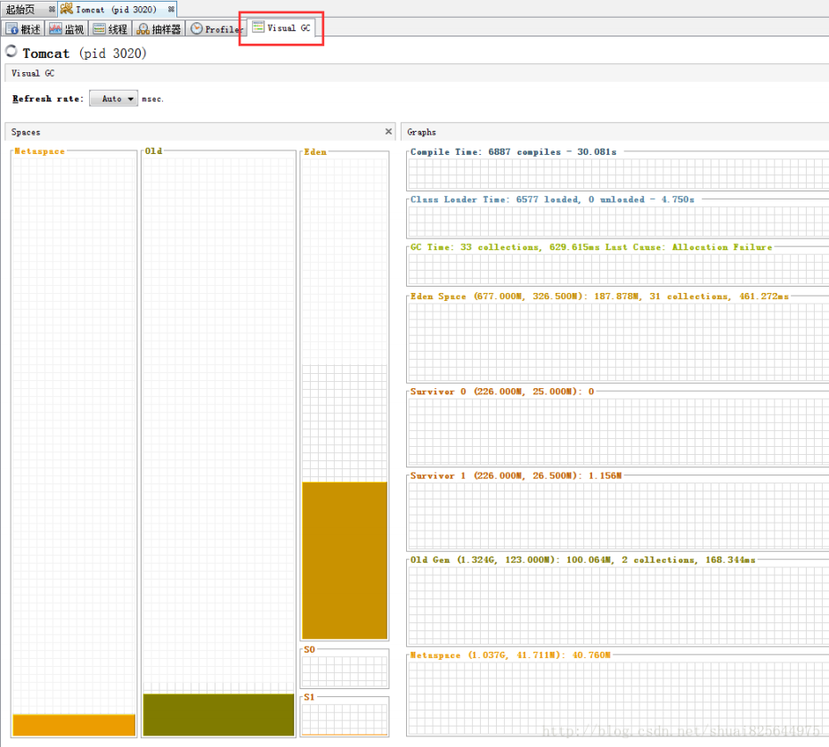

# VisualVM

VisualVM 是一款免费的，集成了多个 JDK 命令行工具的可视化工具，它能为您提供强大的分析能力，对 Java 应用程序做性能分析和调优。这些功能包括生成和分析海量数据、跟踪内存泄漏、监控垃圾回收器、执行内存和 CPU 分析，同时它还支持在 MBeans 上进行浏览和操作。本文主要介绍如何使用 VisualVM 进行性能分析及调优。

## 环境准备

自从 JDK 6 Update 7 以后已经作为 Oracle JDK 的一部分，位于 JDK 根目录的 bin 文件夹下，无需安装，直接运行即可。

**安装插件**

给jdk自带的jvisualvm安装Visual GC插件，遇到We're sorry the java.net site has 

closed（我们很抱歉java.net网站已经关闭） 

1、找到新的更新地址 

visualvm新访问地址：https://visualvm.github.io/index.html 

进入“Plugins”，找到对应自己JDK版本的更新地址

2、进入jvisualvm的插件管理 

"工具" - "插件" 

在"设置"中修改url地址为刚才我们在github上找到的对应我们JDK版本的地址

修改成功后，可用插件即可刷新出来 

3、安装VisualGC插件 

4、重启即可看到VisualGC

一：整个区域分为三部分：spaces、graphs、histogram

1. spaces区域：代表虚拟机内存分布情况。从图中可以看出，虚拟机被分为Perm、Old、Eden、S0、S1 

   注意：如果对每个区域基本概念不是很熟悉的可以先了解下java虚拟机运行时数据区这篇文字。 

   1. perm：英文叫做Permanent Generation，我们称之为永久代。(根据深入java虚拟机作者说明，这里说法不是很正确，因为hotspot虚拟机的设计团队选择把GC分代收集扩展至此而已，**正确的应该叫做方法区或者非堆**)。 
      1. 通过VM Args:-XX:PermSize=128m -XX:MaxPermSize=256m 设置初始值与最大值1.2）heap：java堆(java heap)。它包括老年代(图中Old区域)和新生代(图中Eden/S0/S1三个统称新生代，分为Eden区和两个Survivor区域)，他们默认是8:1分配内存 
      2. 通过VM Args:-xms512m -Xmx512m -XX:+HeapDumpOnOutofMemoryError -Xmn100m -XX:SurvivorRatio=8 设置初始堆内存、最大堆内存、内存异常打印dump、 新生代内存、新生代内存分配比例(8:1:1)，因为Heap分为新生代跟老年代，所以512M-100M=412M，老年代就是412M(初始内存跟最大内存最好相等，防止内存不够时扩充内存或者Full GC，导致性能降低) 

2. Graphs区域：内存使用详细介绍 

   1. Compile Time(编译时间)：6368compiles 表示编译总数，4.407s表示编译累计时间。一个脉冲表示一次JIT编译，窄脉冲表示持续时间短，宽脉冲表示持续时间长。 
   2. Class Loader Time(类加载时间): 20869loaded表示加载类数量, 139 unloaded表示卸载的类数量，40.630s表示类加载花费的时间 
   3. GC Time(GC Time)：2392collections表示垃圾收集的总次数，37.454s表示垃圾收集花费的时间，last cause表示最近垃圾收集的原因 
   4. Eden Space(Eden 区)：括号内的31.500M表示最大容量，9.750M表示当前容 量，后面的4.362M表示当前使用情况，2313collections表示垃圾收集次数，8.458s表示垃圾收集花费时间 
   5. Survivor 0/Survivor 1(S0和S1区)：括号内的3.938M表示最大容量，1.188M表示当前容量，之后的值是当前使用情况 
   6. Old Gen(老年代)：括号内的472.625M表示最大容量，145.031M表示当前容量， 之后的87.031表示当前使用情况，79collections表示垃圾收集次数 ，28.996s表示垃圾收集花费时间 
   7. Perm Gen(永久代)：括号内的256.000M表示最大容量，105.250M表示当前容量，之后的105.032M表示当前使用情况 

3. Histogram区域：survivor区域参数跟年龄柱状图3.1）Tenuring Threshold：表示新生代年龄大于当前值则进入老年代 

   1. Max Tenuring Threshold：表示新生代最大年龄值。 
   2. Tenuring Threshold与Max Tenuring Threshold区别：Max Tenuring Threshold是一个最大限定，所有的新生代年龄都不能超过当前值，而Tenuring Threshold是个动态计算出来的临时值，一般情况与Max Tenuring Threshold相等，如果 在Suivivor空间中，相同年龄所有对象大小的总和大于Survivor空间的一半，则年龄大于或者等于该年龄的对象就都可以直接进入老年代(如果计算出来年龄段是5，则Tenuring Threshold=5，age>=5的Suivivor对象都符合要求)，它才是新生代是否进入老年代判断的依据。
   3. Desired Survivor Size：Survivor空间大小验证阙值(默认是survivor空间的一半)，用于Tenuring Threshold判断对象是否提前进入老年代。 
   4. Current Survivor Size：当前survivor空间大小 
   5. histogram柱状图：表示年龄段对象的存储柱状图 
   6. 如果显示指定-XX:+UseParallelGC --新生代并行、老年代串行收集器 ，则 histogram柱状图不支持当前收集器 

**引用：** 

http://www.oracle.com/technetwork/java/visualgc-136680.html 

http://www.oracle.com/technetwork/java/javase/tech/vmoptions-jsp-140102.html