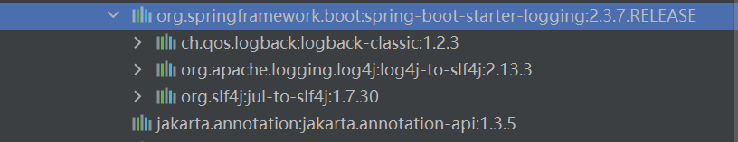
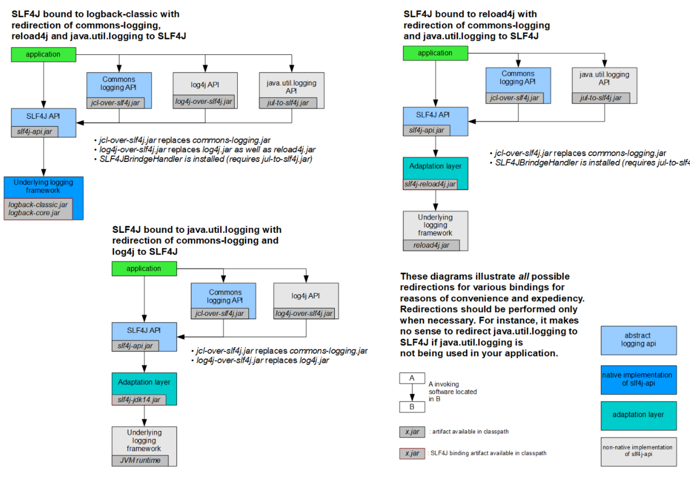

## 日志框架

**日志门面框架**

- ~~jcl~~(jakarta commons logging)

  很久没更新，最后一次事2014年

- ~~jboss-logging~~

  用在特定场景

- slf4j(simple logging facade for java)

  log4j作者在写logback的时候，同时写的一个抽象层

**日志实现框架**

- jul(java.util.logging)

  在log4j出来后，jdk想抢占日志框架市场

- logback

  logback是log4j的作者的升级版

- log4j

  后面卖给了apche公司

- log4j2

  apche升级，写得很好，但是适配度不高

**spring底层使用jcl**

**springboot使用的是slf4j和logback**

## 日志适配

由于slf4j作为门面比较流行，而log4j和jul等日志实现框架在出来的时候slf4j还没出现，对于这类实现框架怎么适配？

slf4j给其他的日志框架开发了适配器，只要多引入一个适配器就能让旧的日志实现框架去使用slf4j门面

**每种日志框架都有自己的配置文件，使用slf4j后，配置文件还是使用实现框架本身的配置文件**

## 遗留问题

app1(slf4j+logback)、spring(jcl)、hibenater(jboss-logging)

**如何统一日志？**

1. springboot首先将jcl的jar包排除掉
2. 使用jcl-over-slf4j.jar替代jcl
3. jcl-over-slf4j中包含了jcl中必须的类，这样其他项目就不会报错

