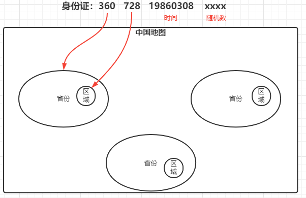
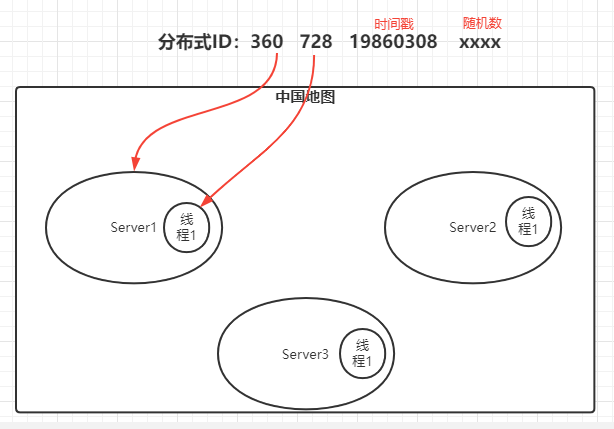

# 分布式ID

全局唯一，局部唯一，按情况保持递增

## 锁的实现方案

- UUID
- DB数据库多种模式 (自增主键、segment)
- Redis
- Zk
- Etcd
- SnowFlake
- 美团Leaf (DB-Segment、Zk+SnowFlake)
- 百度uid-generator


## UUID

**需要学习B+树原理才能理解为什么不能直接使用UUID作为物理主键**


## DB数据库多种模式 (自增主键、segment)

不用


## 雪花算法

举一个生活中的例子：身份证

- 省份编码是全局唯一
- 区域编码是局部唯一
- 时间是递增数
- 随机数某一天最大是9999，表示某个区域某一天不超过9999人出生



那么，演化到分布式ID中：



这里的分布式ID是模拟的，在计算机中，二进制位如果只使用18个长度，那么只能表示2^18次方个ID，那么显然不够，所以使用的是64位的Long类型来实现，排除第一号位是符号位，那么可以生成2^63次方个ID


## 美团Lead

[官方文档](https://github.com/Meituan-Dianping/Leaf)

### 安装

- 安装工具

  ```sh
  yum install -y git maven
  ```

- 克隆项目

  ```sh
  cd /usr/local
  git clone https://github.com/Meituan-Dianping/Leaf.git
  ```

- 配置maven源

  ```sh
  vim /etc/maven/setting.xml
  
  # mirrors节点
   <mirror>
           <id>aliyun-maven</id>
           <mirrorOf>*</mirrorOf>
           <name>aliyun-maven</name>
           <url>http://maven.aliyun.com/nexus/content/groups/public</url>
  </mirror> 
  ```

- maven构建项目

  ```sh
  cd /usr/local/Leaf
  mvn clean install -DskipTests
  ```


### 运行

- 启动：

  ```sh
  cd leaf-server
  # 方式一：maven
  mvn spring-boot:run
  # 方式二：shell
  sh deploy/run.sh
  ```

- 测试

  ```sh
  #segment
  curl http://localhost:8080/api/segment/get/leaf-segment-test
  #snowflake
  curl http://localhost:8080/api/snowflake/get/test
  ```

  

