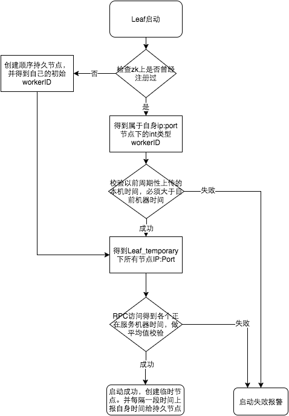
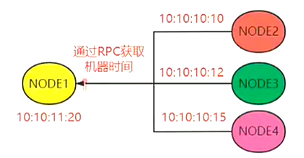

# 分布式ID

全局唯一，局部唯一，按情况保持递增


## 为什么需要分布式ID

有一个订单表，当数据量大了，需要对


## 锁的实现方案

- UUID
- DB数据库多种模式 (自增主键、segment)
- Redis
- Zk
- Etcd
- SnowFlake
- 美团Leaf (DB-Segment、Zk+SnowFlake)
- 百度uid-generator


## UUID

UUID长度128bit，32个16进制字，占用16个字节的空间，占用空间多，且生成的ID是无序的。对于InnoDB这种聚集主键类型的引擎来说，数据会按照主键进行排序，由于UUID的无序性，InnoDB会产生巨大的IO压力，此时不适合使用UUID做物理主键，可以把它作为逻辑主键，物理主键依然使用自增ID

**需要学习B+树原理才能理解为什么不能直接使用UUID作为物理主键**

- 组成部分：
  为了保证UUID的唯一性，规范定义了包括网卡MAC地址，时间戳，名字空间，随机或伪随机数，时序等元素

- 优点：
  性能非常高，本地生成，没有网络消耗。

- 缺点：
  不易于存储：UUID太长，16字节128位，通常以36长度的字符串表示，很多场景不适用

  信息不安全：基于MAC生成UUID的算法可能造成MAC地址泄露，这个漏洞曾被用于寻找梅丽莎病毒的制作者位置

- 版本

  - Version 1：基于时间的UUID

    基于时间的UUID通过计算当前时间戳、随机数和机器MAC地址得到。由于在算法中使用了MAC地址，这个版本的UUID可以保证在全球范围的唯一性。但与此同时，使用MAC地址会带来安全性问题，这就是这个版本UUID受到批评的地方。如果应用只是在局域网中使用，也可以使用退化的算法，以IP地址来代替MAC地址－－Java的UUID往往是这样实现的（当然也考虑了获取MAC的难度）

  - Version 2：DCE安全的UUID

    DCE（Distributed Computing Environment）安全的UUID和基于时间的UUID算法相同，但会把时间戳的前4位置换为POSIX的UID或GID。这个版本的UUID在实际中较少用到。

  - Version 3：基于名字的UUID（MD5）

    基于名字的UUID通过计算名字和名字空间的MD5散列值得到。这个版本的UUID保证了：相同名字空间中不同名字生成的UUID的唯一性；不同名字空间中的UUID的唯一性；相同名字空间中相同名字的UUID重复生成是相同的。

  - Version 4：随机UUID

    根据随机数，或者伪随机数生成UUID。这种UUID产生重复的概率是可以计算出来的，但随机的东西就像是买彩票：你指望它发财是不可能的，但狗屎运通常会在不经意中到来。

    建议是最好不用（虽然它是最简单最方便的）

  - Version 5：基于名字的UUID（SHA1）

    和版本3的UUID算法类似，只是散列值计算使用SHA1（Secure Hash Algorithm 1）算法

- 建议
  - Version 1/2适合应用于分布式计算环境下，具有高度的唯一性
  - Version 3/5适合于一定范围内名字唯一，且需要或可能会重复生成UUID的环境下
  - 通常我们建议使用UUID来标识对象或持久化数据，但以下情况最好不使用UUID
    - 映射类型的对象。比如只有代码及名称的代码表
    - 人工维护的非系统生成对象。比如系统中的部分基础数据
    - 对于具有名称不可重复的自然特性的对象，最好使用Version 3/5的UUID。比如系统中的用户。如果用户的UUID是Version 1的，如果你不小心删除了再重建用户，你会发现人还是那个人，用户已经不是那个用户了。（虽然标记为删除状态也是一种解决方案，但会带来实现上的复杂性）


## DB数据库多种模式 (自增主键)

**不用**

- 实现原理:
  基于MySQL，最简单的方法是使用auto_increment 来生成全局唯一递增ID，但最致命的问题是在高并发情况下，数据库压力大，DB单点存在宕机风险

- 优点:

  实现简单、基于数据库底层机制

- 缺点:

  高并发情况下，数据库压力大，DB单点存在宕机风险

- 示例：

  这里使用MyISAM引擎来提高插入数据，查询速度，因为也不需要事务的支持

  ```sql
  create table `seq_id`(
  	`id` bigint NOT NULL auto_increment,
  	`value` varchar(1) DEFAULT NULL,
      primary key (`id`)
  ) ENGINE=MyISAM DEFAULT CHARSET=utf8mb4 COMMENT='顺序自增id表'
   
  -- 获取id
  insert into seq_id value();select LAST_INSERT_ID();
  ```


## Redis


## Zookeeper

原理: 利用zookeeper中的顺序节点的特性,制作分布式的序列号生成器(ID生成器)


## Etcd


## 基于DB多主模式方案（Segment）

**不用**

上面的单DB存在宕机和性能问题，Flickr团队在2010年撰文介绍的一种主键生成策略（Ticket Servers: Distributed Unique Primary Keys on the Cheap ）

- 实现原理

  在分布式系统中我们可以多部署几台机器，每台机器设置不同的初始值，且步长和机器数相等。比如有两台机器。设置步长step为2，TicketServer1的初始值为1（1，3，5，7，9，11…）、TicketServer2的初始值为2（2，4，6，8，10…）

  

  ```sql
   create table `segment_id`(
  	`id` bigint NOT NULL auto_increment,
  	`max_id` bigint NOT NULL comment '当前最大id',
      `step` bigint NOT NULL comment '号段步长',
      `biz_code` varchar(16) NOT NULL comment '业务类型编码',
      `version` bigint NOT NULL comment '乐观锁',
      primary key (`id`)
   ) ENGINE=InnoDB DEFAULT CHARSET=utf8mb4 COMMENT='顺序自增id表' auto_increment 1
   
   -- biz_code ：每一个biz_code，max_id都是从0开始，增加了扩展性
  ```

  - Proxy
    - 实现原理：每次向db申请一个号段，加载到内存中，然后采用自增的方式来生成id，这个号段用完后，再次向db申请一个新的号段，这样对db的压力就减轻了很多，同时内存中直接生成id。向数据库申请新号段，对max_id字段做一次update操作，update max_id= max_id + step，update成功则说明新号段获取成功，新的号段范围是(max_id ,max_id +step]。
    - 实现过程：假设有两台Proxy
      - 客户端请求分布式ID，Proxy根据biz_code，max_id申请号段，这里使用乐观锁防止号段混乱
      - Proxy如果挂了，重启启动后，如果之前申请的号段还有未使用的直接抛弃，重新申请号段

- 优点:

  利用了缓存，减轻DB压力，性能提升

- 缺点:

  依然存在DB模式下的性能瓶颈，ID最大值的限制


## 雪花算法

举一个生活中的例子：身份证

- 省份编码是全局唯一
- 区域编码是局部唯一
- 时间是递增数
- 随机数某一天最大是9999，表示某个区域某一天不超过9999人出生


那么，演化到分布式ID中：


这里的分布式ID是模拟的，在计算机中，二进制位如果只使用18个长度，那么只能表示2^18次方个ID，那么显然不够，所以使用的是64位的Long类型来实现，排除第一号位是符号位，那么可以生成2^63次方个ID

### [SnowFlake介绍](https://segmentfault.com/a/1190000011282426)

### 时钟回拨 

美团解决访问：



参见上图整个启动流程图，服务启动时首先检查自己是否写过ZooKeeper leaf_forever节点：

1. 若写过，则用自身系统时间与leaf_forever/${self}节点记录时间做比较，若小于leaf_forever/${self}时间则认为机器时间发生了大步长回拨，服务启动失败并报警。
2. 若未写过，证明是新服务节点，直接创建持久节点leaf_forever/${self}并写入自身系统时间，接下来综合对比其余Leaf节点的系统时间来判断自身系统时间是否准确，具体做法是取leaf_temporary下的所有临时节点(所有运行中的Leaf-snowflake节点)的服务IP：Port，然后通过RPC请求得到所有节点的系统时间，计算sum(time)/nodeSize。
3. 若abs( 系统时间-sum(time)/nodeSize ) < 阈值，认为当前系统时间准确，正常启动服务，同时写临时节点leaf_temporary/${self} 维持租约。
4. 否则认为本机系统时间发生大步长偏移，启动失败并报警。
5. 每隔一段时间(3s)上报自身系统时间写入leaf_forever/${self}。

由于强依赖时钟，对时间的要求比较敏感，在机器工作时NTP同步也会造成秒级别的回退，建议可以直接关闭NTP同步。要么在时钟回拨的时候直接不提供服务直接返回ERROR_CODE，等时钟追上即可。**或者做一层重试，然后上报报警系统，更或者是发现有时钟回拨之后自动摘除本身节点并报警**，如下：

```sql
 //发生了回拨，此刻时间小于上次发号时间
 if (timestamp < lastTimestamp) {
  			  
            long offset = lastTimestamp - timestamp;
            if (offset <= 5) {
                try {
                	//时间偏差大小小于5ms，则等待两倍时间
                    wait(offset << 1);//wait
                    timestamp = timeGen();
                    if (timestamp < lastTimestamp) {
                       //还是小于，抛异常并上报
                        throwClockBackwardsEx(timestamp);
                      }    
                } catch (InterruptedException e) {  
                   throw  e;
                }
            } else {
                //throw
                throwClockBackwardsEx(timestamp);
            }
        }
 //分配ID       
```


一：解决ID服务刚启动时的判断

1. 通过zk的node节点的值（存放时间）判断

2. 通过rpc远程调用其他在线的ID服务的时间做比较

   

二：解决ID服务运行时NTP服务校准导致的回拨


## 美团Lead

[官方文档1](https://github.com/Meituan-Dianping/Leaf)，[官方文档2](https://tech.meituan.com/2017/04/21/mt-leaf.html)

### 安装

- 安装工具

  ```sh
  yum install -y git maven
  ```

- 克隆项目

  ```sh
  cd /usr/local
  git clone https://github.com/Meituan-Dianping/Leaf.git
  ```

- 配置maven源

  ```sh
  vim /etc/maven/setting.xml
  
  # mirrors节点
   <mirror>
           <id>aliyun-maven</id>
           <mirrorOf>*</mirrorOf>
           <name>aliyun-maven</name>
           <url>http://maven.aliyun.com/nexus/content/groups/public</url>
  </mirror> 
  ```

- maven构建项目

  ```sh
  cd /usr/local/Leaf
  mvn clean install -DskipTests
  ```


### 运行

- 启动：

  ```sh
  cd leaf-server
  # 方式一：maven
  mvn spring-boot:run
  # 方式二：shell
  sh deploy/run.sh
  ```

- 测试

  ```sh
  #segment
  curl http://localhost:8080/api/segment/get/leaf-segment-test
  #snowflake
  curl http://localhost:8080/api/snowflake/get/test
  ```

  

### 原理

**workID怎么分配？**

Leaf使用Zookeeper作为WorkID生成器，每次机器启动时去Zookeeper特定路径/forever/下读取子节点列表，每个子节点存储了IP:Port及对应的workId，遍历子节点列表，如果存在当前IP:Port对应的workId，就使用节点信息中存储的workId，不存在就创建一个永久有序节点，将序号作为workId，并且将workId信息写入本地缓存文件workerID.properties，供启动时连接Zookeeper失败，读取使用。因为workId只分配了10个二进制位，所以取值范围是0-1023。

**序列号怎么生成？**

序列号是12个二进制位，取值范围是0到4095，主要保证同一个leaf服务在同一毫秒内，生成的ID的唯一性。
序列号是生成流程如下：

1. 当前时间戳与上一个ID的时间戳在同一毫秒内，那么对sequence+1，如果sequence+1超过了4095，那么进行等待，等到下一毫秒到了之后再生成ID。
2. 当前时间戳与上一个ID的时间戳不在同一毫秒内，取一个100以内的随机数作为序列号。

